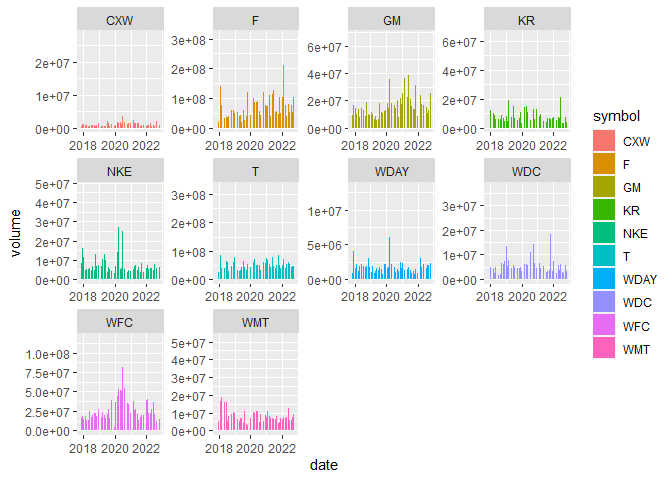

```r
library(ggplot2)
library(readr)
library(knitr)
library(tidyverse)
```

```
## ── Attaching packages ─────────────────────────────────────── tidyverse 1.3.2 ──
## ✔ tibble  3.1.8      ✔ dplyr   1.0.10
## ✔ tidyr   1.2.1      ✔ stringr 1.4.1 
## ✔ purrr   0.3.4      ✔ forcats 0.5.2 
## ── Conflicts ────────────────────────────────────────── tidyverse_conflicts() ──
## ✖ dplyr::filter() masks stats::filter()
## ✖ dplyr::lag()    masks stats::lag()
```

```r
library(dplyr)
library(forcats)
library(downloader)
library(corrplot)
```

```
## corrplot 0.92 loaded
```

```r
library(tidyquant)
```

```
## Loading required package: lubridate
## 
## Attaching package: 'lubridate'
## 
## The following objects are masked from 'package:base':
## 
##     date, intersect, setdiff, union
## 
## Loading required package: PerformanceAnalytics
## Loading required package: xts
## Loading required package: zoo
## 
## Attaching package: 'zoo'
## 
## The following objects are masked from 'package:base':
## 
##     as.Date, as.Date.numeric
## 
## 
## Attaching package: 'xts'
## 
## The following objects are masked from 'package:dplyr':
## 
##     first, last
## 
## 
## Attaching package: 'PerformanceAnalytics'
## 
## The following object is masked from 'package:graphics':
## 
##     legend
## 
## Loading required package: quantmod
## Loading required package: TTR
## Registered S3 method overwritten by 'quantmod':
##   method            from
##   as.zoo.data.frame zoo
```

```r
library(timetk)
library(dygraphs)
```

WILL CHANGE TICKERS_TODAY TO TICKERS SUPPLIED BY FRIEND AT MEETING
Key thing here is that the code is editable.

```r
tickers_today <- tq_get(c("CXW", "F", "GM", "JCP", "KR", "WDC", "NKE","T", "WDAY", "WFC", "WMT"),get = "stock.prices", from = today()-years(5))
```

```
## Warning: x = 'JCP', get = 'stock.prices': Error in getSymbols.yahoo(Symbols = "JCP", env = <environment>, verbose = FALSE, : Unable to import "JCP".
## JCP download failed after two attempts. Error message:
## HTTP error 404.
##  Removing JCP.
```

```r
head(tickers_today)
```

```
## # A tibble: 6 × 8
##   symbol date        open  high   low close  volume adjusted
##   <chr>  <date>     <dbl> <dbl> <dbl> <dbl>   <dbl>    <dbl>
## 1 CXW    2017-11-08  24.9  26.1  24.8  26.0 1017500     20.6
## 2 CXW    2017-11-09  26    26.5  25.7  25.8 1092800     20.4
## 3 CXW    2017-11-10  25.5  25.6  24.4  24.6 1085800     19.5
## 4 CXW    2017-11-13  24.6  24.8  24.3  24.4  849700     19.3
## 5 CXW    2017-11-14  24.3  24.3  22.9  22.9 2015100     18.2
## 6 CXW    2017-11-15  22.8  23.7  22.7  23.2 1255200     18.4
```


```r
tickers <- tickers_today %>%
  group_by(symbol) %>%
  mutate(starting = open[1]) %>%
  select(symbol,date,open,close,volume,starting) %>%
  mutate(value = starting - close) %>%
  select(symbol,date,value) %>%
  pivot_wider(names_from = symbol, values_from = value) %>%
  tk_xts(date_var = date)
```

```
## Warning: Non-numeric columns being dropped: date
```

```r
head(tickers)
```

```
##                  CXW     F        GM        KR       WDC       NKE         T
## 2017-11-08 -1.110000  0.08 -0.250000 -0.540001 -0.860001 -0.759998 -0.445620
## 2017-11-09 -0.920000  0.10 -0.250000 -0.640002 -1.369995 -1.130001 -0.868580
## 2017-11-10  0.289999  0.13 -0.799999 -0.770001 -2.659996 -1.090000 -1.034743
## 2017-11-13  0.529999 -0.02 -1.709999 -0.830000 -2.180000 -0.910000 -0.996979
## 2017-11-14  1.980000  0.12 -1.139999 -0.710001 -5.320000 -0.980000 -0.657101
## 2017-11-15  1.730000  0.14 -1.000000 -0.300002 -4.099999 -1.630001 -0.725077
##                 WDAY      WFC       WMT
## 2017-11-08 -2.739998 0.540001 -1.150001
## 2017-11-09  1.989997 0.799999 -1.190002
## 2017-11-10  0.830001 0.989998 -1.809997
## 2017-11-13  1.970001 1.079998 -1.879997
## 2017-11-14  0.669998 0.759998 -1.979995
## 2017-11-15  1.529998 1.049999 -0.720001
```


```r
stockPrices <- tickers_today %>%
  select(symbol, date, adjusted) %>%
  pivot_wider(names_from = symbol, values_from = adjusted) %>%
  tk_xts(date_var = date)
```

```
## Warning: Non-numeric columns being dropped: date
```

```r
head(stockPrices)
```

```
##                 CXW        F       GM       KR      WDC      NKE        T
## 2017-11-08 20.59956 10.10089 37.92220 19.71328 79.42145 53.05741 16.72142
## 2017-11-09 20.44908 10.08414 37.92220 19.80350 79.88638 53.40948 17.00143
## 2017-11-10 19.49078 10.05901 38.41750 19.92078 81.06239 53.37141 17.11145
## 2017-11-13 19.30071 10.18465 39.23701 19.97491 80.62481 53.20014 17.08644
## 2017-11-14 18.15233 10.06739 38.72369 19.97945 83.48733 53.26675 16.86142
## 2017-11-15 18.35032 10.05064 38.59761 19.60745 82.37514 53.88525 16.90643
##              WDAY      WFC      WMT
## 2017-11-08 110.88 46.96790 82.24993
## 2017-11-09 106.15 46.74284 82.28638
## 2017-11-10 107.31 46.57837 82.85136
## 2017-11-13 106.17 46.50046 82.91515
## 2017-11-14 107.47 46.77746 83.00628
## 2017-11-15 106.61 46.52643 81.85810
```

Interactive viz's

```r
dygraph(tickers,main = "Stock Performance (Win/Loss ($))")
```

```{=html}
<div id="htmlwidget-36f5aed6f7e43c3aeba6" style="width:672px;height:480px;" class="dygraphs html-widget"></div>
<script type="application/json" data-for="htmlwidget-36f5aed6f7e43c3aeba6">{"x":{"attrs":{"title":"Stock Performance (Win/Loss ($))","labels":["day","CXW","F","GM","KR","WDC","NKE","T","WDAY","WFC","WMT"],"legend":"auto","retainDateWindow":false,"axes":{"x":{"pixelsPerLabel":60}}},"scale":"daily","annotations":[],"shadings":[],"events":[],"format":"date","data":[["2017-11-08T00:00:00.000Z","2017-11-09T00:00:00.000Z","2017-11-10T00:00:00.000Z","2017-11-13T00:00:00.000Z","2017-11-14T00:00:00.000Z","2017-11-15T00:00:00.000Z","2017-11-16T00:00:00.000Z","2017-11-17T00:00:00.000Z","2017-11-20T00:00:00.000Z","2017-11-21T00:00:00.000Z","2017-11-22T00:00:00.000Z","2017-11-24T00:00:00.000Z","2017-11-27T00:00:00.000Z","2017-11-28T00:00:00.000Z","2017-11-29T00:00:00.000Z","2017-11-30T00:00:00.000Z","2017-12-01T00:00:00.000Z","2017-12-04T00:00:00.000Z","2017-12-05T00:00:00.000Z","2017-12-06T00:00:00.000Z","2017-12-07T00:00:00.000Z","2017-12-08T00:00:00.000Z","2017-12-11T00:00:00.000Z","2017-12-12T00:00:00.000Z","2017-12-13T00:00:00.000Z","2017-12-14T00:00:00.000Z","2017-12-15T00:00:00.000Z","2017-12-18T00:00:00.000Z","2017-12-19T00:00:00.000Z","2017-12-20T00:00:00.000Z","2017-12-21T00:00:00.000Z","2017-12-22T00:00:00.000Z","2017-12-26T00:00:00.000Z","2017-12-27T00:00:00.000Z","2017-12-28T00:00:00.000Z","2017-12-29T00:00:00.000Z","2018-01-02T00:00:00.000Z","2018-01-03T00:00:00.000Z","2018-01-04T00:00:00.000Z","2018-01-05T00:00:00.000Z","2018-01-08T00:00:00.000Z","2018-01-09T00:00:00.000Z","2018-01-10T00:00:00.000Z","2018-01-11T00:00:00.000Z","2018-01-12T00:00:00.000Z","2018-01-16T00:00:00.000Z","2018-01-17T00:00:00.000Z","2018-01-18T00:00:00.000Z","2018-01-19T00:00:00.000Z","2018-01-22T00:00:00.000Z","2018-01-23T00:00:00.000Z","2018-01-24T00:00:00.000Z","2018-01-25T00:00:00.000Z","2018-01-26T00:00:00.000Z","2018-01-29T00:00:00.000Z","2018-01-30T00:00:00.000Z","2018-01-31T00:00:00.000Z","2018-02-01T00:00:00.000Z","2018-02-02T00:00:00.000Z","2018-02-05T00:00:00.000Z","2018-02-06T00:00:00.000Z","2018-02-07T00:00:00.000Z","2018-02-08T00:00:00.000Z","2018-02-09T00:00:00.000Z","2018-02-12T00:00:00.000Z","2018-02-13T00:00:00.000Z","2018-02-14T00:00:00.000Z","2018-02-15T00:00:00.000Z","2018-02-16T00:00:00.000Z","2018-02-20T00:00:00.000Z","2018-02-21T00:00:00.000Z","2018-02-22T00:00:00.000Z","2018-02-23T00:00:00.000Z","2018-02-26T00:00:00.000Z","2018-02-27T00:00:00.000Z","2018-02-28T00:00:00.000Z","2018-03-01T00:00:00.000Z","2018-03-02T00:00:00.000Z","2018-03-05T00:00:00.000Z","2018-03-06T00:00:00.000Z","2018-03-07T00:00:00.000Z","2018-03-08T00:00:00.000Z","2018-03-09T00:00:00.000Z","2018-03-12T00:00:00.000Z","2018-03-13T00:00:00.000Z","2018-03-14T00:00:00.000Z","2018-03-15T00:00:00.000Z","2018-03-16T00:00:00.000Z","2018-03-19T00:00:00.000Z","2018-03-20T00:00:00.000Z","2018-03-21T00:00:00.000Z","2018-03-22T00:00:00.000Z","2018-03-23T00:00:00.000Z","2018-03-26T00:00:00.000Z","2018-03-27T00:00:00.000Z","2018-03-28T00:00:00.000Z","2018-03-29T00:00:00.000Z","2018-04-02T00:00:00.000Z","2018-04-03T00:00:00.000Z","2018-04-04T00:00:00.000Z","2018-04-05T00:00:00.000Z","2018-04-06T00:00:00.000Z","2018-04-09T00:00:00.000Z","2018-04-10T00:00:00.000Z","2018-04-11T00:00:00.000Z","2018-04-12T00:00:00.000Z","2018-04-13T00:00:00.000Z","2018-04-16T00:00:00.000Z","2018-04-17T00:00:00.000Z","2018-04-18T00:00:00.000Z","2018-04-19T00:00:00.000Z","2018-04-20T00:00:00.000Z","2018-04-23T00:00:00.000Z","2018-04-24T00:00:00.000Z","2018-04-25T00:00:00.000Z","2018-04-26T00:00:00.000Z","2018-04-27T00:00:00.000Z","2018-04-30T00:00:00.000Z","2018-05-01T00:00:00.000Z","2018-05-02T00:00:00.000Z","2018-05-03T00:00:00.000Z","2018-05-04T00:00:00.000Z","2018-05-07T00:00:00.000Z","2018-05-08T00:00:00.000Z","2018-05-09T00:00:00.000Z","2018-05-10T00:00:00.000Z","2018-05-11T00:00:00.000Z","2018-05-14T00:00:00.000Z","2018-05-15T00:00:00.000Z","2018-05-16T00:00:00.000Z","2018-05-17T00:00:00.000Z","2018-05-18T00:00:00.000Z","2018-05-21T00:00:00.000Z","2018-05-22T00:00:00.000Z","2018-05-23T00:00:00.000Z","2018-05-24T00:00:00.000Z","2018-05-25T00:00:00.000Z","2018-05-29T00:00:00.000Z","2018-05-30T00:00:00.000Z","2018-05-31T00:00:00.000Z","2018-06-01T00:00:00.000Z","2018-06-04T00:00:00.000Z","2018-06-05T00:00:00.000Z","2018-06-06T00:00:00.000Z","2018-06-07T00:00:00.000Z","2018-06-08T00:00:00.000Z","2018-06-11T00:00:00.000Z","2018-06-12T00:00:00.000Z","2018-06-13T00:00:00.000Z","2018-06-14T00:00:00.000Z","2018-06-15T00:00:00.000Z","2018-06-18T00:00:00.000Z","2018-06-19T00:00:00.000Z","2018-06-20T00:00:00.000Z","2018-06-21T00:00:00.000Z","2018-06-22T00:00:00.000Z","2018-06-25T00:00:00.000Z","2018-06-26T00:00:00.000Z","2018-06-27T00:00:00.000Z","2018-06-28T00:00:00.000Z","2018-06-29T00:00:00.000Z","2018-07-02T00:00:00.000Z","2018-07-03T00:00:00.000Z","2018-07-05T00:00:00.000Z","2018-07-06T00:00:00.000Z","2018-07-09T00:00:00.000Z","2018-07-10T00:00:00.000Z","2018-07-11T00:00:00.000Z","2018-07-12T00:00:00.000Z","2018-07-13T00:00:00.000Z","2018-07-16T00:00:00.000Z","2018-07-17T00:00:00.000Z","2018-07-18T00:00:00.000Z","2018-07-19T00:00:00.000Z","2018-07-20T00:00:00.000Z","2018-07-23T00:00:00.000Z","2018-07-24T00:00:00.000Z","2018-07-25T00:00:00.000Z","2018-07-26T00:00:00.000Z","2018-07-27T00:00:00.000Z","2018-07-30T00:00:00.000Z","2018-07-31T00:00:00.000Z","2018-08-01T00:00:00.000Z","2018-08-02T00:00:00.000Z","2018-08-03T00:00:00.000Z","2018-08-06T00:00:00.000Z","2018-08-07T00:00:00.000Z","2018-08-08T00:00:00.000Z","2018-08-09T00:00:00.000Z","2018-08-10T00:00:00.000Z","2018-08-13T00:00:00.000Z","2018-08-14T00:00:00.000Z","2018-08-15T00:00:00.000Z","2018-08-16T00:00:00.000Z","2018-08-17T00:00:00.000Z","2018-08-20T00:00:00.000Z","2018-08-21T00:00:00.000Z","2018-08-22T00:00:00.000Z","2018-08-23T00:00:00.000Z","2018-08-24T00:00:00.000Z","2018-08-27T00:00:00.000Z","2018-08-28T00:00:00.000Z","2018-08-29T00:00:00.000Z","2018-08-30T00:00:00.000Z","2018-08-31T00:00:00.000Z","2018-09-04T00:00:00.000Z","2018-09-05T00:00:00.000Z","2018-09-06T00:00:00.000Z","2018-09-07T00:00:00.000Z","2018-09-10T00:00:00.000Z","2018-09-11T00:00:00.000Z","2018-09-12T00:00:00.000Z","2018-09-13T00:00:00.000Z","2018-09-14T00:00:00.000Z","2018-09-17T00:00:00.000Z","2018-09-18T00:00:00.000Z","2018-09-19T00:00:00.000Z","2018-09-20T00:00:00.000Z","2018-09-21T00:00:00.000Z","2018-09-24T00:00:00.000Z","2018-09-25T00:00:00.000Z","2018-09-26T00:00:00.000Z","2018-09-27T00:00:00.000Z","2018-09-28T00:00:00.000Z","2018-10-01T00:00:00.000Z","2018-10-02T00:00:00.000Z","2018-10-03T00:00:00.000Z","2018-10-04T00:00:00.000Z","2018-10-05T00:00:00.000Z","2018-10-08T00:00:00.000Z","2018-10-09T00:00:00.000Z","2018-10-10T00:00:00.000Z","2018-10-11T00:00:00.000Z","2018-10-12T00:00:00.000Z","2018-10-15T00:00:00.000Z","2018-10-16T00:00:00.000Z","2018-10-17T00:00:00.000Z","2018-10-18T00:00:00.000Z","2018-10-19T00:00:00.000Z","2018-10-22T00:00:00.000Z","2018-10-23T00:00:00.000Z","2018-10-24T00:00:00.000Z","2018-10-25T00:00:00.000Z","2018-10-26T00:00:00.000Z","2018-10-29T00:00:00.000Z","2018-10-30T00:00:00.000Z","2018-10-31T00:00:00.000Z","2018-11-01T00:00:00.000Z","2018-11-02T00:00:00.000Z","2018-11-05T00:00:00.000Z","2018-11-06T00:00:00.000Z","2018-11-07T00:00:00.000Z","2018-11-08T00:00:00.000Z","2018-11-09T00:00:00.000Z","2018-11-12T00:00:00.000Z","2018-11-13T00:00:00.000Z","2018-11-14T00:00:00.000Z","2018-11-15T00:00:00.000Z","2018-11-16T00:00:00.000Z","2018-11-19T00:00:00.000Z","2018-11-20T00:00:00.000Z","2018-11-21T00:00:00.000Z","2018-11-23T00:00:00.000Z","2018-11-26T00:00:00.000Z","2018-11-27T00:00:00.000Z","2018-11-28T00:00:00.000Z","2018-11-29T00:00:00.000Z","2018-11-30T00:00:00.000Z","2018-12-03T00:00:00.000Z","2018-12-04T00:00:00.000Z","2018-12-06T00:00:00.000Z","2018-12-07T00:00:00.000Z","2018-12-10T00:00:00.000Z","2018-12-11T00:00:00.000Z","2018-12-12T00:00:00.000Z","2018-12-13T00:00:00.000Z","2018-12-14T00:00:00.000Z","2018-12-17T00:00:00.000Z","2018-12-18T00:00:00.000Z","2018-12-19T00:00:00.000Z","2018-12-20T00:00:00.000Z","2018-12-21T00:00:00.000Z","2018-12-24T00:00:00.000Z","2018-12-26T00:00:00.000Z","2018-12-27T00:00:00.000Z","2018-12-28T00:00:00.000Z","2018-12-31T00:00:00.000Z","2019-01-02T00:00:00.000Z","2019-01-03T00:00:00.000Z","2019-01-04T00:00:00.000Z","2019-01-07T00:00:00.000Z","2019-01-08T00:00:00.000Z","2019-01-09T00:00:00.000Z","2019-01-10T00:00:00.000Z","2019-01-11T00:00:00.000Z","2019-01-14T00:00:00.000Z","2019-01-15T00:00:00.000Z","2019-01-16T00:00:00.000Z","2019-01-17T00:00:00.000Z","2019-01-18T00:00:00.000Z","2019-01-22T00:00:00.000Z","2019-01-23T00:00:00.000Z","2019-01-24T00:00:00.000Z","2019-01-25T00:00:00.000Z","2019-01-28T00:00:00.000Z","2019-01-29T00:00:00.000Z","2019-01-30T00:00:00.000Z","2019-01-31T00:00:00.000Z","2019-02-01T00:00:00.000Z","2019-02-04T00:00:00.000Z","2019-02-05T00:00:00.000Z","2019-02-06T00:00:00.000Z","2019-02-07T00:00:00.000Z","2019-02-08T00:00:00.000Z","2019-02-11T00:00:00.000Z","2019-02-12T00:00:00.000Z","2019-02-13T00:00:00.000Z","2019-02-14T00:00:00.000Z","2019-02-15T00:00:00.000Z","2019-02-19T00:00:00.000Z","2019-02-20T00:00:00.000Z","2019-02-21T00:00:00.000Z","2019-02-22T00:00:00.000Z","2019-02-25T00:00:00.000Z","2019-02-26T00:00:00.000Z","2019-02-27T00:00:00.000Z","2019-02-28T00:00:00.000Z","2019-03-01T00:00:00.000Z","2019-03-04T00:00:00.000Z","2019-03-05T00:00:00.000Z","2019-03-06T00:00:00.000Z","2019-03-07T00:00:00.000Z","2019-03-08T00:00:00.000Z","2019-03-11T00:00:00.000Z","2019-03-12T00:00:00.000Z","2019-03-13T00:00:00.000Z","2019-03-14T00:00:00.000Z","2019-03-15T00:00:00.000Z","2019-03-18T00:00:00.000Z","2019-03-19T00:00:00.000Z","2019-03-20T00:00:00.000Z","2019-03-21T00:00:00.000Z","2019-03-22T00:00:00.000Z","2019-03-25T00:00:00.000Z","2019-03-26T00:00:00.000Z","2019-03-27T00:00:00.000Z","2019-03-28T00:00:00.000Z","2019-03-29T00:00:00.000Z","2019-04-01T00:00:00.000Z","2019-04-02T00:00:00.000Z","2019-04-03T00:00:00.000Z","2019-04-04T00:00:00.000Z","2019-04-05T00:00:00.000Z","2019-04-08T00:00:00.000Z","2019-04-09T00:00:00.000Z","2019-04-10T00:00:00.000Z","2019-04-11T00:00:00.000Z","2019-04-12T00:00:00.000Z","2019-04-15T00:00:00.000Z","2019-04-16T00:00:00.000Z","2019-04-17T00:00:00.000Z","2019-04-18T00:00:00.000Z","2019-04-22T00:00:00.000Z","2019-04-23T00:00:00.000Z","2019-04-24T00:00:00.000Z","2019-04-25T00:00:00.000Z","2019-04-26T00:00:00.000Z","2019-04-29T00:00:00.000Z","2019-04-30T00:00:00.000Z","2019-05-01T00:00:00.000Z","2019-05-02T00:00:00.000Z","2019-05-03T00:00:00.000Z","2019-05-06T00:00:00.000Z","2019-05-07T00:00:00.000Z","2019-05-08T00:00:00.000Z","2019-05-09T00:00:00.000Z","2019-05-10T00:00:00.000Z","2019-05-13T00:00:00.000Z","2019-05-14T00:00:00.000Z","2019-05-15T00:00:00.000Z","2019-05-16T00:00:00.000Z","2019-05-17T00:00:00.000Z","2019-05-20T00:00:00.000Z","2019-05-21T00:00:00.000Z","2019-05-22T00:00:00.000Z","2019-05-23T00:00:00.000Z","2019-05-24T00:00:00.000Z","2019-05-28T00:00:00.000Z","2019-05-29T00:00:00.000Z","2019-05-30T00:00:00.000Z","2019-05-31T00:00:00.000Z","2019-06-03T00:00:00.000Z","2019-06-04T00:00:00.000Z","2019-06-05T00:00:00.000Z","2019-06-06T00:00:00.000Z","2019-06-07T00:00:00.000Z","2019-06-10T00:00:00.000Z","2019-06-11T00:00:00.000Z","2019-06-12T00:00:00.000Z","2019-06-13T00:00:00.000Z","2019-06-14T00:00:00.000Z","2019-06-17T00:00:00.000Z","2019-06-18T00:00:00.000Z","2019-06-19T00:00:00.000Z","2019-06-20T00:00:00.000Z","2019-06-21T00:00:00.000Z","2019-06-24T00:00:00.000Z","2019-06-25T00:00:00.000Z","2019-06-26T00:00:00.000Z","2019-06-27T00:00:00.000Z","2019-06-28T00:00:00.000Z","2019-07-01T00:00:00.000Z","2019-07-02T00:00:00.000Z","2019-07-03T00:00:00.000Z","2019-07-05T00:00:00.000Z","2019-07-08T00:00:00.000Z","2019-07-09T00:00:00.000Z","2019-07-10T00:00:00.000Z","2019-07-11T00:00:00.000Z","2019-07-12T00:00:00.000Z","2019-07-15T00:00:00.000Z","2019-07-16T00:00:00.000Z","2019-07-17T00:00:00.000Z","2019-07-18T00:00:00.000Z","2019-07-19T00:00:00.000Z","2019-07-22T00:00:00.000Z","2019-07-23T00:00:00.000Z","2019-07-24T00:00:00.000Z","2019-07-25T00:00:00.000Z","2019-07-26T00:00:00.000Z","2019-07-29T00:00:00.000Z","2019-07-30T00:00:00.000Z","2019-07-31T00:00:00.000Z","2019-08-01T00:00:00.000Z","2019-08-02T00:00:00.000Z","2019-08-05T00:00:00.000Z","2019-08-06T00:00:00.000Z","2019-08-07T00:00:00.000Z","2019-08-08T00:00:00.000Z","2019-08-09T00:00:00.000Z","2019-08-12T00:00:00.000Z","2019-08-13T00:00:00.000Z","2019-08-14T00:00:00.000Z","2019-08-15T00:00:00.000Z","2019-08-16T00:00:00.000Z","2019-08-19T00:00:00.000Z","2019-08-20T00:00:00.000Z","2019-08-21T00:00:00.000Z","2019-08-22T00:00:00.000Z","2019-08-23T00:00:00.000Z","2019-08-26T00:00:00.000Z","2019-08-27T00:00:00.000Z","2019-08-28T00:00:00.000Z","2019-08-29T00:00:00.000Z","2019-08-30T00:00:00.000Z","2019-09-03T00:00:00.000Z","2019-09-04T00:00:00.000Z","2019-09-05T00:00:00.000Z","2019-09-06T00:00:00.000Z","2019-09-09T00:00:00.000Z","2019-09-10T00:00:00.000Z","2019-09-11T00:00:00.000Z","2019-09-12T00:00:00.000Z","2019-09-13T00:00:00.000Z","2019-09-16T00:00:00.000Z","2019-09-17T00:00:00.000Z","2019-09-18T00:00:00.000Z","2019-09-19T00:00:00.000Z","2019-09-20T00:00:00.000Z","2019-09-23T00:00:00.000Z","2019-09-24T00:00:00.000Z","2019-09-25T00:00:00.000Z","2019-09-26T00:00:00.000Z","2019-09-27T00:00:00.000Z","2019-09-30T00:00:00.000Z","2019-10-01T00:00:00.000Z","2019-10-02T00:00:00.000Z","2019-10-03T00:00:00.000Z","2019-10-04T00:00:00.000Z","2019-10-07T00:00:00.000Z","2019-10-08T00:00:00.000Z","2019-10-09T00:00:00.000Z","2019-10-10T00:00:00.000Z","2019-10-11T00:00:00.000Z","2019-10-14T00:00:00.000Z","2019-10-15T00:00:00.000Z","2019-10-16T00:00:00.000Z","2019-10-17T00:00:00.000Z","2019-10-18T00:00:00.000Z","2019-10-21T00:00:00.000Z","2019-10-22T00:00:00.000Z","2019-10-23T00:00:00.000Z","2019-10-24T00:00:00.000Z","2019-10-25T00:00:00.000Z","2019-10-28T00:00:00.000Z","2019-10-29T00:00:00.000Z","2019-10-30T00:00:00.000Z","2019-10-31T00:00:00.000Z","2019-11-01T00:00:00.000Z","2019-11-04T00:00:00.000Z","2019-11-05T00:00:00.000Z","2019-11-06T00:00:00.000Z","2019-11-07T00:00:00.000Z","2019-11-08T00:00:00.000Z","2019-11-11T00:00:00.000Z","2019-11-12T00:00:00.000Z","2019-11-13T00:00:00.000Z","2019-11-14T00:00:00.000Z","2019-11-15T00:00:00.000Z","2019-11-18T00:00:00.000Z","2019-11-19T00:00:00.000Z","2019-11-20T00:00:00.000Z","2019-11-21T00:00:00.000Z","2019-11-22T00:00:00.000Z","2019-11-25T00:00:00.000Z","2019-11-26T00:00:00.000Z","2019-11-27T00:00:00.000Z","2019-11-29T00:00:00.000Z","2019-12-02T00:00:00.000Z","2019-12-03T00:00:00.000Z","2019-12-04T00:00:00.000Z","2019-12-05T00:00:00.000Z","2019-12-06T00:00:00.000Z","2019-12-09T00:00:00.000Z","2019-12-10T00:00:00.000Z","2019-12-11T00:00:00.000Z","2019-12-12T00:00:00.000Z","2019-12-13T00:00:00.000Z","2019-12-16T00:00:00.000Z","2019-12-17T00:00:00.000Z","2019-12-18T00:00:00.000Z","2019-12-19T00:00:00.000Z","2019-12-20T00:00:00.000Z","2019-12-23T00:00:00.000Z","2019-12-24T00:00:00.000Z","2019-12-26T00:00:00.000Z","2019-12-27T00:00:00.000Z","2019-12-30T00:00:00.000Z","2019-12-31T00:00:00.000Z","2020-01-02T00:00:00.000Z","2020-01-03T00:00:00.000Z","2020-01-06T00:00:00.000Z","2020-01-07T00:00:00.000Z","2020-01-08T00:00:00.000Z","2020-01-09T00:00:00.000Z","2020-01-10T00:00:00.000Z","2020-01-13T00:00:00.000Z","2020-01-14T00:00:00.000Z","2020-01-15T00:00:00.000Z","2020-01-16T00:00:00.000Z","2020-01-17T00:00:00.000Z","2020-01-21T00:00:00.000Z","2020-01-22T00:00:00.000Z","2020-01-23T00:00:00.000Z","2020-01-24T00:00:00.000Z","2020-01-27T00:00:00.000Z","2020-01-28T00:00:00.000Z","2020-01-29T00:00:00.000Z","2020-01-30T00:00:00.000Z","2020-01-31T00:00:00.000Z","2020-02-03T00:00:00.000Z","2020-02-04T00:00:00.000Z","2020-02-05T00:00:00.000Z","2020-02-06T00:00:00.000Z","2020-02-07T00:00:00.000Z","2020-02-10T00:00:00.000Z","2020-02-11T00:00:00.000Z","2020-02-12T00:00:00.000Z","2020-02-13T00:00:00.000Z","2020-02-14T00:00:00.000Z","2020-02-18T00:00:00.000Z","2020-02-19T00:00:00.000Z","2020-02-20T00:00:00.000Z","2020-02-21T00:00:00.000Z","2020-02-24T00:00:00.000Z","2020-02-25T00:00:00.000Z","2020-02-26T00:00:00.000Z","2020-02-27T00:00:00.000Z","2020-02-28T00:00:00.000Z","2020-03-02T00:00:00.000Z","2020-03-03T00:00:00.000Z","2020-03-04T00:00:00.000Z","2020-03-05T00:00:00.000Z","2020-03-06T00:00:00.000Z","2020-03-09T00:00:00.000Z","2020-03-10T00:00:00.000Z","2020-03-11T00:00:00.000Z","2020-03-12T00:00:00.000Z","2020-03-13T00:00:00.000Z","2020-03-16T00:00:00.000Z","2020-03-17T00:00:00.000Z","2020-03-18T00:00:00.000Z","2020-03-19T00:00:00.000Z","2020-03-20T00:00:00.000Z","2020-03-23T00:00:00.000Z","2020-03-24T00:00:00.000Z","2020-03-25T00:00:00.000Z","2020-03-26T00:00:00.000Z","2020-03-27T00:00:00.000Z","2020-03-30T00:00:00.000Z","2020-03-31T00:00:00.000Z","2020-04-01T00:00:00.000Z","2020-04-02T00:00:00.000Z","2020-04-03T00:00:00.000Z","2020-04-06T00:00:00.000Z","2020-04-07T00:00:00.000Z","2020-04-08T00:00:00.000Z","2020-04-09T00:00:00.000Z","2020-04-13T00:00:00.000Z","2020-04-14T00:00:00.000Z","2020-04-15T00:00:00.000Z","2020-04-16T00:00:00.000Z","2020-04-17T00:00:00.000Z","2020-04-20T00:00:00.000Z","2020-04-21T00:00:00.000Z","2020-04-22T00:00:00.000Z","2020-04-23T00:00:00.000Z","2020-04-24T00:00:00.000Z","2020-04-27T00:00:00.000Z","2020-04-28T00:00:00.000Z","2020-04-29T00:00:00.000Z","2020-04-30T00:00:00.000Z","2020-05-01T00:00:00.000Z","2020-05-04T00:00:00.000Z","2020-05-05T00:00:00.000Z","2020-05-06T00:00:00.000Z","2020-05-07T00:00:00.000Z","2020-05-08T00:00:00.000Z","2020-05-11T00:00:00.000Z","2020-05-12T00:00:00.000Z","2020-05-13T00:00:00.000Z","2020-05-14T00:00:00.000Z","2020-05-15T00:00:00.000Z","2020-05-18T00:00:00.000Z","2020-05-19T00:00:00.000Z","2020-05-20T00:00:00.000Z","2020-05-21T00:00:00.000Z","2020-05-22T00:00:00.000Z","2020-05-26T00:00:00.000Z","2020-05-27T00:00:00.000Z","2020-05-28T00:00:00.000Z","2020-05-29T00:00:00.000Z","2020-06-01T00:00:00.000Z","2020-06-02T00:00:00.000Z","2020-06-03T00:00:00.000Z","2020-06-04T00:00:00.000Z","2020-06-05T00:00:00.000Z","2020-06-08T00:00:00.000Z","2020-06-09T00:00:00.000Z","2020-06-10T00:00:00.000Z","2020-06-11T00:00:00.000Z","2020-06-12T00:00:00.000Z","2020-06-15T00:00:00.000Z","2020-06-16T00:00:00.000Z","2020-06-17T00:00:00.000Z","2020-06-18T00:00:00.000Z","2020-06-19T00:00:00.000Z","2020-06-22T00:00:00.000Z","2020-06-23T00:00:00.000Z","2020-06-24T00:00:00.000Z","2020-06-25T00:00:00.000Z","2020-06-26T00:00:00.000Z","2020-06-29T00:00:00.000Z","2020-06-30T00:00:00.000Z","2020-07-01T00:00:00.000Z","2020-07-02T00:00:00.000Z","2020-07-06T00:00:00.000Z","2020-07-07T00:00:00.000Z","2020-07-08T00:00:00.000Z","2020-07-09T00:00:00.000Z","2020-07-10T00:00:00.000Z","2020-07-13T00:00:00.000Z","2020-07-14T00:00:00.000Z","2020-07-15T00:00:00.000Z","2020-07-16T00:00:00.000Z","2020-07-17T00:00:00.000Z","2020-07-20T00:00:00.000Z","2020-07-21T00:00:00.000Z","2020-07-22T00:00:00.000Z","2020-07-23T00:00:00.000Z","2020-07-24T00:00:00.000Z","2020-07-27T00:00:00.000Z","2020-07-28T00:00:00.000Z","2020-07-29T00:00:00.000Z","2020-07-30T00:00:00.000Z","2020-07-31T00:00:00.000Z","2020-08-03T00:00:00.000Z","2020-08-04T00:00:00.000Z","2020-08-05T00:00:00.000Z","2020-08-06T00:00:00.000Z","2020-08-07T00:00:00.000Z","2020-08-10T00:00:00.000Z","2020-08-11T00:00:00.000Z","2020-08-12T00:00:00.000Z","2020-08-13T00:00:00.000Z","2020-08-14T00:00:00.000Z","2020-08-17T00:00:00.000Z","2020-08-18T00:00:00.000Z","2020-08-19T00:00:00.000Z","2020-08-20T00:00:00.000Z","2020-08-21T00:00:00.000Z","2020-08-24T00:00:00.000Z","2020-08-25T00:00:00.000Z","2020-08-26T00:00:00.000Z","2020-08-27T00:00:00.000Z","2020-08-28T00:00:00.000Z","2020-08-31T00:00:00.000Z","2020-09-01T00:00:00.000Z","2020-09-02T00:00:00.000Z","2020-09-03T00:00:00.000Z","2020-09-04T00:00:00.000Z","2020-09-08T00:00:00.000Z","2020-09-09T00:00:00.000Z","2020-09-10T00:00:00.000Z","2020-09-11T00:00:00.000Z","2020-09-14T00:00:00.000Z","2020-09-15T00:00:00.000Z","2020-09-16T00:00:00.000Z","2020-09-17T00:00:00.000Z","2020-09-18T00:00:00.000Z","2020-09-21T00:00:00.000Z","2020-09-22T00:00:00.000Z","2020-09-23T00:00:00.000Z","2020-09-24T00:00:00.000Z","2020-09-25T00:00:00.000Z","2020-09-28T00:00:00.000Z","2020-09-29T00:00:00.000Z","2020-09-30T00:00:00.000Z","2020-10-01T00:00:00.000Z","2020-10-02T00:00:00.000Z","2020-10-05T00:00:00.000Z","2020-10-06T00:00:00.000Z","2020-10-07T00:00:00.000Z","2020-10-08T00:00:00.000Z","2020-10-09T00:00:00.000Z","2020-10-12T00:00:00.000Z","2020-10-13T00:00:00.000Z","2020-10-14T00:00:00.000Z","2020-10-15T00:00:00.000Z","2020-10-16T00:00:00.000Z","2020-10-19T00:00:00.000Z","2020-10-20T00:00:00.000Z","2020-10-21T00:00:00.000Z","2020-10-22T00:00:00.000Z","2020-10-23T00:00:00.000Z","2020-10-26T00:00:00.000Z","2020-10-27T00:00:00.000Z","2020-10-28T00:00:00.000Z","2020-10-29T00:00:00.000Z","2020-10-30T00:00:00.000Z","2020-11-02T00:00:00.000Z","2020-11-03T00:00:00.000Z","2020-11-04T00:00:00.000Z","2020-11-05T00:00:00.000Z","2020-11-06T00:00:00.000Z","2020-11-09T00:00:00.000Z","2020-11-10T00:00:00.000Z","2020-11-11T00:00:00.000Z","2020-11-12T00:00:00.000Z","2020-11-13T00:00:00.000Z","2020-11-16T00:00:00.000Z","2020-11-17T00:00:00.000Z","2020-11-18T00:00:00.000Z","2020-11-19T00:00:00.000Z","2020-11-20T00:00:00.000Z","2020-11-23T00:00:00.000Z","2020-11-24T00:00:00.000Z","2020-11-25T00:00:00.000Z","2020-11-27T00:00:00.000Z","2020-11-30T00:00:00.000Z","2020-12-01T00:00:00.000Z","2020-12-02T00:00:00.000Z","2020-12-03T00:00:00.000Z","2020-12-04T00:00:00.000Z","2020-12-07T00:00:00.000Z","2020-12-08T00:00:00.000Z","2020-12-09T00:00:00.000Z","2020-12-10T00:00:00.000Z","2020-12-11T00:00:00.000Z","2020-12-14T00:00:00.000Z","2020-12-15T00:00:00.000Z","2020-12-16T00:00:00.000Z","2020-12-17T00:00:00.000Z","2020-12-18T00:00:00.000Z","2020-12-21T00:00:00.000Z","2020-12-22T00:00:00.000Z","2020-12-23T00:00:00.000Z","2020-12-24T00:00:00.000Z","2020-12-28T00:00:00.000Z","2020-12-29T00:00:00.000Z","2020-12-30T00:00:00.000Z","2020-12-31T00:00:00.000Z","2021-01-04T00:00:00.000Z","2021-01-05T00:00:00.000Z","2021-01-06T00:00:00.000Z","2021-01-07T00:00:00.000Z","2021-01-08T00:00:00.000Z","2021-01-11T00:00:00.000Z","2021-01-12T00:00:00.000Z","2021-01-13T00:00:00.000Z","2021-01-14T00:00:00.000Z","2021-01-15T00:00:00.000Z","2021-01-19T00:00:00.000Z","2021-01-20T00:00:00.000Z","2021-01-21T00:00:00.000Z","2021-01-22T00:00:00.000Z","2021-01-25T00:00:00.000Z","2021-01-26T00:00:00.000Z","2021-01-27T00:00:00.000Z","2021-01-28T00:00:00.000Z","2021-01-29T00:00:00.000Z","2021-02-01T00:00:00.000Z","2021-02-02T00:00:00.000Z","2021-02-03T00:00:00.000Z","2021-02-04T00:00:00.000Z","2021-02-05T00:00:00.000Z","2021-02-08T00:00:00.000Z","2021-02-09T00:00:00.000Z","2021-02-10T00:00:00.000Z","2021-02-11T00:00:00.000Z","2021-02-12T00:00:00.000Z","2021-02-16T00:00:00.000Z","2021-02-17T00:00:00.000Z","2021-02-18T00:00:00.000Z","2021-02-19T00:00:00.000Z","2021-02-22T00:00:00.000Z","2021-02-23T00:00:00.000Z","2021-02-24T00:00:00.000Z","2021-02-25T00:00:00.000Z","2021-02-26T00:00:00.000Z","2021-03-01T00:00:00.000Z","2021-03-02T00:00:00.000Z","2021-03-03T00:00:00.000Z","2021-03-04T00:00:00.000Z","2021-03-05T00:00:00.000Z","2021-03-08T00:00:00.000Z","2021-03-09T00:00:00.000Z","2021-03-10T00:00:00.000Z","2021-03-11T00:00:00.000Z","2021-03-12T00:00:00.000Z","2021-03-15T00:00:00.000Z","2021-03-16T00:00:00.000Z","2021-03-17T00:00:00.000Z","2021-03-18T00:00:00.000Z","2021-03-19T00:00:00.000Z","2021-03-22T00:00:00.000Z","2021-03-23T00:00:00.000Z","2021-03-24T00:00:00.000Z","2021-03-25T00:00:00.000Z","2021-03-26T00:00:00.000Z","2021-03-29T00:00:00.000Z","2021-03-30T00:00:00.000Z","2021-03-31T00:00:00.000Z","2021-04-01T00:00:00.000Z","2021-04-05T00:00:00.000Z","2021-04-06T00:00:00.000Z","2021-04-07T00:00:00.000Z","2021-04-08T00:00:00.000Z","2021-04-09T00:00:00.000Z","2021-04-12T00:00:00.000Z","2021-04-13T00:00:00.000Z","2021-04-14T00:00:00.000Z","2021-04-15T00:00:00.000Z","2021-04-16T00:00:00.000Z","2021-04-19T00:00:00.000Z","2021-04-20T00:00:00.000Z","2021-04-21T00:00:00.000Z","2021-04-22T00:00:00.000Z","2021-04-23T00:00:00.000Z","2021-04-26T00:00:00.000Z","2021-04-27T00:00:00.000Z","2021-04-28T00:00:00.000Z","2021-04-29T00:00:00.000Z","2021-04-30T00:00:00.000Z","2021-05-03T00:00:00.000Z","2021-05-04T00:00:00.000Z","2021-05-05T00:00:00.000Z","2021-05-06T00:00:00.000Z","2021-05-07T00:00:00.000Z","2021-05-10T00:00:00.000Z","2021-05-11T00:00:00.000Z","2021-05-12T00:00:00.000Z","2021-05-13T00:00:00.000Z","2021-05-14T00:00:00.000Z","2021-05-17T00:00:00.000Z","2021-05-18T00:00:00.000Z","2021-05-19T00:00:00.000Z","2021-05-20T00:00:00.000Z","2021-05-21T00:00:00.000Z","2021-05-24T00:00:00.000Z","2021-05-25T00:00:00.000Z","2021-05-26T00:00:00.000Z","2021-05-27T00:00:00.000Z","2021-05-28T00:00:00.000Z","2021-06-01T00:00:00.000Z","2021-06-02T00:00:00.000Z","2021-06-03T00:00:00.000Z","2021-06-04T00:00:00.000Z","2021-06-07T00:00:00.000Z","2021-06-08T00:00:00.000Z","2021-06-09T00:00:00.000Z","2021-06-10T00:00:00.000Z","2021-06-11T00:00:00.000Z","2021-06-14T00:00:00.000Z","2021-06-15T00:00:00.000Z","2021-06-16T00:00:00.000Z","2021-06-17T00:00:00.000Z","2021-06-18T00:00:00.000Z","2021-06-21T00:00:00.000Z","2021-06-22T00:00:00.000Z","2021-06-23T00:00:00.000Z","2021-06-24T00:00:00.000Z","2021-06-25T00:00:00.000Z","2021-06-28T00:00:00.000Z","2021-06-29T00:00:00.000Z","2021-06-30T00:00:00.000Z","2021-07-01T00:00:00.000Z","2021-07-02T00:00:00.000Z","2021-07-06T00:00:00.000Z","2021-07-07T00:00:00.000Z","2021-07-08T00:00:00.000Z","2021-07-09T00:00:00.000Z","2021-07-12T00:00:00.000Z","2021-07-13T00:00:00.000Z","2021-07-14T00:00:00.000Z","2021-07-15T00:00:00.000Z","2021-07-16T00:00:00.000Z","2021-07-19T00:00:00.000Z","2021-07-20T00:00:00.000Z","2021-07-21T00:00:00.000Z","2021-07-22T00:00:00.000Z","2021-07-23T00:00:00.000Z","2021-07-26T00:00:00.000Z","2021-07-27T00:00:00.000Z","2021-07-28T00:00:00.000Z","2021-07-29T00:00:00.000Z","2021-07-30T00:00:00.000Z","2021-08-02T00:00:00.000Z","2021-08-03T00:00:00.000Z","2021-08-04T00:00:00.000Z","2021-08-05T00:00:00.000Z","2021-08-06T00:00:00.000Z","2021-08-09T00:00:00.000Z","2021-08-10T00:00:00.000Z","2021-08-11T00:00:00.000Z","2021-08-12T00:00:00.000Z","2021-08-13T00:00:00.000Z","2021-08-16T00:00:00.000Z","2021-08-17T00:00:00.000Z","2021-08-18T00:00:00.000Z","2021-08-19T00:00:00.000Z","2021-08-20T00:00:00.000Z","2021-08-23T00:00:00.000Z","2021-08-24T00:00:00.000Z","2021-08-25T00:00:00.000Z","2021-08-26T00:00:00.000Z","2021-08-27T00:00:00.000Z","2021-08-30T00:00:00.000Z","2021-08-31T00:00:00.000Z","2021-09-01T00:00:00.000Z","2021-09-02T00:00:00.000Z","2021-09-03T00:00:00.000Z","2021-09-07T00:00:00.000Z","2021-09-08T00:00:00.000Z","2021-09-09T00:00:00.000Z","2021-09-10T00:00:00.000Z","2021-09-13T00:00:00.000Z","2021-09-14T00:00:00.000Z","2021-09-15T00:00:00.000Z","2021-09-16T00:00:00.000Z","2021-09-17T00:00:00.000Z","2021-09-20T00:00:00.000Z","2021-09-21T00:00:00.000Z","2021-09-22T00:00:00.000Z","2021-09-23T00:00:00.000Z","2021-09-24T00:00:00.000Z","2021-09-27T00:00:00.000Z","2021-09-28T00:00:00.000Z","2021-09-29T00:00:00.000Z","2021-09-30T00:00:00.000Z","2021-10-01T00:00:00.000Z","2021-10-04T00:00:00.000Z","2021-10-05T00:00:00.000Z","2021-10-06T00:00:00.000Z","2021-10-07T00:00:00.000Z","2021-10-08T00:00:00.000Z","2021-10-11T00:00:00.000Z","2021-10-12T00:00:00.000Z","2021-10-13T00:00:00.000Z","2021-10-14T00:00:00.000Z","2021-10-15T00:00:00.000Z","2021-10-18T00:00:00.000Z","2021-10-19T00:00:00.000Z","2021-10-20T00:00:00.000Z","2021-10-21T00:00:00.000Z","2021-10-22T00:00:00.000Z","2021-10-25T00:00:00.000Z","2021-10-26T00:00:00.000Z","2021-10-27T00:00:00.000Z","2021-10-28T00:00:00.000Z","2021-10-29T00:00:00.000Z","2021-11-01T00:00:00.000Z","2021-11-02T00:00:00.000Z","2021-11-03T00:00:00.000Z","2021-11-04T00:00:00.000Z","2021-11-05T00:00:00.000Z","2021-11-08T00:00:00.000Z","2021-11-09T00:00:00.000Z","2021-11-10T00:00:00.000Z","2021-11-11T00:00:00.000Z","2021-11-12T00:00:00.000Z","2021-11-15T00:00:00.000Z","2021-11-16T00:00:00.000Z","2021-11-17T00:00:00.000Z","2021-11-18T00:00:00.000Z","2021-11-19T00:00:00.000Z","2021-11-22T00:00:00.000Z","2021-11-23T00:00:00.000Z","2021-11-24T00:00:00.000Z","2021-11-26T00:00:00.000Z","2021-11-29T00:00:00.000Z","2021-11-30T00:00:00.000Z","2021-12-01T00:00:00.000Z","2021-12-02T00:00:00.000Z","2021-12-03T00:00:00.000Z","2021-12-06T00:00:00.000Z","2021-12-07T00:00:00.000Z","2021-12-08T00:00:00.000Z","2021-12-09T00:00:00.000Z","2021-12-10T00:00:00.000Z","2021-12-13T00:00:00.000Z","2021-12-14T00:00:00.000Z","2021-12-15T00:00:00.000Z","2021-12-16T00:00:00.000Z","2021-12-17T00:00:00.000Z","2021-12-20T00:00:00.000Z","2021-12-21T00:00:00.000Z","2021-12-22T00:00:00.000Z","2021-12-23T00:00:00.000Z","2021-12-27T00:00:00.000Z","2021-12-28T00:00:00.000Z","2021-12-29T00:00:00.000Z","2021-12-30T00:00:00.000Z","2021-12-31T00:00:00.000Z","2022-01-03T00:00:00.000Z","2022-01-04T00:00:00.000Z","2022-01-05T00:00:00.000Z","2022-01-06T00:00:00.000Z","2022-01-07T00:00:00.000Z","2022-01-10T00:00:00.000Z","2022-01-11T00:00:00.000Z","2022-01-12T00:00:00.000Z","2022-01-13T00:00:00.000Z","2022-01-14T00:00:00.000Z","2022-01-18T00:00:00.000Z","2022-01-19T00:00:00.000Z","2022-01-20T00:00:00.000Z","2022-01-21T00:00:00.000Z","2022-01-24T00:00:00.000Z","2022-01-25T00:00:00.000Z","2022-01-26T00:00:00.000Z","2022-01-27T00:00:00.000Z","2022-01-28T00:00:00.000Z","2022-01-31T00:00:00.000Z","2022-02-01T00:00:00.000Z","2022-02-02T00:00:00.000Z","2022-02-03T00:00:00.000Z","2022-02-04T00:00:00.000Z","2022-02-07T00:00:00.000Z","2022-02-08T00:00:00.000Z","2022-02-09T00:00:00.000Z","2022-02-10T00:00:00.000Z","2022-02-11T00:00:00.000Z","2022-02-14T00:00:00.000Z","2022-02-15T00:00:00.000Z","2022-02-16T00:00:00.000Z","2022-02-17T00:00:00.000Z","2022-02-18T00:00:00.000Z","2022-02-22T00:00:00.000Z","2022-02-23T00:00:00.000Z","2022-02-24T00:00:00.000Z","2022-02-25T00:00:00.000Z","2022-02-28T00:00:00.000Z","2022-03-01T00:00:00.000Z","2022-03-02T00:00:00.000Z","2022-03-03T00:00:00.000Z","2022-03-04T00:00:00.000Z","2022-03-07T00:00:00.000Z","2022-03-08T00:00:00.000Z","2022-03-09T00:00:00.000Z","2022-03-10T00:00:00.000Z","2022-03-11T00:00:00.000Z","2022-03-14T00:00:00.000Z","2022-03-15T00:00:00.000Z","2022-03-16T00:00:00.000Z","2022-03-17T00:00:00.000Z","2022-03-18T00:00:00.000Z","2022-03-21T00:00:00.000Z","2022-03-22T00:00:00.000Z","2022-03-23T00:00:00.000Z","2022-03-24T00:00:00.000Z","2022-03-25T00:00:00.000Z","2022-03-28T00:00:00.000Z","2022-03-29T00:00:00.000Z","2022-03-30T00:00:00.000Z","2022-03-31T00:00:00.000Z","2022-04-01T00:00:00.000Z","2022-04-04T00:00:00.000Z","2022-04-05T00:00:00.000Z","2022-04-06T00:00:00.000Z","2022-04-07T00:00:00.000Z","2022-04-08T00:00:00.000Z","2022-04-11T00:00:00.000Z","2022-04-12T00:00:00.000Z","2022-04-13T00:00:00.000Z","2022-04-14T00:00:00.000Z","2022-04-18T00:00:00.000Z","2022-04-19T00:00:00.000Z","2022-04-20T00:00:00.000Z","2022-04-21T00:00:00.000Z","2022-04-22T00:00:00.000Z","2022-04-25T00:00:00.000Z","2022-04-26T00:00:00.000Z","2022-04-27T00:00:00.000Z","2022-04-28T00:00:00.000Z","2022-04-29T00:00:00.000Z","2022-05-02T00:00:00.000Z","2022-05-03T00:00:00.000Z","2022-05-04T00:00:00.000Z","2022-05-05T00:00:00.000Z","2022-05-06T00:00:00.000Z","2022-05-09T00:00:00.000Z","2022-05-10T00:00:00.000Z","2022-05-11T00:00:00.000Z","2022-05-12T00:00:00.000Z","2022-05-13T00:00:00.000Z","2022-05-16T00:00:00.000Z","2022-05-17T00:00:00.000Z","2022-05-18T00:00:00.000Z","2022-05-19T00:00:00.000Z","2022-05-20T00:00:00.000Z","2022-05-23T00:00:00.000Z","2022-05-24T00:00:00.000Z","2022-05-25T00:00:00.000Z","2022-05-26T00:00:00.000Z","2022-05-27T00:00:00.000Z","2022-05-31T00:00:00.000Z","2022-06-01T00:00:00.000Z","2022-06-02T00:00:00.000Z","2022-06-03T00:00:00.000Z","2022-06-06T00:00:00.000Z","2022-06-07T00:00:00.000Z","2022-06-08T00:00:00.000Z","2022-06-09T00:00:00.000Z","2022-06-10T00:00:00.000Z","2022-06-13T00:00:00.000Z","2022-06-14T00:00:00.000Z","2022-06-15T00:00:00.000Z","2022-06-16T00:00:00.000Z","2022-06-17T00:00:00.000Z","2022-06-21T00:00:00.000Z","2022-06-22T00:00:00.000Z","2022-06-23T00:00:00.000Z","2022-06-24T00:00:00.000Z","2022-06-27T00:00:00.000Z","2022-06-28T00:00:00.000Z","2022-06-29T00:00:00.000Z","2022-06-30T00:00:00.000Z","2022-07-01T00:00:00.000Z","2022-07-05T00:00:00.000Z","2022-07-06T00:00:00.000Z","2022-07-07T00:00:00.000Z","2022-07-08T00:00:00.000Z","2022-07-11T00:00:00.000Z","2022-07-12T00:00:00.000Z","2022-07-13T00:00:00.000Z","2022-07-14T00:00:00.000Z","2022-07-15T00:00:00.000Z","2022-07-18T00:00:00.000Z","2022-07-19T00:00:00.000Z","2022-07-20T00:00:00.000Z","2022-07-21T00:00:00.000Z","2022-07-22T00:00:00.000Z","2022-07-25T00:00:00.000Z","2022-07-26T00:00:00.000Z","2022-07-27T00:00:00.000Z","2022-07-28T00:00:00.000Z","2022-07-29T00:00:00.000Z","2022-08-01T00:00:00.000Z","2022-08-02T00:00:00.000Z","2022-08-03T00:00:00.000Z","2022-08-04T00:00:00.000Z","2022-08-05T00:00:00.000Z","2022-08-08T00:00:00.000Z","2022-08-09T00:00:00.000Z","2022-08-10T00:00:00.000Z","2022-08-11T00:00:00.000Z","2022-08-12T00:00:00.000Z","2022-08-15T00:00:00.000Z","2022-08-16T00:00:00.000Z","2022-08-17T00:00:00.000Z","2022-08-18T00:00:00.000Z","2022-08-19T00:00:00.000Z","2022-08-22T00:00:00.000Z","2022-08-23T00:00:00.000Z","2022-08-24T00:00:00.000Z","2022-08-25T00:00:00.000Z","2022-08-26T00:00:00.000Z","2022-08-29T00:00:00.000Z","2022-08-30T00:00:00.000Z","2022-08-31T00:00:00.000Z","2022-09-01T00:00:00.000Z","2022-09-02T00:00:00.000Z","2022-09-06T00:00:00.000Z","2022-09-07T00:00:00.000Z","2022-09-08T00:00:00.000Z","2022-09-09T00:00:00.000Z","2022-09-12T00:00:00.000Z","2022-09-13T00:00:00.000Z","2022-09-14T00:00:00.000Z","2022-09-15T00:00:00.000Z","2022-09-16T00:00:00.000Z","2022-09-19T00:00:00.000Z","2022-09-20T00:00:00.000Z","2022-09-21T00:00:00.000Z","2022-09-22T00:00:00.000Z","2022-09-23T00:00:00.000Z","2022-09-26T00:00:00.000Z","2022-09-27T00:00:00.000Z","2022-09-28T00:00:00.000Z","2022-09-29T00:00:00.000Z","2022-09-30T00:00:00.000Z","2022-10-03T00:00:00.000Z","2022-10-04T00:00:00.000Z","2022-10-05T00:00:00.000Z","2022-10-06T00:00:00.000Z","2022-10-07T00:00:00.000Z","2022-10-10T00:00:00.000Z","2022-10-11T00:00:00.000Z","2022-10-12T00:00:00.000Z","2022-10-13T00:00:00.000Z","2022-10-14T00:00:00.000Z","2022-10-17T00:00:00.000Z","2022-10-18T00:00:00.000Z","2022-10-19T00:00:00.000Z","2022-10-20T00:00:00.000Z","2022-10-21T00:00:00.000Z","2022-10-24T00:00:00.000Z","2022-10-25T00:00:00.000Z","2022-10-26T00:00:00.000Z","2022-10-27T00:00:00.000Z","2022-10-28T00:00:00.000Z","2022-10-31T00:00:00.000Z","2022-11-01T00:00:00.000Z","2022-11-02T00:00:00.000Z","2022-11-03T00:00:00.000Z","2022-11-04T00:00:00.000Z","2022-11-07T00:00:00.000Z"],[-1.11,-0.920000000000002,0.289998999999998,0.529999,1.98,1.73,1.49,1.690001,1.690001,1.850001,1.699999,1.9,1.789999,1.459999,1.55,1.39,1.690001,1.75,2.42,2.510001,2.340001,2.350001,2.82,3.08,3.119999,3.13,2.82,2.369999,2.699999,2.949999,2.760001,2.539999,2.5,2.539999,2.539999,2.4,2.350001,2.039999,2.31,2.17,1.350001,2.459999,3.199999,2.289999,2.58,2.359999,2.680001,2.92,2.56,2.47,2.66,2.33,2.119999,0.869999,1.840001,2.100001,1.690001,2.029999,2.590001,3.520001,4.180001,4.529999,4.98,4.760001,4.680001,3.64,3.24,3.430001,3.590001,3.63,3.270001,3.23,2.789999,3.039999,4.109999,4.109999,3.58,3.590001,3.609999,3.190001,3.14,3.690001,3.38,2.97,3.15,3.5,3.57,3.41,4.119999,4.13,3.930001,4.440001,5.41,5.63,5.49,4.840001,5.38,5.9,5.08,4.38,4.260001,4.17,4.07,4.279999,4.449999,4.81,4.949999,4.609999,4.430001,4.459999,4.56,4.64,4.74,4.82,4.590001,4.41,4.199999,4.74,4.459999,4.41,3.83,3.42,3.279999,4.029999,4.33,4.109999,4.029999,4.209999,4.39,3.92,4.350001,4.25,3.840001,3.98,3.81,3.89,3.81,3.48,3.22,3.38,3.23,3.260001,3.350001,3.56,3.5,3.459999,3.440001,3.48,4.010001,3.709999,3.449999,3.840001,3.67,2.92,2.369999,1.48,1.08,1.709999,1.91,1.190001,1.010001,1.33,1.100001,0.82,1.100001,1.13,0.919999999999998,0.379999999999999,0.279999,0.0599999999999987,0.169999999999998,0.639999999999997,0.600000999999999,0.289998999999998,0.329999999999998,0.239999999999998,0.340000999999997,0.119999,-0.200000000000003,-0.409999000000003,-0.68,-0.739999000000001,-0.729999000000003,-0.860000000000003,-0.5,-0.880001,-0.899999000000001,-0.690000000000001,-0.319999000000003,-0.470001,-0.190000000000001,0.149999999999999,0.529999,0.010000999999999,-0.370000000000001,-0.409999000000003,-0.630001,-0.470001,-0.0699990000000028,-0.0800000000000018,-0.479999000000003,-0.809999000000001,-0.770000000000003,-1.059999,-0.989999000000001,-0.530000000000001,-0.780000000000001,-0.850000000000001,-0.0899999999999999,0.209999,0.359998999999998,0.0700000000000003,-0.239999000000001,-0.330000000000002,-0.620000000000001,-0.59,-0.450000000000003,-0.890001000000002,-0.190000000000001,0.329999999999998,0.510000999999999,0.850000999999999,0.739999999999998,0.57,0.789998999999998,0.739999999999998,0.869999,1.350001,1.510001,0.949998999999998,0.75,1.090001,1.5,2.529999,2.48,1.949999,1.779999,1.9,1.539999,1.5,1.109999,1.06,0.699998999999998,1.16,1.3,1.289999,2.440001,2.359999,2.22,1.539999,3.109999,2.91,2.72,3.05,2.190001,2.359999,2.840001,3.15,3.48,3.5,3.65,3.680001,3.340001,2.98,3.529999,2.98,2.89,2.949999,2.609999,3.459999,2.73,2.779999,3.010001,3.180001,3.430001,3.39,3.89,4.98,4.81,6.13,5.680001,6.49,7.199999,6.760001,7.260001,6.770001,7.07,7.520001,7.39,6.99,6.73,6.15,5.89,5.609999,5.41,6,5.73,5.31,5.430001,5.41,5.81,5.8,5.709999,5.73,5.66,5.270001,5.33,5.029999,5.4,4.930001,4.840001,4.97,4.760001,4.619999,4.609999,4.89,4.81,4.9,4.56,4.430001,3.56,3.260001,2.859999,2.930001,3.3,3.440001,3.72,4.109999,3.83,4.020001,4.98,5.289999,5.42,5.14,5.41,5.67,5.699999,5.770001,5.770001,5.83,5.930001,5.41,5.709999,5.72,5.369999,5.520001,5.16,5.449999,5.180001,5.24,5.05,4.840001,4.57,4.590001,4.949999,4.56,4.63,4.55,4.3,4.67,4.369999,4.24,4.55,4.4,4.340001,4.56,4.340001,4.459999,4.090001,3.770001,4.16,3.600001,3.510001,4.190001,4.49,3.31,3.020001,3.209999,3.3,3.08,2.770001,2.82,2.74,2.510001,2.56,2.600001,2.57,2.89,3.190001,3.15,3,3.38,3.260001,3.279999,2.779999,2.119999,1.779999,1.369999,1.17,0.899999999999999,1.100001,0.949998999999998,0.829999999999998,1,1.100001,2.529999,2.709999,3.279999,4.23,4.06,4.14,4.699999,4.699999,4.760001,4.64,4.760001,5.260001,5.56,6.709999,6.72,6.97,7.430001,7.289999,7.9,8.270001,8.64,8.06,8.49,9.1,8.72,8.690001,8.33,7.930001,8.340001,8.3,8.100001,7.459999,7.17,6.88,7.209999,7.25,7.13,7.72,7.690001,7.23,7.350001,7.539999,7.58,7.619999,8.22,7.680001,8.25,7.88,7.82,7.949999,7.67,7.520001,7.510001,7.600001,7.3,7,6.600001,6.840001,7.090001,7,7.340001,7.4,7.57,7.539999,7.850001,7.609999,6.81,7.07,7.180001,7.619999,8.65,9.02,8.82,8.48,8.64,9.08,9.29,9.8,9.36,9.23,9.49,9.59,9.35,9.57,9.38,8.95,8.699999,9.01,9.07,9.3,9.43,9.43,9.64,9.19,8.760001,9.03,9.32,8.97,8.75,8.96,9,9.28,9.16,9.45,9.44,9.54,9.59,9.81,9.83,9.81,9.6,9.5,9.75,9.98,9.95,9.8,10.04,9.85,9.53,9.64,9.81,9.56,8.98,8.859999,8.180001,7.859999,7.82,7.459999,7.58,7.56,7.24,7.38,7.55,7.520001,7.63,8.779999,8.81,8.88,8.92,9.34,9.3,9.02,8.66,8.47,8.3,8.699999,8.709999,8.760001,8.57,8.67,8.680001,8.340001,8.48,8.48,8.95,8.850001,8.520001,8.08,8.06,8.31,8.119999,7.949999,7.510001,8,8.05,7.949999,8.14,7.690001,7.5,8.06,9.05,8.770001,9.14,10.09,8.82,9.19,8.359999,8.56,8.74,10.1,10.2,11.67,14.07,12.8,14.34,13.08,15.76,14.93,15,16.17,14.77,14.63,13.75,13.48,12.94,13.73,14.82,15.12,15.92,15.3,15.42,14.56,13.64,12.88,12.42,12.94,13.51,13.26,13.48,13.8,13.8,13.97,13.74,13.06,12.4,11.69,11.78,12.74,13.18,13.09,13.36,13.9,12.57,13.25,13.9,14.57,14.85,14.66,13.28,13.84,13.47,13.32,13.42,12.67,11.83,12.34,12.87,12.35,12.7,11.93,11.97,11.11,10.94,10.74,11.68,12.94,12.52,12.4,12.38,14.47,14.71,15.06,14.8,15.17,15.55,15.45,15.88,15.37,15.54,15.5,15.37,15.64,15.73,15.65,16.1,15.65,15.78,15.79,15.48,15.66,15.76,16.07,15.74,15.74,15.73,15.99,16.06,15.99,15.86,16.11,15.99,15.98,15.69,15.76,16.16,16.16,15.92,15.74,15,15.22,15.03,14.85,15.31,15.53,15.59,15.65,15.24,15.36,15.69,15.47,15.55,15.59,15.49,15.42,15.37,15.41,15.4,15.5,15.84,15.87,15.77,15.75,15.77,15.97,16.33,16.68,16.69,16.9,16.9,16.86,16.65,16.74,16.9,16.72,16.59,16.87,16.92,16.99,16.91,16.98,17.01,17.18,17.08,16.96,17.14,17.26,17.24,18.05,18.17,18.28,18.49,18.9,18.98,18.58,18.49,17.71,17.39,18.44,18.72,18.9,18.68,18.52,18.32,18.67,18.3,18.18,18.09,18.19,18.08,18.1,17.81,17.11,17.06,17.22,17.81,17.44,17.26,17.19,17.04,17.31,17.05,17.19,17.35,17.37,17.04,17.14,17.35,17.35,17.5,17.7,18.45,18.17,17.92,17.87,18.07,18.12,18.35,18.2,18.17,17.97,18.05,18.21,18.38,18.04,18.03,17.8,17.56,17.62,18.19,18.13,18.13,18.25,18.64,17.61,17.96,17.79,17.67,17.61,17.98,17.66,17.71,17.27,16.94,17.05,17.28,17.17,17.28,17.3,17.95,17.71,17.31,17.39,17.17,16.67,17.72,17.31,17.48,17.23,17.11,17.16,16.75,16.59,16.36,16.57,16.38,15.81,15.81,15.59,15.65,15.68,15.89,16.42,16.39,16.27,15.98,15.79,15.84,15.85,16.06,15.93,15.82,17.39,17.64,17.37,17.31,17.29,16.96,16.76,16.29,16.48,16.58,16.17,16.43,16.72,16.75,16.72,16.9,16.94,17.13,16.48,16.56,16.61,16.99,16.76,16.83,16.98,17.18,17.1,17.07,16.77,16.68,16.79,16.84,16.93,17.04,17.35,17.45,17.27,17.07,16.31,16.27,15.83,15.87,15.6,15.47,13.78,14.11,13.49,13.52,13.61,12.93,12.92,13.2,13.27,13.5,13.66,13.25,13.75,13.9,14.21,14.43,14.31,14.41,14.42,14.3,14.48,14.48,14.28,14.77,14.71,14.93,15.21,15.35,14.89,14.66,15.07,15.17,14.74,14.73,14.77,14.7,14.62,14.74,14.86,14.63,14.61,14.39,14.21,14.35,14.1,14.06,14.18,14.35,14.47,14.89,15.53,15.51,15.45,15.3,15.36,15.52,15.26,15.28,15.18,15.16,15.13,15.4,15.48,15.72,15.83,16,15.92,16.16,16.11,16.09,16.34,16.17,16.28,16.33,16.28,16.38,16.18,16.21,15.95,16,16.02,16.08,15.96,16.03,15.93,15.5,15.39,15.42,15.41,15.41,15.49,15.67,15.75,15.67,15.74,15.9,15.9,16.43,16.54,16.34,16.29,16.08,15.98,15.6,15.79,15.33,15.26,15.11,14.3,14.03,13.51,13.45,13.27,13.32,13.58,13.31,13.06,13.02,13.02,13.6,13.83,14.13,14.49,14.57,14.65,14.47,14.53,14.87,15.1,15.26,15.58,15.21,15.09,15.37,15.05,15.13,14.66,14.61,14.61,14.64,14.62,14.71,14.91,14.93,14.77,14.73,14.85,14.92,14.53,14.66,14.21,14.18,14.1,13.95,14.19,14.39,14.79,14.91,14.73,14.33,14.31,14.7,14.93,14.79,14.61,14.62,14.96,15.17,15.03,15.3,14.84,15.21,15.18,15.16,15.12,15.06,15.06,15.03,15.66,15.84,15.9,15.74,15.79,16.16,16.19,16.09,16.17,16.31,16.5,15.97,15.99,16.05,16.05,15.47,15.5,15.52,15.43,15.15,15.2,15.15,15.12,14.8,14.92,14.7,14.77,13.73,13.41,13.25,13.55,13.49,13.69,13.73,13.81,13.43,13.2,11.45,11.76,11.11,11.09,11.49,11.86,11.97,12.41,12.14,11.9,12.47,11.98,11.68,11.17,12.91,12.75,13.28,14.11,14.54,14.49,14.23,13.57,13.08,13.33,12.8,12.74,12.48,11.99,11.64,11.87,11.9,12.03,12.29,12.22,12.47,12.09,11.84,12.08,12.52,12.65,13.25,13.39,13.36,14.15,14.04,13.8,13.9,13.81,13.23,13.27,13.5,13.62,13.79,13.76,13.76,14.14,14.13,13.85,13.69,13.79,13.98,14.17,13.91,13.92,13.61,13.34,13.83,13.9,13.92,13.78,13.69,13.88,14.13,14.27,14,14.52,15.08,15.32,15.28,15.4,15.3,15.03,14.83,14.6,14.79,14.82,14.92,15.11,15.15,15.11,15.27,15.12,15.13,14.84,15.24,15.37,15.3,15.36,15.54,15.31,15.52,15.23,15.03,15.34,15.24,15.32,15.16,15.2,15.46,15.37,15.42,15.71,15.97,16.01,15.79,16.08,16.06,15.51,15.1,15.16,15.26,15.47,15.36,15.28,15.73,15.33,15.5,15.38,15.4,15.27,15.37,15.35,15.23,15.02,14.84,14.58,14.54,14.43,14.69,14.95,14.4,13.69,12.99],[0.0800000000000001,0.100000000000001,0.130000000000001,-0.0199999999999996,0.120000000000001,0.140000000000001,0.100000000000001,0.130000000000001,0.00999999999999979,0.0200000000000014,0.0700000000000003,0.0400000000000009,0.0300000000000011,-0.0700000000000003,-0.42,-0.379999999999999,-0.44,-0.49,-0.289999999999999,-0.24,-0.389999999999999,-0.469999999999999,-0.44,-0.459999999999999,-0.49,-0.32,-0.44,-0.52,-0.549999999999999,-0.58,-0.49,-0.44,-0.459999999999999,-0.359999999999999,-0.44,-0.35,-0.52,-0.619999999999999,-0.84,-1.06,-1.01,-0.94,-0.889999999999999,-1.02,-1.09,-0.959999999999999,-0.0399999999999991,0.0700000000000003,0.140000000000001,0.120000000000001,0.18,0.0899999999999999,0.57,0.49,1.02,1.08,1.17,1.22,1.43,1.9,1.38,1.38,1.71,1.61,1.44,1.55,1.4,1.38,1.53,1.51,1.54,1.51,1.44,1.25,1.53,1.53,1.85,1.74,1.56,1.51,1.51,1.53,1.41,1.33,1.36,1.12,1.07,0.99,1.13,1.15,1.04,1.39,1.58,1.31,1.31,1.28,1.06,1.28,0.99,0.81,0.790000000000001,0.960000000000001,0.890000000000001,0.690000000000001,0.710000000000001,0.83,0.860000000000001,0.76,0.76,0.81,1.18,1.32,1.1,1.18,1.03,0.710000000000001,0.65,0.9,0.880000000000001,0.93,0.940000000000001,0.780000000000001,0.800000000000001,0.870000000000001,1.08,0.93,0.950000000000001,0.960000000000001,0.92,0.74,0.68,0.81,0.630000000000001,0.620000000000001,0.700000000000001,0.520000000000001,0.630000000000001,0.700000000000001,0.59,0.59,0.43,0.4,0.31,0.17,0.110000000000001,0.0400000000000009,0.110000000000001,0.0300000000000011,0.120000000000001,0.25,0.26,0.15,0.25,0.270000000000001,0.43,0.49,0.640000000000001,0.620000000000001,0.720000000000001,0.860000000000001,1.07,1.04,1.15,1.09,1.08,0.940000000000001,0.890000000000001,1.07,1.09,1.16,1.29,1.28,1.27,1.32,1.58,1.67,1.57,1.62,2.25,2.21,2.07,2.1,2.24,2.22,2.1,2.11,2.06,2.09,2.23,2.4,2.68,2.64,2.69,2.63,2.59,2.42,2.28,2.45,2.51,2.46,2.15,2.13,2.17,2.44,2.66,2.67,2.65,2.71,2.87,2.76,2.83,2.8,2.77,2.69,2.59,2.56,2.36,2.33,2.29,2.55,2.75,2.87,2.91,2.89,2.82,2.94,3.01,2.99,3.02,2.88,3.19,3.32,3.33,3.5,3.33,3.34,3.38,3.63,3.64,3.73,3.55,3.96,3.15,3.16,2.86,2.68,2.59,2.85,2.76,2.61,2.6,2.54,2.68,2.76,2.65,2.6,2.6,2.83,3.09,2.89,3.08,3.03,3.01,2.74,2.86,2.73,2.77,2.73,2.54,2.96,3.12,3.32,3.62,3.6,3.5,3.64,3.62,3.64,3.67,3.82,3.88,4.09,4.51,4.29,4.29,4.33,4.49,4.24,4.36,4.06,3.85,3.77,3.42,3.47,3.32,3.15,3.3,3.85,3.78,3.56,3.64,3.8,3.54,3.28,3.48,3.38,3.43,3.34,3.42,3.44,3.39,3.42,3.83,3.75,3.81,3.68,3.73,3.72,3.6,3.31,3.2,3.43,3.43,3.38,3.26,3.36,3.37,3.35,3.33,3.37,3.56,3.66,3.72,3.53,3.57,3.61,3.73,3.71,3.57,3.44,3.63,3.45,3.6,3.63,3.38,3.52,3.37,3.36,3.16,3.13,3.01,2.9,2.89,2.84,2.93,2.81,2.75,2.69,2.81,2.78,2.64,2.59,2.64,2.64,2.57,2.74,1.73,1.82,1.69,1.84,1.8,1.73,1.77,1.76,1.8,1.94,1.76,2.06,1.9,1.78,1.74,1.85,1.86,1.9,2.17,2.29,2.31,2.36,2.43,2.4,2.62,2.53,2.22,2.36,2.39,2.38,2.32,2.22,2.29,2.08,2.16,2.09,2.04,2.1,2.1,2.15,2.19,2.3,2.23,1.94,1.91,1.99,2.02,1.94,1.94,1.94,2,2.03,1.95,1.65,1.72,1.63,1.81,1.88,1.94,2.12,1.97,1.81,2.58,2.57,2.54,2.59,2.61,2.83,2.86,2.91,2.66,2.61,2.58,2.69,2.85,2.88,3.14,3.28,3.18,3.11,3.18,3.1,3.1,3.37,3.32,3.38,3.14,3.02,2.97,3.04,2.94,2.8,2.8,2.6,2.72,2.72,2.73,2.69,2.84,2.86,2.89,3.04,2.97,2.98,3.03,2.94,3,3.06,2.98,3.24,3.53,3.43,3.4,3.46,3.6,3.58,3.52,3.36,3.32,3.07,3.07,3.03,2.85,3.11,3.07,2.93,3.54,3.42,3.53,3.5,3.6,3.55,3.25,3.14,3.12,3.22,3.25,3.1,3.06,3.1,3.33,3.35,3.19,3.19,3.24,3.41,3.43,3.25,3.14,3.13,3.04,3.08,3.13,3.25,3.19,3.21,3.12,3.13,3.07,3.03,2.82,2.91,2.75,2.75,2.6,2.73,2.66,2.7,2.67,2.69,2.78,2.89,2.84,2.72,2.93,2.98,2.89,2.89,2.88,2.89,2.9,2.85,2.95,2.97,2.98,2.93,2.98,3,3.14,3.25,3.17,3.28,3.3,3.32,3.16,2.96,3.83,3.89,4.03,4.08,4.04,3.9,3.89,4.04,4.08,4.14,4.11,4.25,4.57,4.91,4.93,5.17,5.18,4.94,5.17,5.06,5.4,5.65,6.24,5.88,6.24,6.79,6.51,7.13,7.13,7.64,7.67,7.81,8.13,7.19,6.75,6.89,6.95,7.11,7.31,7.74,7.78,7.9,7.61,7.43,7.11,6.77,6.98,6.85,7.11,7.2,7.02,7.16,7.37,7.37,7.25,7.27,6.97,6.76,6.88,7.05,7.22,7.28,7.17,7.27,7.27,6.9,7.02,7.16,7.42,7.25,7.24,6.83,6.84,6.65,6.51,6.49,6.3,6.11,6.29,6.43,6.27,6.24,5.95,5.57,4.8,4.61,4.9,5.33,6.01,5.68,5.64,5.59,5.81,5.81,5.91,5.86,5.99,6.19,6.11,6.23,6.13,6.06,6.16,6.09,5.95,6.02,6.05,6.3,6.04,6.08,5.78,5.4,5.28,5.34,5.48,5.46,5.3,5.16,5.26,5.21,5.13,5.22,5.4,5.53,5.45,5.28,5.18,5.21,5.28,5.05,4.91,5.03,5.11,5.1,5.16,5.25,5.27,5.3,5.48,5.16,5.2,5.32,5.23,5.2,5.32,5.31,5.19,5.32,5.24,5.11,5.17,5.23,5.14,5.02,5.1,5.12,4.86,4.91,5.27,5.36,5.5,5.48,5.63,5.45,5.54,5.48,5.39,5.25,5.12,5.16,4.91,4.79,4.89,4.47,4.38,4.57,4.52,4.47,4.55,4.4,4.29,3.93,3.98,4.11,4.22,4.44,4.24,4.41,4.43,4.26,4.5,4.15,4.35,3.94,3.76,3.81,3.93,3.6,3.34,3.39,3.32,3.32,3.4,3.28,2.69,3.06,3.05,3.06,2.9,2.94,2.93,2.8,2.92,2.89,2.69,3.02,3.12,3.23,2.99,3.1,3.06,3.19,3.21,3.35,3.15,3.28,3.25,3.32,3.28,3.35,3.62,3.49,3.3,3.08,3.14,2.84,2.36,2.36,1.97,2.31,2.12,1.28,0.610000000000001,0.620000000000001,0.850000000000001,0.950000000000001,1.35,1.42,1.61,1.31,1.28,0.940000000000001,0.770000000000001,0.630000000000001,0.58,0.210000000000001,0.380000000000001,0.690000000000001,0.690000000000001,0.600000000000001,0.66,0.710000000000001,0.56,0.440000000000001,0.520000000000001,-0.129999999999999,0.380000000000001,0.440000000000001,0.16,-0.41,-0.0299999999999994,0.210000000000001,-0.129999999999999,-0.51,-0.43,-0.77,-0.67,-1.23,-1.06,-0.35,-0.549999999999999,-0.35,-0.69,-0.709999999999999,-0.0700000000000003,0,-0.18,-0.16,-0.00999999999999979,-0.32,-0.109999999999999,-0.0299999999999994,-0.559999999999999,-0.779999999999999,-0.59,-0.369999999999999,-0.369999999999999,-0.24,-0.0599999999999987,-0.0999999999999996,-0.0999999999999996,-0.0899999999999999,0.0300000000000011,0.690000000000001,0.41,0.200000000000001,-0.0800000000000001,-0.129999999999999,-0.35,-0.289999999999999,0.880000000000001,0.600000000000001,0.51,0.73,0.530000000000001,0.4,0.32,0.43,0.56,0.81,0.59,0.300000000000001,-0.00999999999999979,0,0.0300000000000011,-0.35,-1.19,-0.92,-0.67,-1.76,-2.74,-2.39,-2.67,-2.77,-3.85,-3.83,-3.74,-3.49,-3.34,-2.97,-3.14,-2.73,-2.86,-2.88,-2.63,-2.38,-2.64,-2.77,-3.28,-3.12,-3.05,-2.82,-2.87,-2.72,-2.77,-2.79,-2.36,-2.09,-1.92,-2.34,-2.47,-2.28,-2.11,-1.87,-1.47,-1.14,-1.77,-2.05,-1.77,-1.68,-1.89,-1.65,-1.72,-2.25,-1.81,-1.77,-1.88,-1.18,-1.57,-1.66,-1.61,-1.68,-1.79,-1.76,-1.45,-1.32,-0.85,-0.859999999999999,-0.529999999999999,-0.43,-0.59,-0.94,-1.03,-0.76,-1.17,-0.91,-0.889999999999999,-0.969999999999999,-0.869999999999999,-0.75,-0.809999999999999,-0.889999999999999,-0.619999999999999,-0.539999999999999,-0.85,-0.719999999999999,-1.08,-1.26,-1.41,-0.68,-0.629999999999999,-1.09,-1.57,-1.64,-2.02,-2.17,-2.16,-2.02,-2.02,-2.21,-2.15,-1.98,-2.75,-2.98,-2.95,-3.5,-3.37,-3.31,-3.56,-3.42,-3.28,-3.900001,-4.409999,-4.140001,-3.86,-3.8,-3.37,-4.720001,-4.94,-5.810001,-5.87,-6.489999,-7.28,-7.150001,-8.01,-7.980001,-7.220001,-7.409999,-7.36,-7.720001,-7.650001,-7.819999,-7.419999,-7.249999,-8.34,-8.060001,-8.11,-7.61,-7.53,-7.050001,-7.44,-7.730001,-6.999999,-7.079999,-7.819999,-7.669999,-7.43,-9.310001,-8.29,-7.909999,-8.050001,-8.21,-7.63,-7.28,-7.470001,-7.999999,-8.11,-8.659999,-8.62,-8.419999,-8.329999,-8.63,-9.63,-12.169999,-11.52,-12.319999,-12.300001,-11.71,-12.21,-12.329999,-12.88,-13.050001,-12.239999,-10.310001,-9.51,-8.51,-8.249999,-7.84,-7.77,-7.409999,-7.400001,-8.159999,-8.52,-8.489999,-7.749999,-5.819999,-5.749999,-5.579999,-6.21,-5.94,-5.409999,-5.319999,-5.94,-5.87,-5.400001,-5.900001,-5.150001,-4.810001,-5.01,-5.69,-5.419999,-4.560001,-5.96,-5.46,-4.71,-3.83,-3.890001,-4.230001,-4.19,-3.900001,-3.6,-3.919999,-4.44,-4.44,-4.720001,-4.34,-4.95,-4.54,-4.69,-4.329999,-4.53,-5.61,-5.13,-4.77,-4.51,-4.52,-3.68,-3.25,-2.82,-2.91,-3.14,-3.22,-3.37,-3.34,-3.53,-4.01,-3.909999,-3.56,-2.99,-3.05,-2.57,-2.71,-2.48,-2.02,-2.13,-2.42,-2.84,-2.39,-2.07,-1.23,-1.21,-0.69,-0.299999999999999,-1.36,-0.91,-1.39,-0.639999999999999,-0.709999999999999,-0.359999999999999,-0.69,-0.279999999999999,-0.57,-0.979999999999999,-1.49,-1.54,-1.41,-1.75,-1.36,-1.32,-1.6,-1.39,-1.14,-0.609999999999999,0.33,-0.0599999999999987,-0.129999999999999,0.890000000000001,0.91,0.68,0.66,0.58,0.130000000000001,0.100000000000001,0.33,0.620000000000001,1.01,0.82,0.940000000000001,1.08,0.49,0.520000000000001,0.850000000000001,0.58,0.630000000000001,0.75,0.26,0.18,-0.449999999999999,-0.59,-0.859999999999999,-0.68,-0.699999999999999,-0.399999999999999,-1.05,-1.86,-2.55,-3.2,-3.02,-3.55,-3.23,-3.16,-3.64,-3.05,-3.36,-3.69,-4.04,-4.18,-4.29,-3.890001,-4.01,-3.74,-2.94,-3.18,-3.38,-3.79,-3.27,-3.43,-3.31,-3.1,-3.05,-3.02,-2.89,-3.29,-3.33,-3.28,-3.4,-2.6,-2.52,-2.75,-2.58,-2.79,-0.949999999999999,-0.91,-0.629999999999999,-0.17,0.15,0.23,-0.0399999999999991,0.67,0.940000000000001,0.67,-0.219999999999999,-0.369999999999999,-0.219999999999999,-0.0599999999999987,0.780000000000001,0.58,0.600000000000001,0.370000000000001,0.470000000000001,0.31,0.110000000000001,0.00999999999999979,0.370000000000001,-0.0499999999999989,-0.34,-0.69,-0.68,-0.859999999999999,-1.12,-1.23,-1.26,-0.92,-1.12,-1.37,-1.56],[-0.25,-0.25,-0.799999,-1.709999,-1.139999,-1,-1.739997,-2.02,-3.02,-3.11000000000001,-2.43,-2.59999800000001,-2.309997,-3.059997,-1.95,-1.22999900000001,-0.93,-1.189998,-0.939998000000003,-0.290001000000004,-0.159999000000006,-0.159999000000006,0.190002999999997,0.330002,0.459998999999996,1.05,0.909999999999997,-0.290001000000004,-0.630001,-0.659999000000006,-0.299999,-0.159999000000006,0.0600019999999972,0.549999999999997,0.479999999999997,0.869999,0.0600019999999972,-0.959999000000003,-2.27999800000001,-2.14999700000001,-2.36000000000001,-2.189998,-1.139999,-2.329998,-2.209999,-2.329998,-2.169998,-2,-1.290001,-1.43,-1.52,-2.299999,-1.299999,-1.630001,-1.15999900000001,-0.840000000000003,-0.549999,-0.569999000000003,0.860000999999997,2.32,0,-0.529998000000006,1.110001,0.400001999999994,-0.139999000000003,0.459998999999996,0.0499999999999972,0.0100029999999975,0.770000999999993,1.09000099999999,1.3,0.950001,0.950001,0.32,1.690003,2.510003,4.07,4.430001,4.119999,3.930001,4.119999,4.02000099999999,4.02000099999999,4.029999,3.85000299999999,4.170002,4.010003,3.920002,4.85000299999999,4.97000199999999,4.279999,5.510003,6.690003,5.869999,6.990002,6.38999999999999,5.52000099999999,6.10000299999999,4.920002,3.830002,3.860001,4.180001,4.029999,2.790001,2.860001,3.029999,3.130001,2.690003,2.63999999999999,2.930001,4.09000099999999,4.25,4.170002,3.930001,3.75,3.610001,4.209999,5.119999,5.440003,5.66,5.709999,5.15000199999999,5.52000099999999,5.529999,5.59000099999999,4.700001,4.97000199999999,5.23,4.920002,3.830002,3.560002,4.07,3.77000099999999,3.580002,4.010003,3.47000199999999,3.560002,4.48,4.029999,-0.840000000000003,-1.34,-1.919998,-1.549999,-2.069999,-2.14999700000001,-2.389999,-2.989997,-2.319999,-2.59,-1.709999,-2.049999,-2.09,-0.399997000000006,-0.0900000000000034,0.740001999999997,0.610000999999997,1.25,0.850002999999994,1.490002,1.34000099999999,2.459999,2.360001,2.88999999999999,2.38999999999999,2.700001,2.110001,1.77000099999999,2.560002,2.59000099999999,2.5,2.3,1.830002,1.990002,2.55,2.459999,2.59000099999999,2.380001,4.209999,5.110001,4.330002,4.190003,3.950001,4.72000199999999,5.240002,4.130001,4.260003,4.279999,4.200001,4.35000299999999,5.27000099999999,5.700001,5.66,5.920002,5.57,5.48,5.09000099999999,4.950001,5.73,6.190003,5.91,4.170002,4.540001,4.740002,5.5,5.810002,6.260003,6.57,7.48,7.950001,7.990002,8.09000099999999,7.8,7.610001,7.23,6.84000099999999,6.760003,6.130001,5.779999,6.540001,7.110001,8.310002,8.130001,8.190003,8.190003,7.66,8.560002,7.860001,7.610001,7.740002,7.610001,9.209999,9.260003,9.55,10.07,9.740002,9.52000099999999,9.930001,10.780001,10.66,10.520001,9.740002,11.300002,9.860001,9.209999,8.73,8.32,5.27000099999999,5.38999999999999,5.830002,5.610001,5.40000199999999,4.98,5.290001,6.16,6.170002,5.930001,6.630001,6.310002,6.110001,6.180001,6.77000099999999,6.310002,5.930001,4.209999,5.170002,4.91,5.10000299999999,3.91,3.41,5.34000099999999,6.16,7.170002,7.440003,7.170002,6.180001,6.75,6.760003,7.200001,6.959999,6.930001,7.59000099999999,8.880001,9.490002,8.34000099999999,7.90000199999999,7.940003,8.41,8.22000199999999,9.610001,8.529999,7.5,7.05,6.680001,7.130001,4.680001,4.200001,4.310002,4.190003,3.60000299999999,3.25,3.709999,4.190003,3.700001,3.22000199999999,3.40000199999999,3.38999999999999,2.77000099999999,2.84000099999999,3.080002,2.930001,2.560002,1.950001,3.209999,3.16,3.23,2.830002,2.860001,2.97000199999999,2.77000099999999,2.330002,1.91,2.240002,1.869999,1.72000199999999,1.75,1.860001,2.380001,2.330002,2.610001,2.580002,3.190003,3.82,3.869999,3.240002,3.240002,3.060002,3.830002,3.790001,3.880001,3.59000099999999,4.860001,4.510003,5.420002,5.110001,4.990002,5.25,4.8,4.760003,4.10000299999999,4.05,3.47000199999999,3.07,2.920002,2.8,3,2.610001,2.529999,2.15000199999999,2.290001,2.200001,1.869999,1.560002,2.360001,2.029999,2.13999999999999,2.75,2.180001,1.85000299999999,2.91,3.110001,3.610001,3.060002,3.77000099999999,3.330002,3.65000199999999,4.279999,3.97000199999999,5.3,4.82,4.490002,4.48,4.860001,4.88999999999999,4.73,6.310002,6.73,6.740002,7.010003,7.07,7.040001,8.52000099999999,8.16,6.130001,6.02000099999999,6.670002,6.369999,5.85000299999999,5.66,6.190003,5.84000099999999,6.200001,5.72000199999999,5.16,5.080002,4.90000199999999,4.940003,4.90000199999999,4.180001,3.73,3.540001,3.330002,3.110001,3.52000099999999,3.700001,3.360001,3.630001,3.779999,3.760003,3.430001,2.65000199999999,2.5,2.430001,2.700001,2.740002,2.380001,2,1.15000199999999,0.979999999999997,1.110001,1.09000099999999,1.180001,1.430001,1.52000099999999,1.709999,2.080002,2.85000299999999,2.779999,2.47000199999999,1.760003,2.25,3,2.85000299999999,4.670002,5.38999999999999,4.860001,4.5,4.90000199999999,4.740002,4.60000299999999,5.8,5.610001,5.97000199999999,5.420002,4.950001,4.77000099999999,4.950001,3.619999,3.130001,3.080002,2.279999,2.279999,2.40000199999999,2.790001,3,4.65000199999999,3.57,3.680001,4.080002,4.490002,4.619999,5.09000099999999,4.75,4.25,4.440003,4.380001,5.75,7.180001,6.880001,6.950001,7.110001,7.98,7.72000199999999,7.200001,6.290001,6.360001,5.60000299999999,5.209999,5.670002,5.690003,5.930001,5.55,5.25,6.040001,5.119999,5.22000199999999,3.65000199999999,3.950001,4.700001,3.88999999999999,3.47000199999999,3.630001,3.440003,3.369999,3.190003,3.13999999999999,3.27000099999999,4.670002,5.060002,4.97000199999999,5.240002,5.48,6.580002,7.190003,6.529999,6.05,5.950001,5.72000199999999,5.860001,5.98,6.330002,6.060002,6.55,6.32,6.48,6.75,6.619999,5.760003,6.209999,5.75,5.55,4.55,4.60000299999999,4.610001,5.09000099999999,5.279999,5.380001,5.3,5.420002,5.260003,4.48,5.540001,6.02000099999999,6.709999,7.209999,6.779999,7.209999,6.880001,6.709999,6.709999,6.310002,6.260003,6.869999,6.950001,6.98,7.55,8.450001,8.22000199999999,8.260003,8.529999,8.47000199999999,8.13999999999999,7.490002,6.830002,7.529999,8.23,7.610001,6.85000299999999,6.369999,6.57,7.10000299999999,7.450001,6.940003,6.57,7.209999,8.77000099999999,10.110001,9.860001,11.150002,11.360001,10.440001,11.340001,10.33,11.760001,13.17,17.17,14.74,15.860001,18.82,17.150002,20.860001,21.540001,25.060002,24.150002,23.720002,24.260001,20.75,20.370001,19.300002,20.480002,20.540001,21.08,22.600001,23.67,23.82,22.310002,20.560002,18.730002,17.800002,18.850001,18.880001,20.200001,20.99,19.380001,19.480002,20.620001,20.560002,20.340001,19.91,19.41,19.680001,18.08,19.57,20.960001,21.110001,20.600001,19.970002,19.42,17.930001,19.060002,19.300002,20.400002,19.550002,19.230002,17.050002,17.17,16.380001,16.060002,15.880001,14.460001,14.07,15.180001,15.980002,14.92,14.450001,12.790001,12.700001,11.25,11.180001,12,13.110001,15.360001,13.900002,14.090001,14.08,14.700001,14.770001,15.270001,15.49,15.610001,16.58,16.630001,17.400002,16.560002,16.560002,16.900002,16.620001,16.130001,16.730002,16.92,18.440001,17.470002,17,16.220002,14.980002,15.010001,15.41,15.850001,15.710001,15.560002,15.100001,15.610001,16.16,15.530001,15.970002,16.66,16.970002,16.220002,16.060002,15.530001,15.24,15.140002,13.880001,13.340001,13.83,14.310002,14,11.850001,12.020001,12.640002,13.030001,13.300002,11.550002,12.17,12.380001,12.17,11.840001,12.230002,12.07,10.900002,12.380001,11.860001,9.48,9.91,11.690001,11.400002,10.680001,10.280001,10.07,9.940001,10.360001,11.860001,12.42,12.520001,12.75,12.860001,12.42,13.120001,12.270001,11.480002,11.400002,10.900002,11.460001,10.24,9.65000199999999,9.700001,9.65000199999999,9.99,10.190001,9.27000099999999,8.41,8.510003,6.260003,6.09000099999999,4.450001,5.029999,6.040001,6.97000199999999,7.77000099999999,6.97000199999999,7.330002,7.310002,6.510003,6.619999,4.72000199999999,4.38999999999999,2.90000199999999,0.779998999999997,1.3,2.540001,0.670001999999997,-0.270000000000003,-0.119999,-0.860000000000007,-0.959999000000003,-1.18,-2.90999900000001,-4.59999800000001,-3.59999800000001,-3.2,-1.97999900000001,-2.819999,-2.720001,-2.22999900000001,-2.540001,-2.45,-1.939998,-2.569999,-1.009998,-0.0599970000000027,0.240001999999997,0.200001,0.440002999999997,-0.169998,0.850002999999994,0.650001999999994,0.959998999999996,-0.590000000000003,0.279998999999997,0.200001,0.290000999999997,0.0200009999999935,0.220001999999994,1.35000299999999,0.200001,-1.119999,-1.459999,-1.2,-3.14999700000001,-5.959999,-6.869999,-9.669998,-8.11000000000001,-12.979999,-14,-13.220001,-13.540001,-11.529998,-10.18,-7.47999900000001,-9.18,-8.819999,-9.64999700000001,-10.86,-12.389999,-12.27,-12.549999,-15.02,-14.2,-13.02,-11.639999,-11.739997,-11.599998,-11.029998,-10.299999,-10.709999,-10.119999,-9.25,-11.040001,-8.739997,-9.470001,-10.68,-12.25,-10.809997,-9.970001,-11.889999,-13.119999,-12.790001,-14.970001,-14.470001,-17.399997,-16.079998,-15.259998,-18.189998,-17.409999,-17.959999,-16.239997,-14.299999,-13.95,-14.739997,-14.659999,-14.079998,-16.649997,-15.599998,-15.939998,-19.18,-20.079998,-18.970001,-18.229999,-18.299999,-17.799999,-16.630001,-16.619999,-16.75,-16.849998,-16.02,-13.909999,-15.630001,-14.799999,-15.669998,-16.349998,-17.11,-16.689998,-14.709999,-15.36,-15.290001,-13.479999,-15.720001,-16.86,-17.130001,-15.549999,-13.869999,-11.899997,-12.739997,-14.139999,-14.18,-14.029998,-13.669998,-13.649997,-14.86,-14.739997,-14.899997,-16.220001,-17.909999,-17.45,-17.790001,-17.790001,-21.599998,-21.509998,-21.369999,-22.059997,-20.909999,-19.479999,-19.630001,-18.93,-18.95,-19.899997,-18.220001,-16.899997,-17.439998,-17.380001,-18.259998,-18.18,-18.439998,-16.779998,-16.970001,-17.309997,-17.25,-17.099998,-15.599998,-14.729999,-14.2,-16.899997,-17.11,-16.869999,-16.139999,-15.09,-13.599998,-12.319999,-14.290001,-15.189998,-13.779998,-13.079998,-13.909999,-13.139999,-13.630001,-15.419998,-14.979999,-15.169998,-16.02,-10.86,-12.579998,-13.189998,-12.09,-12.399997,-12.409999,-12.759998,-11.790001,-11.09,-8.61000000000001,-8.97999900000001,-7.220001,-6.939998,-6.319999,-7.709999,-7.84,-6.759998,-7.939998,-7.309997,-7.14999700000001,-7.25,-7.09,-6.959999,-6.86000000000001,-7.11000000000001,-6.559997,-7.630001,-8.959999,-8.880001,-9.959999,-9.65999900000001,-9.470001,-7.509998,-7.509998,-8.919998,-10.059997,-10.369999,-11.380001,-10.989997,-11.069999,-10.849998,-11.27,-12.119999,-12.479999,-12.069999,-14.579998,-16.709999,-16.229999,-17.099998,-15.909999,-15.829998,-16.139999,-15.029998,-14.989997,-15.809997,-16.549999,-15.909999,-15.899997,-15.509998,-12.399997,-12.380001,-12.569999,-13.630001,-13.729999,-14.139999,-16.779998,-16.659999,-17.739997,-16.759998,-17.409999,-19.959999,-21.540001,-21.11,-20.75,-22.75,-20.470001,-19.939998,-22.199997,-21.189998,-20.329998,-18.309997,-18,-16.009998,-16.2,-19.159999,-17.849998,-17.979999,-19.669998,-18.919998,-17.759998,-21.349998,-17.27,-16.540001,-16.75,-16.529998,-13.299999,-12.18,-12.93,-14.220001,-15.049999,-15.569999,-15.25,-15.369999,-16.27,-16.77,-19.309997,-23.879997,-20.880001,-21.009998,-20.409999,-19.209999,-19.599998,-19.169998,-19.909999,-19.239997,-16.93,-14.380001,-12.790001,-11.419998,-10.779998,-10.040001,-10.489997,-9.59,-8.380001,-10.869999,-12.209999,-11.639999,-11.25,-9.43,-8.84999800000001,-7.59999800000001,-8.86000000000001,-8.47999900000001,-6.970001,-6.540001,-7.809997,-8.569999,-6.959999,-6.739997,-4.90999900000001,-4.52,-4.489997,-5.569999,-4.86000000000001,-2.65999900000001,-4.459999,-3.040001,-0.540001000000004,2.029999,1.66,-0.419998,0.0100029999999975,0.350002999999994,1.029999,-0.270000000000003,-1.989997,-1.799999,-2.959999,-1.75,-2.7,-1.919998,-2.489997,-1.790001,-2.36000000000001,-4.39999700000001,-3.36000000000001,-1.880001,-1.09999800000001,-1.319999,0.440002999999997,2.360001,3.13999999999999,2.510003,1.529999,1.82,1.63999999999999,1.73,1.23,-0.220001000000003,0.139999999999993,1.15000199999999,2.02000099999999,2.040001,3.82,3.200001,3.110001,3.950001,3.41,1.920002,0.690002999999997,1.91,2.279999,3.60000299999999,3.16,4.59000099999999,6.3,3.65000199999999,4.760003,3.760003,6.029999,5.740002,6.459999,5.860001,6.65000199999999,5.880001,4.440003,3.290001,3.180001,3.59000099999999,2.990002,4.25,4.029999,3.490002,4.170002,5.209999,6.85000299999999,9.580002,8.66,7.680001,10.440001,9.980002,9.22000199999999,9.029999,8.869999,7.040001,7.23,7.869999,8.41,10.100001,9.670002,9.490002,10.590001,9.200001,9.55,10.99,10.33,10.140002,10.270001,8.990002,9.240002,7.459999,7.10000299999999,6.73,7.190003,7.34000099999999,8.52000099999999,7.180001,6.119999,5.60000299999999,5.09000099999999,5.73,4.55,5.630001,5.8,4.3,5.240002,3.91,3.40000199999999,2.380001,2.459999,2.869999,3.459999,3.13999999999999,2.16,3.310002,3.3,2.610001,1.47000199999999,2.630001,2.35000299999999,2.73,3.65000199999999,3.3,3.38999999999999,3.15000199999999,1.75,1.360001,0.57,-0.189998000000003,1.330002,1.240002,1.200001,1.88999999999999,0.470001999999994,2.8,4.180001,4.48,6.380001,6.82,7.15000199999999,6.610001,8.60000299999999,9.77000099999999,8.990002,6.060002,7.02000099999999,7.23,8.240002,9.57,9.77000099999999,9.66,9.10000299999999,8.97000199999999,8.290001,7.610001,8.23,8.420002,6.860001,6.13999999999999,4.85000299999999,4,3.700001,3.010003,2.610001,2.510003,3.34000099999999,3.35000299999999,2.860001,2.47000199999999],[-0.540001,-0.640001999999999,-0.770000999999997,-0.829999999999998,-0.710000999999998,-0.300001999999999,-0.970001999999997,-2.100001,-1.890002,-1.470002,-1.83,-1.670001,-1.870001,-2.25,-3.07,-4.550002,-4.360001,-5.57,-4.91,-5.100001,-5.220002,-5.370001,-5.270001,-5.020001,-5.380002,-4.590001,-5.140002,-5.690001,-5.640002,-6.010001,-6.24,-6.940001,-6.49,-6.4,-6.340001,-6.140002,-6.99,-6.540001,-5.670001,-6.010001,-6.66,-6.460001,-6.680001,-6.770001,-6.83,-6.940001,-7.360001,-7.75,-8.41,-8.32,-8,-8.170001,-8.950001,-9.57,-10.030001,-9.520001,-9.050002,-8.9,-8.030001,-7.16,-7.760001,-7.590001,-6.260001,-6.350001,-5.890002,-6.810002,-7.090001,-7.480002,-7.380002,-6.180001,-6.100001,-5.91,-6.110001,-6.540001,-5.960001,-5.810002,-6.15,-6.040001,-6.680001,-6.700001,-4.920001,-1.670001,-2.770001,-2.680001,-2.700001,-2.130002,-2.32,-2.380002,-1.850001,-2.100001,-2.140002,-2.08,-1.970002,-2.560002,-2.16,-2.310002,-2.630002,-1.970002,-2.280001,-2.770001,-2.5,-2.460001,-2.230002,-2.15,-2.170001,-2.290001,-2.420001,-2.860001,-2.920001,-3.270001,-2.870001,-2.810002,-3.480002,-4.07,-4.32,-4.32,-4.210001,-3.880002,-3.450001,-3.24,-2.560002,-2.83,-2.670001,-2.780001,-3.050002,-3.050002,-3.260001,-3.420001,-3.440001,-3.630002,-3.99,-3.58,-3.460001,-3.390002,-3.260001,-3.25,-3.300002,-3.190001,-3.670001,-3.020001,-3.110001,-3.440001,-3.600001,-3.370001,-3.670001,-4.050002,-4.230002,-4.380002,-4.700001,-4.850001,-4.57,-4.700001,-4.680001,-4.870001,-7.420001,-8.380002,-8.020001,-7.690001,-7.700001,-7.120001,-7.140002,-6.91,-7.390002,-7.290001,-7.810002,-7.440001,-7.460001,-6.66,-6.640002,-6.74,-6.680001,-7.110001,-6.83,-6.810002,-6.83,-6.980002,-6.65,-6.970002,-7.33,-7.390002,-8.41,-7.690001,-7.380002,-8.430001,-8.620001,-8.600001,-8.690001,-9.300002,-8.510001,-8.83,-8.58,-9.140002,-8.75,-9.220002,-10.040001,-10.090001,-10.050002,-10.430001,-11.000002,-9.890002,-9.880002,-9.800002,-9.370001,-9.730002,-10.190001,-10.590001,-10.65,-11.250002,-11.06,-10.440001,-10.08,-10.420001,-7.270001,-6.49,-7.530001,-7.980002,-7.57,-7.870001,-8.640002,-8.300002,-7.950001,-8.08,-7.690001,-7.800002,-7.440001,-7.770001,-8.07,-7.470002,-7.760001,-8.040001,-6.610001,-6.420001,-5.430001,-5.610001,-6.190001,-5.890002,-5.980002,-6.050002,-6.25,-6.670001,-7.120001,-6.640002,-6.690001,-6.270001,-6.920001,-8.780001,-8.450001,-8.020001,-8.860001,-9.300002,-9.520001,-10.010001,-10.040001,-10.08,-10.060002,-10.07,-8.980002,-8.720002,-8.930001,-9.25,-8.280001,-8.220002,-8.380002,-8.260001,-8.730002,-8.940001,-9.050002,-8.350001,-8.450001,-7.33,-8.25,-7.860001,-7.480002,-7.930001,-8.440001,-8.450001,-8.24,-7.610001,-7.24,-6.920001,-6.370001,-6.090001,-5.290001,-6.420001,-6.07,-6.270001,-6.190001,-5.99,-6.040001,-6.350001,-6.610001,-7.15,-6.74,-7.170001,-7.120001,-6.99,-7.310002,-7.390002,-7.620001,-8.120001,-8.010001,-7.930001,-7.4,-6.810002,-6.91,-6.770001,-6.950001,-7.020001,-6.760001,-6.810002,-6.99,-6.980002,-6.870001,-6.520001,-6.24,-7.270001,-7.65,-7.65,-8.190001,-8.24,-7.440001,-7.270001,-7.210001,-7.540001,-7.610001,-8.49,-8.020001,-6.710001,-7.33,-7.610001,-7.130002,-4.300002,-3.16,-3.360001,-3.170001,-3.420001,-3.440001,-3.050002,-3.24,-3.020001,-2.680001,-3.010001,-3.030001,-2.840001,-3.16,-2.960001,-3.130002,-3.290001,-3.170001,-2.450001,-2.49,-2.370001,-2.590001,-2.550002,-2.630002,-3.670001,-4.430001,-4.360001,-4.16,-4.260001,-4.230002,-4.470002,-4.190001,-3.91,-4.260001,-4.460001,-3.690001,-4.260001,-4.470002,-4.270001,-4.470002,-4.430001,-4.4,-4.460001,-3.970002,-4.050002,-4.520001,-4.08,-3.940001,-3.9,-3.350001,-2.91,-2.760001,-2.99,-2.690001,-2.220002,-2.41,-2.310002,-1.720002,-1.470002,-1.5,-1.65,-2.32,-2.060002,-2.390002,-2.620001,-3.08,-3.350001,-3.32,-3.310002,-2.950001,-3.050002,-2.630002,-2.33,-1.82,-0.930000999999997,-0.770000999999997,-0.540001,-0.120000999999998,-0.0799999999999983,-0.399999999999999,-0.290001,-0.130001999999998,-0.239999999999998,-0.440000999999999,-0.489999999999998,-0.399999999999999,-0.340000999999997,-0.450001,-0.579999999999998,-0.770000999999997,-0.649999999999999,-0.329999999999998,-0.350000999999999,-0.380001999999998,0.449998000000001,0.489999000000001,0.0699990000000028,0.170000000000002,-0.170000999999999,-0.120000999999998,-0.120000999999998,0.149999000000001,-0.210000999999998,-0.930000999999997,-0.610001,-0.970001999999997,-2.590001,-2.040001,-2.010001,-1.760001,-1.74,-0.800001999999999,-0.920000999999999,-1.350001,-1.680001,-1.600001,-2.030001,-2.360001,-1.980002,-2.610001,-1.810002,-2.200001,-2.360001,-2.370001,-2.700001,-3.350001,-3.520001,-3.390002,-3.880002,-4.510001,-4.260001,-4.280001,-4.920001,-4.670001,-4.340001,-3.91,-4.510001,-4.370001,-4.41,-4.5,-4.460001,-4.470002,-4.430001,-4.470002,-4.280001,-3.74,-3.280001,-3.480002,-3.530001,-3.15,-3.220002,-2.530001,-2.940001,-2.790001,-3,-3.200001,-3.120001,-2.630002,-2.800002,-3.540001,-3.670001,-3.620001,-3.970002,-4.020001,-3.32,-3.430001,-3.33,-3.680001,-3.680001,-6.520001,-5.690001,-5.550002,-5.710001,-5.300002,-5.690001,-5.75,-5.600001,-5.440001,-5.700001,-5.560002,-5.280001,-5.390002,-5.74,-5.690001,-5.730002,-5.920001,-6.030001,-6.430001,-6.08,-6.33,-5.49,-6.180001,-6.530001,-6.560002,-6.710001,-6.890002,-6.780001,-7,-7.390002,-7.020001,-7.450001,-7.690001,-7.58,-7.790001,-7.58,-7.450001,-7.75,-7.680001,-7.350001,-7.390002,-7.49,-7.280001,-7.110001,-7.130002,-7.050002,-7.110001,-7.530001,-6.980002,-6.770001,-6.840001,-7.100001,-7.060002,-7.130002,-6.880002,-7.020001,-7.020001,-6.140002,-6.24,-5.550002,-5.670001,-6.08,-6.770001,-6.74,-6.65,-6.83,-7.130002,-7.380002,-7.32,-6.920001,-8.4,-8.230002,-8.470002,-9,-8.960001,-8.360001,-7.440001,-7.050002,-6.82,-8.370001,-8.030001,-9.65,-12.160002,-10.730002,-9.940001,-11.289999,-9.280001,-7.810002,-9.4,-9.790001,-11.690001,-12.600001,-12.870001,-10.460001,-9.770001,-8.840001,-6.630002,-7.690001,-7.82,-8.340001,-8.810002,-9.190001,-10.290001,-10.980002,-11.320002,-10.550002,-9.710001,-9.75,-10.020001,-10.780001,-10.72,-10.640002,-10.620001,-10.620001,-10.859999,-11.000002,-11.570002,-11.65,-11.97,-11.050002,-10.210001,-10.300002,-10.65,-11.22,-11.500002,-11.47,-11.370001,-12.030001,-12.420001,-12.24,-12.789999,-11.47,-11.199999,-10.949999,-10.450001,-10.99,-10.81,-11.06,-10.060002,-11.97,-10.750002,-11.31,-11.180003,-11.690001,-11.370001,-11.800002,-11.170001,-11.699999,-11.609999,-11.260001,-11.390002,-10.949999,-10.770003,-11.22,-11.500002,-10.5,-10.930003,-10.760001,-10.789999,-11.510001,-11.47,-11.370001,-12.820002,-12.539999,-12.260001,-12.190001,-12.420001,-12.370001,-11.109999,-11.449999,-12.13,-11.97,-12.930003,-12.460001,-12.420001,-12.539999,-12.840003,-13.480002,-13.850001,-13.820002,-13.4,-13.449999,-13.920001,-13.800002,-13.100001,-13.480002,-13.789999,-14.08,-13.780001,-13.72,-13.930003,-13.72,-12.949999,-13.300002,-13.280001,-14.08,-14.690001,-14.930003,-14.910002,-14.609999,-14.600001,-14.750002,-14.770003,-15.06,-14.850001,-13.99,-14.370001,-14.090003,-15.289999,-14.800002,-14.160002,-13.31,-13.870001,-13.430003,-13.06,-11.530001,-11.410002,-10.710001,-11.199999,-11.9,-12.15,-12.430003,-11.97,-12.120001,-12.22,-12.390002,-12.460001,-12.600001,-12.710001,-12.760001,-13.22,-12.640002,-12.72,-12.980002,-13.140002,-13.320002,-13.49,-12.530001,-12.670001,-12.760001,-12.570002,-12.020003,-12.020003,-11.33,-11.449999,-11.850001,-11.030001,-10.850001,-10.949999,-10.9,-10.750002,-11.430003,-10.780001,-11.410002,-11.859999,-9.700001,-10.610001,-10.780001,-10.72,-10.83,-10.99,-10.590001,-10.730002,-11.449999,-11.13,-11.72,-11.38,-11.010001,-11.120001,-11.690001,-11.699999,-10.980002,-9.57,-9.270001,-9.640002,-9.99,-9.9,-9.9,-10.030001,-9.99,-9.880002,-9.66,-9.690001,-9.560002,-9.49,-9.58,-10.08,-10.220002,-10.08,-10.15,-10.24,-10.450001,-10.820002,-10.590001,-10.9,-10.510001,-10.32,-10.450001,-10.210001,-10.680001,-11.83,-12.390002,-12.31,-11.760001,-11.9,-12.250002,-13.260001,-15.760001,-17.440001,-14.070002,-13.190001,-12.390002,-11.789999,-12.65,-12.140002,-11.840003,-11.97,-12.280001,-12.300002,-12.090003,-12.640002,-12.350001,-13.06,-12.530001,-12.710001,-12.280001,-11.72,-11.440001,-11.100001,-10.9,-11.58,-11.250002,-11.940001,-12.780001,-13.13,-13.430003,-13.15,-13.930003,-13.63,-14.15,-14.56,-14.510001,-13.97,-13.38,-14.090003,-14.88,-15.33,-14.4,-15.180003,-15.920001,-16.640002,-16.770003,-14.680003,-14.640002,-15.420001,-15.58,-15.840003,-15.920001,-16.47,-16.660002,-16.270003,-15.930003,-15.88,-15.800002,-16.120001,-16.449999,-16.600001,-16.120001,-16.039999,-15.230002,-15.460001,-15.340003,-15.750002,-15.230002,-16.070002,-14.58,-15.160002,-16.38,-16.420001,-17.550002,-17.109999,-15.320002,-15.500002,-15.890002,-16.08,-15.890002,-15.090003,-15.050002,-15.280001,-15.289999,-15.15,-15.08,-14.980002,-15.670001,-15.97,-16.640002,-17.180003,-17.300002,-17.660002,-17.58,-16.97,-17.480002,-17.4,-17.090003,-16.56,-16.24,-17.870001,-17.440001,-18.270003,-18.520003,-17.88,-17.840003,-17.9,-18.050002,-17.539999,-17.000002,-16.820002,-17.06,-16.100001,-16.33,-16.570002,-16.960001,-17.000002,-16.760001,-17.010001,-17.530001,-18.050002,-19.760001,-19.260001,-18.800002,-18.420001,-18.58,-18.480002,-18.72,-18.72,-19.410002,-19.390002,-19.699999,-21.31,-20.609999,-20.56,-20.440001,-20.97,-21.47,-21.690001,-21.33,-21.500002,-22.140002,-24.13,-24.949999,-24.620001,-25.63,-25.430003,-24.440001,-24.49,-23.859999,-24.180003,-24.890002,-24.72,-24.430003,-26.000002,-25.340003,-24.680003,-24.980002,-24.820002,-21.359999,-21.570002,-20.480002,-19.789999,-19.56,-19.63,-19.100001,-19.140002,-18.789999,-18.870001,-18.670001,-18.88,-19.199999,-20.030001,-19.120001,-17.83,-18.320002,-18.570002,-18.24,-18.190001,-18.160002,-18.270003,-18.520003,-18.160002,-17.81,-17.280001,-17.9,-17.760001,-18.010001,-17.99,-18.920001,-19.020003,-18.65,-18.170001,-18.38,-18.710001,-19.140002,-19.390002,-21.640002,-22.109999,-21.010001,-20.390002,-20.620001,-21.160002,-20.960001,-21.120001,-21.350001,-20.38,-19.340003,-20.090003,-19.58,-21.550002,-21.750002,-21.230002,-21.83,-21.039999,-20.22,-18.9,-23.340003,-22.120001,-23.800002,-23.760001,-21.500002,-22.370001,-23.289999,-24.320002,-24.270003,-24.910002,-24.600001,-23.480002,-24.199999,-22.56,-22.210001,-21.9,-22.430003,-23.109999,-23.4,-23.83,-23.949999,-23.88,-24.859999,-25.500002,-25.81,-26.81,-27.789999,-26.4,-25.83,-28.170001,-27.81,-27.280001,-27.270003,-25.960001,-25.609999,-26.410002,-23.770003,-23.070002,-24.090003,-22.160002,-22.280001,-22.820002,-22.789999,-23.800002,-23.460001,-23.359999,-24.190001,-23.840003,-23.859999,-24.960001,-24.38,-25.100001,-23.260001,-23.920001,-24.280001,-23.730002,-23.22,-23.13,-25.15,-25.49,-27.039999,-28.06,-33.789999,-37.63,-36.510001,-34.4,-34.030001,-35.780001,-34.58,-34.109999,-34.88,-33.680003,-34.350001,-34.510001,-34.370001,-35.260001,-35.140002,-35.440001,-35.690001,-35.690001,-35.08,-35.06,-36.06,-36.170001,-36.13,-36.340003,-37.420001,-38.570002,-40.359999,-39.340003,-37.440001,-37.030001,-37.010001,-36.510001,-36.480002,-36.390002,-36.870001,-35.690001,-35.38,-34.410002,-34.270003,-34.180003,-32.65,-32.410002,-33.480002,-34.460001,-32.539999,-32.539999,-33.530001,-33.88,-33.020003,-32.910002,-32.08,-31.890002,-29.920001,-26.590003,-26.690001,-27.350001,-28.910002,-30.199999,-29.850001,-30.83,-31.65,-31.660002,-30.039999,-31.570002,-31.230002,-30.840003,-30.72,-29.910002,-29.120001,-29.780001,-29.020003,-29.08,-29.570002,-28.510001,-24.890002,-27.090003,-26.030001,-26.420001,-27.140002,-27.390002,-27.120001,-26.800002,-26.020003,-26.83,-25.920001,-26.090003,-27.430003,-26.710001,-26.590003,-26.289999,-26.640002,-26.190001,-26.440001,-26.22,-25.99,-25.890002,-24.97,-24.930003,-24.4,-24.710001,-24.63,-24.730002,-25.13,-25.430003,-25.47,-25.660002,-25.390002,-25.940001,-25.780001,-25.56,-25.480002,-25.88,-25.9,-26.210001,-27.770003,-27.24,-28.31,-28.190001,-28.81,-28.289999,-28.350001,-28.010001,-27.070002,-26.99,-26.199999,-26.63,-27.300002,-27.120001,-27.210001,-28.510001,-27.050002,-30.63,-29.230002,-28.06,-27.63,-26.570002,-25.97,-26.140002,-25.609999,-23.960001,-24.190001,-23.550002,-23.690001,-22.980002,-24.140002,-23.370001,-22.440001,-22.440001,-23.390002,-23.289999,-22.410002,-21.690001,-22.949999,-24.370001,-24.730002,-25.260001,-21.850001,-20.800002,-21.850001,-21.63,-20.859999,-22.320002,-22.680003,-23.460001,-24.13,-24.370001,-25.460001,-25.980002,-25.859999,-25.250002,-25.910002,-25.090003,-25.539999],[-0.860000999999997,-1.369995,-2.65999600000001,-2.18000000000001,-5.31999999999999,-4.099999,-4.949997,-5.040001,-4.619995,-6.089996,-6.650002,-6.519997,-0.290001000000004,-0.629997000000003,5.260002,7.400001,6.900001,9.150001,7.70000400000001,8.400001,7.910004,4.790001,5.060005,4.490005,2.630005,3.620003,4.639999,2.639999,2.020004,3.490005,5.43000000000001,5.58000199999999,6.260002,5.300003,5.620003,6.730003,4.880005,3.59000399999999,4.09000399999999,3.56999999999999,4.81999999999999,5.639999,5.349998,4.010002,3.139999,2.380005,1.099998,-0.140000000000001,0.660004000000001,0.0200040000000001,-1.079994,-0.709998999999996,-1.729996,-3.339996,-1.189995,-0.819999999999993,-2.720001,-1.39,1.010002,4.810005,2.010002,2.550003,6.170006,5.670006,3.920006,3.290001,2.93000000000001,1.720001,1.349998,-0.199996999999996,0.590003999999993,0.730002999999996,-2.879997,-2.959999,-0.930000000000007,-0.779999000000004,-1.009995,-1.989998,-3.689995,-7.540001,-9.009995,-10.959999,-13.290001,-16.599999,-16.650002,-16.939995,-15.970001,-20.189995,-16.900002,-17.409996,-16.579994,-14.57,-6.079994,-8.009995,-5.91999800000001,-4.540001,-6.009995,-3.729996,-4.949997,-6.25,-4.269997,-1.509995,-2.29999599999999,-4.459999,-3.369995,-4.239998,-3.66999800000001,-4.259995,-5.110001,-5.439995,-3.25,-3.29999599999999,-0.739998,-0.169998000000007,0.340003999999993,-1.650002,5.380005,7.470001,6.470001,9.490005,9.279999,8.980003,7.740005,8.529999,7.810005,7.220001,7.459999,5.139999,3.279999,-0.759995000000004,-0.259995000000004,1.510002,-0.269997000000004,-1.610001,-2.239998,-1.199997,-0.0899959999999993,-0.229996,-0.269997000000004,2.75,0.389999000000003,1.410004,0.359999999999999,1.540001,3.660004,3.639999,3.260002,4.139999,3.400001,3.709999,5.660004,5.990005,5.75,6.040001,5.370003,6.58000199999999,8.130005,7.75,8.959999,9.33000199999999,8.849998,8.220001,9.389999,8.800003,8.33000199999999,6.58000199999999,6.18000000000001,8.06999999999999,7.410004,6.740005,7.83000199999999,7.270004,7.480003,8.800003,9.620003,9.880005,11.150001,10.630005,9.170006,15.130005,16.230003,16.11,17.029999,17.740005,18.300003,17.959999,18.510002,19.209999,20.150001,21.470001,22.040001,21.270004,22.310001,21.200004,21.630005,22.240005,21.370003,22.240005,22.910004,22.450001,21.790001,21.590004,22.870003,22.980003,23.02,26.02,26.250004,28.470001,28.570003,29.210003,31.280002,29.690002,29.160004,29.300003,29.080002,28.160004,27.870003,26.210003,25.540001,26.340004,26.580002,27.320003,27.980003,27.720001,28.240002,28.540001,27.900001,29.650001,30.11,30.61,31.840004,32.11,32.130001,31.850002,31.760002,30.200001,30.500004,30.43,29.720001,30.900001,30.600002,33.920002,32.250004,42.070003,44.710003,44.890003,43.190002,39.18,38.52,37.900001,37.36,37.730003,38.700001,40.530002,42.800003,41.570003,41.210003,39.530002,39.660004,41.150001,40.580002,39.36,38.920002,38.340004,37.580002,38.11,40.740002,40.870003,39.890003,43.220001,42.660004,44.230003,44.600002,44.660004,45.290001,46.300003,47.480003,48.010002,47.540001,49.68,49.570003,50.36,51.200001,49.330002,49.370003,49.52,49.290001,48.000004,50.61,49.100002,47.780002,48.150001,46.470001,46.450001,46.230003,48.200001,48.580002,48.43,49.790001,47.060001,48.700001,48.640003,46.120003,43.100002,42.260002,43.710003,42.43,41.27,39.260002,38.410004,38.850002,38.260002,40.400001,39.550003,40.330002,39.000004,38.570003,38.280002,38.61,38.260002,37.800003,39.070003,36.77,34.900001,35.290001,37.720001,35.960003,34.600002,33.650001,35.52,38.140003,39.27,38.780002,36.600002,37.11,37.27,38.68,38.160004,37.970001,38.380001,39.090004,34.480003,37.870003,38.370003,39.18,40.880001,40.510002,38.200001,36.950001,35.880001,34.250004,34.86,34.220001,34.670002,36.150001,35.570003,35.43,34.43,34.400001,31.970001,31.810001,30.870003,32.050003,31.810001,32.320003,33.310001,35.340004,35.790001,35.140003,35.460003,36.500004,35.460003,36.700001,39.050003,39.560001,39.840004,40.400001,43.27,41.630001,40.77,41.170002,41.630001,44.310001,42.810001,44.070003,44.77,45.280002,46.68,46.600002,46.800003,49.040001,49.18,47.120003,48.36,48.27,49.320003,48.280002,47.850002,50.02,48.920002,49.93,49.990002,48.150001,47.420002,46.620003,46.220001,45.230003,45.160004,42.160004,41.710003,38.710003,36.61,37.93,38.320003,37.740002,36.390003,34.780002,32.220001,32.000004,30.960003,31.620003,34.77,34.77,33.380001,33.800003,30.950001,30.280002,28.900001,29.290001,29.760002,30.470001,29.670002,32.370003,30.750004,31.870003,33.510002,32.68,33.43,31.060001,32.000004,32.090004,30.660004,31.830002,32.200001,31.070003,29.010002,30.070003,29.910004,29.340004,31.630001,31.620003,33.600002,32.820003,31.18,28.990002,28.790001,26.93,24.310001,24.02,23.510002,23.990002,21.959999,21.560005,21.660004,23.27,22.350002,22.700001,23.61,25.580002,25.27,26.68,25.210003,24.460003,25.77,26.620003,27.670002,29.440002,28.480003,27.690002,28.27,30.740002,29.730003,28.920002,27.910004,26.980003,25.440002,26.800003,26.640003,28.130001,27.660004,27.400001,28.61,26.740002,25.030002,23.530002,23.470001,24.100002,34.61,32.43,31.300003,32.120003,32.540001,33.02,34.240002,34.27,33.720001,35.240002,35.880001,35.920002,36.750004,38.740002,37.760002,38.420002,37.800003,36.500004,37.550003,35.850002,35.93,37.760002,38.550003,38.820003,38.870003,37.18,38.200001,37.02,35.190002,32.530002,31.960003,29.760002,29.02,29.030002,27.490002,25.150001,23.560001,24.030002,23.460003,24.130001,23.880001,22.790001,20.639999,21.650001,22.890003,18.599998,17.620003,17.639999,18.32,17.130005,17.050003,19.590004,17.590004,18,17.470001,17.590004,15.330002,16.740005,19.599998,17.849998,19.5,19.300003,20.760002,19.020004,17.830002,18.150001,17.560005,19.230003,18.240005,17.340004,15.910004,16.68,17.010002,17.950004,16.700004,17.200004,19.279999,22.700001,26.730003,26.640003,31.090004,30.700001,26.220001,29.330002,27.120003,28.550003,31.530002,38.86,36.310001,41.120003,47.150001,44.440002,52.990002,52.210003,57.070001,54.920002,55.210003,51.890003,45.790001,44.630001,41.970001,44.010002,42.750004,44.640003,47.590004,47.86,48.050003,42.950001,43.400001,40.920002,41.210003,42.500004,41.490002,43.61,45.18,43.940002,46.710003,48.43,46.330002,46.870003,45.570003,43.170002,41.560001,38.530002,40.18,45.780002,46.590004,45.920002,45.630001,44.410004,42.060001,43.870003,45.280002,47.010002,45.920002,47.050003,43.880001,44.52,43.280002,43.570003,43.840004,41.190002,40.250004,42.640003,41.890003,43.18,42.260002,40.820003,40.280002,37.800003,37.730003,38.43,39.410004,43.910004,43.310001,43.330002,41.790001,42.550003,43.440002,41.870003,41.150001,42.750004,44.010002,43.690002,45.390003,44.27,42.11,43.810001,43.820003,43.310001,44.540001,43.460003,43.940002,43.950001,44.410004,44.210003,42.190002,42.460003,42.850002,42.68,42.090004,42.300003,40.100002,43.410004,42.530002,43.410004,43.840004,43.500004,43.160004,42.36,41.500004,41.790001,48.960003,49.27,48.900001,49.280002,49.490002,50.52,50.52,50.660004,51.550003,51.810001,52.160004,52.550003,51.720001,51.950001,51.960003,51.02,48.420002,47.840004,48.920002,47.400001,48.550003,48.100002,49.810001,49.710003,50.010002,48.890003,47.320003,48.480003,47.480003,47.980003,49.050003,50.170002,49.790001,47.340004,48.730003,47.790001,47.640003,46.940002,49.710003,49.93,50.300003,49.690002,50.000004,48.710003,47.560001,48.140003,47.940002,48.410004,48.530002,48.260002,48.320003,45.340004,44.850002,44.200001,43.320003,44.540001,45.77,45.940002,47.450001,48.150001,48.530002,49.230003,48.780002,48.750004,47.11,46.450001,44.780002,44.990002,45.660004,46.950001,44.790001,42.68,43.540001,43.77,43.650001,43.840004,41.780002,40.420002,41.000004,40.410004,41.380001,38.990002,38.540001,37.780002,34.510002,35.120003,33.840004,35.160004,34.650001,35.170002,35.120003,32.68,33.240002,32.800003,33.070003,34.050003,36.540001,36.330002,36.340004,36.200001,37.970001,36.730003,30.870003,34.030002,33.200001,32.850002,31.52,34.440002,34.700001,36.36,36.790001,35.890003,35.050003,34.27,34.440002,32.750004,35.550003,34.980003,34.200001,33.070003,33.61,29.830002,28.670002,28.350002,28.560001,27.000004,26.52,24.140003,24.570003,25.870003,22.300003,20.690002,19.599998,18.959999,17.550003,17.380005,18.400001,19.11,15.730003,18.470001,17.730003,14.050003,16.720001,16.590004,22.77,18.190002,17.400001,16.93,19.68,17.57,17.790001,17.660004,16.490005,14.959999,17.090004,15.68,15.93,20.800003,22.600002,22.209999,18.980003,20.910004,20.800003,19.510002,14.889999,14.220001,13.440002,14.040001,13.32,13.330002,14.830002,16.459999,17.57,17.529999,17.370003,17.950004,18.279999,16.800003,20,18.190002,14.849998,13.810005,15.660004,15.130005,15.630005,16.139999,18.980003,17.68,16.650001,14.61,17.639999,18.11,21.880005,19.889999,14.389999,9.84000399999999,13.050003,15,13.310005,13.920006,12.349998,13.209999,11.5,10.400001,11.029999,10.709999,9.660004,9.480003,9.09000399999999,10.130005,10.560005,11.400001,12.700004,11.480003,11.550003,11.340004,12.990005,15.490005,16.790001,17.060005,17.800003,17.020004,16.470001,15.510002,16.270004,15.61,15.090004,15.400001,16.050003,17.11,16.93,18.440002,16.090004,15.370003,16.18,16.25,19.349998,22.060005,23.27,21.620003,21.810005,23.210003,22.510002,21.990005,23.900001,22.740002,21.800003,21.330002,21.57,20.120003,21.32,19.190002,17.5,18.650001,20.760002,19.540001,23.880001,23.11,24.410004,25.120003,25.250004,26.690002,26.220001,23.980003,25.500004,20.760002,23.690002,23.02,24.190002,23.060001,25.220001,24.620003,24.850002,25.86,28.18,27.52,28.290001,27.750004,28.720001,28.000004,27.980003,28.340004,29.640003,30.790001,29.68,28.77,28.320003,27.200001,27.940002,29.560001,29.820003,29.170002,29.310001,29.300003,29.830002,28.870003,29.670002,30.090004,32.060001,32.050003,29.710003,30.850002,30.86,30.61,29.850002,29.460003,29.210003,29.43,29.940002,30.780002,28.980003,33.970001,32.080002,31.230003,30.490002,31.220001,30.080002,30.480003,30.010002,31.000004,27.440002,25.700001,27.330002,27.780002,29.77,30.560001,30.240002,29.330002,25.730003,26.390003,28.500004,27.27,28.420002,28.540001,29.310001,28.740002,29.200001,27.090004,27.260002,28.93,28.390003,30.530002,30.630001,29.910004,29.550003,29.410004,30.36,27.240002,26.470001,25.060001,24.170002,23.420002,20.130005,20.889999,21.050003,20.330002,18.639999,19.200004,21.520004,20.43,20.720001,20.240005,19.720001,19.75,19.620003,22.139999,24.320003,26.340004,28.450001,29.240002,31.170002,31.68,32.420002,36.36,34.52,33.690002,32.820003,33.970001,34.450001,34.410004,33.890003,31.780002,32.170002,32.530002,33.400001,30.390003,29.870003,29.810001,30.730003,32.840004,34.280002,34.43,33.310001,35.320003,36.77,34.420002,34.240002,35.990002,39.650001,40.490002,38.490002,39.670002,40.960003,41.790001,40.320003,38.010002,37.400001,36.960003,37.310001,36.530002,37.580002,35.760002,35.450001,35.560001,34.370003,35.640003,36.61,37.870003,36.920002,38.140003,38.400001,38.500004,39.060001,39.240002,38.760002,38.400001,39.920002,38.980003,37.310001,36.760002,36.02,36.800003,35.250004,36.68,36.210003,33.650001,33.190002,32.340004,24.540001,23.400001,25.070003,26.810001,29.730003,28.900001,30.510002,30.710003,27.810001,28.370003,25.070003,27.160004,28.250004,29.450001,28.920002,29.660004,27.160004,25.580002,24.010002,25.570003,25.980003,24.330002,26.18,26.540001,25.940002,28.440002,29.68,32.230003,35.900001,37.02,36.310001,39.910004,39.910004,39.760002,40.740002,40.340004,39.190002,38.68,39.52,40.86,41.43,42.840004,42.470001,42.490002,41.400001,41.02,41.440002,40.230003,39.950001,40.250004,38.850002,39.36,37.700001,36.670002,35.830002,39.040001,39.420002,39.310001,37.830002,37.540001,37.160004,37.140003,37.790001,36.870003,36.350002,39.170002,38.68,39.950001,38.580002,37.200001,35.590004,36.650001,37.02,38.060001,37.540001,38.590004,40.200001,40.410004,40.050003,38.350002,40.77,41.500004,42.900001,44.000004,44.27,44.61,45.290001,44.810001,43.850002,42.460003,42.990002,46.940002,47.93,48.490002,49.040001,49.640003,50.720001,51.480003,52.440002,52.420002,53.86,53.540001,53.11,54.080002,53.710003,52.210003,49.800003,49.090004,49.200001,50.52,51.600002,51.440002,51.980003,51.160004,52.540001,52.370003,52.650001,52.900001,52.790001,51.400001,51.340004,50.970001,50.980003,51.920002,50.760002,51.890003,50.560001,51.68,52.550003,50.820003,49.640003],[-0.759998000000003,-1.130001,-1.09,-0.909999999999997,-0.979999999999997,-1.630001,-2.23,-4.189999,-4.25,-4.389999,-4.07,-4.32,-4.630001,-4.580002,-5.360001,-5.419998,-4.880001,-5.099998,-5.419998,-4.720001,-5.599998,-6.299999,-6.91,-7.169998,-9.300003,-9.529999,-9.790001,-9.80999799999999,-9.239998,-8.59,-9.769997,-8.290001,-8.650002,-7.950001,-7.950001,-7.549999,-8.490002,-8.48,-8.439999,-8.98,-9.550003,-9.089996,-9.220001,-9.290001,-9.66999800000001,-8.419998,-8.810001,-9.110001,-12.209999,-11.389999,-12.139999,-13,-12.709999,-13.040001,-12.580002,-12.330002,-13.220001,-12.650002,-12.220001,-9.389999,-10.220001,-10.629997,-7.490002,-10.489998,-10.980003,-10.870003,-12.959999,-13.290001,-13.300003,-12.489998,-12.050003,-12.129997,-13.160004,-14.650002,-13.029999,-12.029999,-11.32,-10.889999,-10.050003,-10.239998,-9.16999800000001,-10.110001,-11.300003,-11.82,-11.169998,-11.199997,-11.389999,-10.910004,-10.709999,-11.800003,-11.349998,-9.41999800000001,-9.629997,-10.900002,-11.169998,-10.440002,-11.440002,-9.120003,-11.699997,-13.419998,-14.589996,-12.550003,-12.18,-12,-11.830002,-12.769997,-12.25,-12.059998,-12.510002,-11.199997,-10.730003,-11.089996,-11.879997,-11.970001,-11.669998,-13.050003,-14.559998,-13.389999,-13.099998,-13.260002,-11.900002,-13.099998,-14.339996,-13.459999,-12.949997,-12.919998,-13.43,-13.839996,-14.5,-16.339996,-15.940002,-16.32,-16.379997,-16.309998,-16.339996,-17.18,-17.25,-15.919998,-17.230003,-16.800003,-17.760002,-18.830002,-19.050003,-19.75,-19.760002,-19.900002,-19.589996,-19.290001,-19.110001,-19.699997,-20.839996,-20.610001,-19.260002,-19.720001,-18.940002,-18.43,-17.349998,-17.559998,-16.349998,-16.699997,-24.68,-23.349998,-21.279999,-21.550003,-21.480003,-22.279999,-22.57,-22.360001,-22.370003,-22.379997,-22.75,-22.470001,-21.589996,-21.949997,-21.959999,-21.589996,-20.529999,-22.160004,-23.150002,-21.889999,-20.959999,-21.910004,-22.540001,-23.650002,-23.739998,-24.510002,-25.529999,-25.5,-26.260002,-25.730003,-25.150002,-25.139999,-24.57,-25.050003,-24.75,-27.18,-27.949997,-27.639999,-27.910004,-27.449997,-27.650002,-27.580002,-27.790001,-26.400002,-27.199997,-24.599998,-24.919998,-25.400002,-25.300003,-27.099998,-27.629997,-28,-28.470001,-28.489998,-28.260002,-30.260002,-29.43,-30.370003,-30.550003,-29.269997,-29.790001,-28.699997,-29.540001,-29.720001,-29.459999,-27.769997,-27.5,-25.18,-25.120003,-25.230003,-25.419998,-19.940002,-19.510002,-20.910004,-19.989998,-22.480003,-21.480003,-20.599998,-19.209999,-19.900002,-18.349998,-17.120003,-18.099998,-17.07,-17.190002,-19.510002,-20.040001,-21.790001,-21.580002,-22.529999,-21.57,-22.970001,-22.779999,-21.360001,-20.099998,-20.199997,-20.199997,-19.330002,-19.739998,-17.519997,-16.120003,-17.370003,-16.489998,-17.709999,-17.089996,-19.660004,-19.339996,-20.120003,-22.940002,-20.790001,-20.540001,-18.339996,-17.510002,-18.57,-19.32,-17.93,-17.529999,-14.900002,-16.150002,-13.970001,-12.529999,-17.370003,-13.099998,-18.010002,-18.669998,-18.339996,-19.139999,-19.059998,-17.75,-19.650002,-20.720001,-21.730003,-21.589996,-21.419998,-21.040001,-21.089996,-22.879997,-22.68,-24.129997,-25.449997,-25.75,-25.5,-25.440002,-25.610001,-25.32,-25.220001,-26.279999,-26.879997,-26.510002,-26.989998,-27.860001,-27.709999,-27.389999,-27.360001,-28.68,-29.709999,-30.400002,-29.68,-30.379997,-29.57,-29.839996,-28.949997,-29.760002,-30.169998,-30.800003,-31.169998,-30.730003,-32.160004,-30.639999,-30.440002,-30.129997,-30.260002,-29.800003,-30.82,-30.43,-30.93,-31.870003,-31.800003,-32.82,-32.690002,-31.690002,-33.010002,-27.190002,-27.330002,-28.379997,-28.089996,-29.040001,-29.209999,-30.230003,-29.370003,-29.470001,-30.279999,-30.400002,-29.730003,-29.279999,-29.879997,-30,-31.239998,-31.830002,-32.800003,-33.730003,-34.199997,-32.360001,-32.43,-33.389999,-32.559998,-33.309998,-33.260002,-32.830002,-30.900002,-30.269997,-30.699997,-28.57,-27.540001,-27.769997,-27.980003,-28.949997,-27.529999,-28.669998,-29.010002,-29.279999,-29.57,-27.849998,-28.639999,-28.199997,-27.639999,-27.160004,-26.199997,-23.870003,-24.260002,-22.139999,-22.959999,-26.620003,-27.720001,-27.449997,-28.410004,-27.580002,-28.260002,-27.629997,-28.610001,-28.440002,-27.110001,-29.300003,-28.550003,-30.239998,-30.75,-29.5,-27.620003,-27.550003,-28.660004,-28.949997,-30.410004,-29.959999,-31.199997,-31.82,-33.480003,-33.040001,-32.440002,-33.290001,-34.120003,-34.480003,-33.599998,-32.5,-32.440002,-31.550003,-30.970001,-31.699997,-31.699997,-32.279999,-32.540001,-32.620003,-32.199997,-31.029999,-28.120003,-26.139999,-23.970001,-26.300003,-26.279999,-28,-26.980003,-26.650002,-28.32,-26.029999,-24.510002,-25.279999,-26.129997,-25.529999,-27.739998,-28.309998,-25.440002,-27.25,-27.029999,-28.480003,-30.379997,-29.5,-29.669998,-31.349998,-33.419998,-33.690002,-33.669998,-31.830002,-31.75,-32.669998,-32.32,-32.269997,-32.589996,-33.080002,-32.699997,-31.68,-32.690002,-32.18,-35.809998,-37.169998,-37.309998,-38.919998,-37.279999,-36.489998,-37.220001,-38.07,-38.169998,-36.75,-37.519997,-38,-38.879997,-39.879997,-39.790001,-39.879997,-40.559998,-41.099998,-41.220001,-40.599998,-37.32,-36.5,-35.919998,-35.849998,-34.279999,-35.190002,-34.550003,-34.18,-34.860001,-34.879997,-34.480003,-35.400002,-34.809998,-35.050003,-34.5,-36.290001,-36.269997,-38.040001,-39.18,-38.610001,-38.050003,-37.160004,-38.339996,-37.900002,-38.330002,-39.139999,-38.489998,-38.559998,-37.459999,-38.720001,-40.790001,-42,-41.629997,-42.010002,-42.18,-42.720001,-42.769997,-43.809998,-44.650002,-45.57,-46.150002,-44.959999,-45.040001,-45.139999,-45.709999,-46.57,-45.800003,-46.309998,-47.199997,-46.919998,-46.830002,-46.779999,-46.550003,-46.480003,-45.900002,-47.160004,-47.919998,-47.790001,-48.370003,-49.529999,-49.580002,-49.489998,-48.019997,-47.029999,-45.239998,-45.410004,-44.839996,-43.190002,-41.300003,-44.269997,-46.379997,-45.540001,-45.269997,-44.440002,-45.019997,-45.019997,-48,-48.370003,-48.540001,-47,-47.459999,-47.529999,-45.25,-40.910004,-37.900002,-37,-33.550003,-34.379997,-37.68,-35.93,-38.790001,-35.580002,-33.360001,-29.110001,-33.300003,-29,-19.199997,-20.580002,-11.790001,-14.839996,-13.040001,-15.339996,-12.449997,-7.799999,-17.330002,-24.010002,-29.300003,-28.230003,-30.379997,-27.739998,-24.230003,-25.139999,-23.860001,-29.629997,-29.160004,-30.300003,-31.790001,-29.459999,-32.470001,-30.040001,-31.300003,-34.910004,-32.900002,-30.199997,-33.769997,-32.349998,-33.370003,-34.370003,-33.800003,-33.07,-32.18,-30.540001,-30.75,-32.199997,-33.440002,-33.559998,-35.459999,-35.93,-33.260002,-31.019997,-31.550003,-31.989998,-36.040001,-36.510002,-37.949997,-39.260002,-38.75,-41.620003,-44.870003,-43.459999,-43.580002,-44.540001,-45.739998,-49.110001,-46.279999,-47.709999,-49.290001,-47.629997,-47.120003,-40.169998,-41.43,-42.839996,-44.040001,-44.209999,-43.449997,-40.779999,-44.510002,-46.919998,-45.080002,-46.400002,-38.669998,-40.870003,-43.050003,-42.400002,-43.43,-44.949997,-42.07,-43.839996,-41.989998,-42.989998,-41.459999,-41.760002,-43.540001,-42.260002,-41.279999,-40.650002,-43.360001,-43.910004,-43.300003,-43.43,-42.209999,-41.269997,-41.970001,-41.82,-42.610001,-43.330002,-42.330002,-45.940002,-45.449997,-46.860001,-50.410004,-50.120003,-50.220001,-51.519997,-51.43,-50.660004,-51.970001,-53.389999,-53.010002,-54.75,-56.830002,-56.510002,-56.529999,-55.839996,-57.290001,-56.889999,-59.839996,-61.800003,-57.849998,-57.400002,-57.720001,-59.900002,-59.790001,-63,-64.279999,-64.269997,-63.589996,-61.360001,-59.660004,-58.370003,-61.870003,-72.110001,-69.75,-69.230003,-69.32,-71.349998,-70.540001,-71.639999,-71.639999,-72.910004,-72.650002,-75.059998,-74.710007,-75.979996,-74.460007,-74.199997,-72.660004,-74,-73,-72.43,-73.490005,-74.429993,-75.020004,-74.990005,-73.369995,-72.989998,-67.080002,-67.860001,-65.080002,-67.389999,-69.589996,-72.339996,-74.699997,-73.899994,-73.949997,-72.709999,-72.660004,-71.639999,-73.279999,-75.110001,-77.210007,-76.630005,-76.910004,-77.979996,-79.130005,-79.699997,-80.539993,-79.25,-79.699997,-80.440002,-80.580002,-81.960007,-82.190002,-83.75,-84.119995,-83.789993,-82.580002,-82.410004,-81.279999,-84.389999,-83.339996,-85.5,-82.279999,-89.020004,-87.449997,-86.759995,-86.600006,-87.429993,-86.570007,-86.580002,-86.470001,-85.100006,-86.229996,-87.350006,-89.949997,-91.350006,-92.050003,-90.050003,-88.039993,-86.300003,-85.720001,-84.270004,-87.800003,-86.610001,-84.350006,-82.550003,-80.100006,-76.020004,-79.720001,-78.589996,-80.710007,-84.589996,-83.630005,-85.630005,-90.110001,-88.410004,-86.789993,-87.460007,-88.539993,-87.119995,-86.710007,-88.990005,-90.089996,-87.020004,-81.669998,-81.130005,-80.649994,-80.539993,-79.779999,-82.649994,-82.020004,-79.259995,-77.039993,-78.350006,-79.559998,-80.949997,-82.589996,-86.190002,-85.449997,-89.940002,-89.649994,-89.820007,-88.169998,-82.490005,-83.270004,-82.119995,-78.160004,-73.639999,-77.990005,-78.490005,-77.949997,-77.889999,-77.529999,-80.119995,-82.160004,-81.539993,-78.679993,-80.449997,-81.639999,-78.539993,-77.259995,-78.669998,-79.309998,-77.570007,-72.110001,-74.899994,-74.179993,-75.190002,-76.600006,-77.110001,-75.710007,-78.259995,-77.619995,-78.029999,-76.550003,-77.210007,-78.490005,-82.809998,-81.399994,-82.119995,-78.389999,-78.610001,-80.929993,-81.410004,-80.559998,-77.960007,-78.270004,-77.660004,-79.059998,-79.320007,-81.889999,-81.559998,-81.460007,-79.509995,-79.169998,-79.169998,-78.740005,-78.949997,-78.350006,-76.839996,-75.979996,-76.940002,-76.360001,-75.289993,-75.399994,-73.919998,-73.410004,-75.080002,-77.479996,-78.100006,-78.600006,-99.350006,-97.360001,-100.949997,-99.490005,-103,-104.740005,-105.110001,-105.160004,-105.630005,-106,-106.820007,-106.589996,-106.539993,-106.690002,-104.850006,-102.869995,-104.740005,-106.080002,-108.679993,-111.360001,-110.089996,-109.570007,-110.460007,-111.990005,-112.509995,-113.75,-116.229996,-116.910004,-118.850006,-117.800003,-116.770004,-117.270004,-116.270004,-115.639999,-116.690002,-117.360001,-115.660004,-113.809998,-110.589996,-112.789993,-114.720001,-114.979996,-114.839996,-111.919998,-112.580002,-113.029999,-109.740005,-109.559998,-108.669998,-108.289993,-107.639999,-105.710007,-108.339996,-108.589996,-104.520004,-103.759995,-102.910004,-102.600006,-101.419998,-99.25,-100.020004,-102.440002,-104.580002,-94.589996,-93.039993,-90.300003,-91.020004,-90.229996,-92.059998,-92.139999,-94.460007,-93.800003,-96.850006,-97.479996,-95.279999,-98.350006,-101.300003,-102.139999,-103.009995,-104.429993,-102.820007,-103.449997,-107.179993,-108.479996,-109.220001,-108.789993,-107.350006,-109.460007,-112.289993,-111.330002,-112.830002,-117.5,-120.440002,-122.509995,-116.850006,-118.820007,-113.259995,-111.970001,-114.089996,-113.850006,-116.830002,-116.740005,-116.350006,-119.880005,-119.240005,-117.149994,-117.029999,-113.020004,-114.869995,-114.240005,-111.699997,-115,-115.240005,-113.910004,-116.289993,-115.25,-113.100006,-114.059998,-111.839996,-110.399994,-108.899994,-107.720001,-106.360001,-101.979996,-111.630005,-110.440002,-110.669998,-112.580002,-111.419998,-113.779999,-112.490005,-111.669998,-109.669998,-111.389999,-107.25,-106.039993,-101.970001,-95.440002,-95.300003,-97.210007,-94.589996,-93.179993,-91.949997,-90.110001,-87.729996,-87.949997,-91,-90.479996,-88.990005,-89.639999,-90.910004,-93.070007,-93.220001,-93.710007,-90.309998,-90.389999,-90.139999,-88.529999,-91.259995,-89.820007,-85.179993,-86.589996,-90.580002,-91.490005,-87.800003,-87.949997,-83.190002,-81.830002,-82.169998,-83.800003,-81.550003,-77.220001,-80.679993,-78.970001,-76.179993,-69.440002,-66.209999,-71.949997,-71.029999,-67.629997,-62.57,-64.400002,-70.190002,-72.410004,-76.240005,-75.190002,-78.089996,-78,-77.080002,-78.699997,-79.809998,-84.139999,-83.539993,-79.559998,-78.520004,-79.339996,-77.300003,-73.360001,-74.380005,-73.149994,-69.980003,-70.040001,-72.489998,-78.460007,-76.630005,-82.050003,-80.869995,-80.460007,-74.070007,-72.940002,-65.519997,-66.239998,-72.050003,-69.699997,-71.080002,-67.860001,-71.059998,-63.629997,-59.489998,-56.209999,-54.489998,-52.919998,-52.900002,-58.010002,-57.599998,-60.900002,-54.370003,-51.440002,-53,-53.629997,-52.290001,-53.199997,-57.940002,-60.989998,-63.849998,-63.68,-68.410004,-65.949997,-65.230003,-66.669998,-67.400002,-63.599998,-59.730003,-55.440002,-55.720001,-58.440002,-52.120003,-52.339996,-53.68,-49.919998,-53,-57.910004,-55.5,-47.779999,-48.25,-47.199997,-46.18,-49.32,-49.230003,-53.129997,-52.93,-50.110001,-48.760002,-50.110001,-48.220001,-49.699997,-48.940002,-54.190002,-56.110001,-56.620003,-54.120003,-54.279999,-50.199997,-52.860001,-57.230003,-59.919998,-59.300003,-56.769997,-59.279999,-59.480003,-58.870003,-59,-55.110001,-58.139999,-59.099998,-61.07,-61.32,-63.059998,-62.040001,-61.010002,-58.160004,-55.339996,-55.68,-56.410004,-58.220001,-53.279999,-52.879997,-52.860001,-51.449997,-51.489998,-50.739998,-50.150002,-53.480003,-53.730003,-55.970001,-57.379997,-50.720001,-52,-50.5,-49.120003,-52.209999,-47.419998,-44.790001,-43.550003,-42.019997,-41.059998,-41.290001,-43.699997,-40.330002,-28.120003,-30.400002,-33.639999,-36.099998,-35.169998,-32.160004,-31.690002,-32.989998,-33.510002,-34.559998,-32.550003,-34.970001,-34.68,-33.57,-31.830002,-33.5,-33.010002,-36.720001,-37.389999,-35.540001,-38.830002,-37.68,-38.769997,-35.300003,-35.400002,-40.790001,-38.440002],[-0.445619999999998,-0.868579999999998,-1.034743,-0.996979,-0.657100999999997,-0.725076999999999,-1.26133,-1.253777,-1.351963,-1.117825,-1.525681,-1.480362,-1.382176,-1.941088,-2.741692,-2.666163,-2.756798,-3.33837,-2.794562,-2.462237,-2.507553,-2.930514,-3.058912,-3.965258,-3.919939,-3.693354,-4.070997,-4.23716,-3.927492,-4.305136,-4.554381,-4.599697,-4.690333,-4.561934,-4.780968,-4.554381,-4.297583,-3.625378,-3.889729,-3.995468,-4.078551,-3.504532,-2.847431,-2.741692,-3.058912,-2.92296,-3.021149,-3.247734,-3.293053,-3.79154,-3.277947,-3.149548,-3.47432,-3.753777,-3.330816,-3.466768,-3.47432,-4.765862,-3.942599,-2.854984,-3.006043,-3.081572,-2.054381,-2.41692,-2.658612,-2.832327,-2.688822,-3.134442,-3.240181,-2.960724,-2.613293,-2.734139,-2.92296,-3.481873,-3.036253,-2.60574,-2.379154,-2.643505,-2.907854,-3.036253,-3.066466,-3.217524,-3.172205,-3.406346,-3.429003,-3.157101,-3.164652,-3.134442,-2.817221,-2.635952,-2.379154,-1.903324,-1.397282,-1.389729,-1.548338,-2.046828,-2.114804,-1.699396,-1.903324,-2.288519,-2.484896,-2.099697,-1.752266,-2.235649,-1.812689,-1.744713,-1.729607,-2.10725,-1.895771,-1.782479,-1.487915,-1.374623,-1.540787,-1.623867,-1.774925,-0.188821999999998,-0.143504999999998,0.113292000000001,0.234138000000002,0.596676000000002,0.687311000000001,0.536255000000001,0.611782000000002,0.868580000000001,1.095167,0.732628000000002,0.422960000000003,0.498489000000003,0.574018000000002,0.415409,0.694864000000003,0.604229,0.196375000000003,0.317220000000002,0.392750000000003,0.0528700000000022,0.256798000000003,0.392750000000003,0.211481000000003,0.400303000000001,0.287008,0.332327000000003,0.128399000000002,-0.400300999999999,-0.725076999999999,-0.740181,-1.004532,-1.132931,0.475832,0.249244000000001,-0.226585999999998,0.498489000000003,0.347433000000002,0.641994,0.944109000000001,0.876133000000003,0.861027,0.929003000000002,0.906343000000003,0.498489000000003,0.558912000000003,0.483383000000003,0.105739000000003,0.188822000000002,0.128399000000002,0.528702000000003,0.264351000000001,0.740181000000003,0.468279000000003,0.891237,0.717521000000001,0.823263000000001,0.861027,1.193353,1.321752,1.397281,0.883686000000001,1.963747,1.888218,1.336859,0.641994,0.664652,0.717521000000001,0.755287000000003,0.438066000000003,0.558912000000003,0.339880000000001,0.370090000000001,0.271904000000003,0.445619000000001,0.483383000000003,0.460726000000001,0.287008,-0.181268999999997,-0.135952,-0.196375,-0.415406999999998,0.128399000000002,0.271904000000003,0.158609000000002,0.0151040000000009,0.135952000000003,0.468279000000003,0.672205000000002,0.687311000000001,0.747734000000001,0.626888000000001,0.506042000000001,0.551359000000001,0.347433000000002,0.135952000000003,-0.430513999999999,-0.626887999999997,-0.566465999999998,-0.581571999999998,-0.657100999999997,-0.392747999999997,-0.445619999999998,-0.702417999999998,-0.800604,-0.687310999999998,-0.377643999999997,-0.430513999999999,-0.551358999999998,-0.483383,-0.808156999999998,-0.808156999999998,-0.959214999999997,-0.861027,-0.951661999999999,-0.490935999999998,0,0.830814,0.453172000000002,0.370090000000001,0.347433000000002,0.211481000000003,0.264351000000001,-0.0151059999999994,0.135952000000003,-0.128398999999998,1.880665,2.167673,2.83988,2.424471,1.797582,1.638973,1.782476,1.759819,1.676737,1.427492,1.321752,1.367069,1.63142,1.563444,1.903324,1.767372,2.061933,1.933534,1.888218,2.590633,2.326284,2.635952,2.190332,1.820242,1.593654,1.722053,1.216013,0.861027,1.601208,1.752266,2.046827,2.220545,2.379154,2.031723,2.220545,1.986404,2.258308,2.341388,2.288519,3.172205,3.429003,4.146524,3.602718,3.549848,3.31571,3.255287,2.5,2.469787,1.895771,1.480362,1.1858,2.07704,1.850452,1.495468,1.68429,1.699396,1.729606,1.669184,1.427492,1.7145,1.480362,1.699396,1.654077,1.646524,1.623867,2.628399,2.107252,2.152569,2.44713,2.432024,2.484894,2.567976,2.492447,2.371601,2.296072,2.273414,2.311178,1.797582,1.676737,1.510574,1.52568,1.283989,1.299093,1.231119,1.351963,1.306646,1.533232,2.167673,2.190332,2.296072,2.212992,2.182779,1.986404,1.676737,1.941088,1.941088,1.646524,1.548338,1.638973,1.767372,1.351963,1.344412,1.570997,1.102718,1.095167,1.389728,1.125377,0.679758000000003,0.921449000000003,0.740181000000003,0.657099000000002,0.377643000000003,0.347433000000002,0.830814,0.732628000000002,0.490936000000001,0.490936000000001,0.626888000000001,0.453172000000002,0.679758000000003,0.619335000000003,0.581571,0.566465000000001,1.555891,1.895771,1.638973,1.487915,1.427492,1.555891,1.68429,1.623867,1.706947,1.752266,1.925981,1.865558,1.68429,1.797582,1.329305,1.20846,0.929003000000002,0.793051000000002,0.498489000000003,0.332327000000003,0.430513000000001,0.536255000000001,0.438066000000003,0.694864000000003,0.709970000000002,0.747734000000001,1.7145,1.329305,1.034742,0.883686000000001,0.566465000000001,0.271904000000003,0.694864000000003,0.558912000000003,0.506042000000001,0.422960000000003,0.377643000000003,0.415409,0.309667000000001,0.332327000000003,0.234138000000002,0.302114000000003,0.203928000000001,0.226585,0.241691000000003,-0.0981889999999979,-0.498489999999997,-0.438066999999997,-0.747733999999998,-0.853475999999997,-1.095165,-1.057402,-0.521148999999998,-0.687310999999998,-0.460723999999999,-0.604228999999997,-0.649547999999999,-0.551358999999998,-0.309667999999999,-0.181268999999997,0.0453160000000032,0.543806,0.574018000000002,-0.294561999999999,-0.725076999999999,-0.981872999999997,-1.125378,-1.004532,-0.906345999999999,-0.959214999999997,-0.996979,-0.483383,-0.838369999999998,-0.913898999999997,-1.276434,-1.276434,-1.231117,-1.518128,-0.936556,-1.125378,-1.60121,-1.910876,-1.608763,-1.744713,-1.918429,-1.487915,-1.570997,-1.412386,-1.593657,-1.73716,-1.820242,-1.910876,-2.167673,-2.296072,-2.567976,-2.97583,-3.572508,-4.448641,-4.176737,-3.821753,-3.36858,-3.255287,-2.953173,-3.247734,-3.821753,-3.587614,-3.42145,-3.42145,-3.42145,-3.459215,-3.768881,-3.444109,-3.194864,-3.277947,-3.519638,-3.632931,-3.496979,-3.172205,-3.451662,-3.572508,-3.489426,-3.8142,-3.731117,-3.746224,-4.244713,-4.063444,-4.018128,-3.693354,-2.99849,-3.066466,-4.259819,-3.935045,-4.040787,-4.259819,-4.60725,-4.561934,-4.773415,-4.833838,-4.962237,-4.932024,-4.924471,-4.773415,-4.765862,-4.60725,-5.02266,-5.120846,-3.889729,-3.270394,-3.587614,-3.700907,-3.330816,-3.436556,-3.632931,-3.42145,-3.376133,-3.549849,-3.965258,-4.033234,-4.040787,-3.919939,-3.935045,-4.018128,-4.15408,-4.086104,-4.335348,-4.267372,-4.448641,-4.592144,-4.758309,-4.697886,-4.614804,-4.765862,-4.826285,-4.675226,-4.705439,-4.539274,-4.690333,-4.720543,-4.833838,-4.924471,-4.493958,-4.320242,-3.965258,-3.957705,-3.79154,-3.912386,-4.176737,-4.282479,-4.675226,-4.365559,-4.267372,-4.078551,-4.327795,-3.172205,-3.459215,-3.602719,-3.104229,-3.610272,-3.746224,-4.222056,-4.229607,-4.146527,-4.018128,-3.919939,-4.123867,-4.078551,-4.086104,-4.222056,-4.350453,-4.305136,-3.927492,-3.398792,-3.209971,-2.175226,-1.79003,-3.270394,-2.60574,-4.025681,-3.270394,-3.157101,-1.389729,-2.265862,-1.26133,1.148037,-1.223564,0.785497000000003,-0.672204999999998,0,1.283989,3.323263,4.592146,3.595167,3.361027,1.699396,2.273414,1.978851,2.794561,3.625377,3.089124,4.070997,2.575529,2.092146,2.235649,1.601208,2.009064,1.299093,2.084593,2.031723,1.223566,1.412386,2.250755,2.55287,2.53021,2.371601,1.744713,1.66163,1.072508,1.797582,2.228096,2.454683,2.348942,3.066465,2.990936,2.311178,2.620846,2.990936,3.595167,3.225075,3.429003,2.567976,2.938066,2.462234,2.326284,2.243202,1.533232,0.755287000000003,1.351963,1.503021,1.450151,1.404835,1.012085,0.793051000000002,0.0604230000000001,-0.287007999999997,0.173715000000001,0.536255000000001,2.02417,1.774923,1.774923,1.563444,1.956194,1.888218,1.918428,2.069486,1.963747,2.590633,2.364048,2.847433,2.220545,1.978851,2.228096,2.092146,1.782476,1.910875,1.805136,2.5,2.05438,2.333837,2.182779,2.145016,1.858005,1.963747,2.265861,1.963747,2.031723,2.228096,2.47734,2.688822,2.386707,2.484894,2.47734,2.469787,2.439577,2.145016,2.265861,2.273414,2.137462,2.00151,2.00151,2.016617,2.220545,2.145016,2.265861,2.311178,2.356495,2.401811,2.386707,2.129909,2.228096,2.160122,2.228096,2.122356,2.296072,2.55287,2.379154,2.462234,2.590633,2.522657,2.628399,2.975832,2.907856,2.802114,2.81722,2.726585,2.854984,2.960726,3.187311,3.277944,3.761329,3.632931,3.632931,3.376133,3.436556,3.277944,3.293051,3.149547,3.157099,3.126888,3.058912,3.202417,3.421449,3.564955,3.851963,4.048338,4.07855,4.169184,4.509064,4.599699,4.629909,3.451662,3.799093,4.13142,4.478851,4.796072,4.599699,4.403324,4.16163,4.070997,4.388218,4.033232,4.086101,3.436556,3.021148,3.111782,3.330814,2.975832,2.930513,2.885196,3.194864,3.451662,3.421449,3.194864,2.734138,2.915409,2.885196,3.096676,3.006042,2.83988,2.734138,2.5,2.424471,1.540785,1.049848,1.63142,1.389728,1.73716,1.7145,1.933534,2.439577,2.605739,2.900303,3.361027,3.096676,3.141994,3.247734,3.255287,3.293051,3.089124,2.575529,2.711481,2.280968,2.220545,2.89275,3.006042,3.096676,3.202417,2.688822,2.779457,2.945619,2.938066,3.036255,2.960726,2.824774,2.341388,2.802114,3.058912,3.187311,3.172205,3.255287,3.277944,2.990936,2.960726,3.081571,3.194864,3.247734,3.141994,3.058912,2.930513,2.47734,2.734138,2.907856,2.666162,2.771904,2.620846,3.187311,3.746223,3.595167,3.496979,3.119335,2.968279,2.439577,2.160122,2.424471,2.160122,2.5,2.296072,2.205438,2.160122,2.039276,2.145016,2.333837,2.160122,2.152569,2.160122,2.092146,1.918428,1.729606,1.601208,1.948641,1.797582,1.616314,1.412386,1.450151,2.152569,2.122356,2.182779,2.432024,2.356495,2.341388,2.190332,2.160122,2.235649,2.069486,1.125377,1.095167,1.465257,1.570997,1.427492,1.140484,1.087614,1.019638,0.626888000000001,0.619335000000003,0.332327000000003,0.521148,0.166162000000003,0.445619000000001,0.664652,0.483383000000003,0.460726000000001,1.117824,2.492447,2.938066,2.424471,2.145016,2.341388,2.515104,2.492447,2.371601,2.58308,2.666162,2.44713,2.734138,2.703928,2.847433,2.92296,2.900303,2.771904,2.666162,2.83988,2.696375,2.862537,3.104229,3.172205,2.960726,3.074018,3.172205,3.066465,2.990936,3.074018,3.164652,3.074018,2.824774,2.734138,2.89275,2.960726,3.527189,3.323263,3.300604,3.459213,3.466766,3.338367,3.406343,3.821752,3.731119,3.73867,3.65559,3.549848,3.527189,3.512085,3.65559,3.444109,3.625377,3.580061,3.519638,3.776436,3.70846,3.693353,3.776436,3.595167,3.542295,3.648037,3.519638,3.512085,3.519638,3.791542,4.018127,3.987915,4.02568,4.07855,4.093654,4.403324,4.320242,4.244713,4.101208,4.274923,3.935045,3.995468,4.101208,3.965257,4.101208,4.282476,4.02568,4.169184,3.987915,3.965257,4.018127,4.259819,4.448641,4.410875,4.274923,4.320242,4.116314,4.23716,4.116314,4.410875,4.297582,4.229606,4.154077,4.18429,4.350452,4.592146,5.151056,5.604229,5.702417,5.460726,5.400303,5.679758,5.483383,5.241691,5.354984,5.558912,5.445619,5.649547,5.883686,5.513595,5.732628,5.649547,5.755287,5.793051,6.080061,5.853473,6.019638,6.148037,5.966766,5.989425,5.974319,6.080061,6.1858,6.1858,6.389728,6.586101,6.15559,6.110271,6.329305,6.518127,6.767372,7.567976,8.021148,7.401811,7.092146,7.228096,7.379154,7.311178,7.484894,7.560423,7.862537,7.975832,8.066465,6.903324,6.850452,6.540785,6.329305,6.095167,6.027189,6.095167,6.064955,6.200907,6.095167,6.231119,5.604229,5.445619,5.015104,5.090633,4.954683,4.826284,4.916918,4.833837,4.569486,4.282476,4.18429,4.206947,4.403324,4.712992,4.916918,4.811178,6.495468,6.593654,5.770393,5.551359,6.367069,6.276436,6.261329,6.623867,6.73716,6.729606,6.306646,6.495468,6.586101,6.646524,6.427492,6.729606,6.865558,6.782476,6.873112,7.05438,7.265861,6.752266,6.918428,7.039276,6.820242,6.752266,6.782476,7.009064,7.439577,7.243202,7.296072,7.296072,7.522657,7.371601,7.296072,7.296072,7.273414,7.318731,7.280968,7.280968,7.190332,6.805136,6.782476,6.691843,6.57855,6.963747,6.699396,6.548338,6.767372,6.66163,6.888218,6.57855,5.181179,5.251179,5.391178,5.271177,5.351179,5.321178,5.381178,4.601179,5.291178,5.301178,5.511179,5.741178,5.391178,5.951177,5.691177,5.481178,4.861177,4.861177,4.781177,5.261179,5.451177,5.381178,5.091179,4.971178,4.531177,4.241178,4.581178,4.601179,4.411178,4.071178,3.651178,3.511179,3.491178,3.521177,3.521177,3.591179,3.621177,3.911178,3.871177,3.671179,3.761179,3.931179,4.121177,5.051178,5.361177,5.371177,5.851179,5.431179,4.851179,4.491178,4.201177,3.821178,4.031177,4.201177,3.861177,3.851179,3.501179,3.641178,3.721178,3.661178,4.011179,4.151178,4.211178,4.361177,4.481178,4.241178,4.281177,4.011179,4.331178,5.891178,6.411178,6.281177,6.511179,6.421179,6.231178,6.031177,6.081178,6.451177,6.441177,6.541178,6.461178,6.811178,6.711178,6.801178,6.771177,6.541178,6.421179,6.241178,6.391178,6.381178,6.381178,6.681179,6.751179,6.801178,6.721178,6.921179,7.031177,6.991178,7.271177,7.311178,7.621177,8.021177,7.941177,8.041178,7.781177,7.431179,7.981178,8.041178,8.051178,8.071178,8.051178,8.251179,8.561178,8.571178,8.801178,9.141178,9.081178,8.981178,9.281178,9.471178,8.911178,8.721178,8.881178,9.491178,9.871178,9.911178,10.001178,10.181178,9.691178,9.821178,9.501178,9.211178,9.271178,8.071178,7.711178,7.301178,7.121177,6.671179,6.781177,6.331178,6.581178,6.461178,6.381178,6.641178,6.491178,6.451177],[-2.739998,1.989997,0.83000100000001,1.970001,0.669998000000007,1.52999800000001,-1.199997,-3.540001,-5.660004,-7.150002,-7.010003,-8,-6.800003,-6.620003,1.599998,5.139999,7.620002,11.559997,8.94000200000001,5.790001,3.94000200000001,3.290001,3.33000100000001,5.650001,6.66999800000001,4.790001,4.66999800000001,4.489997,5.209999,6.139999,5.25,5.81999900000001,5.209999,5.08000100000001,5.94000200000001,6.400001,4.739997,2.970001,-1.110001,-1.18000099999999,-1.800003,-1.55999799999999,-6,-6.099999,-4.760003,-1.949997,-4.120003,-5.14,-5.97000199999999,-7.160004,-9.06999999999999,-7.73000399999999,-7.18000099999999,-10.669999,-8.379998,-12.120003,-11.75,-10.89,-9.349999,-6.610001,-7.93000099999999,-9.629998,-2.83000199999999,-4.81999999999999,-7.489998,-8.489998,-12.57,-16.169999,-15.870003,-17.879998,-17.529999,-16.220002,-19.190003,-19.660004,-20.070008,-18.529999,-15.809998,-23.14,-24.779999,-27.809998,-29.440003,-28.800003,-29.479996,-30.930008,-29.199997,-30.649994,-28.279999,-27.190003,-23.460007,-24.940003,-25.289994,-23.080002,-19.5,-23.600006,-18.300003,-15.629998,-18.970002,-17.099999,-16.870003,-17.900002,-17.860001,-14.440003,-15.150002,-18.360001,-18.489998,-20.089997,-16.57,-18.690003,-24.430008,-24.460007,-23.830002,-22.39,-21.690003,-17.419999,-14.440003,-17.790001,-16.099999,-16.699997,-17.480004,-18.230004,-20.559998,-21.910004,-24.990006,-26.649994,-28.360001,-29.869996,-27.600006,-25.820008,-25.289994,-25.830002,-24.779999,-26.339997,-23.559998,-22.210007,-21.380005,-22.360001,-22.649994,-22.270005,-23.64,-22.820008,-18.150002,-20.009995,-20.570008,-20.169999,-15.230004,-15.760003,-15.099999,-18.449997,-18.300003,-20.059998,-19.949997,-22.990006,-21.419999,-20.039994,-17.620003,-15.870003,-12.580002,-13.680001,-9.58000199999999,-11.770005,-12.980004,-16.120003,-15.599999,-18.25,-20.610001,-20.960007,-21,-23.479996,-29.169999,-26.619996,-24.740006,-25.059998,-25.050003,-24.839997,-24.190003,-25.779999,-22.770005,-25.529999,-26.270005,-22.410004,-15.760003,-15.879998,-18.239998,-22.64,-21.020005,-23.410004,-24.610001,-26.869996,-28.39,-29.029999,-28.949997,-29.259995,-31.059998,-31.910004,-34.509995,-35.149994,-36.869996,-38,-37.539994,-42.860001,-43.539994,-44.119996,-45.64,-45.669999,-46.399994,-48.550003,-34.070008,-36.380005,-36.789994,-35.520005,-38.009995,-40.070008,-42.399994,-42.930008,-36.589997,-35.539994,-32.520005,-33.520005,-30.490006,-33.360001,-35.649994,-36.369996,-37.830002,-37.839997,-37.729996,-34.759995,-37.520005,-31.619996,-31.830002,-24.279999,-23.529999,-16.160004,-16.610001,-20.169999,-18.860001,-26.050003,-29.110001,-22.289994,-19.559998,-21.580002,-20.64,-13.970002,-17.699997,-12.510003,-14.610001,-19.880005,-24.880005,-29.75,-24.699997,-22.180008,-26.839997,-36.100006,-37.850006,-31.789994,-24.960007,-26.919999,-24.25,-28.039994,-26.089997,-15.930001,-18.669999,-24.960007,-27.119996,-32.089997,-30.610001,-37.690003,-37.160004,-55.860001,-59.660004,-56.880005,-59.990006,-52.289994,-51.539994,-54.800003,-57.380005,-56.509995,-53.89,-45.619996,-47.570008,-47.550003,-43.919999,-36.789994,-34.270005,-45.669999,-50.350006,-51.419999,-51.539994,-51.600006,-45.880005,-55.210007,-55.360001,-58.809998,-58.039994,-59.820008,-59.320008,-55.190003,-56.330002,-57.199997,-58.440003,-63.940003,-62.630005,-63.520005,-63.059998,-67.440003,-64.360001,-58.550003,-64.479996,-73.39,-77.919999,-78.64,-81.149994,-80.339997,-78.470002,-81.270005,-82.160004,-81.380005,-79.610001,-80.399994,-82.649994,-84.600006,-80.509995,-81.330002,-86.559998,-88.089997,-86.979996,-89.309998,-89.789994,-81,-71.080002,-73.820008,-74.289994,-73.610001,-73.470002,-77.360001,-79.199997,-78.020005,-78.899994,-78.550003,-79.369996,-83.39,-84.570008,-89.440003,-82.940003,-82.559998,-84.5,-81.539994,-82.059998,-84.710007,-84.610001,-85.64,-85.360001,-77.330002,-78.149994,-78.970002,-82.660004,-86.960007,-87.729996,-87.610001,-84.770005,-87.649994,-82.880005,-79.690003,-81.229996,-87.059998,-87.229996,-90.680008,-96.270005,-96.369996,-97.490006,-93.039994,-90.509995,-94.979996,-94.839997,-90.399994,-88.779999,-92.210007,-95.39,-85.940003,-93.14,-96.850006,-103.860001,-102.240006,-94.669999,-98.690003,-102.270005,-97.180008,-102.580002,-104.729996,-95.089997,-99.770005,-95.979996,-83.740006,-87.649994,-91.460007,-95.970002,-103.330002,-105.550003,-97.630005,-101.309998,-100.320008,-99.860001,-100.89,-105.100006,-107.619996,-111.970002,-108.190003,-100.930008,-96.380005,-96.440003,-98.119996,-97.440003,-105.330002,-105.820008,-108.660004,-107.869996,-107.130005,-110.600006,-111.089997,-116.160004,-114.029999,-109.860001,-105.360001,-109.869996,-109.740006,-106.100006,-106.199997,-103.830002,-106.449997,-106.869996,-107.75,-104.360001,-97.830002,-91.839997,-95.720002,-87.690003,-79.699997,-79.190003,-79.009995,-84.649994,-83.380005,-81.600006,-84.009995,-77.630005,-77.850006,-84.25,-79.5,-78.009995,-82.779999,-85.229996,-83.990006,-85.720002,-80.210007,-77.169999,-79.509995,-69.14,-66.839997,-65.529999,-67.759995,-64.160004,-62.899994,-65.75,-64.419999,-62.240006,-59.449997,-64.860001,-66.930008,-67.369996,-64.600006,-66.830002,-66.309998,-59.369996,-61.839997,-66.300003,-60.509995,-61.820008,-60.600006,-57.669999,-63.949997,-65.740006,-69.699997,-61.350006,-65.149994,-66.180008,-72.300003,-72.100006,-72.820008,-52.320008,-49.690003,-46.399994,-45.949997,-44.880005,-44.149994,-50.449997,-52.610001,-51.259995,-49.970002,-55.960007,-54.020005,-57.190003,-57.050003,-53.240006,-53.410004,-52.300003,-54.279999,-55.830002,-55.570008,-58.240006,-56.660004,-57.839997,-55.860001,-58.75,-64.419999,-63.369996,-64.699997,-68.309998,-69.850006,-71.539994,-70.979996,-63.789994,-65.360001,-57.25,-52.830002,-58.080002,-55.490006,-55.080002,-56.860001,-51.600006,-51.320008,-52.309998,-51.470002,-53.339997,-53.430008,-59.020005,-57.470002,-58.050003,-57.220002,-57.710007,-55.699997,-56.309998,-59.320008,-60.300003,-61.350006,-64.809998,-70.570008,-71.339997,-71.970002,-73.779999,-71.839997,-71.039994,-74.64,-72.919999,-74.169999,-74.270005,-76.240006,-77.930008,-75.820008,-78.539994,-75.470002,-80.009995,-76.490006,-80.430008,-86.559998,-80.330002,-79.360001,-83.940003,-86.720002,-84.930008,-86.259995,-86.529999,-88.850006,-91.240006,-89.440003,-82.419999,-75.720002,-68.970002,-67.330002,-67.220002,-63.059998,-65.110001,-64.75,-58.419999,-62.75,-57.169999,-50.539994,-34.830002,-42.169999,-33.89,-23.149994,-29.619996,-12.050003,-15.879998,-5.73000399999999,-18.599999,-16.860001,-19.010003,-24.25,-27.589997,-37.14,-28.070008,-29.160004,-22.080002,-18.14,-14.230004,-7.94000299999999,-22.169999,-23.660004,-33.970002,-37.270005,-33.039994,-41.309998,-37.930008,-34.440003,-41.160004,-42.759995,-32.009995,-37.680008,-35.460007,-36.820008,-39.960007,-36.930008,-46.630005,-45.759995,-38.520005,-40.330002,-44.039994,-44.14,-52.520005,-57.410004,-58.440003,-51.589997,-45.619996,-47.089997,-46.160004,-42.419999,-49.279999,-51.399994,-55.690003,-60.009995,-60.199997,-62.240006,-74.419999,-75.289994,-69.820008,-70.690003,-73.570008,-67.160004,-70.529999,-73.089997,-71.619996,-74.910004,-65.360001,-65.410004,-69.860001,-73,-74.419999,-79.669999,-75.419999,-76.800003,-77.199997,-71.930008,-78.119996,-79.339997,-78.039994,-79.220002,-83.330002,-80.309998,-82.649994,-83.460007,-90.160004,-89.419999,-87.740006,-76.630005,-77.539994,-75.089997,-73.570008,-74.690003,-85.850006,-80.360001,-80.430008,-77.229996,-74.64,-75.619996,-72.240006,-75.770005,-72.440003,-72.779999,-73.449997,-73.350006,-75.850006,-75.550003,-69.330002,-72.910004,-69.410004,-70.110001,-75.619996,-73.440003,-77.100006,-83.419999,-83.059998,-86.180008,-84.509995,-83.460007,-85.89,-105.479996,-108.490006,-135.740006,-131.570008,-133.610001,-125.339997,-114.860001,-107.660004,-100.440003,-102.610001,-99.169999,-98.059998,-100.270005,-99.490006,-97.479996,-95.050003,-92.309998,-95.410004,-103.660004,-99.25,-100.550003,-107.64,-112.199997,-112.64,-106.990006,-112.380005,-110.839997,-113.899994,-108.869996,-119.070008,-115.899994,-117.589997,-120.050003,-124.759995,-122.399994,-118.529999,-121.309998,-119.5,-116.289994,-116.169999,-112.710007,-116,-102.190003,-106.029999,-101.559998,-109.490006,-101.979996,-97.339997,-101.039994,-107.100006,-117.089997,-116.860001,-115.259995,-105.759995,-110.479996,-111.669999,-113.860001,-116.830002,-118.64,-115.470002,-122.660004,-101.259995,-98.960007,-105,-106.740006,-115.720002,-116.649994,-117.559998,-117.289994,-116.029999,-114.039994,-119.14,-120.029999,-111.339997,-110.149994,-111.100006,-112.229996,-112.110001,-122.449997,-131.669999,-133.25,-134.180008,-149.569992,-140.619996,-140.619996,-133.779999,-129.580002,-128.789994,-131.470002,-119.940003,-117.220002,-111.860001,-118.070008,-119.509995,-120.690003,-117.479996,-120.930008,-119.190003,-114.419999,-112.899994,-118.649994,-121.25,-127.39,-126.850006,-127.460007,-115.309998,-120.419999,-119.39,-128.550003,-149.620011,-150.490006,-156.050003,-155.810013,-164.65001,-167.229996,-165.949997,-167.849991,-173.219986,-166.729996,-162.909989,-164.65001,-168.199997,-161.810013,-153.590012,-154.64,-143.050003,-137.039994,-144.660004,-139.820008,-128.559998,-122.210007,-128.880005,-122.930008,-137.779999,-134.570008,-149.12999,-144.589997,-146.740006,-148.979996,-152.580002,-141,-143.089997,-149.12999,-149.250016,-137.930008,-138.009995,-141.520005,-134.979996,-135.089997,-140.289994,-146.830002,-146.860001,-146.759995,-143.789994,-148.90001,-149.469986,-151.370011,-157.789994,-151.710007,-152.15001,-148.210007,-146.369996,-141.779999,-143.479996,-144.809998,-146.660004,-151.099991,-153.189988,-152.750016,-146.529999,-138.860001,-135.610001,-129.020005,-127.800003,-126.789994,-128.570008,-124.149994,-128.759995,-116.360001,-114.440003,-120.630005,-121.309998,-116.949997,-117.860001,-125.289994,-123.279999,-125.860001,-128.430008,-128.930008,-121.210007,-120.580002,-118.270005,-118.690003,-113.100006,-115.169999,-117.509995,-116.580002,-117.320008,-120.930008,-121.949997,-124.14,-123.669999,-122.059998,-126.899994,-128.350006,-128.789994,-130.830002,-130.550003,-133.570008,-134.860001,-134.770005,-138.25,-130.600006,-127.369996,-130.160004,-130.410004,-130.509995,-128.949997,-131.800003,-128.25,-124.850006,-123.89,-120.559998,-119.39,-118.009995,-122.690003,-129.220002,-129.779999,-132.259995,-130.470002,-122.520005,-126.25,-127.110001,-126.259995,-125.509995,-127.220002,-124.089997,-127.860001,-127.580002,-126.050003,-122.559998,-123.229996,-127.190003,-128.539994,-124.440003,-123.220002,-123.440003,-123.759995,-127.809998,-134.479996,-137.669999,-137.970002,-138.619996,-161.14,-163.229996,-165.020005,-165.229996,-163.180008,-169.599991,-166.229996,-164.060013,-161.860001,-159.39,-159.610001,-161.64,-161.710007,-162.930008,-160.370011,-159.050003,-162.039994,-162.569992,-161.930008,-160.289994,-155.64,-144.229996,-141.369996,-141.75,-146.410004,-141.539994,-143.910004,-148.189988,-149.719986,-147.759995,-145.529999,-149.050003,-158.460007,-162.969986,-162.849991,-164.530014,-169.12999,-169.120011,-172.870011,-172.65001,-174.009995,-174.620011,-174.990006,-178.599991,-181.840012,-179.930008,-183.14,-180.819992,-182.340012,-181.780014,-184.590012,-185.340012,-182.870011,-187.099991,-188.310013,-187.460007,-191.699997,-192.759995,-190.949997,-178.460007,-166.610001,-166.14,-169.740006,-169.409989,-173.449997,-166.090012,-152.719986,-158.520005,-158.849991,-160.949997,-172.099991,-174.159989,-171.210007,-171.539994,-172.780014,-165.210007,-171.080002,-164.090012,-165.740006,-161.560013,-170.719986,-169.740006,-169.909989,-171.210007,-167.659989,-167.610001,-168.360001,-165.039994,-155.580002,-144.919999,-140.119996,-142.490006,-142.100006,-144.169999,-147.580002,-149.819992,-141.270005,-146.169999,-137.720002,-141.320008,-143.630005,-137.550003,-139.490006,-127.970002,-116.899994,-118.039994,-130.039994,-144.869996,-144.600006,-134.710007,-124.880005,-128.649994,-128.309998,-130.369996,-135.309998,-131.5,-124.630005,-124.839997,-127.320008,-120.169999,-108.570008,-106.330002,-109.949997,-104.869996,-114.220002,-117.089997,-120.910004,-132.190003,-140.25,-137.229996,-132.070008,-116.270005,-111.759995,-125.39,-120.309998,-116.770005,-112.770005,-113.279999,-119.330002,-127.160004,-135.460007,-134.699997,-136.009995,-128.64,-133.089997,-129.949997,-136.089997,-138.119996,-133.419999,-131.320008,-129.789994,-134.860001,-131.580002,-122,-125.110001,-120.630005,-119.070008,-117.830002,-120.520005,-116.529999,-111.360001,-116.479996,-112,-104.309998,-97.990006,-100.990006,-93.759995,-98.580002,-107.320008,-98.559998,-100.270005,-93.160004,-99.619996,-87.680008,-81.320008,-68.070008,-75.529999,-65,-63.779999,-74.149994,-67.919999,-65.199997,-54.809998,-56.380005,-57.850006,-57.649994,-50.630005,-56.369996,-60.009995,-50.649994,-48.160004,-48.419999,-61.300003,-53.990006,-50.720002,-51.110001,-51.899994,-45.690003,-41.14,-34.089997,-31.240006,-34.669999,-28.720002,-31.240006,-30.460007,-28.449997,-34.050003,-43.910004,-39.910004,-36.110001,-38.169999,-31.440003,-34.210007,-38.229996,-37.800003,-39.460007,-39.869996,-37.399994,-29.64,-31.910004,-29.779999,-32.570008,-30.600006,-33.699997,-39.160004,-41.64,-39.860001,-37.300003,-32.770005,-41.960007,-44.669999,-46.960007,-47.440003,-46.919999,-52.220002,-54.399994,-53.570008,-58.660004,-58.289994,-63.190003,-57.940003,-68.089997,-71.410004,-69.649994,-67.75,-64.990006,-60.039994,-52.710007,-49.520005,-52.240006,-54.220002,-58.320008,-52.75,-56.130005,-56.419999,-52.949997,-50.399994,-51.759995,-57.630005,-59.440003,-61.820008,-61.610001,-51.970002,-51.990006,-46.190003,-44.149994,-46.860001,-44.509995,-42.839997,-42.350006,-43.100006,-38.830002,-41.039994,-48.710007,-48.119996,-44.080002,-46.110001,-50.860001,-51.309998,-51.360001,-44.740006,-39.690003,-34.559998,-35.789994,-34.570008,-31.449997,-40.800003,-44.470002,-38.360001,-37.279999,-41.339997,-39.809998,-48.039994,-46.589997,-47.100006,-49.509995,-47.680008,-43.460007,-35.369996,-32.080002,-24.490006,-28.380005],[0.540000999999997,0.799999,0.989998,1.079998,0.759998000000003,1.049999,0.200001,0.649996999999999,0.75,0.279998999999997,0.739998,0.709998999999996,0.849997999999999,-0.770001000000001,-1.880001,-1.670002,-1.400002,-2.59,-3.75,-3.770001,-4.560002,-4.510002,-4.07,-5.530003,-4.600003,-4.420002,-5.07,-6.119999,-5.560002,-5.34,-6.810002,-6.75,-6.330002,-6.150002,-6.5,-5.869999,-6.290001,-6.760002,-7.530003,-7.950001,-7.240002,-7.459999,-8.32,-8.209999,-7.75,-7.700001,-9.080002,-9.150002,-9.420002,-9.930004,-9.689999,-10.680004,-10.850003,-11.130001,-11.020001,-10.48,-10.98,-10.710003,-9.27000099999999,-3.360001,-2.48,-2.740002,-0.600003000000001,-1.330002,-1.700001,-3.200001,-4.75,-5.220001,-5.150002,-5.150002,-4.930001,-4.010002,-4.369999,-5.170002,-4.41,-3.610001,-2.510002,-2.610001,-2.790001,-2.270001,-1.799999,-1.920002,-3.430001,-3.220001,-2.760002,-1.830002,-2.030003,-1.100003,-0.680000999999997,-0.100003000000001,0.00999800000000306,2.27,3.819999,2.509998,3.700001,3.319999,2.389999,3.450001,2.719997,1.889999,1.540001,2.569999,2.549999,2.18,2.869999,2.099998,3.91,4,4.229999,4.41,3.259998,2.239998,2.189998,2.290001,1.689998,2.36,2.439998,2.84,2.239998,2.61,3.259998,2.389999,2.139999,1.61,1.040001,0.149996999999999,0.349997999999999,0.319999000000003,0.0499989999999997,-0.240001999999997,0.579997999999996,1.099998,0.259998000000003,-0.459999000000003,-1.380001,0.130001,-0.100003000000001,1.849998,0.569999000000003,0.809997000000003,0.109999999999999,-0.0300030000000007,0.299999,-0.780003000000001,-0.830002,-0.880001,-0.709999000000003,-0.580002,-0.360000999999997,0.0599970000000027,-0.180000999999997,-0.280003000000001,-0.280003000000001,0.319999000000003,0.43,0.859999999999999,0.839999999999996,1.369999,1.52,1.169998,-0.640000000000001,-1.520001,-0.760002,-0.440002999999997,-1.09,-1.970001,-1.82,-1.270001,-1.23,-0.560001999999997,-2.190003,-1.760002,-1.770001,-1.530003,-1.610001,-3.200001,-3.549999,-3.430001,-3.510002,-3.830002,-3.690003,-2.490002,-2.850003,-3.490002,-4.030003,-4.09,-4.020001,-4.39,-3.64,-3.25,-2.810002,-3.270001,-3.190003,-3.860001,-4.060002,-4.23,-4.16,-4.369999,-3.82,-3.89,-4.299999,-4.270001,-4.16,-3.66,-3.680001,-4,-4.150002,-3.130001,-2.600003,-2.66,-2.580002,-1.14,-0.200001,0.0699990000000028,0.489998,0.299999,-0.420002000000004,-0.75,-0.190002999999997,0.540000999999997,0.569999000000003,1.639999,1.979999,2.239998,2.549999,2.669998,2.149997,1.290001,1.61,1.130001,1.27,2.369999,3.36,2.689998,1.559997,1.069999,0.339999999999996,1.700001,1.91,3.149997,3.239998,4.61,2.939998,3.549999,2.569999,2.11,1.569999,1.239998,1.189998,1.139999,1.25,1.219997,1.639999,1.759998,2.450001,2.059997,2.649997,1.979999,1.86,1.479999,2.259998,2.369999,2.969997,1.919998,1.61,0.450001,0.759998000000003,0.520000000000003,0.559997000000003,3.02,3.709999,4.540001,6,7.040001,7.059997,7.77,8.259998,8.189998,8.279999,9.130001,8.759998,9.68,11.200001,9.209999,9.27,9.02,8.719997,7.86,8.229999,6.849998,7.16,7.259998,7,7.049999,6.93,6.380001,7.130001,5.86,5.569999,4.790001,4.939998,4.68,4.819999,4.669998,4.979999,4.950001,4.709999,5.889999,5.889999,5.739998,5.529999,5.579998,6.719997,7.149997,7.149997,5.75,5.779999,6.279999,5.579998,5.419998,4.989998,5.239998,5.779999,5.139999,5.209999,4.899997,4.91,4.77,4.689998,4.91,4.979999,5.119999,5,5.040001,5.149997,4.880001,4.450001,4.139999,3.069999,3.389999,4.399997,4.939998,6.489998,6.719997,5.790001,6.029999,5.709999,6.479999,5.989998,6.59,5.939998,5.630001,6.02,5.919998,6.66,7.009998,7.059997,8.309997,8.029999,7.149997,7.25,7.219997,7.540001,7.450001,7.319999,7.290001,6.84,6.529999,6.389999,6.569999,6.5,6.149997,6.369999,7.630001,7.799999,8.059997,7.649997,8.469997,8.309997,8.959999,8.899997,9.099998,9.349998,8.469997,8.700001,9.239998,8.630001,9.209999,9.319999,9.75,10.43,10.279999,9.119999,8.939998,8.880001,9.169998,8.529999,8.540001,9.889999,9.509998,9.209999,9.529999,8.700001,9.149997,8.939998,7.91,8.529999,8.66,9,8.509998,7.479999,7.11,7.569999,7.139999,7.029999,7.27,6.969997,7.649997,7.66,7.439998,8.09,9.5,9.59,8.979999,8.77,8.319999,7.599998,6.349998,6.709999,5.5,6.52,6.25,6.389999,7.739998,7.36,8.66,7.869999,8.989998,8.399997,8.5,9.369999,8.84,10.829998,11.419998,10.41,9.549999,10.119999,9.799999,9.18,10.380001,9.819999,10.049999,9.329998,8.61,8.229999,8.709999,8.299999,7.18,7.649997,6.389999,6.489998,5.950001,6.149997,5.880001,5.819999,6.040001,5.869999,5.889999,6.169998,5.84,6.149997,5.540001,5.93,4.09,4.36,5.739998,6.329998,6.319999,5.59,5.989998,6.979999,6.649997,6.149997,5.59,5.529999,4.689998,5.209999,5.189998,4.829998,4.34,4.18,3.869999,3.700001,3.229999,3.149997,2.630001,2.77,3.169998,2.619999,2.079998,1.5,1,0.799999,0.700001,0.75,0.579997999999996,1.509998,1.309997,1,0.799999,0.770000000000003,1.259998,1.239998,0.520000000000003,0.589999999999996,0.989998,0.459998999999996,0.339999999999996,1.18,2.219997,1.559997,1.569999,0.43,0.880001,1.11,1.630001,0.439998000000003,1.009998,0.579997999999996,0.459998999999996,1.130001,1.169998,1.469997,0.989998,0.979998999999999,0.649996999999999,0.880001,1.200001,1,1.049999,1.380001,1.700001,2.139999,1.979999,2.069999,2.299999,2.689998,5.5,6.479999,5.549999,5.619999,5.86,6.239998,6.579998,7.229999,7.700001,7.43,7.529999,6.889999,7.86,7.68,7.540001,6.489998,6.819999,6.959999,7.029999,6.809997,7.009998,6.68,6.579998,7.809997,7.709999,7.459999,7.099998,8.41,9.68,10.66,12.329998,13.950001,12.540001,14.27,13.399997,15.899997,17.709999,22.319999,19.719997,22.469997,27.599998,23.91,28.299999,25.17,26.679998,26.509998,28.299999,29.549999,25.879999,25.83,23.899999,24.519998,24.879999,26.099998,28.229999,27.58,28.569999,26.17,26.029999,24.519998,21.599998,23.369999,24.619999,26.359998,27.91,26.42,27.119999,27.959999,28,28.269998,27.879999,26.389999,25.929998,24.799999,25.75,27.209999,27.449999,28.479999,29.189998,29.569999,29.369999,30.019998,30.759998,32.269998,30.74,31.439998,29.389999,30.849998,30.279999,30.34,30.629999,28.539999,26.849998,27.58,28.33,27.709999,27.399999,25.969999,24.58,23.129999,21.479999,22.169998,25.09,28.009998,26.83,26.59,26.279999,27.349998,27.25,27.199999,27.449999,27.569999,28.679998,27.429998,29.459999,29.099998,29.199999,29.709999,29.459999,29.309999,30.34,30.25,30.759998,29.33,29.389999,30.549999,29.449999,29.34,29.849998,30.229999,28.599998,28.539999,28.449999,28.539999,29.309999,29.269998,29.019998,30.149999,30.539999,30.509998,30.58,30.399999,30.559999,29.729999,30.099998,29.479999,29.609998,29.779999,29.5,30.33,30.759998,30.729999,31.049999,31.16,30.309999,30.189998,30.759998,30.209999,30.109998,30.649999,30.75,30.229999,30.279999,30.009998,30.83,30.959999,30.849998,30.529999,29.99,29.92,29.09,29.689998,29.67,30.759998,31.149999,31.969999,31.479999,31.16,30.979999,31.539999,31.289999,31.24,30.809999,30.349998,30.619999,29.99,29.5,29.5,29.119999,30.059999,31.549999,31.849998,31.939998,32.259998,31.99,32.099998,31.549999,31.519998,32.099998,32.979999,33.619999,33.66,33.349998,32.899999,32.709999,32.92,32.469999,32.889999,30.58,30.609998,30.609998,30.99,30.729999,29.899999,29.759998,29.74,28.639999,29.319999,28.5,26.189998,26.209999,26.34,27.449999,26.74,25.929998,25.639999,25.25,25.459999,25.859998,25.75,25.309999,25.719999,26.16,25.069999,25.149999,25.33,25.789999,25.25,25.84,24.449999,24.959999,24.869999,25.019998,25.049999,24.619999,25.099998,24.269998,22.11,21.369999,21.61,21.559997,20.86,21,20.049999,22.759998,22.169998,22.34,22.799999,22.899999,22.559997,23.42,24.629999,23.99,24.92,24.809999,24.049999,23.099998,22.139999,22.239998,21.399997,21.540001,21.599998,22.079998,21.27,20.009998,18.209999,17.84,16.969997,17.540001,17.66,16.509998,17.239998,18.630001,17.709999,17.66,17.11,17.639999,17.369999,16.130001,16.669998,15.219997,15.919998,14.829998,15.099998,15.450001,14.959999,13.989998,15.169998,15.829998,16.559997,16.68,15.5,15.040001,16.36,15.41,15.729999,15.169998,15.319999,14.950001,14.809997,14.77,14.299999,14.029999,15.009998,12.809997,12.559997,10.959999,10.919998,12.259998,11.559997,12.099998,10.939998,10.66,9.709999,9.719997,8.559997,9.75,9.319999,9.059997,8.86,8.169998,8.259998,8.200001,9.079998,9.16,8.399997,7.84,6.899997,7.939998,8.630001,9.069999,8.919998,8.559997,8.709999,8.399997,8.040001,8.079998,7.540001,7.989998,8.34,7.84,7.689998,8.189998,8.880001,9.709999,9.119999,9.649997,9.34,9.229999,12.009998,13.049999,11.52,11.259998,10.84,9.619999,8.419998,9.009998,10.009998,9.509998,9.389999,9.729999,11.309997,11.399997,12.479999,10.889999,10.639999,11.569999,9.849998,9.799999,10.52,11.75,9.959999,9,9.77,10.209999,9.790001,9.66,9.290001,8.299999,8.86,9.009998,7.969997,8.649997,7.809997,6.029999,6.149997,5.169998,4.139999,3.649997,4.43,5.389999,6.09,6.829998,7.549999,7.380001,7.189998,6.439998,5.509998,5.75,4.989998,6.389999,9.099998,11.349998,10.229999,10.630001,10.489998,10.979999,10.439998,10.469997,9.040001,8.75,8.16,8.52,8.329998,8.989998,8.950001,7.719997,7,6.880001,7.239998,8.880001,7.77,8.389999,7.779999,7.779999,6.84,6.93,7.040001,6.799999,7.52,8.149997,8.75,9.489998,6.419998,5.369999,4.459999,4.639999,4.469997,4.139999,4.18,4.169998,4.75,3.439998,3.639999,3.09,3.5,2.799999,4.18,4.36,3.93,4.91,4.439998,4.209999,3.84,3.719997,4.43,4.959999,4.899997,5.979999,4.459999,3.399997,3.489998,6.369999,5.639999,7.02,7.59,5.889999,7.049999,5.989998,4.549999,5.389999,5.11,4.599998,6.239998,5.91,5.86,4.5,6.849998,7.950001,6.989998,6.77,6.439998,6.029999,6.380001,6.349998,6.700001,6.819999,4.069999,2.049999,2.509998,1.169998,0.0299989999999966,-0.549999,-1.260002,-1.600003,-1.200001,-3.260002,-1.89,-0.770001000000001,-0.200001,1.130001,1.479999,1.209999,0.659999999999997,1.040001,0.609999999999999,1,-0.799999,-1.130001,-0.369999,-1.530003,-2.530003,-3.950001,-4.260002,-4.25,-3.510002,-3.049999,-3.580002,-3.34,-1.350003,-0.830002,-0.479999999999997,0.849997999999999,2.09,0.689998000000003,1.43,4.509998,2.579998,3.559997,6.009998,8.989998,8.34,5.639999,5.790001,6.329998,4.939998,4.689998,3.200001,3.319999,3.380001,3.66,1.41,3.68,3.469997,2.239998,2.989998,3.200001,4.689998,6.34,6.09,6.34,6.68,6.91,7.059997,6.069999,5.469997,6.380001,6.259998,8.450001,7.630001,6.969997,6.149997,7.02,8.459999,8.969997,10.219997,10.219997,9.630001,11.169998,11.130001,10.639999,8.819999,10.040001,10.25,10.84,11.719997,12.229999,12.989998,12.16,12.59,11.09,12.689998,12.799999,13.130001,10.979999,11.509998,10.68,9.200001,8.91,9.029999,9.639999,9.469997,9.979999,9.68,9.329998,10.169998,12.130001,14.719997,15.809997,17.369999,16.630001,17.149997,16.319999,15.809997,16.200001,16.899997,14.040001,14.559997,14.619999,15.09,15.630001,14.880001,14.700001,15.299999,14.68,14.619999,15.009998,15.200001,15.729999,16.059997,13.669998,13.61,11.899997,12.079998,11.52,11.630001,11.299999,11.899997,11.09,11.479999,10.93,11.259998,11.919998,10.91,12.029999,11.040001,11.61,11.399997,10.469997,9.549999,8.86,9.049999,8.739998,8.66,8.66,9.450001,10.389999,10.43,10.16,9.41,10.829998,10.880001,10.66,11.09,11.099998,11.419998,11.919998,10.959999,9.569999,9.469997,9.27,11.579998,11.52,10.66,10.86,10.479999,11.389999,12.529999,13.279999,14.389999,14.790001,14.77,13.989998,14.299999,14.579998,13.219997,11.259998,11.489998,12.559997,13.009998,13.349998,14.569999,14.290001,12.419998,11.630001,10.84,10.130001,11.18,11.149997,9.969997,9.599998,9.43,9.099998,9.149997,8.450001,8.809997,7.849998,7.919998,9.259998,8.059997,7.729999],[-1.150001,-1.19000200000001,-1.80999700000001,-1.879997,-1.979995,-0.720000999999996,-10.510002,-8.36,-8.370002,-7.40999600000001,-7.300003,-7.510002,-7.510002,-7.65999600000001,-8.449997,-8.120002,-8.239997,-7.900001,-8.720001,-8.16999800000001,-7.66999800000001,-7.44000200000001,-7.81999900000001,-7.589996,-8.650001,-8.01999600000001,-8,-8.790001,-9.69000200000001,-9.639999,-8.949997,-9.099998,-10.050003,-10.150001,-10.290001,-9.639999,-9.479995,-10.339996,-10.43,-11.019996,-12.5,-11.279998,-10.559997,-10.909996,-11.760002,-11.580001,-13.589996,-15.190002,-15.479995,-16.339996,-16.790001,-16.68,-17.489997,-19.279998,-20.440002,-18.620002,-17.489997,-16.409996,-15.370002,-10.979995,-11.790001,-13.739997,-10.909996,-10.260002,-10.440002,-11.870002,-12.589996,-14.120002,-15.669998,-5,-2.40999600000001,-3.65999600000001,-3.77999800000001,-4.010002,-2.40999600000001,-0.900001000000003,0.0299990000000037,0.340003999999993,-0.870001999999999,0.0500030000000038,1.370003,1.19000299999999,0.390000000000001,1.040001,0.809997999999993,1.44000299999999,1.599999,-0.0599970000000098,1.660004,1.160004,0.93000099999999,1.97000199999999,3.69000299999999,1.610001,3.05999799999999,1.34000399999999,0.140000000000001,3.55999799999999,2.30999799999999,1.89,1.300003,2.41999899999999,2.83000199999999,2.660004,3.199997,3.68000099999999,3.09000399999999,2.270005,1.209999,1.540001,1.22000199999999,2.129998,3.010003,2.58000199999999,1.94000299999999,1.16999899999999,1.81999999999999,0.650002000000001,1.699997,2.770005,2.879998,1.58000199999999,3.64,3.370003,6.050003,6.41999899999999,5.73000399999999,4.72000199999999,4.59000399999999,2.98000399999999,4.620003,5.47000199999999,4.599999,5.739998,6.099999,6.260003,6.650002,6.709999,4.989998,6.56999999999999,6.120003,3.69000299999999,4.489998,4.550003,4.160004,4.75,4.80999799999999,5.010003,5.020005,5.31999999999999,5.410004,6.110001,5.5,5.5,4.900002,4.290001,2.64,3.129998,2.22000199999999,3.25,3.459999,5.110001,4.66999899999999,4.540001,4.599999,3.18000099999999,1.900002,2.58000199999999,2.59000399999999,1.410004,1.47000199999999,0.91999899999999,1.040001,1.39,1.050003,1.48000399999999,1.150002,1.209999,0.879998000000001,0.980003999999994,0.230003999999994,-0.120001999999999,0.870002999999997,0.349998999999997,-0.489997000000002,-0.55999700000001,-0.659996000000007,-0.940002000000007,0.0999989999999968,-1.06999900000001,-0.529998000000006,-1.739997,-1.11,-9.52999800000001,-8.739997,-6.889999,-6.970001,-6.55999700000001,-6.06999900000001,-5.839996,-5.43000000000001,-6.959999,-6.52999800000001,-6.989997,-6.75,-6.25,-7.510002,-7.339996,-6.720001,-7.790001,-7.52999800000001,-6.86,-6.010002,-5.479995,-5.709999,-6.31999900000001,-6.129997,-6.639999,-6.790001,-5.80999700000001,-5.989997,-5.479995,-5.01999600000001,-4.800003,-5.290001,-6.040001,-4.959999,-5.099998,-4.199997,-5.58000100000001,-7.970001,-6.650001,-4.80999700000001,-5.699997,-4.709999,-6.699997,-7.449997,-7.05999700000001,-8.040001,-8.02999800000001,-8.69000200000001,-8.449997,-10.069999,-9.83000100000001,-10.690002,-13.309997,-11.169998,-11.470001,-12.229995,-13.800003,-14.220001,-15.209999,-15.769996,-16.449997,-14.760002,-13.830001,-12.419998,-10.43,-8.58000100000001,-7.66999800000001,-5.050003,-5.05999700000001,-5.989997,-6.040001,-5.93000000000001,-8.349998,-8.18000000000001,-8.540001,-9.639999,-6.699997,-5.65999600000001,-4.08000100000001,-4.83000100000001,-4.739997,-4,-3.849998,-2.739997,-1.65999600000001,-1.970001,-1.44000200000001,1.83000199999999,1.98000399999999,3.290001,-1.300003,-2.479995,-3.01999600000001,-4.040001,-4.229995,-3.75,-4.33000100000001,-5.43000000000001,-6.089996,-5.77999800000001,-5.849998,-5.729995,-5.839996,-7.139999,-7.239997,-7.629997,-8.620002,-8.379997,-9.599998,-9.25,-7.83000100000001,-7.949997,-7.599998,-5.69000200000001,-6.720001,-4.75,-5.65999600000001,-6.489997,-6.52999800000001,-7.620002,-6.470001,-7.089996,-7.86,-8.83000100000001,-9.40999600000001,-10.879997,-13.089996,-10.769996,-10.279998,-10.440002,-10.010002,-9.58000100000001,-9,-9.879997,-8.81999900000001,-8.739997,-9.229995,-9.150001,-8.339996,-8.479995,-9.370002,-9.260002,-9.91999800000001,-9.11,-9.30999700000001,-10.550003,-10.739997,-9.52999800000001,-9.949997,-9.16999800000001,-9.05999700000001,-9.209999,-8.099998,-8.01999600000001,-8.41999800000001,-8.709999,-7.83000100000001,-8.08000100000001,-9,-9.720001,-10.120002,-9.58000100000001,-10.489997,-11.690002,-12.449997,-13.319999,-13.819999,-14.050003,-14.069999,-13.260002,-13.959999,-14.419998,-14.409996,-12.419998,-12.449997,-13.729995,-12.25,-12.040001,-12.970001,-13.349998,-12.190002,-11.190002,-10.43,-12.800003,-10.779998,-11.18,-10.769996,-12.199997,-11.75,-12.409996,-12.010002,-13.120002,-12.75,-13.559997,-13.309997,-13.010002,-13.080001,-12.330001,-12.849998,-13.449997,-15.309997,-16,-16.949997,-18.409996,-18.830001,-19.709999,-19.540001,-19.959999,-20.050003,-20.540001,-20.510002,-21.209999,-22.019996,-22.129997,-21.61,-21.050003,-20.989997,-21.379997,-21.510002,-22.489997,-23.209999,-22.870002,-23.61,-23.769996,-23.870002,-24.809997,-25.489997,-25.870002,-25.650001,-25.489997,-25.61,-24.790001,-23.709999,-22.979995,-22.889999,-23.11,-23.909996,-23.159996,-22.949997,-21.269996,-20.269996,-20.290001,-16.709999,-18.159996,-19.089996,-19.409996,-18.169998,-16.11,-18.300003,-17.089996,-23.580001,-23.879997,-24.699997,-22.940002,-22.909996,-22.800003,-21.720001,-22.879997,-23.309997,-23.61,-24.970001,-25.150001,-25.529998,-26.800003,-26.330001,-25.620002,-27.220001,-26.940002,-26.909996,-27.809997,-28.319999,-26.459999,-27.400001,-28.050003,-28,-27.870002,-28.510002,-29.290001,-29.36,-29.190002,-29.339996,-29.569999,-28.739997,-27.010002,-27.199997,-29.050003,-28.120002,-28.470001,-29.819999,-30.5,-31.129997,-30.059997,-30.419998,-30.309997,-30.729995,-30.029998,-30.629997,-30.470001,-30.239997,-29.989997,-29.93,-30.11,-28.040001,-28.989997,-28.150001,-28.510002,-28.459999,-29.75,-30.389999,-31.120002,-30.330001,-29.93,-30.010002,-31.870002,-31.540001,-29.760002,-31.139999,-30.779998,-30.019996,-30.75,-30.25,-29.809997,-30.080001,-29.650001,-29.979995,-30.169998,-29.559997,-29.580001,-29.550003,-30.669998,-30.25,-30.029998,-29.889999,-30.650001,-31.18,-31.43,-32.169998,-30.75,-30.970001,-31.18,-29.919998,-30.400001,-30.409996,-30.479995,-30.290001,-29.729995,-29.830001,-28.779998,-28.540001,-27.449997,-27.050003,-28.25,-27.269996,-26.769996,-27.069999,-26.169998,-26.790001,-25.849998,-26.479995,-26.989997,-26.699997,-25.260002,-26.75,-27.489997,-26.779998,-27.470001,-25.379997,-25.159996,-26.159996,-27.699997,-27.199997,-27.339996,-26.139999,-26.290001,-26.739997,-28.330001,-28.779998,-30.519996,-28.569999,-28.580001,-29.470001,-27.209999,-25.279998,-24.669998,-21.290001,-18.569999,-26.769996,-23.800003,-27.659996,-26.809997,-28.120002,-28.050003,-30.68,-25.319999,-14.940002,-24.989997,-17.650001,-30.150001,-33.470001,-30.339996,-24.86,-25.169998,-25.919998,-20.290001,-20.709999,-20.470001,-26.080001,-24.510002,-25.029998,-29.540001,-30.370002,-36.959999,-32.879997,-32.729995,-32.690002,-36.190002,-39.889999,-39.649994,-43.220001,-43.009994,-40.740005,-40.100006,-42.479995,-39.419998,-40.330001,-39.190002,-38.889999,-34.489997,-32.440002,-33.809997,-34.589996,-35.620002,-34.190002,-32.779998,-33.830001,-34.559997,-34.669998,-34.599998,-34.309997,-36.830001,-38.550003,-35.839996,-36.339996,-35.879997,-35.220001,-34.75,-33.370002,-34.580001,-34.949997,-34.849998,-34.830001,-34.36,-33,-32.449997,-32.129997,-32.239997,-32.050003,-30.979995,-28.629997,-28.970001,-30.540001,-29.919998,-28.879997,-30.739997,-32.569999,-31.959999,-31.190002,-30.599998,-29.209999,-29.949997,-30.669998,-30.580001,-30.099998,-29.779998,-37.839996,-35.330001,-38.639999,-41.569992,-40.410003,-42.899994,-42.889999,-43.089996,-42.630004,-42.36,-43.220001,-43.550003,-42.529998,-42.130004,-42.100006,-42.649994,-41.580001,-41.009994,-40.289993,-40.190002,-42.529998,-40.699997,-40.240005,-40.86,-42.770004,-41.089996,-42.779998,-42.740005,-43.490005,-46.490005,-45.600006,-43.300003,-41.460006,-42.520004,-42.220001,-41.520004,-41.589996,-47.520004,-51.190002,-49.740005,-58.479995,-58.569992,-55.429992,-53.720001,-49.339996,-50.779998,-47.699997,-47.589996,-48.210006,-48.25,-47.149994,-47.580001,-46.179992,-47.960006,-49.199997,-46.880004,-47.589996,-48.160003,-48.139999,-48.029998,-50.800003,-53.970001,-51.389999,-52.690002,-51.520004,-51.779998,-52.25,-53.669998,-55.139999,-57.119995,-54.830001,-55.419998,-55.600006,-53.839996,-54.789993,-55.289993,-54.440002,-54.740005,-53.050003,-53.759994,-50.929992,-50.809997,-49.639999,-51.289993,-53.669998,-52.850006,-54.36,-56.660003,-54.429992,-56.449997,-58.869995,-59.119995,-61.429992,-63.330001,-60.259994,-59.979995,-63.009994,-61.130004,-61.819992,-62.25,-62.720001,-62.490005,-63.679992,-63.529998,-61.410003,-60.190002,-59.800003,-59,-60.339996,-59.160003,-57.929992,-57.889999,-56.539993,-56.470001,-56.319992,-56.990005,-56.839996,-56.86,-55.089996,-54.11,-54.389999,-56.11,-55.190002,-55.069992,-55.039993,-57.419998,-56.639999,-57.550003,-57.539993,-57.520004,-58.179992,-59.86,-58.339996,-57.86,-55.529998,-54.279998,-56.399994,-55.740005,-57.220001,-57.089996,-58.399994,-54.729995,-54.639999,-51.380004,-50.160003,-51.660003,-52.089996,-53.419998,-55.25,-55.919998,-56.720001,-55.020004,-54.910003,-55.36,-56.550003,-58.089996,-48.550003,-49.229995,-48.580001,-46.36,-44.100006,-42.839996,-40.809997,-42.259994,-41,-38.479995,-38.419998,-40.009994,-38.769996,-39.779998,-43.069992,-43.020004,-45.009994,-44.319992,-44.279998,-43.169998,-40.899994,-42.630004,-43.259994,-44.830001,-44,-44.899994,-46.020004,-47.559997,-46.630004,-46.720001,-46.509994,-50.319992,-50.990005,-50.690002,-50.600006,-50.669998,-50.690002,-50.259994,-50.210006,-51.050003,-51.5,-50.600006,-51.679992,-52.089996,-50.559997,-50.789993,-48.800003,-49.270004,-48.779998,-50.520004,-50.800003,-53.009994,-51.61,-51.490005,-51.940002,-51.089996,-51.710006,-50.440002,-46.830001,-49.130004,-50.410003,-49.779998,-52.800003,-52.809997,-53.309997,-52.639999,-52.649994,-53.229995,-53.059997,-52.580001,-52.919998,-52.550003,-52.240005,-52.490005,-52.740005,-51.789993,-50.720001,-49.970001,-50.770004,-51.639999,-51.449997,-50.889999,-48.039993,-48.61,-46.059997,-47.289993,-47.919998,-46.850006,-47.800003,-49.419998,-48.990005,-48.190002,-51.910003,-50.210006,-51,-50.830001,-50.600006,-50.479995,-51.190002,-50.940002,-51.470001,-52.440002,-52.550003,-52.449997,-52.119995,-52.759994,-52.059997,-52.160003,-53.319992,-53.520004,-53.529998,-52.949997,-53.130004,-53.440002,-53.11,-54.710006,-53.729995,-56.380004,-56.119995,-56.470001,-59.569992,-60.899994,-59.949997,-60.419998,-61.639999,-61.589996,-59.990005,-61,-62.339996,-61.339996,-59.789993,-59.850006,-58.240005,-57.410003,-58.589996,-58.990005,-58.669998,-59.449997,-60.139999,-58.160003,-58.350006,-57.309997,-56.779998,-55.949997,-55.190002,-55.440002,-55.919998,-55.619995,-53.630004,-53.910003,-53.580001,-53.660003,-54.059997,-53.139999,-51.389999,-51.330001,-50.270004,-47.940002,-46.619995,-47.509994,-48.509994,-50.130004,-50.550003,-50.419998,-50.270004,-49.259994,-50.759994,-51.440002,-52.569992,-55.580001,-56.889999,-57.699997,-59.229995,-60.949997,-59.639999,-58.419998,-59.339996,-60.309997,-60.679992,-60.61,-61.069992,-62.169998,-61.119995,-60.160003,-60.679992,-59.330001,-59.389999,-58.649994,-57.800003,-54.059997,-52.830001,-54.050003,-53.279998,-55.669998,-56.699997,-57.429992,-55.789993,-53.520004,-51.520004,-48.029998,-46.36,-48.399994,-49.889999,-49.440002,-48.039993,-49.389999,-51.919998,-54.460006,-55.830001,-56.660003,-54.229995,-49.639999,-50.089996,-50.509994,-50.690002,-50.380004,-51.649994,-53.669998,-53.600006,-54.059997,-55.580001,-55.539993,-52.889999,-54.809997,-54.410003,-55.779998,-55.5,-55.089996,-54.330001,-56.36,-55.949997,-53.410003,-54.830001,-52.11,-51.080001,-51.089996,-48.039993,-46.639999,-46.729995,-48.410003,-50.699997,-51.800003,-51.740005,-51.880004,-50.220001,-48.850006,-48.880004,-48.580001,-46.970001,-46.220001,-44.839996,-45.259994,-44.419998,-49.770004,-48.880004,-47.339996,-45.940002,-45.419998,-47.270004,-46.050003,-46.880004,-47.050003,-50.179992,-53.710006,-52.559997,-49.630004,-50.350006,-53.520004,-52.960006,-54.940002,-56.669998,-56.240005,-55.899994,-56.330001,-55.119995,-54.690002,-52.839996,-53.720001,-54.339996,-56.889999,-58.119995,-60.759994,-59.809997,-61.899994,-61.929992,-62.36,-65.880004,-67.429992,-68.300003,-65.179992,-64.119995,-68.11,-67.970001,-66.770004,-68.539993,-70.520004,-70.759994,-67.75,-67.830001,-66.190002,-65.130004,-67.100006,-63.880004,-62.869995,-63.399994,-65.509994,-63.630004,-60.449997,-62.199997,-60.069992,-58.509994,-58.369995,-58.940002,-59.100006,-42.240005,-33.319999,-29.959999,-30.089996,-33.489997,-35.019996,-34.260002,-36.889999,-39.369995,-39.520004,-36.339996,-38.400001,-36.209999,-35.760002,-34.260002,-33.190002,-31.909996,-32.589996,-30.300003,-30.349998,-30.269996,-31.510002,-29.18,-33.059997,-31.580001,-34.510002,-34.61,-35.010002,-33.260002,-32.809997,-32.470001,-33.519996,-35.139999,-36.019996,-36.209999,-36.290001,-36.339996,-35.959999,-36.260002,-38.709999,-39.960006,-39.660003,-40.449997,-41.529998,-43.440002,-43.100006,-42.910003,-32.870002,-37.479995,-40.639999,-42.940002,-43.429992,-43.569992,-41.389999,-36.459999,-37.470001,-38.5,-39.759994,-40.029998,-40.710006,-43.11,-43.490005,-50.259994,-50.410003,-49.960006,-47.910003,-45.460006,-44.889999,-45.86,-46.759994,-42.490005,-43.770004,-43.369995,-43.440002,-45.369995,-43.889999,-43.229995,-46.630004,-47.319992,-47.729995,-48.960006,-46.11,-45.809997,-44.36,-44.080001,-45.220001,-44.440002,-45.660003,-44.279998,-40.949997,-42.199997,-41.839996,-44,-43.139999,-40.589996,-43.419998,-45.139999,-43.809997,-42.569992,-39.449997,-40.210006,-43.559997,-42.059997,-43.169998,-41.319992,-42.259994,-45.029998,-44.649994,-44.979995,-47.690002,-50.300003,-50.960006,-52.029998,-51.619995,-53.399994,-53.220001,-52.580001,-51.639999,-51.61,-51.86,-53.339996]]},"evals":[],"jsHooks":[]}</script>
```

```r
dygraph(stockPrices, main = "Stock Performance (Percentage)") %>%
  dyRebase(percent = TRUE) 
```

```{=html}
<div id="htmlwidget-97a989abbc96e591db85" style="width:672px;height:480px;" class="dygraphs html-widget"></div>
<script type="application/json" data-for="htmlwidget-97a989abbc96e591db85">{"x":{"attrs":{"title":"Stock Performance (Percentage)","labels":["day","CXW","F","GM","KR","WDC","NKE","T","WDAY","WFC","WMT"],"legend":"auto","retainDateWindow":false,"axes":{"x":{"pixelsPerLabel":60}}},"scale":"daily","annotations":[],"shadings":[],"events":[],"format":"date","data":[["2017-11-08T00:00:00.000Z","2017-11-09T00:00:00.000Z","2017-11-10T00:00:00.000Z","2017-11-13T00:00:00.000Z","2017-11-14T00:00:00.000Z","2017-11-15T00:00:00.000Z","2017-11-16T00:00:00.000Z","2017-11-17T00:00:00.000Z","2017-11-20T00:00:00.000Z","2017-11-21T00:00:00.000Z","2017-11-22T00:00:00.000Z","2017-11-24T00:00:00.000Z","2017-11-27T00:00:00.000Z","2017-11-28T00:00:00.000Z","2017-11-29T00:00:00.000Z","2017-11-30T00:00:00.000Z","2017-12-01T00:00:00.000Z","2017-12-04T00:00:00.000Z","2017-12-05T00:00:00.000Z","2017-12-06T00:00:00.000Z","2017-12-07T00:00:00.000Z","2017-12-08T00:00:00.000Z","2017-12-11T00:00:00.000Z","2017-12-12T00:00:00.000Z","2017-12-13T00:00:00.000Z","2017-12-14T00:00:00.000Z","2017-12-15T00:00:00.000Z","2017-12-18T00:00:00.000Z","2017-12-19T00:00:00.000Z","2017-12-20T00:00:00.000Z","2017-12-21T00:00:00.000Z","2017-12-22T00:00:00.000Z","2017-12-26T00:00:00.000Z","2017-12-27T00:00:00.000Z","2017-12-28T00:00:00.000Z","2017-12-29T00:00:00.000Z","2018-01-02T00:00:00.000Z","2018-01-03T00:00:00.000Z","2018-01-04T00:00:00.000Z","2018-01-05T00:00:00.000Z","2018-01-08T00:00:00.000Z","2018-01-09T00:00:00.000Z","2018-01-10T00:00:00.000Z","2018-01-11T00:00:00.000Z","2018-01-12T00:00:00.000Z","2018-01-16T00:00:00.000Z","2018-01-17T00:00:00.000Z","2018-01-18T00:00:00.000Z","2018-01-19T00:00:00.000Z","2018-01-22T00:00:00.000Z","2018-01-23T00:00:00.000Z","2018-01-24T00:00:00.000Z","2018-01-25T00:00:00.000Z","2018-01-26T00:00:00.000Z","2018-01-29T00:00:00.000Z","2018-01-30T00:00:00.000Z","2018-01-31T00:00:00.000Z","2018-02-01T00:00:00.000Z","2018-02-02T00:00:00.000Z","2018-02-05T00:00:00.000Z","2018-02-06T00:00:00.000Z","2018-02-07T00:00:00.000Z","2018-02-08T00:00:00.000Z","2018-02-09T00:00:00.000Z","2018-02-12T00:00:00.000Z","2018-02-13T00:00:00.000Z","2018-02-14T00:00:00.000Z","2018-02-15T00:00:00.000Z","2018-02-16T00:00:00.000Z","2018-02-20T00:00:00.000Z","2018-02-21T00:00:00.000Z","2018-02-22T00:00:00.000Z","2018-02-23T00:00:00.000Z","2018-02-26T00:00:00.000Z","2018-02-27T00:00:00.000Z","2018-02-28T00:00:00.000Z","2018-03-01T00:00:00.000Z","2018-03-02T00:00:00.000Z","2018-03-05T00:00:00.000Z","2018-03-06T00:00:00.000Z","2018-03-07T00:00:00.000Z","2018-03-08T00:00:00.000Z","2018-03-09T00:00:00.000Z","2018-03-12T00:00:00.000Z","2018-03-13T00:00:00.000Z","2018-03-14T00:00:00.000Z","2018-03-15T00:00:00.000Z","2018-03-16T00:00:00.000Z","2018-03-19T00:00:00.000Z","2018-03-20T00:00:00.000Z","2018-03-21T00:00:00.000Z","2018-03-22T00:00:00.000Z","2018-03-23T00:00:00.000Z","2018-03-26T00:00:00.000Z","2018-03-27T00:00:00.000Z","2018-03-28T00:00:00.000Z","2018-03-29T00:00:00.000Z","2018-04-02T00:00:00.000Z","2018-04-03T00:00:00.000Z","2018-04-04T00:00:00.000Z","2018-04-05T00:00:00.000Z","2018-04-06T00:00:00.000Z","2018-04-09T00:00:00.000Z","2018-04-10T00:00:00.000Z","2018-04-11T00:00:00.000Z","2018-04-12T00:00:00.000Z","2018-04-13T00:00:00.000Z","2018-04-16T00:00:00.000Z","2018-04-17T00:00:00.000Z","2018-04-18T00:00:00.000Z","2018-04-19T00:00:00.000Z","2018-04-20T00:00:00.000Z","2018-04-23T00:00:00.000Z","2018-04-24T00:00:00.000Z","2018-04-25T00:00:00.000Z","2018-04-26T00:00:00.000Z","2018-04-27T00:00:00.000Z","2018-04-30T00:00:00.000Z","2018-05-01T00:00:00.000Z","2018-05-02T00:00:00.000Z","2018-05-03T00:00:00.000Z","2018-05-04T00:00:00.000Z","2018-05-07T00:00:00.000Z","2018-05-08T00:00:00.000Z","2018-05-09T00:00:00.000Z","2018-05-10T00:00:00.000Z","2018-05-11T00:00:00.000Z","2018-05-14T00:00:00.000Z","2018-05-15T00:00:00.000Z","2018-05-16T00:00:00.000Z","2018-05-17T00:00:00.000Z","2018-05-18T00:00:00.000Z","2018-05-21T00:00:00.000Z","2018-05-22T00:00:00.000Z","2018-05-23T00:00:00.000Z","2018-05-24T00:00:00.000Z","2018-05-25T00:00:00.000Z","2018-05-29T00:00:00.000Z","2018-05-30T00:00:00.000Z","2018-05-31T00:00:00.000Z","2018-06-01T00:00:00.000Z","2018-06-04T00:00:00.000Z","2018-06-05T00:00:00.000Z","2018-06-06T00:00:00.000Z","2018-06-07T00:00:00.000Z","2018-06-08T00:00:00.000Z","2018-06-11T00:00:00.000Z","2018-06-12T00:00:00.000Z","2018-06-13T00:00:00.000Z","2018-06-14T00:00:00.000Z","2018-06-15T00:00:00.000Z","2018-06-18T00:00:00.000Z","2018-06-19T00:00:00.000Z","2018-06-20T00:00:00.000Z","2018-06-21T00:00:00.000Z","2018-06-22T00:00:00.000Z","2018-06-25T00:00:00.000Z","2018-06-26T00:00:00.000Z","2018-06-27T00:00:00.000Z","2018-06-28T00:00:00.000Z","2018-06-29T00:00:00.000Z","2018-07-02T00:00:00.000Z","2018-07-03T00:00:00.000Z","2018-07-05T00:00:00.000Z","2018-07-06T00:00:00.000Z","2018-07-09T00:00:00.000Z","2018-07-10T00:00:00.000Z","2018-07-11T00:00:00.000Z","2018-07-12T00:00:00.000Z","2018-07-13T00:00:00.000Z","2018-07-16T00:00:00.000Z","2018-07-17T00:00:00.000Z","2018-07-18T00:00:00.000Z","2018-07-19T00:00:00.000Z","2018-07-20T00:00:00.000Z","2018-07-23T00:00:00.000Z","2018-07-24T00:00:00.000Z","2018-07-25T00:00:00.000Z","2018-07-26T00:00:00.000Z","2018-07-27T00:00:00.000Z","2018-07-30T00:00:00.000Z","2018-07-31T00:00:00.000Z","2018-08-01T00:00:00.000Z","2018-08-02T00:00:00.000Z","2018-08-03T00:00:00.000Z","2018-08-06T00:00:00.000Z","2018-08-07T00:00:00.000Z","2018-08-08T00:00:00.000Z","2018-08-09T00:00:00.000Z","2018-08-10T00:00:00.000Z","2018-08-13T00:00:00.000Z","2018-08-14T00:00:00.000Z","2018-08-15T00:00:00.000Z","2018-08-16T00:00:00.000Z","2018-08-17T00:00:00.000Z","2018-08-20T00:00:00.000Z","2018-08-21T00:00:00.000Z","2018-08-22T00:00:00.000Z","2018-08-23T00:00:00.000Z","2018-08-24T00:00:00.000Z","2018-08-27T00:00:00.000Z","2018-08-28T00:00:00.000Z","2018-08-29T00:00:00.000Z","2018-08-30T00:00:00.000Z","2018-08-31T00:00:00.000Z","2018-09-04T00:00:00.000Z","2018-09-05T00:00:00.000Z","2018-09-06T00:00:00.000Z","2018-09-07T00:00:00.000Z","2018-09-10T00:00:00.000Z","2018-09-11T00:00:00.000Z","2018-09-12T00:00:00.000Z","2018-09-13T00:00:00.000Z","2018-09-14T00:00:00.000Z","2018-09-17T00:00:00.000Z","2018-09-18T00:00:00.000Z","2018-09-19T00:00:00.000Z","2018-09-20T00:00:00.000Z","2018-09-21T00:00:00.000Z","2018-09-24T00:00:00.000Z","2018-09-25T00:00:00.000Z","2018-09-26T00:00:00.000Z","2018-09-27T00:00:00.000Z","2018-09-28T00:00:00.000Z","2018-10-01T00:00:00.000Z","2018-10-02T00:00:00.000Z","2018-10-03T00:00:00.000Z","2018-10-04T00:00:00.000Z","2018-10-05T00:00:00.000Z","2018-10-08T00:00:00.000Z","2018-10-09T00:00:00.000Z","2018-10-10T00:00:00.000Z","2018-10-11T00:00:00.000Z","2018-10-12T00:00:00.000Z","2018-10-15T00:00:00.000Z","2018-10-16T00:00:00.000Z","2018-10-17T00:00:00.000Z","2018-10-18T00:00:00.000Z","2018-10-19T00:00:00.000Z","2018-10-22T00:00:00.000Z","2018-10-23T00:00:00.000Z","2018-10-24T00:00:00.000Z","2018-10-25T00:00:00.000Z","2018-10-26T00:00:00.000Z","2018-10-29T00:00:00.000Z","2018-10-30T00:00:00.000Z","2018-10-31T00:00:00.000Z","2018-11-01T00:00:00.000Z","2018-11-02T00:00:00.000Z","2018-11-05T00:00:00.000Z","2018-11-06T00:00:00.000Z","2018-11-07T00:00:00.000Z","2018-11-08T00:00:00.000Z","2018-11-09T00:00:00.000Z","2018-11-12T00:00:00.000Z","2018-11-13T00:00:00.000Z","2018-11-14T00:00:00.000Z","2018-11-15T00:00:00.000Z","2018-11-16T00:00:00.000Z","2018-11-19T00:00:00.000Z","2018-11-20T00:00:00.000Z","2018-11-21T00:00:00.000Z","2018-11-23T00:00:00.000Z","2018-11-26T00:00:00.000Z","2018-11-27T00:00:00.000Z","2018-11-28T00:00:00.000Z","2018-11-29T00:00:00.000Z","2018-11-30T00:00:00.000Z","2018-12-03T00:00:00.000Z","2018-12-04T00:00:00.000Z","2018-12-06T00:00:00.000Z","2018-12-07T00:00:00.000Z","2018-12-10T00:00:00.000Z","2018-12-11T00:00:00.000Z","2018-12-12T00:00:00.000Z","2018-12-13T00:00:00.000Z","2018-12-14T00:00:00.000Z","2018-12-17T00:00:00.000Z","2018-12-18T00:00:00.000Z","2018-12-19T00:00:00.000Z","2018-12-20T00:00:00.000Z","2018-12-21T00:00:00.000Z","2018-12-24T00:00:00.000Z","2018-12-26T00:00:00.000Z","2018-12-27T00:00:00.000Z","2018-12-28T00:00:00.000Z","2018-12-31T00:00:00.000Z","2019-01-02T00:00:00.000Z","2019-01-03T00:00:00.000Z","2019-01-04T00:00:00.000Z","2019-01-07T00:00:00.000Z","2019-01-08T00:00:00.000Z","2019-01-09T00:00:00.000Z","2019-01-10T00:00:00.000Z","2019-01-11T00:00:00.000Z","2019-01-14T00:00:00.000Z","2019-01-15T00:00:00.000Z","2019-01-16T00:00:00.000Z","2019-01-17T00:00:00.000Z","2019-01-18T00:00:00.000Z","2019-01-22T00:00:00.000Z","2019-01-23T00:00:00.000Z","2019-01-24T00:00:00.000Z","2019-01-25T00:00:00.000Z","2019-01-28T00:00:00.000Z","2019-01-29T00:00:00.000Z","2019-01-30T00:00:00.000Z","2019-01-31T00:00:00.000Z","2019-02-01T00:00:00.000Z","2019-02-04T00:00:00.000Z","2019-02-05T00:00:00.000Z","2019-02-06T00:00:00.000Z","2019-02-07T00:00:00.000Z","2019-02-08T00:00:00.000Z","2019-02-11T00:00:00.000Z","2019-02-12T00:00:00.000Z","2019-02-13T00:00:00.000Z","2019-02-14T00:00:00.000Z","2019-02-15T00:00:00.000Z","2019-02-19T00:00:00.000Z","2019-02-20T00:00:00.000Z","2019-02-21T00:00:00.000Z","2019-02-22T00:00:00.000Z","2019-02-25T00:00:00.000Z","2019-02-26T00:00:00.000Z","2019-02-27T00:00:00.000Z","2019-02-28T00:00:00.000Z","2019-03-01T00:00:00.000Z","2019-03-04T00:00:00.000Z","2019-03-05T00:00:00.000Z","2019-03-06T00:00:00.000Z","2019-03-07T00:00:00.000Z","2019-03-08T00:00:00.000Z","2019-03-11T00:00:00.000Z","2019-03-12T00:00:00.000Z","2019-03-13T00:00:00.000Z","2019-03-14T00:00:00.000Z","2019-03-15T00:00:00.000Z","2019-03-18T00:00:00.000Z","2019-03-19T00:00:00.000Z","2019-03-20T00:00:00.000Z","2019-03-21T00:00:00.000Z","2019-03-22T00:00:00.000Z","2019-03-25T00:00:00.000Z","2019-03-26T00:00:00.000Z","2019-03-27T00:00:00.000Z","2019-03-28T00:00:00.000Z","2019-03-29T00:00:00.000Z","2019-04-01T00:00:00.000Z","2019-04-02T00:00:00.000Z","2019-04-03T00:00:00.000Z","2019-04-04T00:00:00.000Z","2019-04-05T00:00:00.000Z","2019-04-08T00:00:00.000Z","2019-04-09T00:00:00.000Z","2019-04-10T00:00:00.000Z","2019-04-11T00:00:00.000Z","2019-04-12T00:00:00.000Z","2019-04-15T00:00:00.000Z","2019-04-16T00:00:00.000Z","2019-04-17T00:00:00.000Z","2019-04-18T00:00:00.000Z","2019-04-22T00:00:00.000Z","2019-04-23T00:00:00.000Z","2019-04-24T00:00:00.000Z","2019-04-25T00:00:00.000Z","2019-04-26T00:00:00.000Z","2019-04-29T00:00:00.000Z","2019-04-30T00:00:00.000Z","2019-05-01T00:00:00.000Z","2019-05-02T00:00:00.000Z","2019-05-03T00:00:00.000Z","2019-05-06T00:00:00.000Z","2019-05-07T00:00:00.000Z","2019-05-08T00:00:00.000Z","2019-05-09T00:00:00.000Z","2019-05-10T00:00:00.000Z","2019-05-13T00:00:00.000Z","2019-05-14T00:00:00.000Z","2019-05-15T00:00:00.000Z","2019-05-16T00:00:00.000Z","2019-05-17T00:00:00.000Z","2019-05-20T00:00:00.000Z","2019-05-21T00:00:00.000Z","2019-05-22T00:00:00.000Z","2019-05-23T00:00:00.000Z","2019-05-24T00:00:00.000Z","2019-05-28T00:00:00.000Z","2019-05-29T00:00:00.000Z","2019-05-30T00:00:00.000Z","2019-05-31T00:00:00.000Z","2019-06-03T00:00:00.000Z","2019-06-04T00:00:00.000Z","2019-06-05T00:00:00.000Z","2019-06-06T00:00:00.000Z","2019-06-07T00:00:00.000Z","2019-06-10T00:00:00.000Z","2019-06-11T00:00:00.000Z","2019-06-12T00:00:00.000Z","2019-06-13T00:00:00.000Z","2019-06-14T00:00:00.000Z","2019-06-17T00:00:00.000Z","2019-06-18T00:00:00.000Z","2019-06-19T00:00:00.000Z","2019-06-20T00:00:00.000Z","2019-06-21T00:00:00.000Z","2019-06-24T00:00:00.000Z","2019-06-25T00:00:00.000Z","2019-06-26T00:00:00.000Z","2019-06-27T00:00:00.000Z","2019-06-28T00:00:00.000Z","2019-07-01T00:00:00.000Z","2019-07-02T00:00:00.000Z","2019-07-03T00:00:00.000Z","2019-07-05T00:00:00.000Z","2019-07-08T00:00:00.000Z","2019-07-09T00:00:00.000Z","2019-07-10T00:00:00.000Z","2019-07-11T00:00:00.000Z","2019-07-12T00:00:00.000Z","2019-07-15T00:00:00.000Z","2019-07-16T00:00:00.000Z","2019-07-17T00:00:00.000Z","2019-07-18T00:00:00.000Z","2019-07-19T00:00:00.000Z","2019-07-22T00:00:00.000Z","2019-07-23T00:00:00.000Z","2019-07-24T00:00:00.000Z","2019-07-25T00:00:00.000Z","2019-07-26T00:00:00.000Z","2019-07-29T00:00:00.000Z","2019-07-30T00:00:00.000Z","2019-07-31T00:00:00.000Z","2019-08-01T00:00:00.000Z","2019-08-02T00:00:00.000Z","2019-08-05T00:00:00.000Z","2019-08-06T00:00:00.000Z","2019-08-07T00:00:00.000Z","2019-08-08T00:00:00.000Z","2019-08-09T00:00:00.000Z","2019-08-12T00:00:00.000Z","2019-08-13T00:00:00.000Z","2019-08-14T00:00:00.000Z","2019-08-15T00:00:00.000Z","2019-08-16T00:00:00.000Z","2019-08-19T00:00:00.000Z","2019-08-20T00:00:00.000Z","2019-08-21T00:00:00.000Z","2019-08-22T00:00:00.000Z","2019-08-23T00:00:00.000Z","2019-08-26T00:00:00.000Z","2019-08-27T00:00:00.000Z","2019-08-28T00:00:00.000Z","2019-08-29T00:00:00.000Z","2019-08-30T00:00:00.000Z","2019-09-03T00:00:00.000Z","2019-09-04T00:00:00.000Z","2019-09-05T00:00:00.000Z","2019-09-06T00:00:00.000Z","2019-09-09T00:00:00.000Z","2019-09-10T00:00:00.000Z","2019-09-11T00:00:00.000Z","2019-09-12T00:00:00.000Z","2019-09-13T00:00:00.000Z","2019-09-16T00:00:00.000Z","2019-09-17T00:00:00.000Z","2019-09-18T00:00:00.000Z","2019-09-19T00:00:00.000Z","2019-09-20T00:00:00.000Z","2019-09-23T00:00:00.000Z","2019-09-24T00:00:00.000Z","2019-09-25T00:00:00.000Z","2019-09-26T00:00:00.000Z","2019-09-27T00:00:00.000Z","2019-09-30T00:00:00.000Z","2019-10-01T00:00:00.000Z","2019-10-02T00:00:00.000Z","2019-10-03T00:00:00.000Z","2019-10-04T00:00:00.000Z","2019-10-07T00:00:00.000Z","2019-10-08T00:00:00.000Z","2019-10-09T00:00:00.000Z","2019-10-10T00:00:00.000Z","2019-10-11T00:00:00.000Z","2019-10-14T00:00:00.000Z","2019-10-15T00:00:00.000Z","2019-10-16T00:00:00.000Z","2019-10-17T00:00:00.000Z","2019-10-18T00:00:00.000Z","2019-10-21T00:00:00.000Z","2019-10-22T00:00:00.000Z","2019-10-23T00:00:00.000Z","2019-10-24T00:00:00.000Z","2019-10-25T00:00:00.000Z","2019-10-28T00:00:00.000Z","2019-10-29T00:00:00.000Z","2019-10-30T00:00:00.000Z","2019-10-31T00:00:00.000Z","2019-11-01T00:00:00.000Z","2019-11-04T00:00:00.000Z","2019-11-05T00:00:00.000Z","2019-11-06T00:00:00.000Z","2019-11-07T00:00:00.000Z","2019-11-08T00:00:00.000Z","2019-11-11T00:00:00.000Z","2019-11-12T00:00:00.000Z","2019-11-13T00:00:00.000Z","2019-11-14T00:00:00.000Z","2019-11-15T00:00:00.000Z","2019-11-18T00:00:00.000Z","2019-11-19T00:00:00.000Z","2019-11-20T00:00:00.000Z","2019-11-21T00:00:00.000Z","2019-11-22T00:00:00.000Z","2019-11-25T00:00:00.000Z","2019-11-26T00:00:00.000Z","2019-11-27T00:00:00.000Z","2019-11-29T00:00:00.000Z","2019-12-02T00:00:00.000Z","2019-12-03T00:00:00.000Z","2019-12-04T00:00:00.000Z","2019-12-05T00:00:00.000Z","2019-12-06T00:00:00.000Z","2019-12-09T00:00:00.000Z","2019-12-10T00:00:00.000Z","2019-12-11T00:00:00.000Z","2019-12-12T00:00:00.000Z","2019-12-13T00:00:00.000Z","2019-12-16T00:00:00.000Z","2019-12-17T00:00:00.000Z","2019-12-18T00:00:00.000Z","2019-12-19T00:00:00.000Z","2019-12-20T00:00:00.000Z","2019-12-23T00:00:00.000Z","2019-12-24T00:00:00.000Z","2019-12-26T00:00:00.000Z","2019-12-27T00:00:00.000Z","2019-12-30T00:00:00.000Z","2019-12-31T00:00:00.000Z","2020-01-02T00:00:00.000Z","2020-01-03T00:00:00.000Z","2020-01-06T00:00:00.000Z","2020-01-07T00:00:00.000Z","2020-01-08T00:00:00.000Z","2020-01-09T00:00:00.000Z","2020-01-10T00:00:00.000Z","2020-01-13T00:00:00.000Z","2020-01-14T00:00:00.000Z","2020-01-15T00:00:00.000Z","2020-01-16T00:00:00.000Z","2020-01-17T00:00:00.000Z","2020-01-21T00:00:00.000Z","2020-01-22T00:00:00.000Z","2020-01-23T00:00:00.000Z","2020-01-24T00:00:00.000Z","2020-01-27T00:00:00.000Z","2020-01-28T00:00:00.000Z","2020-01-29T00:00:00.000Z","2020-01-30T00:00:00.000Z","2020-01-31T00:00:00.000Z","2020-02-03T00:00:00.000Z","2020-02-04T00:00:00.000Z","2020-02-05T00:00:00.000Z","2020-02-06T00:00:00.000Z","2020-02-07T00:00:00.000Z","2020-02-10T00:00:00.000Z","2020-02-11T00:00:00.000Z","2020-02-12T00:00:00.000Z","2020-02-13T00:00:00.000Z","2020-02-14T00:00:00.000Z","2020-02-18T00:00:00.000Z","2020-02-19T00:00:00.000Z","2020-02-20T00:00:00.000Z","2020-02-21T00:00:00.000Z","2020-02-24T00:00:00.000Z","2020-02-25T00:00:00.000Z","2020-02-26T00:00:00.000Z","2020-02-27T00:00:00.000Z","2020-02-28T00:00:00.000Z","2020-03-02T00:00:00.000Z","2020-03-03T00:00:00.000Z","2020-03-04T00:00:00.000Z","2020-03-05T00:00:00.000Z","2020-03-06T00:00:00.000Z","2020-03-09T00:00:00.000Z","2020-03-10T00:00:00.000Z","2020-03-11T00:00:00.000Z","2020-03-12T00:00:00.000Z","2020-03-13T00:00:00.000Z","2020-03-16T00:00:00.000Z","2020-03-17T00:00:00.000Z","2020-03-18T00:00:00.000Z","2020-03-19T00:00:00.000Z","2020-03-20T00:00:00.000Z","2020-03-23T00:00:00.000Z","2020-03-24T00:00:00.000Z","2020-03-25T00:00:00.000Z","2020-03-26T00:00:00.000Z","2020-03-27T00:00:00.000Z","2020-03-30T00:00:00.000Z","2020-03-31T00:00:00.000Z","2020-04-01T00:00:00.000Z","2020-04-02T00:00:00.000Z","2020-04-03T00:00:00.000Z","2020-04-06T00:00:00.000Z","2020-04-07T00:00:00.000Z","2020-04-08T00:00:00.000Z","2020-04-09T00:00:00.000Z","2020-04-13T00:00:00.000Z","2020-04-14T00:00:00.000Z","2020-04-15T00:00:00.000Z","2020-04-16T00:00:00.000Z","2020-04-17T00:00:00.000Z","2020-04-20T00:00:00.000Z","2020-04-21T00:00:00.000Z","2020-04-22T00:00:00.000Z","2020-04-23T00:00:00.000Z","2020-04-24T00:00:00.000Z","2020-04-27T00:00:00.000Z","2020-04-28T00:00:00.000Z","2020-04-29T00:00:00.000Z","2020-04-30T00:00:00.000Z","2020-05-01T00:00:00.000Z","2020-05-04T00:00:00.000Z","2020-05-05T00:00:00.000Z","2020-05-06T00:00:00.000Z","2020-05-07T00:00:00.000Z","2020-05-08T00:00:00.000Z","2020-05-11T00:00:00.000Z","2020-05-12T00:00:00.000Z","2020-05-13T00:00:00.000Z","2020-05-14T00:00:00.000Z","2020-05-15T00:00:00.000Z","2020-05-18T00:00:00.000Z","2020-05-19T00:00:00.000Z","2020-05-20T00:00:00.000Z","2020-05-21T00:00:00.000Z","2020-05-22T00:00:00.000Z","2020-05-26T00:00:00.000Z","2020-05-27T00:00:00.000Z","2020-05-28T00:00:00.000Z","2020-05-29T00:00:00.000Z","2020-06-01T00:00:00.000Z","2020-06-02T00:00:00.000Z","2020-06-03T00:00:00.000Z","2020-06-04T00:00:00.000Z","2020-06-05T00:00:00.000Z","2020-06-08T00:00:00.000Z","2020-06-09T00:00:00.000Z","2020-06-10T00:00:00.000Z","2020-06-11T00:00:00.000Z","2020-06-12T00:00:00.000Z","2020-06-15T00:00:00.000Z","2020-06-16T00:00:00.000Z","2020-06-17T00:00:00.000Z","2020-06-18T00:00:00.000Z","2020-06-19T00:00:00.000Z","2020-06-22T00:00:00.000Z","2020-06-23T00:00:00.000Z","2020-06-24T00:00:00.000Z","2020-06-25T00:00:00.000Z","2020-06-26T00:00:00.000Z","2020-06-29T00:00:00.000Z","2020-06-30T00:00:00.000Z","2020-07-01T00:00:00.000Z","2020-07-02T00:00:00.000Z","2020-07-06T00:00:00.000Z","2020-07-07T00:00:00.000Z","2020-07-08T00:00:00.000Z","2020-07-09T00:00:00.000Z","2020-07-10T00:00:00.000Z","2020-07-13T00:00:00.000Z","2020-07-14T00:00:00.000Z","2020-07-15T00:00:00.000Z","2020-07-16T00:00:00.000Z","2020-07-17T00:00:00.000Z","2020-07-20T00:00:00.000Z","2020-07-21T00:00:00.000Z","2020-07-22T00:00:00.000Z","2020-07-23T00:00:00.000Z","2020-07-24T00:00:00.000Z","2020-07-27T00:00:00.000Z","2020-07-28T00:00:00.000Z","2020-07-29T00:00:00.000Z","2020-07-30T00:00:00.000Z","2020-07-31T00:00:00.000Z","2020-08-03T00:00:00.000Z","2020-08-04T00:00:00.000Z","2020-08-05T00:00:00.000Z","2020-08-06T00:00:00.000Z","2020-08-07T00:00:00.000Z","2020-08-10T00:00:00.000Z","2020-08-11T00:00:00.000Z","2020-08-12T00:00:00.000Z","2020-08-13T00:00:00.000Z","2020-08-14T00:00:00.000Z","2020-08-17T00:00:00.000Z","2020-08-18T00:00:00.000Z","2020-08-19T00:00:00.000Z","2020-08-20T00:00:00.000Z","2020-08-21T00:00:00.000Z","2020-08-24T00:00:00.000Z","2020-08-25T00:00:00.000Z","2020-08-26T00:00:00.000Z","2020-08-27T00:00:00.000Z","2020-08-28T00:00:00.000Z","2020-08-31T00:00:00.000Z","2020-09-01T00:00:00.000Z","2020-09-02T00:00:00.000Z","2020-09-03T00:00:00.000Z","2020-09-04T00:00:00.000Z","2020-09-08T00:00:00.000Z","2020-09-09T00:00:00.000Z","2020-09-10T00:00:00.000Z","2020-09-11T00:00:00.000Z","2020-09-14T00:00:00.000Z","2020-09-15T00:00:00.000Z","2020-09-16T00:00:00.000Z","2020-09-17T00:00:00.000Z","2020-09-18T00:00:00.000Z","2020-09-21T00:00:00.000Z","2020-09-22T00:00:00.000Z","2020-09-23T00:00:00.000Z","2020-09-24T00:00:00.000Z","2020-09-25T00:00:00.000Z","2020-09-28T00:00:00.000Z","2020-09-29T00:00:00.000Z","2020-09-30T00:00:00.000Z","2020-10-01T00:00:00.000Z","2020-10-02T00:00:00.000Z","2020-10-05T00:00:00.000Z","2020-10-06T00:00:00.000Z","2020-10-07T00:00:00.000Z","2020-10-08T00:00:00.000Z","2020-10-09T00:00:00.000Z","2020-10-12T00:00:00.000Z","2020-10-13T00:00:00.000Z","2020-10-14T00:00:00.000Z","2020-10-15T00:00:00.000Z","2020-10-16T00:00:00.000Z","2020-10-19T00:00:00.000Z","2020-10-20T00:00:00.000Z","2020-10-21T00:00:00.000Z","2020-10-22T00:00:00.000Z","2020-10-23T00:00:00.000Z","2020-10-26T00:00:00.000Z","2020-10-27T00:00:00.000Z","2020-10-28T00:00:00.000Z","2020-10-29T00:00:00.000Z","2020-10-30T00:00:00.000Z","2020-11-02T00:00:00.000Z","2020-11-03T00:00:00.000Z","2020-11-04T00:00:00.000Z","2020-11-05T00:00:00.000Z","2020-11-06T00:00:00.000Z","2020-11-09T00:00:00.000Z","2020-11-10T00:00:00.000Z","2020-11-11T00:00:00.000Z","2020-11-12T00:00:00.000Z","2020-11-13T00:00:00.000Z","2020-11-16T00:00:00.000Z","2020-11-17T00:00:00.000Z","2020-11-18T00:00:00.000Z","2020-11-19T00:00:00.000Z","2020-11-20T00:00:00.000Z","2020-11-23T00:00:00.000Z","2020-11-24T00:00:00.000Z","2020-11-25T00:00:00.000Z","2020-11-27T00:00:00.000Z","2020-11-30T00:00:00.000Z","2020-12-01T00:00:00.000Z","2020-12-02T00:00:00.000Z","2020-12-03T00:00:00.000Z","2020-12-04T00:00:00.000Z","2020-12-07T00:00:00.000Z","2020-12-08T00:00:00.000Z","2020-12-09T00:00:00.000Z","2020-12-10T00:00:00.000Z","2020-12-11T00:00:00.000Z","2020-12-14T00:00:00.000Z","2020-12-15T00:00:00.000Z","2020-12-16T00:00:00.000Z","2020-12-17T00:00:00.000Z","2020-12-18T00:00:00.000Z","2020-12-21T00:00:00.000Z","2020-12-22T00:00:00.000Z","2020-12-23T00:00:00.000Z","2020-12-24T00:00:00.000Z","2020-12-28T00:00:00.000Z","2020-12-29T00:00:00.000Z","2020-12-30T00:00:00.000Z","2020-12-31T00:00:00.000Z","2021-01-04T00:00:00.000Z","2021-01-05T00:00:00.000Z","2021-01-06T00:00:00.000Z","2021-01-07T00:00:00.000Z","2021-01-08T00:00:00.000Z","2021-01-11T00:00:00.000Z","2021-01-12T00:00:00.000Z","2021-01-13T00:00:00.000Z","2021-01-14T00:00:00.000Z","2021-01-15T00:00:00.000Z","2021-01-19T00:00:00.000Z","2021-01-20T00:00:00.000Z","2021-01-21T00:00:00.000Z","2021-01-22T00:00:00.000Z","2021-01-25T00:00:00.000Z","2021-01-26T00:00:00.000Z","2021-01-27T00:00:00.000Z","2021-01-28T00:00:00.000Z","2021-01-29T00:00:00.000Z","2021-02-01T00:00:00.000Z","2021-02-02T00:00:00.000Z","2021-02-03T00:00:00.000Z","2021-02-04T00:00:00.000Z","2021-02-05T00:00:00.000Z","2021-02-08T00:00:00.000Z","2021-02-09T00:00:00.000Z","2021-02-10T00:00:00.000Z","2021-02-11T00:00:00.000Z","2021-02-12T00:00:00.000Z","2021-02-16T00:00:00.000Z","2021-02-17T00:00:00.000Z","2021-02-18T00:00:00.000Z","2021-02-19T00:00:00.000Z","2021-02-22T00:00:00.000Z","2021-02-23T00:00:00.000Z","2021-02-24T00:00:00.000Z","2021-02-25T00:00:00.000Z","2021-02-26T00:00:00.000Z","2021-03-01T00:00:00.000Z","2021-03-02T00:00:00.000Z","2021-03-03T00:00:00.000Z","2021-03-04T00:00:00.000Z","2021-03-05T00:00:00.000Z","2021-03-08T00:00:00.000Z","2021-03-09T00:00:00.000Z","2021-03-10T00:00:00.000Z","2021-03-11T00:00:00.000Z","2021-03-12T00:00:00.000Z","2021-03-15T00:00:00.000Z","2021-03-16T00:00:00.000Z","2021-03-17T00:00:00.000Z","2021-03-18T00:00:00.000Z","2021-03-19T00:00:00.000Z","2021-03-22T00:00:00.000Z","2021-03-23T00:00:00.000Z","2021-03-24T00:00:00.000Z","2021-03-25T00:00:00.000Z","2021-03-26T00:00:00.000Z","2021-03-29T00:00:00.000Z","2021-03-30T00:00:00.000Z","2021-03-31T00:00:00.000Z","2021-04-01T00:00:00.000Z","2021-04-05T00:00:00.000Z","2021-04-06T00:00:00.000Z","2021-04-07T00:00:00.000Z","2021-04-08T00:00:00.000Z","2021-04-09T00:00:00.000Z","2021-04-12T00:00:00.000Z","2021-04-13T00:00:00.000Z","2021-04-14T00:00:00.000Z","2021-04-15T00:00:00.000Z","2021-04-16T00:00:00.000Z","2021-04-19T00:00:00.000Z","2021-04-20T00:00:00.000Z","2021-04-21T00:00:00.000Z","2021-04-22T00:00:00.000Z","2021-04-23T00:00:00.000Z","2021-04-26T00:00:00.000Z","2021-04-27T00:00:00.000Z","2021-04-28T00:00:00.000Z","2021-04-29T00:00:00.000Z","2021-04-30T00:00:00.000Z","2021-05-03T00:00:00.000Z","2021-05-04T00:00:00.000Z","2021-05-05T00:00:00.000Z","2021-05-06T00:00:00.000Z","2021-05-07T00:00:00.000Z","2021-05-10T00:00:00.000Z","2021-05-11T00:00:00.000Z","2021-05-12T00:00:00.000Z","2021-05-13T00:00:00.000Z","2021-05-14T00:00:00.000Z","2021-05-17T00:00:00.000Z","2021-05-18T00:00:00.000Z","2021-05-19T00:00:00.000Z","2021-05-20T00:00:00.000Z","2021-05-21T00:00:00.000Z","2021-05-24T00:00:00.000Z","2021-05-25T00:00:00.000Z","2021-05-26T00:00:00.000Z","2021-05-27T00:00:00.000Z","2021-05-28T00:00:00.000Z","2021-06-01T00:00:00.000Z","2021-06-02T00:00:00.000Z","2021-06-03T00:00:00.000Z","2021-06-04T00:00:00.000Z","2021-06-07T00:00:00.000Z","2021-06-08T00:00:00.000Z","2021-06-09T00:00:00.000Z","2021-06-10T00:00:00.000Z","2021-06-11T00:00:00.000Z","2021-06-14T00:00:00.000Z","2021-06-15T00:00:00.000Z","2021-06-16T00:00:00.000Z","2021-06-17T00:00:00.000Z","2021-06-18T00:00:00.000Z","2021-06-21T00:00:00.000Z","2021-06-22T00:00:00.000Z","2021-06-23T00:00:00.000Z","2021-06-24T00:00:00.000Z","2021-06-25T00:00:00.000Z","2021-06-28T00:00:00.000Z","2021-06-29T00:00:00.000Z","2021-06-30T00:00:00.000Z","2021-07-01T00:00:00.000Z","2021-07-02T00:00:00.000Z","2021-07-06T00:00:00.000Z","2021-07-07T00:00:00.000Z","2021-07-08T00:00:00.000Z","2021-07-09T00:00:00.000Z","2021-07-12T00:00:00.000Z","2021-07-13T00:00:00.000Z","2021-07-14T00:00:00.000Z","2021-07-15T00:00:00.000Z","2021-07-16T00:00:00.000Z","2021-07-19T00:00:00.000Z","2021-07-20T00:00:00.000Z","2021-07-21T00:00:00.000Z","2021-07-22T00:00:00.000Z","2021-07-23T00:00:00.000Z","2021-07-26T00:00:00.000Z","2021-07-27T00:00:00.000Z","2021-07-28T00:00:00.000Z","2021-07-29T00:00:00.000Z","2021-07-30T00:00:00.000Z","2021-08-02T00:00:00.000Z","2021-08-03T00:00:00.000Z","2021-08-04T00:00:00.000Z","2021-08-05T00:00:00.000Z","2021-08-06T00:00:00.000Z","2021-08-09T00:00:00.000Z","2021-08-10T00:00:00.000Z","2021-08-11T00:00:00.000Z","2021-08-12T00:00:00.000Z","2021-08-13T00:00:00.000Z","2021-08-16T00:00:00.000Z","2021-08-17T00:00:00.000Z","2021-08-18T00:00:00.000Z","2021-08-19T00:00:00.000Z","2021-08-20T00:00:00.000Z","2021-08-23T00:00:00.000Z","2021-08-24T00:00:00.000Z","2021-08-25T00:00:00.000Z","2021-08-26T00:00:00.000Z","2021-08-27T00:00:00.000Z","2021-08-30T00:00:00.000Z","2021-08-31T00:00:00.000Z","2021-09-01T00:00:00.000Z","2021-09-02T00:00:00.000Z","2021-09-03T00:00:00.000Z","2021-09-07T00:00:00.000Z","2021-09-08T00:00:00.000Z","2021-09-09T00:00:00.000Z","2021-09-10T00:00:00.000Z","2021-09-13T00:00:00.000Z","2021-09-14T00:00:00.000Z","2021-09-15T00:00:00.000Z","2021-09-16T00:00:00.000Z","2021-09-17T00:00:00.000Z","2021-09-20T00:00:00.000Z","2021-09-21T00:00:00.000Z","2021-09-22T00:00:00.000Z","2021-09-23T00:00:00.000Z","2021-09-24T00:00:00.000Z","2021-09-27T00:00:00.000Z","2021-09-28T00:00:00.000Z","2021-09-29T00:00:00.000Z","2021-09-30T00:00:00.000Z","2021-10-01T00:00:00.000Z","2021-10-04T00:00:00.000Z","2021-10-05T00:00:00.000Z","2021-10-06T00:00:00.000Z","2021-10-07T00:00:00.000Z","2021-10-08T00:00:00.000Z","2021-10-11T00:00:00.000Z","2021-10-12T00:00:00.000Z","2021-10-13T00:00:00.000Z","2021-10-14T00:00:00.000Z","2021-10-15T00:00:00.000Z","2021-10-18T00:00:00.000Z","2021-10-19T00:00:00.000Z","2021-10-20T00:00:00.000Z","2021-10-21T00:00:00.000Z","2021-10-22T00:00:00.000Z","2021-10-25T00:00:00.000Z","2021-10-26T00:00:00.000Z","2021-10-27T00:00:00.000Z","2021-10-28T00:00:00.000Z","2021-10-29T00:00:00.000Z","2021-11-01T00:00:00.000Z","2021-11-02T00:00:00.000Z","2021-11-03T00:00:00.000Z","2021-11-04T00:00:00.000Z","2021-11-05T00:00:00.000Z","2021-11-08T00:00:00.000Z","2021-11-09T00:00:00.000Z","2021-11-10T00:00:00.000Z","2021-11-11T00:00:00.000Z","2021-11-12T00:00:00.000Z","2021-11-15T00:00:00.000Z","2021-11-16T00:00:00.000Z","2021-11-17T00:00:00.000Z","2021-11-18T00:00:00.000Z","2021-11-19T00:00:00.000Z","2021-11-22T00:00:00.000Z","2021-11-23T00:00:00.000Z","2021-11-24T00:00:00.000Z","2021-11-26T00:00:00.000Z","2021-11-29T00:00:00.000Z","2021-11-30T00:00:00.000Z","2021-12-01T00:00:00.000Z","2021-12-02T00:00:00.000Z","2021-12-03T00:00:00.000Z","2021-12-06T00:00:00.000Z","2021-12-07T00:00:00.000Z","2021-12-08T00:00:00.000Z","2021-12-09T00:00:00.000Z","2021-12-10T00:00:00.000Z","2021-12-13T00:00:00.000Z","2021-12-14T00:00:00.000Z","2021-12-15T00:00:00.000Z","2021-12-16T00:00:00.000Z","2021-12-17T00:00:00.000Z","2021-12-20T00:00:00.000Z","2021-12-21T00:00:00.000Z","2021-12-22T00:00:00.000Z","2021-12-23T00:00:00.000Z","2021-12-27T00:00:00.000Z","2021-12-28T00:00:00.000Z","2021-12-29T00:00:00.000Z","2021-12-30T00:00:00.000Z","2021-12-31T00:00:00.000Z","2022-01-03T00:00:00.000Z","2022-01-04T00:00:00.000Z","2022-01-05T00:00:00.000Z","2022-01-06T00:00:00.000Z","2022-01-07T00:00:00.000Z","2022-01-10T00:00:00.000Z","2022-01-11T00:00:00.000Z","2022-01-12T00:00:00.000Z","2022-01-13T00:00:00.000Z","2022-01-14T00:00:00.000Z","2022-01-18T00:00:00.000Z","2022-01-19T00:00:00.000Z","2022-01-20T00:00:00.000Z","2022-01-21T00:00:00.000Z","2022-01-24T00:00:00.000Z","2022-01-25T00:00:00.000Z","2022-01-26T00:00:00.000Z","2022-01-27T00:00:00.000Z","2022-01-28T00:00:00.000Z","2022-01-31T00:00:00.000Z","2022-02-01T00:00:00.000Z","2022-02-02T00:00:00.000Z","2022-02-03T00:00:00.000Z","2022-02-04T00:00:00.000Z","2022-02-07T00:00:00.000Z","2022-02-08T00:00:00.000Z","2022-02-09T00:00:00.000Z","2022-02-10T00:00:00.000Z","2022-02-11T00:00:00.000Z","2022-02-14T00:00:00.000Z","2022-02-15T00:00:00.000Z","2022-02-16T00:00:00.000Z","2022-02-17T00:00:00.000Z","2022-02-18T00:00:00.000Z","2022-02-22T00:00:00.000Z","2022-02-23T00:00:00.000Z","2022-02-24T00:00:00.000Z","2022-02-25T00:00:00.000Z","2022-02-28T00:00:00.000Z","2022-03-01T00:00:00.000Z","2022-03-02T00:00:00.000Z","2022-03-03T00:00:00.000Z","2022-03-04T00:00:00.000Z","2022-03-07T00:00:00.000Z","2022-03-08T00:00:00.000Z","2022-03-09T00:00:00.000Z","2022-03-10T00:00:00.000Z","2022-03-11T00:00:00.000Z","2022-03-14T00:00:00.000Z","2022-03-15T00:00:00.000Z","2022-03-16T00:00:00.000Z","2022-03-17T00:00:00.000Z","2022-03-18T00:00:00.000Z","2022-03-21T00:00:00.000Z","2022-03-22T00:00:00.000Z","2022-03-23T00:00:00.000Z","2022-03-24T00:00:00.000Z","2022-03-25T00:00:00.000Z","2022-03-28T00:00:00.000Z","2022-03-29T00:00:00.000Z","2022-03-30T00:00:00.000Z","2022-03-31T00:00:00.000Z","2022-04-01T00:00:00.000Z","2022-04-04T00:00:00.000Z","2022-04-05T00:00:00.000Z","2022-04-06T00:00:00.000Z","2022-04-07T00:00:00.000Z","2022-04-08T00:00:00.000Z","2022-04-11T00:00:00.000Z","2022-04-12T00:00:00.000Z","2022-04-13T00:00:00.000Z","2022-04-14T00:00:00.000Z","2022-04-18T00:00:00.000Z","2022-04-19T00:00:00.000Z","2022-04-20T00:00:00.000Z","2022-04-21T00:00:00.000Z","2022-04-22T00:00:00.000Z","2022-04-25T00:00:00.000Z","2022-04-26T00:00:00.000Z","2022-04-27T00:00:00.000Z","2022-04-28T00:00:00.000Z","2022-04-29T00:00:00.000Z","2022-05-02T00:00:00.000Z","2022-05-03T00:00:00.000Z","2022-05-04T00:00:00.000Z","2022-05-05T00:00:00.000Z","2022-05-06T00:00:00.000Z","2022-05-09T00:00:00.000Z","2022-05-10T00:00:00.000Z","2022-05-11T00:00:00.000Z","2022-05-12T00:00:00.000Z","2022-05-13T00:00:00.000Z","2022-05-16T00:00:00.000Z","2022-05-17T00:00:00.000Z","2022-05-18T00:00:00.000Z","2022-05-19T00:00:00.000Z","2022-05-20T00:00:00.000Z","2022-05-23T00:00:00.000Z","2022-05-24T00:00:00.000Z","2022-05-25T00:00:00.000Z","2022-05-26T00:00:00.000Z","2022-05-27T00:00:00.000Z","2022-05-31T00:00:00.000Z","2022-06-01T00:00:00.000Z","2022-06-02T00:00:00.000Z","2022-06-03T00:00:00.000Z","2022-06-06T00:00:00.000Z","2022-06-07T00:00:00.000Z","2022-06-08T00:00:00.000Z","2022-06-09T00:00:00.000Z","2022-06-10T00:00:00.000Z","2022-06-13T00:00:00.000Z","2022-06-14T00:00:00.000Z","2022-06-15T00:00:00.000Z","2022-06-16T00:00:00.000Z","2022-06-17T00:00:00.000Z","2022-06-21T00:00:00.000Z","2022-06-22T00:00:00.000Z","2022-06-23T00:00:00.000Z","2022-06-24T00:00:00.000Z","2022-06-27T00:00:00.000Z","2022-06-28T00:00:00.000Z","2022-06-29T00:00:00.000Z","2022-06-30T00:00:00.000Z","2022-07-01T00:00:00.000Z","2022-07-05T00:00:00.000Z","2022-07-06T00:00:00.000Z","2022-07-07T00:00:00.000Z","2022-07-08T00:00:00.000Z","2022-07-11T00:00:00.000Z","2022-07-12T00:00:00.000Z","2022-07-13T00:00:00.000Z","2022-07-14T00:00:00.000Z","2022-07-15T00:00:00.000Z","2022-07-18T00:00:00.000Z","2022-07-19T00:00:00.000Z","2022-07-20T00:00:00.000Z","2022-07-21T00:00:00.000Z","2022-07-22T00:00:00.000Z","2022-07-25T00:00:00.000Z","2022-07-26T00:00:00.000Z","2022-07-27T00:00:00.000Z","2022-07-28T00:00:00.000Z","2022-07-29T00:00:00.000Z","2022-08-01T00:00:00.000Z","2022-08-02T00:00:00.000Z","2022-08-03T00:00:00.000Z","2022-08-04T00:00:00.000Z","2022-08-05T00:00:00.000Z","2022-08-08T00:00:00.000Z","2022-08-09T00:00:00.000Z","2022-08-10T00:00:00.000Z","2022-08-11T00:00:00.000Z","2022-08-12T00:00:00.000Z","2022-08-15T00:00:00.000Z","2022-08-16T00:00:00.000Z","2022-08-17T00:00:00.000Z","2022-08-18T00:00:00.000Z","2022-08-19T00:00:00.000Z","2022-08-22T00:00:00.000Z","2022-08-23T00:00:00.000Z","2022-08-24T00:00:00.000Z","2022-08-25T00:00:00.000Z","2022-08-26T00:00:00.000Z","2022-08-29T00:00:00.000Z","2022-08-30T00:00:00.000Z","2022-08-31T00:00:00.000Z","2022-09-01T00:00:00.000Z","2022-09-02T00:00:00.000Z","2022-09-06T00:00:00.000Z","2022-09-07T00:00:00.000Z","2022-09-08T00:00:00.000Z","2022-09-09T00:00:00.000Z","2022-09-12T00:00:00.000Z","2022-09-13T00:00:00.000Z","2022-09-14T00:00:00.000Z","2022-09-15T00:00:00.000Z","2022-09-16T00:00:00.000Z","2022-09-19T00:00:00.000Z","2022-09-20T00:00:00.000Z","2022-09-21T00:00:00.000Z","2022-09-22T00:00:00.000Z","2022-09-23T00:00:00.000Z","2022-09-26T00:00:00.000Z","2022-09-27T00:00:00.000Z","2022-09-28T00:00:00.000Z","2022-09-29T00:00:00.000Z","2022-09-30T00:00:00.000Z","2022-10-03T00:00:00.000Z","2022-10-04T00:00:00.000Z","2022-10-05T00:00:00.000Z","2022-10-06T00:00:00.000Z","2022-10-07T00:00:00.000Z","2022-10-10T00:00:00.000Z","2022-10-11T00:00:00.000Z","2022-10-12T00:00:00.000Z","2022-10-13T00:00:00.000Z","2022-10-14T00:00:00.000Z","2022-10-17T00:00:00.000Z","2022-10-18T00:00:00.000Z","2022-10-19T00:00:00.000Z","2022-10-20T00:00:00.000Z","2022-10-21T00:00:00.000Z","2022-10-24T00:00:00.000Z","2022-10-25T00:00:00.000Z","2022-10-26T00:00:00.000Z","2022-10-27T00:00:00.000Z","2022-10-28T00:00:00.000Z","2022-10-31T00:00:00.000Z","2022-11-01T00:00:00.000Z","2022-11-02T00:00:00.000Z","2022-11-03T00:00:00.000Z","2022-11-04T00:00:00.000Z","2022-11-07T00:00:00.000Z"],[20.599564,20.449083,19.490778,19.300705,18.152325,18.350321,18.540398,18.382,18.382,18.255283,18.374081,18.215683,18.302803,18.564157,18.492878,18.619596,18.382,18.33448,17.80385,17.732573,17.867208,17.859289,17.487055,17.281141,17.24946,17.241539,17.487055,17.843449,17.582096,17.384098,17.534576,17.708813,17.74049,17.708813,17.708813,18.160814,18.201172,18.451389,18.233459,18.346458,19.00832,18.112385,17.515099,18.249601,18.01553,18.193104,17.934813,17.741098,18.031672,18.104317,17.950958,18.217316,18.386816,19.395752,18.612818,18.40296,18.733891,18.459459,18.007456,17.256809,16.724094,16.441591,16.078377,16.255947,16.320517,17.159952,17.482809,17.329454,17.200306,17.168026,17.458593,17.490883,17.846027,17.644241,16.780596,16.780596,17.20838,17.200306,17.184166,17.52317,17.563526,17.119595,17.36981,17.700741,17.555454,17.272951,17.216454,17.345596,16.772522,16.76445,16.92588,16.514235,15.731302,15.55373,15.666732,16.191374,16.100645,15.671732,16.348091,16.925474,17.024452,17.098686,17.18117,17.007957,16.867735,16.570795,16.45532,16.735764,16.884232,16.859486,16.777,16.711018,16.628536,16.562548,16.752258,16.900726,17.073942,16.628536,16.859486,16.900726,17.379128,17.717308,17.832785,17.214163,16.966713,17.148178,17.214163,17.065695,16.917225,17.304892,16.950216,17.0327,17.37088,17.255405,17.395622,17.329639,17.395622,17.667818,17.882273,17.750301,17.874023,17.849283,17.775042,17.601831,17.651321,17.684315,17.700809,17.667818,17.230658,17.478109,17.692562,17.37088,17.511099,18.129721,18.583376,19.317474,19.647406,19.127764,18.962795,19.556673,20.069111,19.800291,19.993507,20.228724,19.993507,19.968306,20.144716,20.598352,20.682358,20.86717,20.774763,20.379934,20.413536,20.673958,20.640354,20.71596,20.631952,20.816771,21.085588,21.262001,21.488821,21.539223,21.530821,21.64003,21.33761,21.656834,21.673634,21.497219,21.186396,21.312407,21.07719,20.791567,20.472345,20.909176,21.228397,21.262001,21.446815,21.312407,20.976381,20.984779,21.320808,21.598024,21.564426,21.808043,21.749237,21.362808,21.572826,21.631628,20.993183,20.741163,20.615152,20.858772,21.11919,21.194798,21.438417,21.413214,21.295605,21.665234,21.07719,20.640354,20.489143,20.203522,20.295931,20.809101,20.620939,20.663702,20.552515,20.141975,20.005133,20.484095,20.655149,20.364349,20.013685,19.132742,19.175505,19.628809,19.774204,19.671572,19.979475,20.013685,20.347248,20.390013,20.697914,20.304483,20.184744,20.193295,19.209715,19.278141,19.397881,19.979475,18.636677,18.80773,18.970236,18.687994,19.423536,19.278141,18.867601,18.602463,18.320219,18.303114,18.17482,18.149162,18.439957,18.747862,18.277454,18.747862,18.824839,18.773523,19.064318,18.337324,18.961685,18.918919,18.722204,18.576803,18.362984,18.397198,17.969553,17.037291,17.182688,16.053713,16.438589,15.745809,15.138556,15.514881,15.087239,15.506328,15.620217,15.225987,15.339878,15.690301,15.918079,16.426197,16.653973,16.899271,17.074482,16.557606,16.794142,17.162088,17.056963,17.074482,16.724056,16.732819,16.811666,16.794142,16.855469,17.197134,17.144567,17.407389,17.083242,17.494993,17.573839,17.459951,17.643925,17.766575,17.775335,17.530037,17.600122,17.521275,17.819139,17.933023,18.6952,18.958019,19.308447,19.247122,18.922979,18.800327,18.555031,18.213367,18.458662,18.29221,17.451191,17.179609,17.065722,17.311022,17.074482,16.846706,16.820427,16.7591,16.7591,16.706537,16.618931,17.074482,16.811666,16.802902,17.109528,16.978115,17.293497,17.427906,17.669834,17.616072,17.78632,17.974487,18.216415,18.198494,17.875923,18.225378,18.162655,18.234339,18.458345,18.126812,18.395624,18.512108,18.234339,18.368744,18.422504,18.225378,18.422504,18.31498,18.646513,18.933245,18.583792,19.085571,19.166212,18.556911,18.288097,19.345423,19.60527,19.435026,19.354382,19.551512,19.829281,19.784481,19.856163,20.06225,20.017448,19.981606,20.008488,19.721756,19.452946,19.488787,19.623194,19.282698,19.390223,19.372303,19.820322,20.411705,20.716356,21.083733,21.262938,21.504869,21.325661,21.46007,21.567591,21.415264,21.325661,20.044331,19.883045,19.372303,18.521069,18.673397,19.002924,18.490322,18.490322,18.4354,18.545242,18.4354,17.977718,17.70311,16.650444,16.641291,16.412449,15.991382,16.119534,15.561162,15.222477,14.883794,15.414704,15.021098,14.462727,14.810565,14.838025,15.167557,15.533701,15.158401,15.195017,15.378088,15.963921,16.229376,16.494831,16.192762,16.156147,16.265989,15.725927,15.753388,16.174454,16.064611,15.890693,15.854077,15.817465,15.268246,15.762541,15.240785,15.57947,15.63439,15.515394,15.771696,15.908998,15.918152,15.835771,16.11038,16.384989,16.751133,16.531445,16.302605,16.384989,16.073765,16.018845,15.863232,15.890693,15.606929,15.826618,16.558907,16.320913,16.220221,16.220224,15.253392,14.906085,15.093819,15.412966,15.262779,14.849764,14.652643,14.173923,14.586936,14.708963,14.46491,14.371043,14.596323,14.389815,14.568163,14.971791,15.20646,14.915472,14.859151,14.643257,14.52123,14.52123,14.324109,14.746511,15.150138,14.896698,14.624483,14.953018,15.159525,14.962404,14.924858,14.66203,14.774671,14.502456,14.511843,14.417975,14.371043,14.164536,14.145761,14.164536,14.361656,14.455523,14.220855,14.004961,14.033121,14.173923,13.94864,14.126988,14.427362,14.324109,14.164536,14.399202,14.943631,15.056273,15.694567,15.994944,16.032488,16.370409,16.257769,16.276543,16.576918,16.445505,16.285931,16.314089,16.210836,15.526958,15.49806,15.430635,15.392107,14.987559,15.026088,15.295786,15.642542,15.825552,15.989298,15.604014,15.594381,15.54622,15.729231,15.632909,15.623277,15.950768,15.81592,15.81592,15.363211,15.459531,15.77739,16.201204,16.220469,15.979666,16.162676,16.326422,16.750233,16.278261,16.230101,16.326422,16.143412,16.576855,16.759867,16.220469,15.26689,15.536588,15.180201,14.265151,15.488428,15.13204,15.931506,15.738863,15.565485,14.255519,14.159197,12.743278,10.431572,11.65485,10.171505,11.38515,8.803746,9.603211,9.535786,8.408829,9.757324,9.892175,10.739799,10.999866,11.52,11.17,10.08,9.78,8.98,9.6,9.48,10.34,11.26,12.02,12.48,11.96,11.39,11.64,11.42,11.1,11.1,10.93,11.16,11.84,12.5,13.21,13.12,12.16,11.72,11.81,11.54,11,12.33,11.65,11,10.33,10.05,10.24,11.62,11.06,11.43,11.58,11.48,12.23,13.07,12.56,12.03,12.55,12.2,12.97,12.93,13.79,13.96,14.16,13.22,11.96,12.38,12.5,12.52,10.43,10.19,9.84,10.1,9.73,9.35,9.45,9.02,9.53,9.36,9.4,9.53,9.26,9.17,9.25,8.8,9.25,9.12,9.11,9.42,9.24,9.14,8.83,9.16,9.16,9.17,8.91,8.84,8.91,9.04,8.79,8.91,8.92,9.21,9.14,8.74,8.74,8.98,9.16,9.9,9.68,9.87,10.05,9.59,9.37,9.31,9.25,9.66,9.54,9.21,9.43,9.35,9.31,9.41,9.48,9.53,9.49,9.5,9.4,9.06,9.03,9.13,9.15,9.13,8.93,8.57,8.22,8.21,8,8,8.04,8.25,8.16,8,8.18,8.31,8.03,7.98,7.91,7.99,7.92,7.89,7.72,7.82,7.94,7.76,7.64,7.66,6.85,6.73,6.62,6.41,6,5.92,6.32,6.41,7.19,7.51,6.46,6.18,6,6.22,6.38,6.58,6.23,6.6,6.72,6.81,6.71,6.82,6.8,7.09,7.79,7.84,7.68,7.09,7.46,7.64,7.71,7.86,7.59,7.85,7.71,7.55,7.53,7.86,7.76,7.55,7.55,7.4,7.2,6.45,6.73,6.98,7.03,6.83,6.78,6.55,6.7,6.73,6.93,6.85,6.69,6.52,6.86,6.87,7.1,7.34,7.28,6.71,6.77,6.77,6.65,6.26,7.29,6.94,7.11,7.23,7.29,6.92,7.24,7.19,7.63,7.96,7.85,7.62,7.73,7.62,7.6,6.95,7.19,7.59,7.51,7.73,8.23,7.18,7.59,7.42,7.67,7.79,7.74,8.15,8.31,8.54,8.33,8.52,9.09,9.09,9.31,9.25,9.22,9.01,8.48,8.51,8.63,8.92,9.11,9.06,9.05,8.84,8.97,9.08,7.51,7.26,7.53,7.59,7.61,7.94,8.14,8.61,8.42,8.32,8.73,8.47,8.18,8.15,8.18,8,7.96,7.77,8.42,8.34,8.29,7.91,8.14,8.07,7.92,7.72,7.8,7.83,8.13,8.22,8.11,8.06,7.97,7.86,7.55,7.45,7.63,7.83,8.59,8.63,9.07,9.03,9.3,9.43,11.12,10.79,11.41,11.38,11.29,11.97,11.98,11.7,11.63,11.4,11.24,11.65,11.15,11,10.69,10.47,10.59,10.49,10.48,10.6,10.42,10.42,10.62,10.13,10.19,9.97,9.69,9.55,10.01,10.24,9.83,9.73,10.16,10.17,10.13,10.2,10.28,10.16,10.04,10.27,10.29,10.51,10.69,10.55,10.8,10.84,10.72,10.55,10.43,10.01,9.37,9.39,9.45,9.6,9.54,9.38,9.64,9.62,9.72,9.74,9.77,9.5,9.42,9.18,9.07,8.9,8.98,8.74,8.79,8.81,8.56,8.73,8.62,8.57,8.62,8.52,8.72,8.69,8.95,8.9,8.88,8.82,8.94,8.87,8.97,9.4,9.51,9.48,9.49,9.49,9.41,9.23,9.15,9.23,9.16,9,9,8.47,8.36,8.56,8.61,8.82,8.92,9.3,9.11,9.57,9.64,9.79,10.6,10.87,11.39,11.45,11.63,11.58,11.32,11.59,11.84,11.88,11.88,11.3,11.07,10.77,10.41,10.33,10.25,10.43,10.37,10.03,9.8,9.64,9.32,9.69,9.81,9.53,9.85,9.77,10.24,10.29,10.29,10.26,10.28,10.19,9.99,9.97,10.13,10.17,10.05,9.98,10.37,10.24,10.69,10.72,10.8,10.95,10.71,10.51,10.11,9.99,10.17,10.57,10.59,10.2,9.97,10.11,10.29,10.28,9.94,9.73,9.87,9.6,10.06,9.69,9.72,9.74,9.78,9.84,9.84,9.87,9.24,9.06,9,9.16,9.11,8.74,8.71,8.81,8.73,8.59,8.4,8.93,8.91,8.85,8.85,9.43,9.4,9.38,9.47,9.75,9.7,9.75,9.78,10.1,9.98,10.2,10.13,11.17,11.49,11.65,11.35,11.41,11.21,11.17,11.09,11.47,11.7,13.45,13.14,13.79,13.81,13.41,13.04,12.93,12.49,12.76,13,12.43,12.92,13.22,13.73,11.99,12.15,11.62,10.79,10.36,10.41,10.67,11.33,11.82,11.57,12.1,12.16,12.42,12.91,13.26,13.03,13,12.87,12.61,12.68,12.43,12.81,13.06,12.82,12.38,12.25,11.65,11.51,11.54,10.75,10.86,11.1,11,11.09,11.67,11.63,11.4,11.28,11.11,11.14,11.14,10.76,10.77,11.05,11.21,11.11,10.92,10.73,10.99,10.98,11.29,11.56,11.07,11,10.98,11.12,11.21,11.02,10.77,10.63,10.9,10.38,9.82,9.58,9.62,9.5,9.6,9.87,10.07,10.3,10.11,10.08,9.98,9.79,9.75,9.79,9.63,9.78,9.77,10.06,9.66,9.53,9.6,9.54,9.36,9.59,9.38,9.67,9.87,9.56,9.66,9.58,9.74,9.7,9.44,9.53,9.48,9.19,8.93,8.89,9.11,8.82,8.84,9.39,9.8,9.74,9.64,9.43,9.54,9.62,9.17,9.57,9.4,9.52,9.5,9.63,9.53,9.55,9.67,9.88,10.06,10.32,10.36,10.47,10.21,9.95,10.5,11.21,11.91],[10.100891,10.08414,10.059013,10.184646,10.067389,10.050639,10.08414,10.059013,10.159521,10.151144,10.109266,10.134393,10.142768,10.226523,10.519667,10.486166,10.536418,10.578296,10.410787,10.36891,10.494539,10.561544,10.536418,10.55317,10.578296,10.435913,10.536418,10.603421,10.628548,10.653677,10.578296,10.536418,10.55317,10.469414,10.536418,10.461038,10.603421,10.687178,10.87144,11.0557,11.013824,10.955196,10.913318,11.022201,11.080827,10.971946,10.201397,10.109266,10.050639,10.067389,10.017136,10.092515,9.690488,9.757494,9.542951,9.491458,9.414223,9.371313,9.191097,8.787751,9.234004,9.234004,8.950806,9.036623,9.182514,9.088114,9.216842,9.234004,9.105277,9.122443,9.096696,9.122443,9.182514,9.345569,9.105277,9.105277,8.83066,8.925061,9.079532,9.122443,9.122443,9.105277,9.20826,9.276913,9.251168,9.457131,9.500039,9.568695,9.448551,9.431385,9.525786,9.225421,9.062369,9.294077,9.294077,9.319823,9.508621,9.319823,9.568695,9.723166,9.740332,9.59444,9.654511,9.826147,9.808984,9.706004,9.680256,9.766075,9.766075,9.723166,9.531837,9.410079,9.60141,9.531837,9.662289,9.94059,9.992771,9.775349,9.792742,9.749257,9.740561,9.879711,9.862317,9.801438,9.618805,9.749257,9.731863,9.723167,9.757955,9.914498,9.966681,9.853621,10.010166,10.018863,9.949286,10.105831,10.010166,9.949286,10.044953,10.044953,10.184103,10.210195,10.288468,10.410226,10.462405,10.523286,10.462405,10.531981,10.453711,10.340649,10.331951,10.427616,10.340649,10.323255,10.184103,10.131923,10.00147,10.018863,9.931893,9.810136,9.6275,9.653592,9.557925,9.610107,9.618805,9.740561,9.784045,9.6275,9.610107,9.549228,9.436169,9.444862,9.453564,9.410079,9.313065,9.233693,9.321885,9.27779,8.72218,8.757458,8.880926,8.854467,8.730999,8.748636,8.854467,8.845649,8.889745,8.863287,8.739819,8.589893,8.342955,8.378233,8.334137,8.387053,8.422329,8.572253,8.695722,8.545795,8.492882,8.536978,8.810372,8.828012,8.792734,8.554616,8.360593,8.351773,8.369412,8.316498,8.175391,8.272404,8.210667,8.237124,8.263583,8.334137,8.422329,8.448786,8.625169,8.651628,8.686905,8.457605,8.281221,8.175391,8.140115,8.157753,8.219487,8.113655,8.051923,8.069561,8.043105,8.166572,7.893175,7.778527,7.769708,7.619782,7.769708,7.76089,7.725612,7.505132,7.496312,7.550179,7.711777,7.343693,8.070881,8.061902,8.331231,8.492829,8.573627,8.340207,8.421008,8.555673,8.56465,8.618516,8.492829,8.421008,8.519762,8.56465,8.56465,8.358165,8.124745,8.304297,8.133723,8.178613,8.196567,8.438962,8.331231,8.447941,8.41203,8.447941,8.618516,8.241455,8.097815,7.918261,7.648934,7.666887,7.756664,7.630977,7.648934,7.630977,7.604045,7.46938,7.415514,7.226985,6.849925,7.047432,7.047432,7.011522,6.86788,7.09232,6.984589,7.253917,7.442447,7.514268,7.828485,7.783597,7.918261,8.070881,7.936217,7.442447,7.505291,7.702797,7.630977,7.487335,7.720755,7.95417,7.774619,7.864396,7.955737,8.037942,7.964871,7.946602,7.992272,7.964871,7.590374,7.663447,7.608643,7.727385,7.681715,7.690849,7.800457,8.065345,8.165817,7.955737,7.955737,8.001406,8.111012,8.019674,8.01054,8.028809,8.047076,8.01054,7.836992,7.745653,7.690849,7.864394,7.827859,7.791324,7.681715,7.699983,7.827859,7.946602,7.773056,7.937467,7.800457,7.773056,8.001406,7.87353,8.01054,8.019674,8.202353,8.229755,8.339363,8.439839,8.448972,8.494644,8.412436,8.522044,8.57685,8.631654,8.522044,8.549447,8.677323,8.722994,8.677323,8.816532,8.881495,8.723726,9.661062,9.577538,9.698185,9.558976,9.596099,9.661062,9.62394,9.633223,9.596099,9.466171,9.633223,9.354804,9.503291,9.614659,9.651782,9.549697,9.540415,9.503291,9.252718,9.141352,9.12279,9.076388,9.011424,9.039264,8.835094,8.918617,9.206314,9.076388,9.048547,9.057826,9.11351,9.206314,9.141352,9.336244,9.261998,9.326962,9.373365,9.31768,9.31768,9.271278,9.234158,9.132071,9.197035,9.466171,9.494011,9.419768,9.391927,9.466171,9.466171,9.466171,9.410489,9.382646,9.45689,9.735308,9.670343,9.753869,9.586819,9.521854,9.466171,9.437914,9.579201,9.729906,9.004638,9.014055,9.042313,8.995217,8.976378,8.769159,8.740903,8.693806,8.929283,8.976378,9.004638,8.901027,8.750321,8.722065,8.477168,8.345301,8.439493,8.505425,8.439493,8.514844,8.514844,8.26053,8.307623,8.25111,8.477168,8.590197,8.637292,8.57136,8.665549,8.797416,8.797416,8.985798,8.872769,8.872769,8.86335,8.901027,8.759741,8.740903,8.712645,8.57136,8.637292,8.627873,8.580777,8.665549,8.609035,8.55252,8.627873,8.382977,8.109824,8.204014,8.232272,8.175757,8.043891,8.06273,8.119243,8.269949,8.307623,8.543101,8.543101,8.580777,8.750321,8.645012,8.683306,8.817337,8.233345,8.348228,8.242917,8.271639,8.175902,8.223771,8.51098,8.616291,8.635438,8.539701,8.51098,8.654585,8.692879,8.654585,8.434392,8.415243,8.568421,8.568421,8.520555,8.3578,8.338654,8.51098,8.616291,8.625865,8.712028,8.673733,8.625865,8.51098,8.568421,8.549275,8.635438,8.625865,8.683306,8.721601,8.922647,8.836484,8.989663,8.989663,9.133267,9.00881,9.075826,9.03753,9.066254,9.047105,8.960941,8.855632,8.903501,9.018384,8.817337,8.769469,8.855632,8.855632,8.865206,8.855632,8.846059,8.893927,8.798189,8.779042,8.769469,8.817337,8.769469,8.750321,8.616291,8.51098,8.587568,8.626514,8.607042,8.587568,8.743352,8.938083,8.091009,8.03259,7.896279,7.847598,7.886544,8.022853,8.03259,7.886544,7.847598,7.789179,7.818388,7.682077,7.37051,7.03947,7.019997,6.786322,6.776586,7.01026,6.786322,6.893423,6.562383,6.318971,5.744519,6.095033,5.744519,5.209013,5.481634,4.877973,4.877973,4.381413,4.352203,4.215893,3.904326,4.819554,5.247959,5.111649,5.053229,4.897446,4.702716,4.284048,4.245102,4.128264,4.410622,4.585879,4.897446,5.228486,5.02402,5.150594,4.897446,4.809818,4.985074,4.848763,4.644298,4.644298,4.761135,4.741662,5.033757,5.238223,5.121385,4.955865,4.790345,4.731926,4.839027,4.741662,4.741662,5.101912,4.985074,4.848763,4.595615,4.761135,4.770872,5.170067,5.160331,5.345324,5.481634,5.501107,5.6861,5.871093,5.695837,5.559526,5.715309,5.744519,6.026877,6.396863,7.146571,7.331564,7.049206,6.630538,5.968458,6.289761,6.328708,6.37739,6.163187,6.163187,6.065823,6.114506,5.987931,5.793201,5.871093,5.754255,5.85162,5.919775,5.822411,5.890566,6.026877,5.958721,5.929512,5.6861,5.939248,5.900302,6.192397,6.562383,6.679221,6.620802,6.48449,6.503963,6.659748,6.796058,6.698694,6.747375,6.825268,6.737639,6.562383,6.435809,6.5137,6.679221,6.776586,6.747375,6.679221,6.90316,7.03947,6.922632,6.844741,6.854476,6.796058,6.708429,6.688957,6.659748,6.48449,6.796058,6.757112,6.640275,6.727902,6.757112,6.640275,6.650012,6.766849,6.640275,6.718166,6.844741,6.786322,6.727902,6.815531,6.932369,6.854476,6.835004,7.088152,7.03947,6.688957,6.601329,6.465018,6.48449,6.338444,6.5137,6.426072,6.48449,6.572119,6.708429,6.835004,6.796058,7.03947,7.156308,7.058943,7.467875,7.555503,7.37051,7.419192,7.467875,7.389983,7.53603,7.643131,7.993644,7.944961,7.818388,7.711287,7.497084,7.691814,7.526293,7.506821,7.672341,7.438665,7.779441,7.584713,7.983907,8.159165,8.110481,7.993644,8.314948,8.568096,8.519414,8.587568,8.587568,8.509677,8.626514,9.200967,8.840716,8.850454,8.840716,8.996502,8.957555,8.967291,9.093865,8.977028,9.006237,9.200967,8.879663,8.782299,8.675197,8.908873,8.801771,8.840716,8.714143,8.694671,8.55836,8.753089,8.626514,8.655725,8.587568,8.626514,8.55836,8.295475,8.422049,8.607042,8.821244,8.762826,9.054921,9.52227,9.52227,9.901994,9.570952,9.755946,10.57381,11.226152,11.216417,10.992477,10.895113,10.505654,10.4375,10.252505,10.5446,10.57381,10.904849,11.07037,11.20668,11.255363,11.615613,11.450091,11.148261,11.148261,11.235889,11.17747,11.128789,11.274837,11.391674,11.313782,11.946653,11.450091,11.391674,11.664294,12.219274,11.849287,11.615613,11.946653,12.316638,12.238746,12.569787,12.472422,13.017664,12.852144,12.160854,12.355583,12.160854,12.491894,12.511368,11.888233,11.820078,11.995334,11.975862,11.829814,12.131645,11.927179,11.849287,12.36532,12.579522,12.39453,12.180327,12.180327,12.053754,11.878496,11.917442,11.917442,11.907705,11.790869,11.148261,11.420882,11.625348,11.89797,11.946653,12.160854,12.102436,10.963268,11.235889,11.323518,11.109316,11.304045,11.430618,11.508511,11.401409,11.274837,11.031424,11.245626,11.527985,11.829814,11.820078,11.790869,12.160854,12.978719,12.715834,12.472422,13.533697,14.487872,14.147094,14.419717,14.51708,15.568621,15.549148,15.461519,15.218107,15.07206,14.711811,14.87733,14.478135,14.604709,14.624183,14.380771,14.13736,14.390507,14.51708,15.013641,14.857857,14.789702,14.565764,14.614446,14.468399,14.51708,14.536554,14.117887,13.855,13.689482,14.098413,14.224987,14.039993,13.874474,13.6408,13.251339,12.930036,13.543434,13.816055,13.543434,13.455805,13.660272,13.426596,13.494751,14.010785,13.58238,13.543434,13.650536,12.968981,13.348704,13.436333,13.38765,13.455805,13.562906,13.533697,13.231867,13.105294,12.647679,12.657415,12.336111,12.238746,12.39453,12.735307,12.822935,12.560049,12.959247,12.706098,12.686625,12.764516,12.667152,12.550314,12.608732,12.686625,12.42374,12.345848,12.647679,12.521104,12.871617,13.046873,13.192921,12.482159,12.433475,12.881354,13.348704,13.416859,13.786845,13.932893,13.923156,13.786845,13.786845,13.971839,13.91342,13.747899,14.497608,14.721547,14.692339,15.227844,15.10127,15.04285,15.286263,15.149953,15.013641,15.617304,16.113861,15.85098,15.578358,15.519938,15.10127,16.415693,16.629896,17.476971,17.535387,18.139048,18.908234,18.781658,19.618994,19.589783,18.849812,19.034801,18.986124,19.336637,19.26848,19.433998,19.140434,18.974079,20.040699,19.766706,19.815634,19.326359,19.248074,18.778372,19.160006,19.443787,18.729443,18.807726,19.531855,19.385071,19.150221,20.989895,19.991776,19.619923,19.756922,19.91349,19.345932,19.003437,19.189363,19.707993,19.815634,20.353836,20.314693,20.118984,20.030914,20.32448,21.30303,23.788546,23.152489,23.935329,23.915758,23.338415,23.82769,23.945114,24.483318,24.64967,23.857044,21.968447,21.185604,20.207052,19.952629,19.551426,19.482925,19.13065,19.219173,19.966692,20.320784,20.291275,19.563425,17.665113,17.596262,17.429052,18.04871,17.783144,17.261845,17.173323,17.783144,17.714293,17.25201,17.743801,17.006115,16.6717,16.868412,17.537249,17.271681,16.425802,17.802816,17.311026,16.573339,15.707788,15.766803,16.101221,16.061876,15.77664,15.481564,15.796309,16.307774,16.307774,16.583174,16.209414,16.809399,16.40613,16.553667,16.199577,16.396296,17.458561,16.986444,16.632353,16.376621,16.386457,15.56025,15.137312,14.714372,14.802894,15.029117,15.107802,15.255341,15.225833,15.412713,15.884832,15.786473,15.442221,14.881579,15.039999,14.564739,14.703358,14.475628,14.020171,14.129085,14.416222,14.832073,14.386517,14.069677,13.237972,13.21817,12.703304,12.317155,13.366689,12.921132,13.396392,12.653798,12.723107,12.376563,12.703304,12.297354,12.58449,12.99044,13.495404,13.544911,13.416195,13.752837,13.366689,13.327084,13.604318,13.396392,13.148861,12.624095,11.693377,12.079526,12.148835,11.138906,11.119104,11.346833,11.366635,11.445847,11.891402,11.921105,11.693377,11.406241,11.020092,11.208216,11.0894,10.950784,11.534957,11.505253,11.178512,11.445847,11.396339,11.277525,11.762686,11.841896,12.465674,12.604292,12.871626,12.693403,12.713206,12.416168,13.05975,13.861751,14.544937,15.188519,15.010296,15.535062,15.218222,15.148913,15.624173,15.039999,15.5,15.83,16.18,16.32,16.43,16.030001,16.15,15.88,15.08,15.32,15.52,15.93,15.41,15.57,15.45,15.24,15.19,15.16,15.03,15.43,15.47,15.42,15.54,14.74,14.66,14.89,14.72,14.93,13.09,13.05,12.77,12.31,11.99,11.91,12.18,11.47,11.2,11.47,12.36,12.51,12.36,12.2,11.36,11.56,11.54,11.77,11.67,11.83,12.03,12.13,11.77,12.19,12.48,12.83,12.82,13,13.26,13.37,13.4,13.06,13.26,13.51,13.7],[37.922203,37.922203,38.417496,39.237007,38.723686,38.59761,39.264019,39.51619,40.416729,40.497776,39.885406,40.038498,39.777336,40.452744,39.453133,38.804741,38.53458,38.768719,38.543579,37.958221,38.185406,38.185406,37.867348,37.74012,37.621994,37.085827,37.213051,38.303547,38.612518,38.639778,38.31263,38.185406,37.985474,37.540207,37.603809,37.249405,37.985474,38.912407,40.111942,39.993816,40.184643,40.030155,39.075977,40.157387,40.048328,40.157387,40.011974,39.857494,39.212292,39.339516,39.421299,40.130119,39.221378,39.521263,39.094158,38.803356,38.539822,38.557995,37.258495,35.931728,38.040009,38.521641,37.031307,37.67651,38.167233,37.621994,37.994576,38.030926,37.340279,37.049477,36.858643,37.176701,37.176701,37.749214,36.504227,35.75906,34.341427,34.014275,34.295979,34.468651,34.295979,34.736622,34.736622,34.727436,34.892681,34.598915,34.7458,34.828419,33.974689,33.864529,34.49794,33.36882,32.285591,33.038345,32.010201,32.560993,33.359642,32.827206,33.910423,34.911034,34.883495,34.589745,34.727436,35.865742,35.801479,35.645424,35.553631,35.957539,36.003445,35.737225,34.672359,34.525478,34.598915,34.819237,34.984478,35.112991,34.562199,33.726833,33.433083,33.231117,33.185215,33.699295,33.359642,33.350456,33.295383,34.112385,33.864529,33.625854,33.910423,34.911034,35.158897,34.69072,34.96611,35.14053,34.7458,35.241516,35.158897,34.314342,34.727436,39.198032,39.657028,40.189457,39.849804,40.327152,40.753117,40.975353,41.530952,40.910538,41.160553,40.34568,40.660515,40.697556,39.132622,38.845562,38.076981,38.197372,37.604725,37.975124,37.382488,37.521389,36.484272,36.576874,36.086094,36.549091,36.262028,36.808369,37.123215,36.391674,36.363895,36.447235,36.632435,37.067646,36.919487,36.400936,36.484272,36.363895,36.558353,34.863773,34.030376,34.752659,34.882298,35.104534,34.391525,33.910004,34.937862,34.817474,34.798962,34.873035,34.734135,33.882217,33.484047,33.52108,33.280319,33.604427,33.687767,34.048893,34.178539,33.456261,33.030308,33.289585,34.900806,34.558201,34.372993,33.669247,33.382183,32.965485,32.678425,32.182304,31.742352,31.704906,31.611296,31.882759,32.060616,32.416328,32.781395,32.856285,33.446011,33.773636,33.062218,32.528656,31.405357,31.573856,31.517687,31.517687,32.013809,31.171345,31.826597,32.060616,31.938919,32.060616,30.562893,30.516087,30.244627,29.75787,30.066771,30.272707,29.888918,29.093254,29.205582,29.336636,30.066771,28.606493,29.954443,30.562893,31.012211,31.396,34.25103,34.138706,33.72683,33.93277,34.129341,34.522499,34.232315,33.417927,33.408566,33.633221,32.97797,33.277512,33.464729,33.399204,32.846916,33.277512,33.633221,35.243271,34.344639,34.58802,34.41016,35.524097,35.992138,34.185509,33.769306,32.813923,32.558521,32.813923,33.750385,33.211212,33.201756,32.785549,33.012569,33.040947,32.416645,31.196405,30.619389,31.707203,32.123405,32.085571,31.640984,31.820709,30.505884,31.527473,32.501774,32.927441,33.277424,32.851757,35.169262,35.623302,35.519257,35.632763,36.190853,36.521927,36.086807,35.632763,36.096264,36.550304,36.380039,36.3895,36.975971,36.909752,36.682728,36.824619,37.174614,37.751621,36.559769,36.607063,36.540848,36.919212,36.890835,36.786781,36.975971,37.392178,37.789459,37.477306,37.827293,37.969181,37.940807,37.836758,37.344879,37.392178,37.127316,37.155693,36.578686,36.339855,36.292095,36.893932,36.893932,37.065884,36.330299,36.368515,36.282536,36.559574,35.346336,35.680691,34.811367,35.10751,35.222145,34.97377,35.403656,35.441868,36.072372,36.120136,36.674213,37.056339,37.199631,37.314266,37.123211,37.495777,37.572201,37.935219,37.801476,37.887451,38.202705,38.498844,37.734604,38.049858,37.944771,37.36203,37.906559,38.221806,37.209183,37.018124,36.540466,37.065884,36.387615,36.807949,36.502254,35.900414,36.19656,34.926006,35.384548,35.699802,35.709351,35.346336,35.31768,35.470531,33.961143,33.559914,33.550362,33.292427,33.235115,33.263767,31.849915,32.193829,34.133099,34.238178,33.977482,34.267147,34.769226,34.952686,34.440945,34.778885,34.43129,34.894745,35.435455,35.512703,35.686497,35.647873,35.686497,36.381683,36.816181,36.999638,37.202396,37.414818,37.018948,36.84515,37.173439,36.912739,36.767902,36.78722,37.105843,37.858967,38.003803,38.071392,37.810692,37.772068,38.119667,38.486572,39.307281,39.471428,39.345905,39.365219,39.27832,39.03693,38.950031,38.766579,38.409328,37.665855,37.733452,38.032764,38.718304,38.245186,37.521034,37.665855,35.908573,35.213383,35.725117,36.072716,35.686497,35.840977,35.976158,34.817509,35.000961,34.653362,35.184414,35.638218,35.812016,35.638218,36.922394,37.770847,37.819607,38.599796,38.599796,38.482765,38.102428,37.897625,36.288486,37.341743,37.234467,36.844368,36.444527,36.317749,35.859383,36.190968,36.678585,36.49329,36.551804,35.215729,33.821144,34.113716,34.045448,33.889412,33.040958,33.294514,33.80164,34.689098,34.620834,35.362015,35.742359,35.293747,35.274242,35.040188,35.410778,35.70335,34.932915,35.830132,35.732605,37.263721,36.971153,36.239723,37.029667,37.439266,37.28323,37.468521,37.536789,37.71233,37.761093,37.634312,36.268986,35.888645,35.97641,35.7131,35.47905,34.406284,33.811394,34.455051,34.923161,35.020683,35.244987,35.108452,34.991425,34.650093,34.913403,34.804981,35.031689,34.873981,34.607841,34.735981,35.583679,35.140118,35.59354,35.79068,36.776375,36.727089,36.717236,36.244099,36.05682,35.958248,36.037106,35.918816,36.076527,36.845375,35.800533,35.3274,34.64727,34.154419,34.578274,34.154419,34.479702,34.64727,34.64727,35.041546,35.090832,34.489559,34.410702,34.381134,33.819283,32.932156,33.158863,33.119438,32.853302,32.912441,33.23772,33.878426,34.528984,33.838997,33.14901,33.760139,34.50927,34.982407,34.785267,34.262848,33.91785,34.420555,34.785267,34.154419,32.616734,31.295898,31.542322,30.270771,30.063774,30.970617,30.08349,31.079044,30.031435,28.624647,24.633759,27.058224,25.940775,22.987518,24.653711,20.952164,20.273712,16.76173,17.669657,18.098679,17.55991,21.061914,21.441048,22.50861,21.331297,21.271435,20.732666,19.216127,18.148565,17.998907,19.505466,21.25148,23.077311,24.005194,22.957586,22.927652,21.610661,20.82246,22.428793,22.32902,21.191616,21.25148,21.47098,21.900002,22.398861,22.129477,23.725832,22.239225,20.852392,20.702734,21.211573,21.840136,22.388884,23.87549,22.748062,22.50861,21.411116,22.25918,22.578449,24.753485,24.633759,25.421959,25.74123,25.92082,27.337585,27.726698,26.619226,25.821047,26.878633,27.347563,29.00378,29.093576,30.540274,30.610113,29.791983,28.684509,26.439636,27.896309,27.706743,27.716721,27.098131,27.028292,26.52943,26.309933,26.190205,25.222416,25.172527,24.404282,25.242369,25.242369,24.903143,25.182505,25.671389,25.072756,24.88319,23.366652,24.33444,24.803371,25.581594,26.818769,26.788839,26.38975,25.950752,26.090433,26.240089,26.699043,26.190205,25.641459,26.270023,25.831024,25.142597,24.833302,25.581594,25.74123,26.270023,26.559362,26.659134,27.916264,28.455034,27.96615,27.487244,27.796537,29.941641,29.772028,29.153439,28.764328,28.494942,30.240955,29.62237,29.412848,29.62237,29.951618,29.562504,29.722141,30.889475,29.412848,29.931664,32.306244,31.877222,30.101276,30.390614,31.108974,31.508064,31.717587,31.84729,31.428246,29.931664,29.372938,29.273167,29.04369,28.933941,29.372938,28.674532,29.522596,30.310797,30.390614,30.889475,30.330751,31.547974,32.136627,32.086742,32.136627,31.797403,31.597858,32.515762,33.373806,33.274029,35.518906,35.688519,37.324783,36.746105,35.738403,34.810524,34.012344,34.810524,34.451344,34.471298,35.269474,35.159729,37.055397,37.384647,38.87125,40.986423,40.467609,39.230431,41.096172,42.034031,41.884373,42.622688,42.722458,42.941959,44.668018,46.354168,45.356445,44.957359,43.740135,44.578224,44.478451,43.989567,44.298862,44.209068,43.700226,44.328793,42.772346,41.824509,41.525192,41.565102,41.325645,41.934258,40.91658,41.116127,40.806835,42.353302,41.485287,41.565102,41.475307,41.744694,41.545147,40.417721,41.565102,42.882095,43.221321,42.961914,44.907471,47.711071,48.618996,51.412617,49.856174,54.71508,55.732758,54.954533,55.273804,53.268383,51.921459,49.227608,50.923737,50.564556,51.392662,52.599911,54.126423,54.006699,54.28606,56.750435,55.932301,54.75499,53.378132,53.477901,53.338223,52.76952,52.041183,52.450249,51.861595,50.993576,52.779499,50.484737,51.213078,52.420319,53.986744,52.550022,51.711937,53.627563,54.854759,54.525513,56.700546,56.201687,59.125008,57.808018,56.989883,59.913212,59.134987,59.683735,57.967651,56.032074,55.682873,56.471069,56.391254,55.812572,58.376717,57.329109,57.668335,60.900959,61.798904,60.691437,59.953121,60.022961,59.524101,58.356766,58.346786,58.476494,58.576263,57.748154,55.64296,57.359043,56.530933,57.398952,58.0774,58.835674,58.416626,56.441139,57.089661,57.019817,55.21394,57.448841,58.586243,58.855629,57.279224,55.60305,53.637539,54.475624,55.872437,55.912346,55.762688,55.403507,55.383553,56.590797,56.471069,56.630703,57.947701,59.63385,59.1749,59.514126,59.514126,63.315441,63.225647,63.085968,63.774395,62.627014,61.200272,61.349934,60.651527,60.671482,61.619316,59.943146,58.626148,59.164921,59.105057,59.983051,59.903236,60.16264,58.506424,58.695992,59.035213,58.975353,58.825695,57.329109,56.461094,55.932301,58.626148,58.835674,58.596218,57.867882,56.820274,55.333668,54.056583,56.022099,56.920044,55.513256,54.81485,55.64296,54.874714,55.363602,57.149521,56.710526,56.900089,57.748154,52.599911,54.31599,54.924599,53.827106,54.136398,54.146378,54.495579,53.52779,52.829384,50.355034,50.72419,48.968201,48.688839,48.070251,49.457085,49.586788,48.509247,49.686558,49.057995,48.898357,48.998131,48.838497,48.708794,48.60902,48.858452,48.3097,49.37727,50.704235,50.62442,51.701958,51.402641,51.213078,49.257538,49.257538,50.664326,51.801727,52.111023,53.118725,52.72961,52.809429,52.589931,53.008976,53.857037,54.216217,53.807152,56.311432,58.436581,57.957676,58.825695,57.638405,57.558586,57.867882,56.76041,56.720501,57.538631,58.276947,57.638405,57.628426,57.239315,54.136398,54.116447,54.306015,55.363602,55.463371,55.872437,58.506424,58.386696,59.464233,58.486469,59.134987,61.67918,63.255581,62.826561,62.467381,64.462822,62.188019,61.659225,63.914074,62.906376,62.048336,60.032936,59.723644,57.738174,57.927746,60.881001,59.573986,59.70369,61.389839,60.641548,59.484188,63.066013,58.995308,58.266972,58.476494,58.256992,55.034351,53.916904,54.665195,55.952255,56.780365,57.299179,56.979908,57.099636,57.997585,58.496449,61.030659,65.590248,62.597084,62.726788,62.128155,60.930889,61.32,60.89098,61.629295,60.960819,58.656082,56.111893,54.525513,53.15863,52.520092,51.781776,52.230751,51.332802,50.125561,52.609886,53.946835,53.378132,52.989021,51.173168,50.594486,49.347332,50.604465,50.22533,48.718773,48.289749,49.556854,50.315125,48.708794,48.489292,46.663464,46.274353,46.244419,47.32196,46.613579,44.418587,46.214485,44.797722,42.303417,39.739273,40.108429,42.183689,41.754669,41.415443,40.736996,42.034031,43.750111,43.560547,44.717903,43.510662,44.458496,43.680271,44.248974,43.550571,44.11927,46.154621,45.116993,43.640366,42.862141,43.081638,41.325645,39.410023,38.631802,39.260365,40.238132,39.948792,40.128384,40.038589,40.537449,41.984146,41.624966,40.617264,39.749249,39.729294,37.95335,38.571938,38.661732,37.823643,38.362415,39.849018,41.076218,39.858997,39.489841,38.172844,38.611847,37.185104,35.479,38.122959,37.015488,38.01321,35.748383,36.03772,35.319363,35.917995,35.129795,35.898041,37.334759,38.48214,38.591892,38.182823,38.781456,37.52433,37.743828,38.282597,37.604145,36.566517,34.930248,32.206467,33.124374,34.102142,31.348429,31.807379,32.565647,32.755219,32.914852,34.740685,34.551117,33.912575,33.373806,31.687654,32.116673,32.296265,31.198771,32.585602,32.236401,30.799683,31.458178,31.647743,31.518042,32.795124,32.545692,34.32164,34.680817,35.049976,34.591022,34.441368,33.264053,34.601002,35.658588,36.177402,36.686241,36.047699,37.225014,36.147472,35.977859,37.474442,36.536583,37.863556,38.372391,39.390068,39.310253,38.901184,38.312531,38.631802,39.60957,38.462185,38.472164,39.160591,40.297993,39.140636,39.419998,39.130001,38.209999,38.560001,38.470001,38.709999,40.110001,40.5,41.290001,42.049999,40.529999,40.619999,40.66,39.970001,41.389999,39.060001,37.68,37.380001,35.48,35.040001,34.709999,35.25,33.259998,32.09,32.869999,35.799999,34.84,34.630001,33.619999,32.290001,32.09,32.200001,32.759998,32.889999,33.57,34.25,33.630001,33.439999,35,35.720001,37.009998,37.860001,38.16,38.849998,39.25,39.349998,38.52,38.509998,39,39.389999],[19.713276,19.803501,19.920784,19.974915,19.979452,19.607449,20.215359,21.240644,21.05011,20.669024,20.99567,20.850494,21.03196,21.376743,22.120758,23.463612,23.291214,24.389088,23.790247,23.962635,24.071524,24.207623,24.11689,23.890055,24.216698,23.499907,23.998932,24.497967,24.4526,24.788311,24.997,25.632135,25.223833,25.142172,25.087734,24.906269,25.6775,25.269201,24.47982,24.788311,25.37808,25.196615,25.396225,25.477886,25.532324,25.632135,26.013208,26.367071,26.965912,26.884245,26.593904,26.748146,27.455872,28.018414,28.435789,27.973047,27.546604,27.410503,26.621126,25.831743,26.376146,26.221899,25.015148,25.096809,24.679434,25.514183,25.883291,26.238733,26.147593,25.053932,24.981022,24.807856,24.990135,25.38203,24.85343,24.716719,25.026588,24.926336,25.509623,25.527855,23.905592,20.943594,21.946117,21.86409,21.882313,21.362829,21.535986,21.590675,21.107637,21.335485,21.371941,21.317257,21.217009,21.754726,21.390169,21.526876,21.81852,21.217009,21.499535,21.946117,21.700041,21.663588,21.453968,21.381058,21.399286,21.50865,21.627127,22.028135,22.082821,22.401806,22.037251,21.982569,22.593197,23.130915,23.358759,23.358759,23.258505,22.957748,22.565857,22.374462,21.754726,22.000799,21.854977,21.955231,22.201303,22.201303,22.392693,22.653763,22.672089,22.846132,23.175905,22.800333,22.690407,22.626284,22.507198,22.498037,22.54384,22.443069,22.882776,22.287344,22.369791,22.672089,22.818649,22.607964,22.882776,23.230875,23.39576,23.533171,23.826302,23.963707,23.707216,23.826302,23.807983,23.982031,26.317934,27.197342,26.867565,26.565271,26.574434,26.043123,26.061451,25.85076,26.290457,26.198858,26.6752,26.336264,26.354584,25.621746,25.603428,25.695028,25.640066,26.033962,25.777472,25.759157,25.777472,25.914881,25.612585,25.905722,26.235497,26.290457,27.224823,26.565271,26.281298,27.243141,27.417192,27.39887,27.481314,28.0401,27.316427,27.609564,27.380552,28.024801,27.665861,28.098427,28.853119,28.899137,28.86232,29.212053,29.736658,28.715065,28.705864,28.632235,28.236479,28.56781,28.991173,29.35931,29.414532,29.966747,29.791882,29.221262,28.889931,29.202854,26.303736,25.585861,26.543028,26.957188,26.57984,26.855949,27.564623,27.251701,26.929575,27.049227,26.690285,26.791527,26.460197,26.763914,27.040018,26.487808,26.754709,27.012413,25.696301,25.521437,24.610285,24.775949,25.309752,25.033648,25.116476,25.180906,25.364975,25.75152,26.165682,25.723913,25.769928,25.383383,25.981609,27.693474,27.389755,26.994001,27.767097,28.172056,28.374535,28.825508,28.853119,28.889931,28.871525,28.880732,28.00248,27.76211,27.956251,28.252079,27.355337,27.29987,27.447786,27.336849,27.771353,27.965498,28.06719,27.420055,27.512499,26.477085,27.327602,26.967058,26.615759,27.031771,27.503254,27.512499,27.318359,26.735939,26.393879,26.098047,25.589584,25.330729,24.591145,25.635807,25.312237,25.497137,25.423174,25.238281,25.284504,25.571093,25.811459,26.310675,25.931639,26.329166,26.282942,26.162762,26.458593,26.532553,26.745182,27.207422,27.105726,27.031771,26.541796,25.996357,26.088806,25.959375,26.125784,26.190495,25.95013,25.996357,26.162762,26.153515,26.051826,25.728254,25.4694,26.421616,26.772923,26.902977,27.404619,27.451065,26.707891,26.549965,26.494225,26.800785,26.865816,27.683304,27.246693,26.029741,26.605703,26.865816,26.41991,23.79092,22.731894,22.917694,22.741186,22.973427,22.992012,22.629713,22.806213,22.601839,22.285992,22.59255,22.611132,22.434629,22.731894,22.546103,22.704025,22.852661,22.741186,22.072329,22.109484,21.998011,22.202383,22.165226,22.239542,23.205671,23.91169,23.846657,23.660864,23.753765,23.725895,23.948849,23.688734,23.428623,23.753765,23.939558,23.224253,23.753765,23.948849,23.763056,23.948849,23.91169,23.883818,23.939558,23.484362,23.558681,23.995298,23.58655,23.586548,23.549185,23.035414,22.624405,22.484289,22.699135,22.418896,21.97986,22.157345,22.063931,21.512804,21.279268,21.307297,21.447412,22.073269,21.830404,22.138664,22.35351,22.783199,23.035414,23.007395,22.998055,22.661772,22.755184,22.36285,22.082615,21.606216,20.774845,20.625385,20.410536,20.018208,19.980846,20.279758,20.177008,20.027548,20.130301,20.317123,20.363832,20.279758,20.223715,20.326469,20.447906,20.625385,20.51329,20.214369,20.233059,20.261076,19.485762,19.448395,19.840721,19.747311,20.064911,20.018208,20.018208,19.765995,20.102278,20.774845,20.475925,20.81221,22.325485,21.811718,21.783695,21.550165,21.531481,20.797775,20.910654,21.315134,21.625546,21.550295,21.954777,22.265194,21.907747,22.500355,21.747831,22.114689,22.265194,22.274597,22.585007,23.19643,23.356348,23.23406,23.694979,24.287586,24.052427,24.071241,24.673258,24.438089,24.127676,23.723196,24.287586,24.155897,24.193521,24.278179,24.240557,24.249964,24.212337,24.249964,24.071241,23.56329,23.130592,23.318718,23.365751,23.008303,23.074152,22.425102,22.810768,22.66967,22.867205,23.055338,22.980085,22.519165,22.679075,23.375158,23.497442,23.450411,23.779638,23.826668,23.168215,23.271687,23.177622,23.506849,23.506849,26.178293,25.397554,25.265863,25.416367,25.030703,25.397554,25.453997,25.463459,25.312057,25.558083,25.425608,25.160662,25.26475,25.59593,25.54862,25.58647,25.766254,25.870344,26.24884,25.917656,26.154215,25.359367,26.01228,26.343464,26.371853,26.51379,26.684116,26.580027,26.788198,27.157236,26.807127,27.21401,27.441111,27.337023,27.535736,27.337023,27.21401,27.497883,27.431644,27.119385,27.157236,27.25186,27.053148,26.892286,26.911213,26.83551,26.892286,27.289711,26.769278,26.570566,26.636801,26.882826,26.844976,26.911213,26.674652,26.807127,26.807127,25.97443,26.069056,25.416143,25.52969,25.917656,26.570566,26.542175,26.457012,26.627337,26.911213,27.147772,27.242926,26.862307,28.270605,28.108843,28.337215,28.841534,28.803473,28.232542,27.357115,26.986008,26.767151,28.242056,27.918531,29.460043,31.848438,30.487724,29.735994,31.020588,29.107971,27.70919,29.222155,29.593264,31.401209,32.26712,32.524036,30.230803,29.574228,28.689285,26.586359,27.595003,27.718706,28.213512,28.660742,29.022329,30.069038,30.725609,31.049143,30.316439,29.517136,29.555197,29.812119,30.535299,30.478205,30.402082,30.383051,30.383051,30.61142,30.744642,31.287029,31.363152,31.667639,30.792217,29.992914,30.078554,30.411596,30.953978,31.220417,31.191866,31.09671,31.724745,32.09584,31.924559,32.447914,31.338909,31.080784,30.84177,30.363752,30.880011,30.707928,30.946936,29.990902,31.816927,30.650566,31.185947,31.061665,31.549236,31.243303,31.654402,31.052103,31.558804,31.472752,31.138142,31.26243,30.84177,30.669687,31.099901,31.367596,30.411554,30.822657,30.660126,30.688805,31.377157,31.338909,31.243303,32.62957,32.361866,32.094185,32.02726,32.24715,32.199345,30.994738,31.319792,31.969896,31.816927,32.734737,32.285393,32.24715,32.361866,32.648685,33.260548,33.614281,33.585606,33.184067,33.231869,33.681206,33.566479,32.897255,33.260548,33.556915,33.834175,33.547359,33.490002,33.690769,33.490002,32.753845,33.088467,33.242226,34.011055,34.597286,34.827934,34.80872,34.520405,34.510799,34.654949,34.674171,34.952873,34.751053,33.924561,34.289757,34.020672,35.173904,34.703003,34.087936,33.271061,33.809238,33.386387,33.030796,31.560415,31.445089,30.772366,31.243267,31.915998,32.156258,32.42535,31.983269,32.127426,32.223526,32.386906,32.454182,32.588726,32.694435,32.742493,33.184559,32.627167,32.704052,32.953918,33.107685,33.280666,33.44405,32.52145,32.655994,32.742493,32.559891,32.031322,32.031322,31.368212,31.483532,31.867952,31.079893,30.906912,31.003016,30.954958,30.810806,31.464312,30.839642,31.445089,31.877552,29.80172,30.67626,30.839642,30.95561,31.061924,31.216555,30.829975,30.965279,31.661125,31.351858,31.922073,31.593472,31.235888,31.342194,31.893076,31.90274,31.206892,29.844187,29.554253,29.91184,30.250099,30.163118,30.163118,30.288757,30.250099,30.143789,29.931166,29.960159,29.834522,29.76687,29.853849,30.337078,30.472385,30.337078,30.40473,30.491713,30.69467,31.052259,30.829975,31.12957,30.752655,30.569031,30.69467,30.462721,30.916956,32.028378,32.569595,32.492283,31.960728,32.096031,32.434292,33.410412,35.826553,37.450203,34.193245,33.342762,32.569595,31.989719,32.820869,32.327984,32.038044,32.163681,32.463284,32.482613,32.453465,32.987877,32.706097,33.395973,32.880997,33.055893,32.638081,32.093948,31.821886,31.491522,31.297186,31.957914,31.637274,32.307709,33.123909,33.463993,33.755493,33.483425,34.241318,33.949821,34.455082,34.853466,34.804878,34.280182,33.706902,34.396782,35.164394,35.601646,34.697998,35.455898,36.174923,36.874519,37.000835,34.970066,34.931198,35.689091,35.844555,36.097191,36.174923,36.709339,36.893955,36.515007,36.184643,36.136055,36.058323,36.369259,36.689903,36.835655,36.369259,36.291523,35.504478,35.727962,35.611362,36.009747,35.504478,36.320683,34.872894,35.436462,36.621887,36.660751,37.758732,37.3312,35.59193,35.943455,36.324272,36.509804,36.324272,35.543106,35.504047,35.728626,35.738392,35.601688,35.53334,35.435699,36.109447,36.402386,37.056614,37.583904,37.70108,38.052608,37.974491,37.378849,37.876839,37.798721,37.496021,36.9785,36.666031,38.257664,37.837784,38.648247,38.892361,38.267422,38.228367,38.286949,38.433422,37.935429,37.408142,37.23238,37.466724,36.529331,36.75391,36.988266,37.369083,37.408142,37.17379,37.417904,37.925663,38.433422,40.103165,39.614937,39.165768,38.794716,38.950943,38.853302,39.087654,39.087654,39.76141,39.741879,40.044579,41.616676,40.933159,40.884331,40.767155,41.284683,41.772907,41.987736,41.840546,42.007359,42.635361,44.588047,45.39267,45.068859,46.059925,45.863678,44.892235,44.941299,44.323105,44.637108,45.333797,45.166985,44.882423,46.422989,45.775364,45.127743,45.422115,45.265114,41.86998,42.076046,41.006477,40.329418,40.103725,40.172417,39.652359,39.691605,39.348167,39.42667,39.230415,39.436478,39.750481,40.564915,39.671978,38.406162,38.886982,39.13229,38.808475,38.759418,38.729977,38.837917,39.083229,38.729977,38.386543,37.866478,38.47485,38.337475,38.58279,38.563168,39.475727,39.573856,39.210793,38.739792,38.945854,39.269669,39.691605,39.93692,42.144737,42.605923,41.526543,40.918167,41.143856,41.673733,41.477486,41.842358,42.069172,41.112606,40.087009,40.826622,40.323685,42.266403,42.463631,41.950832,42.542522,41.763466,40.954823,39.653103,44.031612,42.82851,44.485241,44.445793,42.217098,43.075043,43.982304,44.998039,44.948734,45.579868,45.274162,44.169674,44.879696,43.262413,42.917259,42.611549,43.134212,43.804794,44.090778,44.514824,44.63316,44.564129,45.530556,46.161697,46.467403,47.453548,48.419975,47.049229,46.487122,48.794716,48.439701,47.917042,47.907185,46.615326,46.270168,47.059093,44.455658,43.76535,44.771225,42.867954,42.98629,43.518814,43.489227,44.485241,44.149948,44.051331,44.869839,44.524689,44.544407,45.629173,45.262634,45.975903,44.153111,44.806938,45.16357,44.618717,44.113483,44.024326,46.025433,46.362251,47.897751,48.908215,54.584618,58.388699,57.279179,55.188911,54.822376,56.556007,55.367226,54.901627,55.664421,54.475647,55.139381,55.297882,55.159195,56.040867,55.921993,56.219185,56.466846,56.466846,55.862553,55.842739,56.833385,56.942356,56.902729,57.110767,58.180664,59.319912,61.093166,60.082706,58.200481,57.794312,57.774498,57.279179,57.249458,57.160297,57.635811,56.466846,56.159744,55.198822,55.060131,54.970974,53.45528,53.217525,54.277519,55.248352,53.346306,53.346306,54.327049,54.673775,53.821823,53.921268,53.09584,52.906891,50.947742,47.636089,47.735538,48.391903,49.94331,51.226196,50.878128,51.85273,52.668209,52.678158,51.067081,52.588654,52.250526,51.862675,51.743332,50.937798,50.152149,50.808514,50.052704,50.11237,50.59967,49.545509,45.945457,48.133335,47.079174,47.467026,48.18306,48.431683,48.16317,47.844933,47.069233,47.874767,46.96978,47.138847,48.471462,47.755428,47.636089,47.337742,47.685814,47.238293,47.486916,47.268127,47.039394,46.939945,46.025013,45.985237,45.458153,45.766449,45.686886,45.786339,46.184132,46.482483,46.522259,46.711216,46.442703,46.98967,46.830551,46.611763,46.532207,46.93,47.209999,47.52,49.080002,48.549999,49.619999,49.5,50.119999,49.599998,49.66,49.32,48.380001,48.299999,47.509998,47.939999,48.610001,48.43,48.52,49.82,48.360001,51.939999,50.540001,49.369999,48.939999,47.880001,47.279999,47.450001,46.919998,45.27,45.5,44.860001,45,44.290001,45.450001,44.68,43.75,43.75,44.700001,44.599998,43.720001,43,44.259998,45.68,46.040001,46.57,43.16,42.110001,43.16,42.939999,42.169998,43.630001,43.990002,44.77,45.439999,45.68,46.77,47.290001,47.169998,46.560001,47.220001,46.400002,46.849998],[79.421448,79.886383,81.062386,80.624809,83.487328,82.375137,83.150024,83.232086,82.849182,84.189285,84.699806,84.581291,78.901825,79.211769,73.842247,71.891357,72.347176,70.296005,71.617874,70.979729,71.42643,74.270729,74.024582,74.544205,76.239868,75.337341,74.407478,76.230728,76.795944,75.455849,73.687271,73.550537,72.930626,73.805801,73.970901,72.952705,74.649704,75.833038,75.374367,75.851372,74.704742,73.95256,74.218567,75.447754,76.245804,76.942947,78.117096,79.254547,78.520706,79.107765,80.116798,79.777397,80.713028,82.189903,80.217712,79.878304,81.62117,80.401176,78.199654,74.713913,77.282341,76.78701,73.466393,73.925034,75.530312,76.108215,76.438438,77.54837,77.887772,79.309586,78.584908,78.456497,81.767929,81.841324,79.97921,79.841614,80.052582,80.951538,82.510948,86.042549,87.390968,89.17971,91.317009,94.353264,94.399132,94.665146,93.775368,97.646362,94.628464,95.096275,94.334923,92.49115,84.703285,86.473663,84.556519,83.744896,85.100685,82.997826,84.123039,85.322021,83.495872,80.950325,81.67894,83.671112,82.665802,83.468208,82.94249,83.486641,84.270607,84.574966,82.55513,82.60125,80.240158,79.714455,79.244072,81.079453,74.59568,72.668068,73.59037,70.805016,70.998703,71.275383,72.419037,71.69043,72.354485,72.898643,72.677292,74.817032,76.532516,80.258598,79.797447,78.16497,79.806671,81.042557,81.623611,80.664413,79.64064,79.769791,79.806671,77.021324,79.197952,78.257202,79.225624,78.137314,76.182037,76.200485,76.550957,75.739342,76.421822,76.135918,74.337425,74.033073,74.254417,73.986954,74.604897,73.488914,72.059341,72.409828,71.293846,71.414513,71.8601,72.444939,71.358826,71.906517,72.342827,73.967354,74.338676,72.584175,73.196869,73.818817,72.806969,73.326828,73.131874,71.906517,71.145317,70.903946,69.724998,70.207726,71.563034,66.03035,65.009201,65.120613,64.266571,63.607468,63.08762,63.403259,62.892673,62.242867,61.370251,60.144897,59.615761,60.330551,59.365116,60.395535,59.996361,59.430096,60.23772,59.430096,58.808128,59.235157,59.847832,60.033497,58.845264,58.743153,58.706024,55.921104,55.707592,53.646759,53.553921,52.959808,51.038216,52.514221,53.006222,52.876263,53.08049,53.934532,54.203739,55.744724,56.366695,55.624046,55.401257,54.714306,54.564507,54.807934,54.321083,54.040215,54.639412,53.000977,52.570297,52.102184,50.950592,50.697807,50.679081,50.941227,51.025494,52.486038,52.205158,52.270706,52.93544,51.830666,52.111538,49.003201,50.56673,41.372784,38.901089,38.732563,40.324184,44.078545,44.696465,45.276928,45.782509,45.436092,44.527935,42.814606,40.689323,41.840908,42.177956,43.750851,43.629135,42.234135,42.767792,43.910011,44.321957,44.864979,45.57653,45.080326,42.617989,42.496277,43.413799,40.296097,40.820393,39.350487,39.00407,38.947903,38.358063,37.412449,36.307682,35.81147,36.251511,34.24794,34.350922,33.611286,32.824841,34.575626,35.012207,34.869846,35.088135,36.312473,33.835327,35.268467,36.521271,36.170109,37.764587,37.783577,37.992371,36.122654,35.762001,35.904362,34.61359,37.204628,35.648102,35.705048,38.096775,40.963051,41.760292,40.384102,41.598946,42.699905,44.607586,45.414318,44.996716,45.556683,43.525616,44.332344,43.592052,44.854351,45.262463,45.537697,45.224499,45.556683,45.993267,44.787914,46.97084,48.745644,48.375504,46.069199,47.739605,49.03038,49.932026,48.157211,45.670574,44.598095,45.063148,47.132187,46.648144,46.496292,45.158062,45.651592,45.831921,45.442795,44.768929,49.144272,45.926834,45.452278,44.683517,43.070045,43.904961,46.121803,47.321396,48.348244,49.912502,49.327106,49.941296,49.509445,48.08913,48.645733,48.780098,49.739765,49.768555,52.100555,52.254105,53.156197,52.023781,52.254105,51.764668,50.814594,48.866463,48.434612,49.058395,48.751305,47.753242,48.751305,47.56131,45.30608,44.816654,44.547939,44.010521,41.256268,42.830132,43.655449,43.271584,42.830132,40.258213,41.69772,40.488525,39.816765,39.327332,37.983791,38.060562,37.868629,35.718967,35.584614,37.561531,36.371544,36.457912,35.45026,36.448315,36.860973,34.778492,35.834126,34.864861,34.807278,36.573074,37.273632,38.04137,38.42524,39.375317,39.44249,42.321499,43.243649,46.155678,48.194099,46.912807,46.534237,47.097237,48.407646,49.970436,52.455372,52.668915,53.678421,53.037773,49.980145,49.980145,51.329384,50.9217,53.688129,54.338482,55.678017,55.299454,54.843231,54.154057,54.930592,52.309769,53.882267,52.795101,51.203194,52.008862,51.280849,53.581356,52.668915,52.581558,53.969624,52.833935,52.474785,53.571648,55.571243,54.542324,54.697628,55.250916,53.028072,53.037773,51.115837,51.872963,53.464874,55.59066,55.78479,57.590252,60.133423,60.414921,60.909962,60.444038,62.414516,62.80278,62.705711,61.142929,62.03595,61.696213,60.812893,58.900665,59.201572,57.83292,59.259811,59.98782,58.716236,57.891159,56.871952,55.153851,56.583622,57.357262,56.789276,54.370415,55.359505,56.152733,57.141819,58.052559,59.560677,58.228832,58.385521,56.926373,57.386639,57.641258,56.456314,58.287594,59.962185,61.431129,61.489883,60.872932,50.580547,52.715408,53.82201,53.018986,52.607689,52.137627,50.942886,50.913509,51.452122,49.963593,49.336845,49.297672,48.484856,46.536064,47.49577,46.849434,47.4566,48.729679,47.70142,49.366222,49.28788,47.49577,46.722126,46.457718,46.408756,48.063763,47.064884,48.220451,50.012554,52.617477,53.175674,55.330124,56.054802,56.04501,57.553123,59.844673,61.401749,60.941479,61.499676,60.843552,61.088375,62.155804,64.771545,63.774597,62.550629,66.785164,67.752487,67.73275,67.061546,68.236153,68.315117,65.807961,67.782104,67.377403,67.900551,67.782104,70.012878,68.621109,65.798096,67.525467,65.896797,66.094215,64.653091,66.37059,67.545204,67.229347,67.811714,66.163307,67.140503,68.02887,69.440376,68.680336,68.354607,67.426758,68.660591,68.167061,66.11396,62.738174,58.760281,58.849117,54.456654,54.841614,59.263687,56.193901,58.375324,56.963814,54.022346,46.787125,49.30415,44.556343,38.604313,41.27927,32.839821,33.609737,28.812576,30.934776,30.648525,33.925598,39.946728,41.091728,43.717335,41.703712,42.947418,41.081856,38.169998,38.400002,38.209999,43.310001,42.860001,45.34,45.049999,43.759998,44.77,42.650002,41.080002,42.32,39.549999,37.830002,39.93,39.389999,40.689999,43.09,44.700001,47.73,46.080002,40.48,39.669998,40.34,40.630001,41.849998,44.200001,42.389999,40.98,39.25,40.34,39.209999,42.380001,41.740002,42.98,42.689999,42.419998,45.07,46.009998,43.619999,44.369999,43.080002,44,45.439999,45.98,48.459999,48.529999,47.830002,46.849998,42.349998,42.950001,42.93,44.470001,43.709999,42.82,44.389999,45.110001,43.509998,42.25,42.57,40.869999,41.990002,44.150002,42.450001,42.439999,42.950001,41.720001,42.799999,42.32,42.310001,41.849998,42.049999,44.07,43.799999,43.41,43.580002,44.169998,43.959999,46.16,42.849998,43.73,42.849998,42.419998,42.759998,43.099998,43.900002,44.759998,44.470001,37.299999,36.990002,37.360001,36.98,36.77,35.740002,35.740002,35.599998,34.709999,34.450001,34.099998,33.709999,34.540001,34.310001,34.299999,35.240002,37.84,38.419998,37.34,38.860001,37.709999,38.16,36.450001,36.549999,36.25,37.369999,38.939999,37.779999,38.779999,38.279999,37.209999,36.09,36.470001,38.919998,37.529999,38.470001,38.619999,39.32,36.549999,36.330002,35.959999,36.57,36.259998,37.549999,38.700001,38.119999,38.32,37.849998,37.73,38,37.939999,40.919998,41.41,42.060001,42.939999,41.720001,40.490002,40.32,38.810001,38.110001,37.73,37.029999,37.48,37.509998,39.150002,39.810001,41.48,41.27,40.599998,39.310001,41.470001,43.580002,42.720001,42.490002,42.610001,42.419998,44.48,45.84,45.259998,45.849998,44.880001,47.27,47.720001,48.48,51.75,51.139999,52.419998,51.099998,51.610001,51.09,51.139999,53.580002,53.02,53.459999,53.189999,52.209999,49.720001,49.93,49.919998,50.060001,48.290001,49.529999,55.389999,52.23,53.060001,53.41,54.740002,51.82,51.560001,49.900002,49.470001,50.369999,51.209999,51.990002,51.82,53.509998,50.709999,51.279999,52.060001,53.189999,52.650002,56.43,57.59,57.91,57.700001,59.259998,59.740002,62.119999,61.689999,60.389999,63.959999,65.57,66.660004,67.300003,68.709999,68.879997,67.860001,67.150002,70.529999,67.790001,68.529999,72.209999,69.540001,69.669998,63.490002,68.07,68.860001,69.330002,66.580002,68.690002,68.470001,68.599998,69.769997,71.300003,69.169998,70.580002,70.330002,65.459999,63.66,64.050003,67.279999,65.349998,65.459999,66.75,71.370003,72.040001,72.82,72.220001,72.940002,72.93,71.43,69.800003,68.690002,68.730003,68.889999,68.309998,67.980003,69.459999,66.260002,68.07,71.410004,72.449997,70.599998,71.129997,70.629997,70.120003,67.279999,68.580002,69.610001,71.650002,68.620003,68.150002,64.379997,66.370003,71.870003,76.419998,73.209999,71.260002,72.949997,72.339996,73.910004,73.050003,74.760002,75.860001,75.230003,75.550003,76.599998,76.779999,77.169998,76.129997,75.699997,74.860001,73.559998,74.779999,74.709999,74.919998,73.269997,70.769997,69.470001,69.199997,68.459999,69.239998,69.790001,70.75,69.989998,70.650002,71.169998,70.860001,70.209999,69.150002,69.330002,67.82,70.169998,70.889999,70.080002,70.010002,66.910004,64.199997,62.990002,64.639999,64.449997,63.049999,63.75,64.269997,62.360001,63.52,64.459999,64.93,64.690002,66.139999,64.940002,67.07,68.760002,67.610001,65.5,66.720001,62.380001,63.150002,61.849998,61.139999,61.009998,59.57,60.040001,62.279999,60.759998,65.5,62.57,63.240002,62.07,63.200001,61.040001,61.639999,61.41,60.400002,58.080002,58.740002,57.970001,58.509998,57.540001,58.259998,58.279999,57.919998,56.619999,55.470001,56.580002,57.490002,57.939999,59.060001,58.32,56.700001,56.439999,57.09,56.950001,56.959999,56.43,57.389999,56.59,56.169998,54.200001,54.209999,56.549999,55.41,55.400002,55.650002,56.41,56.799999,57.049999,56.830002,56.32,55.48,57.279999,52.290001,54.18,55.029999,55.77,55.040001,56.18,55.779999,56.25,55.259998,58.82,60.560001,58.93,58.48,56.490002,55.700001,56.02,56.93,60.529999,59.869999,57.759998,58.990002,57.84,57.720001,56.950001,57.52,57.060001,59.169998,59,57.330002,57.869999,55.73,55.630001,56.349998,56.709999,56.849998,55.900002,59.02,59.790001,61.200001,62.09,62.84,66.129997,65.370003,65.209999,65.93,67.620003,67.059998,64.739998,65.830002,65.540001,66.019997,66.540001,66.510002,66.639999,64.120003,61.939999,59.919998,57.810001,57.02,55.09,54.580002,53.84,49.900002,51.740002,52.57,53.439999,52.290001,51.810001,51.849998,52.369999,54.48,54.09,53.73,52.860001,55.869999,56.389999,56.450001,55.529999,53.419998,51.98,51.830002,52.950001,50.939999,49.490002,51.84,52.02,50.27,46.610001,45.77,47.77,46.59,45.299999,44.470001,45.939999,48.25,48.860001,49.299999,48.950001,49.73,48.68,50.5,50.810001,50.700001,51.889999,50.619999,49.650002,48.389999,49.34,48.119999,47.860001,47.759998,47.200001,47.02,47.5,47.860001,46.34,47.279999,48.950001,49.5,50.240002,49.459999,51.009998,49.580002,50.049999,52.610001,53.07,53.919998,61.720001,62.860001,61.189999,59.450001,56.529999,57.360001,55.75,55.549999,58.450001,57.889999,61.189999,59.099998,58.009998,56.810001,57.34,56.599998,59.099998,60.68,62.25,60.689999,60.279999,61.93,60.080002,59.720001,60.32,57.82,56.580002,54.029999,50.360001,49.240002,49.950001,46.349998,46.349998,46.5,45.52,45.919998,47.07,47.580002,46.740002,45.400002,44.830002,43.419998,43.790001,43.77,44.860001,45.240002,44.82,46.029999,46.310001,46.009998,47.41,46.900002,48.560001,49.59,50.43,47.220001,46.84,46.950001,48.43,48.720001,49.099998,49.119999,48.470001,49.389999,49.91,47.09,47.580002,46.310001,47.68,49.060001,50.669998,49.610001,49.240002,48.200001,48.720001,47.669998,46.060001,45.849998,46.209999,47.91,45.490002,44.759998,43.360001,42.259998,41.990002,41.650002,40.970001,41.450001,42.41,43.799999,43.27,39.32,38.330002,37.77,37.220001,36.619999,35.540001,34.779999,33.82,33.84,32.400002,32.720001,33.150002,32.18,32.549999,34.049999,36.459999,37.169998,37.060001,35.740002,34.66,34.82,34.279999,35.099998,33.720001,33.889999,33.610001,33.360001,33.470001,34.860001,34.919998,35.290001,35.279999,34.34,35.5,34.369999,35.700001,34.580002,33.709999,35.439999,36.619999],[53.057411,53.409481,53.371414,53.200142,53.266754,53.885246,54.456169,56.321171,56.378254,56.511475,56.206978,56.444866,56.739838,56.692265,57.434464,57.491547,57.166954,57.376984,57.682487,57.014198,57.854328,58.522621,59.104992,59.353199,61.3867,61.60627,61.8545,61.873592,61.329407,60.708855,61.8354,60.422459,60.766144,60.097858,60.097858,59.715981,60.613392,60.603844,60.565655,61.081192,61.625374,61.186199,61.310318,61.377144,61.739922,60.546566,60.918892,61.205296,64.164848,63.382004,64.098015,64.919067,64.642197,64.957237,64.518089,64.279411,65.129089,64.584923,64.174408,61.472614,62.265018,62.656433,59.65871,62.522778,62.99057,62.885578,64.880867,65.195923,65.205475,64.432167,64.012108,64.088478,65.071815,66.494301,64.947693,63.993023,63.31517,63.094925,62.290554,62.472496,61.447891,62.348019,63.487541,63.985497,63.363056,63.391777,63.573711,63.114079,62.922562,63.966324,63.535412,61.68729,61.888371,63.104519,63.363056,62.664028,63.621601,61.400009,63.870567,65.517601,66.637962,64.684525,64.330208,64.157845,63.995049,64.895164,64.397255,64.215279,64.646202,63.391777,62.941723,63.286442,64.042915,64.12912,63.841843,65.1633,66.60923,65.488876,65.211182,65.364395,64.062088,65.211182,66.398575,65.555923,65.067543,65.038795,65.527184,65.919777,66.551781,68.313751,67.930702,68.294594,68.352028,68.284996,68.313751,69.118103,69.185143,67.911552,69.165985,68.754234,69.868134,70.895592,71.10685,71.779022,71.788635,71.923065,71.625389,71.337311,71.164474,71.731003,72.825691,72.604843,71.308495,71.750229,71.001236,70.511505,69.474403,69.676064,68.514153,68.850243,76.513092,75.235954,73.24823,73.507492,73.440277,74.208466,74.486954,74.285301,74.294899,74.304489,74.659798,74.390915,73.545891,73.891579,73.901184,73.545891,72.52803,74.093246,75.0439,73.833969,72.940933,73.85318,74.458153,75.524025,75.610428,76.349838,77.329292,77.300499,78.030296,77.521355,76.964409,76.954788,76.40744,76.868378,76.580284,78.913712,79.653107,79.355431,79.6147,79.172974,79.365051,79.297813,79.499481,78.164719,79.127335,76.624519,76.932571,77.39463,77.298363,79.031075,79.541275,79.89743,80.349869,80.369118,80.14772,82.072968,81.273979,82.178856,82.352135,81.119949,81.620514,80.571259,81.379883,81.553154,81.302872,79.676033,79.416115,77.182831,77.125099,77.230965,77.413872,72.138733,71.724792,73.072464,72.186844,74.583778,73.621162,72.774055,71.43602,72.10022,70.608131,69.424141,70.367516,69.376007,69.491524,71.724792,72.234978,73.919571,73.71743,74.631889,73.707779,75.055473,74.872559,73.505646,72.29274,72.389015,72.389015,71.551514,71.94619,69.809181,68.461525,69.664787,68.81768,69.992073,69.395256,71.869202,71.561142,72.526642,75.249283,73.173508,72.932121,70.808075,70.006744,71.030128,71.754242,70.412224,70.026039,67.486847,68.69368,66.588951,65.198654,69.871559,65.748985,70.489487,71.126678,70.808075,71.580452,71.50322,70.238464,72.072845,73.105919,74.081047,73.945877,73.781738,73.414871,73.463135,75.191338,74.998245,76.398178,77.672615,77.962257,77.720901,77.662979,77.827103,77.547104,77.450554,78.473976,79.053253,78.696014,79.159439,79.999405,79.854591,79.545639,79.516693,80.791092,81.785538,82.451736,81.756592,82.432411,81.650375,81.911064,81.051788,81.833817,82.22966,82.837929,83.195145,82.77034,84.367485,82.896164,82.702591,82.402512,82.528351,82.083092,83.070396,82.692886,83.176872,84.086769,84.01902,85.006317,84.880501,83.912537,85.190254,79.556717,79.692223,80.708565,80.427864,81.347435,81.511978,82.499321,81.66687,81.763657,82.547707,82.663864,82.015343,81.579742,82.160522,82.276672,83.476952,84.04805,84.986961,85.887177,86.342094,84.561066,84.628815,85.55806,84.754654,85.480614,85.432236,85.016006,83.147858,82.538025,82.954239,80.892494,79.895508,80.118111,80.321404,81.260323,79.885803,80.989288,81.318405,81.579742,81.860466,80.195549,80.960243,80.53434,79.992294,79.527687,78.598434,76.343079,76.720596,74.876343,75.672272,79.224861,80.292595,80.030502,80.962341,80.156715,80.816742,80.205231,81.156479,80.99147,79.700508,81.826233,81.098251,82.73864,83.233681,82.020348,80.195526,80.127586,81.205017,81.486511,82.903656,82.466858,83.670479,84.272278,85.883575,85.45649,84.874062,85.699142,86.504791,86.854233,86.000038,84.932304,84.874062,84.010208,83.447227,84.155792,84.155792,84.718788,84.971169,85.048813,84.641121,83.505455,80.680855,78.758949,76.652641,78.914268,78.894852,80.564377,79.57431,79.253998,80.874992,78.652184,77.176788,77.924187,78.749245,78.166847,80.312004,80.865273,78.079514,79.83638,79.622841,81.030304,82.874519,82.232239,82.397675,84.032593,86.04705,86.309807,86.290329,84.499725,84.42186,85.317162,84.976555,84.927917,85.239326,85.716171,85.346359,84.353745,85.336639,84.840317,88.372894,89.696411,89.832642,91.399437,89.803459,89.034645,89.745071,90.572243,90.669563,89.287666,90.036987,90.504143,91.360512,92.333687,92.246086,92.333687,92.995422,93.520912,93.637703,93.034332,89.842377,89.044388,88.479942,88.411835,86.883957,87.769554,87.146713,86.786652,87.448402,87.467865,87.078613,87.973915,87.39975,87.633293,87.098061,88.840034,88.820564,90.543053,91.652451,91.097755,90.552803,89.686676,90.834999,90.406815,90.825279,91.613541,91.218384,91.286674,90.213402,91.442787,93.462486,94.643082,94.282082,94.65284,94.818718,95.345596,95.394371,96.409119,97.228699,98.126343,98.692245,97.531166,97.609215,97.706795,98.262932,99.102043,98.350769,98.848373,99.716743,99.443535,99.355736,99.306931,99.082542,99.014236,98.448341,99.677711,100.41925,100.292397,100.858315,101.99012,102.038918,101.951103,100.516815,99.550858,97.804352,97.970238,97.414085,95.804192,93.960106,96.857925,98.916656,98.097069,97.833633,97.023811,97.589706,97.589706,100.497307,100.858315,101.024178,99.521584,99.970406,100.038712,97.814117,93.579575,90.642708,89.764572,86.398422,87.450203,90.678955,88.966728,91.764992,88.624283,86.452209,82.293983,86.393532,82.186371,72.597946,73.948158,65.347946,68.332085,66.570946,68.821281,65.99369,61.44408,70.768326,77.304085,82.479874,81.432983,83.536568,80.95356,77.519348,78.409698,77.157326,82.80275,82.342903,83.458305,84.91613,82.636421,85.581429,83.203903,84.436699,87.968773,86.002159,83.360435,86.853355,85.464027,86.461998,87.440414,86.882721,86.168472,85.297699,83.693108,83.898575,85.317253,86.530487,86.647903,88.506882,88.966728,86.354378,84.162743,84.68129,85.111794,89.074364,89.534218,90.943108,92.224838,91.725845,94.533875,97.713715,96.33416,96.692162,97.633789,98.810791,102.116249,99.340462,100.743065,102.292816,100.664612,100.164368,93.347466,94.583336,95.966339,97.143349,97.310104,96.564644,93.945793,97.60437,99.968193,98.163437,99.458153,91.876198,94.034058,96.172318,95.53476,96.545036,98.035927,95.21106,96.947182,95.132607,96.113457,94.612747,94.907021,96.652939,95.397438,94.436211,93.818268,96.476379,97.015846,96.417519,96.545036,95.348404,94.426399,95.112984,94.965866,95.740746,96.446953,95.466103,99.006966,98.526352,99.909348,103.391373,103.106926,103.204994,104.480103,104.391823,103.636581,104.921501,106.314293,105.941582,107.648247,109.688423,109.374542,109.394165,108.717377,110.383598,109.990395,112.890312,114.817032,110.934097,110.49173,110.806305,112.949295,112.841148,115.996658,117.254921,117.245102,116.576637,114.384506,112.713364,111.445267,114.885849,124.951996,122.63205,122.120895,122.209358,124.20491,123.408653,124.489983,124.489983,125.738419,125.482834,127.851898,127.507866,128.756317,127.2621,127.0065,125.492668,126.809914,125.826874,125.266563,126.308571,127.232605,127.812584,127.783096,126.19059,125.817055,120.007378,120.774147,118.041344,120.312134,122.47477,125.178085,127.498039,126.711601,126.76075,125.541809,125.492668,124.489983,126.102135,127.90107,129.965393,129.395248,129.670502,130.722351,131.852829,132.413147,133.238846,131.970795,132.413147,133.140579,133.278214,134.634781,135.132202,136.668793,137.033234,136.708191,135.516342,135.348892,134.23584,137.299194,136.264938,138.392532,135.220856,141.859726,140.313278,139.633652,139.476059,140.293594,139.446503,139.45636,139.347992,137.99855,139.111588,140.214798,142.775787,144.1548,144.844299,142.874283,140.89444,139.180542,138.609268,137.181,140.658051,139.485901,137.259811,135.486786,133.073563,129.054733,132.699234,131.586182,133.674408,137.496185,136.550598,138.520599,142.933395,141.258881,139.663162,140.323151,141.386948,139.988235,139.584396,141.8302,142.913696,139.889755,134.619995,134.088104,133.615295,133.506912,133.028244,135.860931,135.23912,132.515015,130.323853,131.616852,132.811096,134.183044,135.801727,139.35495,138.624557,143.056198,142.769974,142.937744,141.309204,135.703033,136.472916,135.337814,131.429321,126.968063,131.261505,131.755035,131.222031,131.162811,130.807495,133.363815,135.377319,134.76535,131.94252,133.689545,134.864075,131.804352,130.540985,131.932678,132.564377,130.84697,125.457947,128.211685,127.50103,128.497925,129.889587,130.39296,129.011139,131.527985,130.896317,131.30101,129.840225,130.491669,131.755035,136.01886,134.627197,135.337814,131.656311,131.873459,134.163315,134.63707,133.798111,131.231918,131.537872,130.935806,132.317612,132.574249,135.110825,134.78511,134.958206,133.029663,132.69339,132.69339,132.268143,132.4758,131.882416,130.389038,129.538498,130.48793,129.914307,128.856079,128.964874,127.501167,126.996788,128.648407,131.021988,131.635178,132.129654,152.651291,150.683212,154.233688,152.78978,156.261124,157.981979,158.3479,158.397354,158.862198,159.228104,160.039078,159.8116,159.762146,159.910492,158.09079,156.132553,157.981979,159.307236,161.878616,164.529129,163.273102,162.75885,163.639023,165.152191,165.666458,166.892822,169.345505,170.018036,171.936707,170.898254,169.879593,170.374084,169.385086,168.762009,169.800461,170.463074,168.781815,166.952164,163.767578,165.943375,167.852142,168.109268,167.97081,165.082962,166.009186,166.454971,163.195816,163.017502,162.135849,161.759399,161.115494,159.203598,161.808914,162.056595,158.02475,157.271866,156.429825,156.122742,154.953796,152.804138,153.56694,155.964233,158.084183,148.18782,146.652344,143.938049,144.651276,143.868683,145.681534,145.760773,148.059052,147.405228,150.426636,151.050735,148.871353,151.912582,154.83493,155.667038,156.528885,157.935593,156.340683,156.964767,160.659805,161.947617,162.680695,162.254715,160.828217,162.918442,165.721909,164.770905,166.256851,170.883072,173.795517,175.846115,170.239166,172.190704,166.682816,165.404922,167.505035,167.267288,170.21933,170.130203,169.743851,173.240768,172.606766,170.536346,170.41748,166.445068,168.277725,167.653625,165.137436,168.406494,168.947372,167.627457,169.989395,168.957275,166.823624,167.776321,165.573181,164.144119,162.655502,161.484467,160.134796,155.78804,165.364777,164.183807,164.412064,166.307571,165.156387,167.498444,166.218246,165.404465,163.419662,165.126587,161.018036,159.8172,155.778122,149.297714,149.158768,151.054276,148.454147,147.054855,145.834213,144.008163,141.64624,141.864563,144.891418,144.375366,142.896683,143.541733,144.802109,146.945694,147.094559,147.580841,144.20665,144.286041,144.037964,142.44017,145.149445,143.720383,139.115616,140.514908,144.474609,145.377701,141.715729,141.864563,137.140717,135.791061,136.128464,137.746094,135.513168,131.216034,134.649765,132.952759,130.481003,123.776924,120.564133,126.273544,125.358452,121.976563,116.943527,118.763779,124.522926,126.731094,130.540695,129.496292,132.380829,132.291306,131.376205,132.987579,134.091675,138.39859,137.801788,133.843002,132.808548,133.624161,131.595047,127.676033,128.690613,127.467148,124.314049,124.373726,126.810661,132.748871,130.928619,136.319733,135.146011,134.73822,128.382263,127.258278,119.877808,120.593971,126.373024,124.035538,125.408188,122.205345,125.388283,117.997879,113.879944,110.617416,108.906586,107.344948,107.325058,112.407829,112.000008,115.282425,108.787224,105.872841,107.424522,108.051163,106.718307,107.623451,112.338203,115.371948,118.216705,118.047615,122.752411,120.603584,119.885651,121.321518,122.049431,118.260315,114.401405,110.123688,110.402885,113.115097,106.813194,107.032562,108.368729,104.619492,107.690674,112.586617,110.183517,102.485626,102.954277,101.90728,100.890205,104.021217,103.931473,107.820297,107.620872,104.808952,103.462822,104.808952,102.92437,104.400124,103.642303,108.877266,110.791771,111.300308,108.807472,108.96701,104.898689,107.551079,111.908562,114.590851,113.972633,111.449875,113.95269,114.152115,113.543861,113.673492,109.794632,112.815956,113.773201,115.737564,115.986847,117.721863,116.704781,115.677734,112.835899,110.023972,110.362999,111.090912,112.895729,107.969872,107.571014,107.551079,106.145111,106.184998,105.739998,105.150002,108.480003,108.730003,110.970001,112.379997,105.720001,107,105.5,104.120003,107.209999,102.419998,99.790001,98.550003,97.019997,96.059998,96.290001,98.699997,95.330002,83.120003,85.400002,88.639999,91.099998,90.169998,87.160004,86.690002,87.989998,88.510002,89.559998,87.550003,89.970001,89.68,88.57,86.830002,88.5,88.010002,91.720001,92.389999,90.540001,93.830002,92.68,93.769997,90.300003,90.400002,95.790001,93.440002],[16.721415,17.001434,17.111446,17.086441,16.861422,16.906427,17.261456,17.256454,17.321463,17.166451,17.436476,17.406469,17.341465,17.711498,18.241537,18.191536,18.251543,18.636578,18.276541,18.056524,18.086529,18.36655,18.451561,19.051609,19.021606,18.871593,19.121613,19.231623,19.026602,19.276632,19.441641,19.471643,19.531649,19.446648,19.591652,19.441641,19.271624,18.826591,19.001604,19.071611,19.126617,19.076746,18.63405,18.562805,18.776529,18.684933,18.751083,18.90374,18.934265,19.270111,18.924093,18.837587,19.056395,19.244665,18.959711,19.051302,19.056395,19.926525,19.37188,18.639137,18.740904,18.79179,18.099754,18.344006,18.506838,18.623871,18.527189,18.827414,18.898651,18.710375,18.476301,18.557718,18.684933,19.061478,18.761257,18.471214,18.318563,18.496662,18.674751,18.761257,18.781616,18.883385,18.852854,19.010592,19.02586,18.842678,18.847765,18.827414,18.613693,18.491571,18.318563,17.997988,17.657059,17.651972,17.758827,18.094667,18.140461,17.860601,17.997988,18.257502,18.389799,18.130287,18.235025,18.566851,18.276501,18.229836,18.219469,18.478708,18.333532,18.255762,18.053551,17.97578,18.089846,18.146877,18.250576,17.16176,17.130655,16.95437,16.871414,16.622543,16.560326,16.664022,16.612173,16.435888,16.280342,16.529213,16.741787,16.689943,16.638098,16.746977,16.555138,16.617357,16.897337,16.814379,16.762531,16.995852,16.85586,16.762531,16.886969,16.757345,16.835119,16.804008,16.944,17.306936,17.529886,17.540257,17.721724,17.809868,16.7055,16.861046,17.187685,16.689943,16.793638,16.591433,16.384039,16.430706,16.441072,16.394407,16.409964,16.689943,16.648466,16.700315,16.959558,16.902519,16.944,17.013855,17.199076,16.865679,17.05619,16.759838,16.881556,16.807465,16.781008,16.548155,16.458193,16.40527,16.765131,16.008373,16.061293,16.447605,16.934471,16.918598,16.881556,16.855097,17.07736,16.992689,17.146154,17.124987,17.193783,17.072065,17.04561,17.061483,17.183199,17.511303,17.479555,17.521889,17.675358,17.294333,17.193783,17.273167,17.373716,17.289042,17.05619,16.913307,16.902727,16.860388,16.945061,17.02973,16.997976,17.140862,17.289042,17.685946,17.823528,17.781199,17.791782,17.844704,17.659483,17.696527,17.876451,17.94525,17.865871,17.648899,17.685946,17.770613,17.722988,17.950548,17.950548,18.056383,17.987589,18.05109,18.079157,17.728365,17.134724,17.404562,17.463923,17.480112,17.577255,17.539476,17.739162,17.631227,17.820112,16.384571,16.179497,15.699184,15.996003,16.443932,16.557268,16.454731,16.470921,16.530283,16.70838,16.783934,16.751551,16.562666,16.611235,16.368378,16.465523,16.255047,16.346792,16.379173,15.877275,16.066162,15.844897,16.163303,16.427746,16.589647,16.497904,16.859486,17.113134,16.584249,16.47632,16.265844,16.141714,16.028385,16.276636,16.141714,16.309017,16.114733,16.05537,16.093147,15.461726,15.278236,14.765544,15.154113,15.191885,15.359186,15.40236,15.942039,15.963623,16.373775,16.670599,16.881073,16.602655,16.768131,17.027374,16.889481,16.878448,16.856386,16.900509,17.077021,16.867418,17.038406,16.878448,16.911545,16.917061,16.933605,16.200003,16.580589,16.547497,16.33238,16.343416,16.3048,16.244127,16.299288,16.387541,16.442698,16.459248,16.431667,16.80674,16.894993,17.016346,17.005312,17.181816,17.170788,17.220428,17.132179,17.165274,16.999798,16.536469,16.519917,16.442698,16.50337,16.525434,16.668848,16.894993,16.701942,16.701942,16.917061,16.98876,16.922573,16.828806,17.132179,17.13769,16.972219,17.314201,17.319712,17.104595,17.297653,17.623085,17.446579,17.578957,17.639637,17.843719,17.86578,17.885637,17.958864,18.139132,18.139132,18.037733,18.167299,17.998299,18.043364,18.071531,18.082802,17.344839,17.091343,17.282873,17.395538,17.440607,17.344839,17.249073,17.29414,17.232176,17.198378,17.06881,17.11388,17.249073,17.164574,17.51384,17.603973,17.812403,17.913801,18.133499,18.257429,18.184196,18.105333,18.178566,17.987034,17.975765,17.947601,17.226543,17.51384,17.733538,17.846201,18.082802,18.302492,17.987034,18.088432,18.127863,18.189829,18.223633,18.195463,18.274326,18.257429,18.330664,18.279961,18.353195,18.336298,18.325031,18.578529,18.877089,18.832024,19.062988,19.141855,19.322117,19.293955,19.273977,19.4004,19.228001,19.337191,19.37167,19.296961,19.113071,19.015383,18.842985,18.463711,18.440725,19.10158,19.429136,19.624514,19.733704,19.641756,19.567051,19.607275,19.636011,19.245243,19.515333,19.5728,19.848631,19.848631,19.814152,20.032522,19.59004,19.733704,20.095737,20.331347,20.101482,20.204918,20.337091,20.009539,20.072748,19.95207,20.089993,20.199173,20.262383,20.331347,20.526726,20.624416,20.831297,21.141611,21.595591,22.26219,22.055315,21.785223,21.440434,21.354231,21.124371,21.34849,21.785223,21.607082,21.480658,21.480658,21.480658,21.509392,21.744997,21.497896,21.308258,21.371473,21.555363,21.641562,21.538122,21.681637,21.898159,21.991793,21.92742,22.179056,22.114685,22.126387,22.512621,22.372173,22.337063,22.085424,21.547039,21.599707,22.524321,22.27269,22.354616,22.524321,22.79351,22.758404,22.92226,22.969076,23.06856,23.045151,23.039299,22.92226,22.916407,22.79351,23.115374,23.191448,22.237577,21.757713,22.003496,22.091278,21.804527,21.886456,22.038609,21.874754,21.83964,21.974236,22.296097,22.348764,22.354616,22.260983,22.27269,22.337063,22.442396,22.389727,22.582844,22.530174,22.670624,22.781811,22.910555,22.863741,22.79937,22.916407,22.963224,22.846182,22.869591,22.740847,22.857887,22.881292,22.969076,23.039299,23.109869,22.972876,22.692936,22.686981,22.555944,22.651245,22.859705,22.943092,23.252817,23.008614,22.931181,22.782278,22.97883,22.067539,22.293875,22.407042,22.013937,22.412996,22.520208,22.895445,22.9014,22.835886,22.734629,22.657198,22.818014,22.782278,22.788235,22.895445,22.996698,22.960966,22.663153,22.246227,22.097322,21.281334,20.977566,22.144974,21.620829,22.740585,22.144974,22.05563,20.661886,21.352804,20.560637,18.660622,20.530851,18.94652,20.096052,19.565956,18.553411,16.945251,15.944619,16.730827,16.915468,18.225822,17.773155,18.005444,17.362183,16.707006,17.129889,16.355591,17.53491,17.916103,18.219959,18.731998,18.402828,18.975822,18.341871,18.384544,19.036781,18.884388,18.207767,17.963942,17.982229,18.110239,18.616179,18.683233,19.158695,18.573507,18.226057,18.043184,18.128523,17.549437,17.610392,18.159002,17.909084,17.610392,17.122738,17.421427,17.256844,17.95175,17.653061,18.037092,18.146811,18.213863,18.786858,19.414709,18.933151,18.811241,18.85391,18.890488,19.20746,19.384232,19.975512,20.255913,19.884081,19.591486,18.390638,18.591797,18.591797,18.762474,18.445503,18.500362,18.475981,18.354065,18.439402,17.933462,18.116337,17.726213,18.232151,18.427212,18.226057,18.335777,18.585699,18.482077,18.567413,18.423023,18.790985,18.560228,18.684961,18.716143,18.953135,18.865822,18.61636,18.865822,18.809689,18.647541,18.441736,18.267103,18.516573,18.435497,18.441736,18.447969,18.472916,18.716143,18.61636,18.610121,18.722382,18.834641,18.834641,18.822165,18.653778,18.716143,18.61636,18.578941,18.541521,18.504097,18.516573,18.728617,18.647541,18.703671,18.647541,18.734854,18.59141,18.379364,18.52281,18.454208,18.348185,18.404314,18.317001,18.030111,18.086243,18.173559,18.161083,18.235926,18.129902,18.042585,17.855488,17.780651,17.381506,17.487526,17.487526,17.699574,17.649677,17.780651,17.768175,17.886671,17.880438,17.905382,17.96151,18.28001,18.094717,17.973318,17.730522,17.564398,17.538841,17.46217,17.174648,17.097977,17.072416,18.069159,17.775249,17.494116,17.200203,16.931852,17.097977,17.264099,17.468561,17.545229,17.276876,17.577179,17.532455,18.081938,18.433355,18.356682,18.171389,18.471687,18.510027,18.548365,18.286398,18.069159,18.094717,18.286398,18.676151,18.522804,18.548365,18.369465,18.446131,18.5867,18.676151,18.87422,18.938118,19.685675,20.100981,19.609001,19.813459,19.51955,19.538719,19.353426,18.925337,18.784769,18.535583,18.145832,18.369465,18.331125,18.241674,18.235285,18.203337,18.375851,18.810328,18.695318,19.059511,19.110628,18.978834,18.880737,18.802259,18.710699,19.155415,19.076933,18.933056,18.939598,18.854578,18.919975,19.037693,19.456249,19.057314,18.834957,18.723778,18.73686,18.664921,18.6453,18.893816,18.919975,18.815336,18.717241,18.671463,18.76302,18.834957,18.946136,19.338531,19.116173,18.965754,19.175032,19.083473,19.214273,18.723778,18.239826,18.370623,18.455641,18.782637,18.913435,19.371231,19.613207,19.38431,19.613207,19.318911,19.495489,19.573967,19.613207,19.717844,19.626287,19.46279,19.613207,19.619747,19.613207,19.672066,19.822485,19.985983,20.097162,19.796328,19.927124,20.084082,20.26066,20.227961,20.06641,20.093168,20.039656,19.818926,19.885817,19.899191,20.032967,20.059721,19.992834,20.13999,20.976088,21.00284,20.675093,20.581448,20.70854,20.962713,21.009533,21.069731,21.417551,21.424238,21.678413,21.511194,21.825565,21.578081,21.384108,21.544638,21.564703,20.982779,19.765417,19.370775,19.825615,20.073101,19.899191,19.745352,19.765417,19.872438,19.68515,19.611574,19.805548,19.551374,19.578127,19.45104,19.384153,19.404221,19.517929,19.611574,19.457729,19.584816,19.437666,19.223623,19.163424,19.350708,19.250376,19.163424,19.257067,19.323954,19.250376,19.170113,19.250376,19.471109,19.551374,19.410908,19.350708,19.308556,19.493557,19.514112,19.370224,19.363373,19.479855,19.418188,19.041332,19.123554,19.116705,19.192074,19.288,19.308556,19.32226,19.192074,19.383926,19.219482,19.260592,19.315409,19.082445,19.144112,19.157814,19.082445,19.246887,19.294853,19.198925,19.315409,19.32226,19.315409,19.068739,18.863184,18.890594,18.856333,18.808371,18.794666,18.513739,18.589111,18.657629,18.787815,18.630222,18.938559,18.883741,18.787815,18.911146,18.787815,18.623371,18.856333,18.726149,18.890594,18.911146,18.863184,18.643927,18.472628,18.506891,18.630222,18.589111,18.774113,18.664478,18.774113,18.506891,18.609667,18.671335,18.739853,18.712444,19.04174,18.816811,18.296661,17.874916,17.783537,18.008469,18.064701,17.804626,17.987383,18.212313,18.106876,17.917091,18.022526,17.832743,17.614841,17.959265,17.755424,17.832743,17.734335,17.69919,17.432083,17.642958,17.488317,17.368822,17.537521,17.516434,17.530493,17.432083,17.333679,17.333679,17.143894,16.96114,17.361794,17.403969,17.200123,17.024399,16.79244,16.047359,15.625616,16.201998,16.490189,16.363667,16.223085,16.286346,16.12468,16.054388,15.773226,15.667789,15.583442,16.665916,16.71512,17.003313,17.200123,17.418028,17.481291,17.418028,17.446144,17.31962,17.418028,17.291502,17.874916,18.022526,18.423183,18.352892,18.979885,19.102617,19.015984,19.095396,19.348078,19.622416,19.716269,19.694611,19.506905,19.210907,19.015984,19.117054,17.507122,17.413271,18.200188,18.409552,17.629852,17.716484,17.730925,17.384394,17.2761,17.283319,17.687607,17.507122,17.420488,17.362736,17.572098,17.283319,17.15337,17.232784,17.146151,16.972885,16.770741,17.261662,17.102835,16.98732,17.196686,17.261662,17.232784,17.016201,16.604692,16.792397,16.741861,16.741861,16.52528,16.669668,16.741861,16.741861,16.763519,16.720203,16.756302,16.756302,16.842936,17.211124,17.232784,17.319416,17.427708,17.059515,17.312199,17.456587,17.247221,17.348295,17.13171,17.427708,18.76339,18.69648,18.83029,18.946646,18.869074,18.898165,18.839987,19.596298,18.927254,18.917557,18.713932,18.490917,18.83029,18.287294,18.5394,18.743023,19.344196,19.344196,19.421766,18.956341,18.772112,18.839987,19.121178,19.237535,19.664173,19.945368,19.615692,19.596298,19.780531,20.110207,20.517452,20.6532,20.672594,20.643505,20.643505,20.57563,20.546541,20.265347,20.304134,20.498058,20.410791,20.245955,20.061724,19.159964,18.859379,18.849682,18.384256,18.791502,19.353889,19.702961,19.984154,20.352613,20.148993,19.984154,20.313829,20.323524,20.662895,20.527147,20.449577,20.507755,20.437012,20.299456,20.240503,20.093121,19.975214,20.211025,20.171724,20.437012,20.122597,18.589821,18.078896,18.206627,17.98064,18.069069,18.255754,18.452265,18.403135,18.039595,18.049419,17.951164,18.029768,17.685875,17.78413,17.695702,17.725178,17.951164,18.069069,18.245928,18.098547,18.108372,18.108372,17.813606,17.744827,17.695702,17.774305,17.577795,17.469715,17.509016,17.233904,17.194601,16.890013,16.496992,16.575596,16.477341,16.732803,17.076694,16.536293,16.477341,16.467516,16.447865,16.467516,16.271006,15.966415,15.95659,15.730604,15.396538,15.45549,15.553745,15.258981,15.072296,15.622523,15.809208,15.652,15.32,14.94,14.9,14.81,14.63,15.12,14.99,15.31,15.6,15.54,16.74,17.1,17.51,17.690001,18.139999,18.030001,18.48,18.23,18.35,18.43,18.17,18.32,18.360001],[110.879997,106.150002,107.309998,106.169998,107.470001,106.610001,109.339996,111.68,113.800003,115.290001,115.150002,116.139999,114.940002,114.760002,106.540001,103,100.519997,96.580002,99.199997,102.349998,104.199997,104.849998,104.809998,102.489998,101.470001,103.349998,103.470001,103.650002,102.93,102,102.889999,102.32,102.93,103.059998,102.199997,101.739998,103.400002,105.169998,109.25,109.32,109.940002,109.699997,114.139999,114.239998,112.900002,110.089996,112.260002,113.279999,114.110001,115.300003,117.209999,115.870003,115.32,118.809998,116.519997,120.260002,119.889999,119.029999,117.489998,114.75,116.07,117.769997,110.970001,112.959999,115.629997,116.629997,120.709999,124.309998,124.010002,126.019997,125.669998,124.360001,127.330002,127.800003,128.210007,126.669998,123.949997,131.279999,132.919998,135.949997,137.580002,136.940002,137.619995,139.070007,137.339996,138.789993,136.419998,135.330002,131.600006,133.080002,133.429993,131.220001,127.639999,131.740005,126.440002,123.769997,127.110001,125.239998,125.010002,126.040001,126,122.580002,123.290001,126.5,126.629997,128.229996,124.709999,126.830002,132.570007,132.600006,131.970001,130.529999,129.830002,125.559998,122.580002,125.93,124.239998,124.839996,125.620003,126.370003,128.699997,130.050003,133.130005,134.789993,136.5,138.009995,135.740005,133.960007,133.429993,133.970001,132.919998,134.479996,131.699997,130.350006,129.520004,130.5,130.789993,130.410004,131.779999,130.960007,126.290001,128.149994,128.710007,128.309998,123.370003,123.900002,123.239998,126.589996,126.440002,128.199997,128.089996,131.130005,129.559998,128.179993,125.760002,124.010002,120.720001,121.82,117.720001,119.910004,121.120003,124.260002,123.739998,126.389999,128.75,129.100006,129.139999,131.619995,137.309998,134.759995,132.880005,133.199997,133.190002,132.979996,132.330002,133.919998,130.910004,133.669998,134.410004,130.550003,123.900002,124.019997,126.379997,130.779999,129.160004,131.550003,132.75,135.009995,136.529999,137.169998,137.089996,137.399994,139.199997,140.050003,142.649994,143.289993,145.009995,146.139999,145.679993,151,151.679993,152.259995,153.779999,153.809998,154.539993,156.690002,142.210007,144.520004,144.929993,143.660004,146.149994,148.210007,150.539993,151.070007,144.729996,143.679993,140.660004,141.660004,138.630005,141.5,143.789993,144.509995,145.970001,145.979996,145.869995,142.899994,145.660004,139.759995,139.970001,132.419998,131.669998,124.300003,124.75,128.309998,127,134.190002,137.25,130.429993,127.699997,129.720001,128.779999,122.110001,125.839996,120.650002,122.75,128.020004,133.020004,137.889999,132.839996,130.320007,134.979996,144.240005,145.990005,139.929993,133.100006,135.059998,132.389999,136.179993,134.229996,124.07,126.809998,133.100006,135.259995,140.229996,138.75,145.830002,145.300003,164,167.800003,165.020004,168.130005,160.429993,159.679993,162.940002,165.520004,164.649994,162.029999,153.759995,155.710007,155.690002,152.059998,144.929993,142.410004,153.809998,158.490005,159.559998,159.679993,159.740005,154.020004,163.350006,163.5,166.949997,166.179993,167.960007,167.460007,163.330002,164.470001,165.339996,166.580002,172.080002,170.770004,171.660004,171.199997,175.580002,172.5,166.690002,172.619995,181.529999,186.059998,186.779999,189.289993,188.479996,186.610001,189.410004,190.300003,189.520004,187.75,188.539993,190.789993,192.740005,188.649994,189.470001,194.699997,196.229996,195.119995,197.449997,197.929993,189.139999,179.220001,181.960007,182.429993,181.75,181.610001,185.5,187.339996,186.160004,187.039993,186.690002,187.509995,191.529999,192.710007,197.580002,191.080002,190.699997,192.639999,189.679993,190.199997,192.850006,192.75,193.779999,193.5,185.470001,186.289993,187.110001,190.800003,195.100006,195.869995,195.75,192.910004,195.789993,191.020004,187.830002,189.369995,195.199997,195.369995,198.820007,204.410004,204.509995,205.630005,201.179993,198.649994,203.119995,202.979996,198.539993,196.919998,200.350006,203.529999,194.080002,201.279999,204.990005,212,210.380005,202.809998,206.830002,210.410004,205.320007,210.720001,212.869995,203.229996,207.910004,204.119995,191.880005,195.789993,199.600006,204.110001,211.470001,213.690002,205.770004,209.449997,208.460007,208,209.029999,213.240005,215.759995,220.110001,216.330002,209.070007,204.520004,204.580002,206.259995,205.580002,213.470001,213.960007,216.800003,216.009995,215.270004,218.740005,219.229996,224.300003,222.169998,218,213.5,218.009995,217.880005,214.240005,214.339996,211.970001,214.589996,215.009995,215.889999,212.5,205.970001,199.979996,203.860001,195.830002,187.839996,187.330002,187.149994,192.789993,191.520004,189.740005,192.149994,185.770004,185.990005,192.389999,187.639999,186.149994,190.919998,193.369995,192.130005,193.860001,188.350006,185.309998,187.649994,177.279999,174.979996,173.669998,175.899994,172.300003,171.039993,173.889999,172.559998,170.380005,167.589996,173,175.070007,175.509995,172.740005,174.970001,174.449997,167.509995,169.979996,174.440002,168.649994,169.960007,168.740005,165.809998,172.089996,173.880005,177.839996,169.490005,173.289993,174.320007,180.440002,180.240005,180.960007,160.460007,157.830002,154.539993,154.089996,153.020004,152.289993,158.589996,160.75,159.399994,158.110001,164.100006,162.160004,165.330002,165.190002,161.380005,161.550003,160.440002,162.419998,163.970001,163.710007,166.380005,164.800003,165.979996,164,166.889999,172.559998,171.509995,172.839996,176.449997,177.990005,179.679993,179.119995,171.929993,173.5,165.389999,160.970001,166.220001,163.630005,163.220001,165,159.740005,159.460007,160.449997,159.610001,161.479996,161.570007,167.160004,165.610001,166.190002,165.360001,165.850006,163.839996,164.449997,167.460007,168.440002,169.490005,172.949997,178.710007,179.479996,180.110001,181.919998,179.979996,179.179993,182.779999,181.059998,182.309998,182.410004,184.380005,186.070007,183.960007,186.679993,183.610001,188.149994,184.630005,188.570007,194.699997,188.470001,187.5,192.080002,194.860001,193.070007,194.399994,194.669998,196.990005,199.380005,197.580002,190.559998,183.860001,177.110001,175.470001,175.360001,171.199997,173.25,172.889999,166.559998,170.889999,165.309998,158.679993,142.970001,150.309998,142.029999,131.289993,137.759995,120.190002,124.019997,113.870003,126.739998,125,127.150002,132.389999,135.729996,145.279999,136.210007,137.300003,130.220001,126.279999,122.370003,116.080002,130.309998,131.800003,142.110001,145.410004,141.179993,149.449997,146.070007,142.580002,149.300003,150.899994,140.149994,145.820007,143.600006,144.960007,148.100006,145.070007,154.770004,153.899994,146.660004,148.470001,152.179993,152.279999,160.660004,165.550003,166.580002,159.729996,153.759995,155.229996,154.300003,150.559998,157.419998,159.539993,163.830002,168.149994,168.339996,170.380005,182.559998,183.429993,177.960007,178.830002,181.710007,175.300003,178.669998,181.229996,179.759995,183.050003,173.5,173.550003,178,181.139999,182.559998,187.809998,183.559998,184.940002,185.339996,180.070007,186.259995,187.479996,186.179993,187.360001,191.470001,188.449997,190.789993,191.600006,198.300003,197.559998,195.880005,184.770004,185.679993,183.229996,181.710007,182.830002,193.990005,188.5,188.570007,185.369995,182.779999,183.759995,180.380005,183.910004,180.580002,180.919998,181.589996,181.490005,183.990005,183.690002,177.470001,181.050003,177.550003,178.25,183.759995,181.580002,185.240005,191.559998,191.199997,194.320007,192.649994,191.600006,194.029999,213.619995,216.630005,243.880005,239.710007,241.75,233.479996,223,215.800003,208.580002,210.75,207.309998,206.199997,208.410004,207.630005,205.619995,203.190002,200.449997,203.550003,211.800003,207.389999,208.690002,215.779999,220.339996,220.779999,215.130005,220.520004,218.979996,222.039993,217.009995,227.210007,224.039993,225.729996,228.190002,232.899994,230.539993,226.669998,229.449997,227.639999,224.429993,224.309998,220.850006,224.139999,210.330002,214.169998,209.699997,217.630005,210.119995,205.479996,209.179993,215.240005,225.229996,225,223.399994,213.899994,218.619995,219.809998,222,224.970001,226.779999,223.610001,230.800003,209.399994,207.100006,213.139999,214.880005,223.860001,224.789993,225.699997,225.429993,224.169998,222.179993,227.279999,228.169998,219.479996,218.289993,219.240005,220.369995,220.25,230.589996,239.809998,241.389999,242.320007,257.709991,248.759995,248.759995,241.919998,237.720001,236.929993,239.610001,228.080002,225.360001,220,226.210007,227.649994,228.830002,225.619995,229.070007,227.330002,222.559998,221.039993,226.789993,229.389999,235.529999,234.990005,235.600006,223.449997,228.559998,227.529999,236.690002,257.76001,258.630005,264.190002,263.950012,272.790009,275.369995,274.089996,275.98999,281.359985,274.869995,271.049988,272.790009,276.339996,269.950012,261.730011,262.779999,251.190002,245.179993,252.800003,247.960007,236.699997,230.350006,237.020004,231.070007,245.919998,242.710007,257.269989,252.729996,254.880005,257.119995,260.720001,249.139999,251.229996,257.269989,257.390015,246.070007,246.149994,249.660004,243.119995,243.229996,248.429993,254.970001,255,254.899994,251.929993,257.040009,257.609985,259.51001,265.929993,259.850006,260.290009,256.350006,254.509995,249.919998,251.619995,252.949997,254.800003,259.23999,261.329987,260.890015,254.669998,247,243.75,237.160004,235.940002,234.929993,236.710007,232.289993,236.899994,224.5,222.580002,228.770004,229.449997,225.089996,226,233.429993,231.419998,234,236.570007,237.070007,229.350006,228.720001,226.410004,226.830002,221.240005,223.309998,225.649994,224.720001,225.460007,229.070007,230.089996,232.279999,231.809998,230.199997,235.039993,236.490005,236.929993,238.970001,238.690002,241.710007,243,242.910004,246.389999,238.740005,235.509995,238.300003,238.550003,238.649994,237.089996,239.940002,236.389999,232.990005,232.029999,228.699997,227.529999,226.149994,230.830002,237.360001,237.919998,240.399994,238.610001,230.660004,234.389999,235.25,234.399994,233.649994,235.360001,232.229996,236,235.720001,234.190002,230.699997,231.369995,235.330002,236.679993,232.580002,231.360001,231.580002,231.899994,235.949997,242.619995,245.809998,246.110001,246.759995,269.279999,271.369995,273.160004,273.369995,271.320007,277.73999,274.369995,272.200012,270,267.529999,267.75,269.779999,269.850006,271.070007,268.51001,267.190002,270.179993,270.709991,270.070007,268.429993,263.779999,252.369995,249.509995,249.889999,254.550003,249.679993,252.050003,256.329987,257.859985,255.899994,253.669998,257.190002,266.600006,271.109985,270.98999,272.670013,277.269989,277.26001,281.01001,280.790009,282.149994,282.76001,283.130005,286.73999,289.980011,288.070007,291.279999,288.959991,290.480011,289.920013,292.730011,293.480011,291.01001,295.23999,296.450012,295.600006,299.839996,300.899994,299.089996,286.600006,274.75,274.279999,277.880005,277.549988,281.589996,274.230011,260.859985,266.660004,266.98999,269.089996,280.23999,282.299988,279.350006,279.679993,280.920013,273.350006,279.220001,272.230011,273.880005,269.700012,278.859985,277.880005,278.049988,279.350006,275.799988,275.75,276.5,273.179993,263.720001,253.059998,248.259995,250.630005,250.240005,252.309998,255.720001,257.959991,249.410004,254.309998,245.860001,249.460007,251.770004,245.690002,247.630005,236.110001,225.039993,226.179993,238.179993,253.009995,252.740005,242.850006,233.020004,236.789993,236.449997,238.509995,243.449997,239.639999,232.770004,232.979996,235.460007,228.309998,216.710007,214.470001,218.089996,213.009995,222.360001,225.229996,229.050003,240.330002,248.389999,245.369995,240.210007,224.410004,219.899994,233.529999,228.449997,224.910004,220.910004,221.419998,227.470001,235.300003,243.600006,242.839996,244.149994,236.779999,241.229996,238.089996,244.229996,246.259995,241.559998,239.460007,237.929993,243,239.720001,230.139999,233.25,228.770004,227.210007,225.970001,228.660004,224.669998,219.5,224.619995,220.139999,212.449997,206.130005,209.130005,201.899994,206.720001,215.460007,206.699997,208.410004,201.300003,207.759995,195.820007,189.460007,176.210007,183.669998,173.139999,171.919998,182.289993,176.059998,173.339996,162.949997,164.520004,165.990005,165.789993,158.770004,164.509995,168.149994,158.789993,156.300003,156.559998,169.440002,162.130005,158.860001,159.25,160.039993,153.830002,149.279999,142.229996,139.380005,142.809998,136.860001,139.380005,138.600006,136.589996,142.190002,152.050003,148.050003,144.25,146.309998,139.580002,142.350006,146.369995,145.940002,147.600006,148.009995,145.539993,137.779999,140.050003,137.919998,140.710007,138.740005,141.839996,147.300003,149.779999,148,145.440002,140.910004,150.100006,152.809998,155.100006,155.580002,155.059998,160.360001,162.539993,161.710007,166.800003,166.429993,171.330002,166.080002,176.229996,179.550003,177.789993,175.889999,173.130005,168.179993,160.850006,157.660004,160.380005,162.360001,166.460007,160.889999,164.270004,164.559998,161.089996,158.539993,159.899994,165.770004,167.580002,169.960007,169.75,160.110001,160.130005,154.330002,152.289993,155,152.649994,150.979996,150.490005,151.240005,146.970001,149.179993,156.850006,156.259995,152.220001,154.25,159,159.449997,159.5,152.880005,147.830002,142.699997,143.929993,142.710007,139.589996,148.940002,152.610001,146.5,145.419998,149.479996,147.949997,156.179993,154.729996,155.240005,157.649994,155.820007,151.600006,143.509995,140.220001,132.630005,136.520004],[46.967899,46.74284,46.578369,46.500465,46.777458,46.526428,47.262196,46.872681,46.786125,47.192955,46.794773,46.82074,46.699554,48.101841,49.06266,48.880894,48.647171,49.677238,50.681351,50.698662,51.3825,51.339222,50.958351,52.222141,51.417126,51.261311,51.823956,52.732841,52.2481,52.057671,53.330112,53.278179,52.914619,52.758816,53.061783,52.516441,52.879993,53.286831,53.95335,54.316898,53.702328,53.892754,54.637184,54.541962,54.14378,54.10051,55.295048,55.35564,55.589352,56.030819,55.823063,56.680019,56.827171,57.069534,56.974319,56.506893,56.939701,57.044197,55.790279,50.644032,49.87775,50.104153,48.240696,48.876358,49.198551,50.504707,51.854401,52.263653,52.202702,52.202702,52.011143,51.210037,51.523502,52.220123,51.558331,50.861717,49.903881,49.990948,50.147682,49.694881,49.285629,49.390118,50.704983,50.522125,50.121563,49.311752,49.485905,48.67609,48.310352,47.805321,47.709538,45.741592,44.391903,45.532608,44.496384,44.827271,45.637096,44.714077,45.349743,46.072483,46.377254,45.480358,45.49778,45.819958,45.219124,45.889622,44.313534,44.235149,44.034878,43.878139,44.879528,45.767719,45.811253,45.724174,46.246639,45.663219,45.593555,45.245247,45.767719,45.445522,45.217426,45.980701,46.200024,46.665012,47.165089,47.945908,47.770443,47.796757,48.033649,48.288078,47.568657,47.112446,47.849403,48.481075,49.288219,47.963455,48.165245,46.454449,47.577431,47.366867,47.981007,48.103825,47.814308,48.761826,48.805691,48.849548,48.700413,48.586357,48.393345,48.024868,48.235435,48.323158,48.323158,47.796757,47.700253,47.322994,47.340553,46.875572,46.743973,47.051033,48.638996,49.411053,48.744282,48.463539,49.033791,49.80584,49.67424,49.191704,49.156616,48.568802,49.998856,49.621605,49.630375,49.419815,49.490005,50.884964,51.192013,51.086735,51.156929,51.437668,51.314842,50.262047,50.577892,51.139378,51.613136,51.665779,51.604359,51.928967,51.64616,51.301506,50.912663,51.319187,51.248493,51.840591,52.017345,52.167576,52.105717,52.291302,51.805244,51.867107,52.229446,52.202938,52.105717,51.663837,51.681519,51.964317,52.096886,51.195469,50.727074,50.780102,50.709404,49.436802,48.606087,48.367474,47.996292,48.164211,48.800503,49.092144,48.59724,47.952118,47.925598,46.979996,46.679512,46.449749,46.175781,46.069721,46.529289,47.289299,47.006504,47.430695,47.306969,46.334854,45.459938,46.052055,47.050686,47.483723,48.128857,46.926968,46.741371,45.645538,45.56599,44.355263,45.831123,45.29203,46.158104,46.564629,47.041859,47.333485,47.377674,47.421852,47.324646,47.351162,47.360077,47.253166,46.638439,46.985901,46.460262,47.057163,47.164074,47.502613,46.807716,46.709724,46.175182,47.110626,47.386799,48.420238,48.144066,48.357872,48.322239,46.130638,45.515923,44.776478,43.475758,42.549229,42.531414,41.898876,41.46233,41.524696,41.444515,40.687252,41.016891,40.197262,38.84309,40.61599,40.562538,40.785255,41.052525,41.818684,41.489067,42.718502,42.442322,42.35323,42.584866,42.540318,42.647221,43.137222,42.469044,43.600483,43.858852,44.553745,44.420109,44.651749,44.52702,44.660656,44.384476,44.411198,44.625023,43.968765,43.968765,44.103622,44.292393,44.247456,43.222626,42.836071,42.836071,44.094624,44.067657,43.618164,44.247456,44.391289,44.77784,44.553101,44.067657,44.642998,44.580074,44.858753,44.849766,44.975616,45.047539,44.849766,44.786835,44.660973,44.76886,44.732899,44.63401,44.876728,45.263287,45.541965,46.503876,46.216194,45.308239,44.822796,43.42939,43.222626,44.058662,43.842915,44.130585,43.43837,43.878872,43.339485,43.923817,44.202499,43.851906,43.941803,43.276566,42.961926,42.916973,41.793259,42.044968,42.836071,42.74617,42.77314,42.485462,42.566372,42.683239,42.710213,43.114746,43.393429,43.519276,43.357468,43.420399,43.735043,43.537266,42.404552,42.251732,42.424194,42.796329,42.052044,42.197273,41.607288,41.661751,41.480217,41.2533,42.052044,41.843277,41.353146,41.906818,41.380383,41.280529,40.890228,40.273029,40.409172,41.462059,41.625439,41.679897,41.416683,41.997581,41.98851,40.763157,41.108078,41.380383,41.089924,41.843277,41.434845,41.625439,42.560333,41.997581,41.879589,41.57098,42.015743,42.95063,43.286469,42.868942,43.259235,43.359085,43.141239,43.41354,42.796329,42.787247,42.986938,42.396961,41.117153,41.035461,41.589134,41.779743,42.18819,42.841717,43.976292,43.649536,44.747807,43.821987,44.067051,43.939976,42.714642,43.059551,41.879589,42.596645,41.580059,42.589729,42.49794,41.699379,42.185856,40.359283,39.817722,40.744785,41.534164,41.010979,41.304695,41.873787,40.772324,41.286335,41.07523,41.736107,42.396976,42.745777,42.305187,42.681519,43.709549,43.278145,44.434666,44.342888,44.838543,44.654976,44.902794,44.957863,44.755939,44.911964,44.893612,44.636616,44.939514,44.654976,45.21487,44.856892,46.545799,46.29797,45.0313,44.48975,44.49892,45.168976,44.801823,43.893124,44.196026,44.654976,45.168976,45.224052,45.995075,45.517776,45.536133,45.86657,46.31633,46.463188,46.747738,46.903778,47.335182,47.408623,47.88591,47.757408,47.390263,47.895092,48.390747,48.923122,49.382053,50.039997,50.132664,50.086327,50.24387,49.382057,49.567398,49.854656,50.039997,50.067795,49.613728,49.632259,50.299461,50.2346,49.863926,50.355064,50.466263,49.687862,48.724129,49.335735,49.326462,50.382858,49.965858,49.752728,49.270863,50.373592,49.84539,50.24387,50.355064,49.734192,49.697128,49.419132,49.863926,49.873188,50.178997,49.965858,49.669327,49.854656,49.808323,49.502522,49.205997,48.79826,48.946526,48.863125,48.649998,48.288589,45.684658,44.776527,45.638329,45.57346,45.351063,44.998928,44.683861,44.081535,43.645988,43.896194,43.803535,44.396595,43.497726,43.664528,43.794258,44.767262,44.935837,44.804722,44.739166,44.945213,44.757896,45.066948,45.160614,44.008656,44.10231,44.336445,44.673607,43.44672,42.257298,41.339478,39.775433,38.258213,39.578754,37.958519,38.773319,36.431934,34.736778,30.419262,32.854301,30.27878,25.474257,28.930138,24.818672,27.75008,26.335888,26.495102,24.818672,23.647978,27.085129,27.131958,28.939507,28.358843,28.021683,26.879086,24.88423,25.492989,24.565796,26.813528,26.944647,28.358843,31.093576,29.435879,28.265186,26.635586,25.183924,26.579388,25.923801,25.137094,25.099636,24.846766,25.212025,26.607485,27.038307,28.096607,27.206881,25.839516,25.614742,24.650091,23.98514,24.109362,24.30048,23.67935,22.972221,21.529289,22.991329,22.322424,24.281372,22.886219,23.430897,23.373562,23.096447,25.093613,26.708551,26.010973,25.294283,25.886747,26.18298,27.549459,28.877718,30.263313,31.840034,31.180683,28.390373,25.600077,26.727659,26.957003,27.253233,26.230761,26.326311,26.374096,26.135201,26.020529,24.959829,26.154312,24.214478,24.558487,24.462927,23.97558,24.214478,24.357815,23.373562,23.459566,22.972221,24.338703,24.281372,23.172892,24.224031,24.329147,23.841801,23.478676,25.03628,25.093613,25.179615,25.093613,24.357815,24.396038,24.634933,23.555124,23.182449,23.211115,23.144222,23.316229,23.258657,24.055054,23.700035,24.294933,24.170197,24.007076,24.275745,23.479345,23.066757,23.095541,22.788494,22.682947,23.498537,23.61368,23.066757,23.59449,23.690437,23.172298,23.076351,23.575296,23.527321,23.78639,22.999584,22.874853,22.9804,23.287443,23.80558,23.872746,24.669147,24.093437,24.112625,23.066757,22.692543,21.905739,22.375902,22.682947,22.855661,22.318335,22.55821,22.606184,23.018778,23.460157,23.201086,23.80558,24.275745,24.275745,24.640362,23.738415,22.308737,22.020885,21.934526,21.62748,21.886551,21.781004,22.308737,22.337521,21.781004,20.936632,20.32254,20.284159,20.58161,21.01339,21.195702,20.9942,21.524357,21.119509,23.346167,23.317249,23.317249,22.950962,23.201578,24.001633,24.136583,24.155863,25.216173,24.560709,25.351124,27.577782,27.558504,27.433191,26.363243,27.047625,27.8284,28.107939,28.483866,28.281445,27.895876,28.001905,28.426033,28.030825,27.606697,28.657372,28.580257,28.406752,27.96335,28.483866,27.915152,29.255005,28.763405,28.850157,28.70557,28.676653,29.091137,28.628458,29.428509,31.510578,32.223881,31.992537,32.040737,32.715477,32.580532,33.49625,30.884033,31.452747,31.288874,30.845472,30.749081,31.076817,30.247843,29.081499,29.698406,28.801962,28.907993,29.640574,30.556297,31.581289,31.484591,32.296841,32.161469,32.103455,31.639305,32.422554,33.640938,35.381489,35.739269,36.580532,36.029354,35.913315,37.025341,36.319447,34.975357,35.864971,35.913315,36.445148,35.932659,36.193741,37.392784,36.870625,38.272728,37.595844,38.649853,38.388763,38.05032,38.524139,39.462105,38.321079,37.682877,36.976994,36.860954,38.00198,38.446777,37.170383,38.089005,37.779575,38.321079,38.176033,38.533813,38.669189,38.70787,39.162346,39.423428,38.475788,40.603134,40.844879,42.392029,42.430706,41.134968,41.811844,41.28968,42.411366,42.682117,43.600742,43.591072,44.712765,43.562057,43.977859,44.229279,44.422668,45.188244,45.101025,45.159172,44.306381,44.228848,44.965355,45.508038,46.41898,45.411133,44.742458,44.316071,44.46143,44.810307,44.66494,44.965355,45.31422,45.275459,45.798763,45.362679,45.023499,45.508038,45.6534,45.168858,44.500195,43.695858,44.267612,43.754005,44.054417,44.161018,41.466969,40.459133,41.941822,42.193787,42.600796,43.783073,44.945972,44.374214,43.405132,43.889675,44.005959,43.676476,42.145329,42.058113,41.011501,42.552341,42.794621,41.893364,43.560184,43.608639,42.910896,41.718929,43.453587,44.383904,43.637711,43.211319,43.618328,43.744312,44.102875,45.06226,44.519573,44.374214,45.382061,44.723087,45.735317,47.467793,47.350994,48.304829,49.307316,49.784241,49.025063,48.090698,47.409386,46.689144,45.988373,46.153831,46.33876,47.068733,47.9739,47.740307,48.480019,47.117397,44.479759,42.289837,43.379929,42.990612,43.126873,42.649952,43.175537,43.146339,44.538151,44.820412,45.394661,45.04427,45.229202,44.586823,44.625751,45.822914,46.523685,46.64048,46.290096,44.693882,45.774246,45.170799,45.764511,45.764511,46.679413,46.591816,46.484749,46.718346,46.017567,45.404392,44.820412,44.10017,47.088203,48.110161,48.995869,48.820671,48.986137,49.307316,49.268383,49.278118,48.713604,49.988625,49.793972,50.329285,49.930229,50.611538,49.458614,49.282745,49.702877,48.745361,49.204582,49.429306,49.790817,49.908066,49.214352,48.69651,48.755135,47.699913,49.18504,50.220718,50.132786,47.318859,48.032112,46.683773,46.12685,47.787846,46.654461,47.690144,49.097107,48.276379,48.549953,49.048252,47.445881,47.768303,47.817158,49.145958,46.849876,45.775108,46.713089,46.928036,47.250465,47.651058,47.309086,47.338402,46.996429,46.879181,49.566093,51.539745,51.090298,52.399555,53.513401,54.080097,54.773804,55.106003,54.715179,56.727917,55.389343,54.295048,53.738125,52.438633,52.096668,52.360474,52.897854,52.526573,52.946709,52.565659,54.32436,54.646786,54.146248,55.284725,56.266171,57.659817,57.964066,57.954254,57.227982,56.776516,57.296684,57.061134,55.108067,54.597717,54.254208,52.948891,51.731899,53.105919,52.379646,49.356808,51.250992,50.289177,47.88464,44.959938,45.597874,48.247772,48.100555,47.570576,48.93478,49.180145,50.642494,50.524723,50.465832,50.191032,52.399277,50.171402,50.377506,51.584686,50.848598,50.642494,49.180145,47.56076,47.806122,47.56076,47.22707,47.001335,46.854122,47.825752,48.414619,47.521503,47.639278,45.489914,46.294697,46.942455,47.747238,46.893379,45.480103,44.979572,43.752762,43.752762,44.33181,42.820393,42.859646,43.340553,45.126785,44.169575,43.962345,43.380127,42.511738,42.008465,41.258492,42.077538,41.653214,43.133427,41.554531,41.445984,41.120335,43.241974,42.718967,43.538021,44.998497,45.284672,45.166256,44.564301,44.732059,44.228783,44.524826,44.870213,44.041294,42.107143,39.551311,38.475693,36.936268,37.666504,37.153366,37.972412,38.475693,38.090828,37.40007,40.22234,39.709202,39.64999,39.186192,38.653313,39.393417,39.571045,38.978962,39.590782,39.64999,39.265137,39.077641,38.55463,38.228989,40.58746,40.646667,42.334114,42.156487,42.709099,42.600548,42.926197,42.334114,43.133427,42.748569,43.291317,42.965672,42.314373,43.311054,42.4963,43.479965,42.913612,43.122269,44.046318,44.96043,45.646011,45.45723,45.765247,45.844734,45.844734,45.059788,44.125805,44.08606,44.354332,45.099533,43.688622,43.638939,43.857533,43.430283,43.420349,43.102398,42.605598,43.559452,44.940559,45.039921,45.238636,42.94342,43.003036,43.857533,43.658813,44.036381,43.132206,41.9995,41.254299,40.151402,39.75396,39.773834,40.548843,40.240826,39.96262,41.313919,43.261375,43.032845,41.969692,41.522572,41.18475,39.972553,40.250763,42.108799,42.893738,43.678684,44.38414,43.340858,43.37067,44.543121,44.910751,45.079662,45.407551,45.357872,46.053391,45.695698,46.649551,46.580002,45.540001,46.740002,47.07],[82.249931,82.286385,82.851364,82.915146,83.006279,81.858101,90.779297,88.820091,88.829208,87.954391,87.854156,88.045525,88.045525,88.182213,88.902107,88.601395,88.710724,88.400917,89.148155,88.646973,88.656105,88.445427,88.793526,88.582825,89.553848,88.976738,88.958435,89.682114,90.506554,90.460754,89.828674,89.966072,90.836334,90.927948,91.056198,90.460754,90.314178,91.101982,91.184433,91.724899,93.080673,91.963089,91.30352,91.624138,92.402809,92.237907,94.079185,95.544868,95.810532,96.598351,97.010574,96.909805,97.651802,99.291557,100.354187,98.686958,97.651802,96.662453,95.70977,91.688271,92.430275,94.216591,91.624138,91.028702,91.193596,92.503563,93.163124,94.56469,95.984581,86.210243,83.837639,84.982712,85.092651,85.303329,83.837639,82.454414,81.602463,81.318474,82.426933,81.584137,80.374931,81.02002,81.757233,81.158257,81.370193,80.789635,80.642204,82.171913,80.586899,81.047653,81.259605,80.301224,78.716209,80.632973,79.296776,80.881775,81.98761,78.836006,79.987907,80.374939,80.918648,79.886551,79.508713,79.665375,79.167755,78.725433,79.269119,80.024765,81.001595,80.697472,80.992386,80.153778,79.342865,79.739098,80.328865,81.038452,80.439453,81.517632,80.550064,79.564003,79.462646,80.660606,78.762299,79.011101,76.541428,76.680519,77.320389,78.256966,78.377541,79.870522,78.349701,77.561485,78.368263,77.311119,76.97728,76.828896,76.467239,76.411598,78.006592,76.541428,76.958733,79.21212,78.470261,78.414627,78.776268,78.229156,78.173538,77.98806,77.978767,77.700569,77.617111,76.967995,77.533661,77.533661,78.090073,78.655731,80.185822,79.73143,80.575279,79.62014,79.425415,77.895317,78.303352,78.423904,78.368263,79.685066,80.872025,80.241447,80.23217,81.326416,81.27079,81.780807,81.669548,81.344955,81.660263,81.261497,81.567535,81.511909,81.817909,81.725166,82.420654,82.745239,81.827179,82.309387,83.088356,83.153275,83.245995,83.50563,83.020638,84.1119,83.608231,84.736809,84.149208,92.002632,91.265793,89.540276,89.614906,89.232483,88.775444,88.560921,88.178528,89.60556,89.204498,89.63356,89.409698,88.943359,90.118561,89.959976,89.381714,90.379707,90.137184,89.512283,88.71949,88.225166,88.439682,89.008636,88.831406,89.307076,89.447014,88.532944,88.700859,88.225166,87.796104,87.590912,88.047943,88.747459,87.740135,87.870712,87.031288,88.318436,90.5476,89.316422,87.600227,88.430351,87.506966,89.36306,90.062599,89.698853,90.6129,90.603577,91.21917,90.995308,92.506302,92.28244,93.084572,95.528275,93.532272,93.812088,94.520958,95.985321,96.377052,97.300423,97.822746,98.457008,96.880714,96.013283,94.698158,92.842064,91.116562,90.267784,87.824081,87.833397,88.700859,88.747459,88.644875,90.902039,90.743484,91.079262,92.105225,89.36306,88.875412,87.393677,88.097046,88.012611,87.318649,87.177994,86.137024,85.124191,85.414932,84.917885,81.85128,81.710609,80.482079,84.786606,85.893196,86.399605,87.356186,87.534348,87.084206,87.628128,88.659729,89.278671,88.98793,89.053574,88.941048,89.044205,90.263359,90.357147,90.722855,91.651314,91.426224,92.570328,92.242119,90.910423,91.02298,90.694733,88.903542,89.869484,88.022018,88.875412,89.653763,89.691284,90.713493,89.635033,90.216476,90.938568,91.848236,92.392151,93.770729,95.843269,93.66758,93.208046,93.358109,92.954849,92.551582,92.00766,92.832924,91.838875,91.763832,92.223358,92.148346,91.38871,91.520012,92.354652,92.251503,92.870438,92.606445,92.794998,93.964134,94.143288,93.002434,93.398415,92.66301,92.559311,92.700729,91.65416,91.578735,91.955872,92.229294,91.399597,91.6353,92.502731,93.18158,93.558731,93.049576,93.907555,95.038979,95.755531,96.575821,97.047256,97.264107,97.282967,96.519257,97.179245,97.612961,97.603523,95.727264,95.755531,96.962395,95.566986,95.368973,96.245834,96.604111,95.510414,94.567581,94.349556,96.595978,94.681305,95.060448,94.671814,96.027245,95.600723,96.226295,95.847168,96.899284,96.548576,97.316338,97.079376,96.795013,96.861382,96.150482,96.643356,97.212082,98.97509,99.62912,100.529572,101.913437,102.311546,103.14566,102.984512,103.382622,103.467926,103.932373,103.903946,104.567444,105.335197,105.439461,104.946587,104.415779,104.358925,104.728569,104.851799,105.780678,106.463142,106.140892,106.8423,106.993942,107.088745,107.979706,108.624252,108.984444,108.775925,108.624252,108.738007,107.960747,106.937073,106.245148,106.159843,106.368362,107.12664,106.415733,106.216705,104.624306,103.676453,103.695412,100.302086,101.676476,102.557991,103.367622,102.186485,100.224312,102.310326,101.157768,107.339638,107.625389,108.406464,106.730026,106.701431,106.596664,105.56794,106.67289,107.082458,107.368217,108.663651,108.835098,109.197044,110.406761,109.959076,109.282784,110.806824,110.540115,110.511543,111.368813,111.854591,110.082886,110.978279,111.597412,111.549774,111.425957,112.035561,112.778534,112.845215,112.683281,112.826157,113.04525,112.254646,110.606781,110.787766,112.549934,111.664101,111.997459,113.283379,113.931076,114.531181,113.511978,113.854881,113.750099,114.150154,113.483391,114.054909,113.902504,113.683426,113.445305,113.388145,113.559601,111.587883,112.49279,111.692642,112.035561,111.987938,113.21669,113.826302,114.521667,113.769165,113.388145,113.464363,115.236053,114.921722,113.226212,114.540695,114.197792,113.473892,114.16922,113.692947,113.273849,113.531029,113.121445,113.435783,113.61676,113.035736,113.054771,113.533165,114.604782,114.202911,113.992432,113.858482,114.585632,115.092743,115.331932,116.039955,114.68132,114.891815,115.092743,113.887177,114.346443,114.35601,114.422974,114.241188,113.705376,113.801071,112.796425,112.566811,111.523888,111.141174,112.28933,111.351677,110.873268,111.160316,110.299202,110.892418,109.993034,110.595802,111.083771,110.806297,109.428528,110.854149,111.562164,110.882851,111.543037,109.543327,109.332832,110.289635,111.763084,111.284698,111.418648,110.270493,110.414017,110.844574,112.365883,112.796425,114.46125,112.595497,112.60508,113.456619,111.294266,109.447647,108.864021,105.630043,103.027565,110.873268,108.031616,111.724823,110.911537,112.164955,112.097969,114.614349,109.485931,99.554398,109.170189,102.147324,114.107239,117.283806,114.794731,109.528297,109.82621,110.546989,105.136414,105.540039,105.309395,110.700768,109.19194,109.691681,114.025917,114.823547,121.156723,117.235733,117.091583,117.053139,120.416756,123.972557,123.74189,127.17276,126.970932,124.789429,124.17437,126.461609,123.520866,124.395393,123.299828,123.011513,118.782997,116.812904,118.129486,118.879089,119.868958,118.494698,117.654907,118.668449,119.373055,119.479256,119.411682,119.13176,121.564201,123.224442,120.608597,121.091217,120.647194,120.010139,119.556473,118.224411,119.392372,119.749519,119.652992,119.63369,119.180023,117.867271,117.33638,117.027504,117.13369,116.950279,115.91745,113.649109,113.977303,115.492737,114.894287,113.890419,115.685806,117.452217,116.863403,116.120155,115.550652,114.208954,114.923233,115.618233,115.531357,115.068047,114.759155,122.539101,120.116318,123.31131,126.139503,125.019829,127.423279,127.413651,127.606689,127.162674,126.902046,127.732201,128.05072,127.066154,126.680046,126.6511,127.181984,126.149162,125.598953,124.903992,124.807449,127.066154,125.299721,124.855728,125.454193,127.297813,125.676178,127.307457,127.792068,128.518997,131.426682,130.564072,128.334839,126.55146,127.578842,127.288078,126.609627,126.67746,132.424973,135.98201,134.576645,143.047638,143.134857,140.091522,138.434174,134.18895,135.584641,132.599426,132.492828,133.093735,133.132492,132.066345,132.483109,131.12619,132.851456,134.053238,131.804657,132.492828,133.045273,133.025894,132.919281,135.604004,138.676437,136.175842,137.435852,136.301849,136.553833,137.009384,138.385696,139.810425,141.729477,139.509964,140.081848,140.256287,138.55043,139.471207,139.955811,139.132019,139.422745,137.78476,138.472931,135.729996,135.613708,134.479721,136.078934,138.385696,137.590912,139.054443,141.283661,139.122284,141.080139,143.425644,143.667953,145.90686,147.748383,144.772842,144.50148,147.438232,145.616104,146.284836,146.701599,147.15715,146.934235,148.087601,147.942215,145.887512,144.705017,144.327026,143.551651,144.850403,143.706696,143.035492,142.996597,141.68335,141.615265,141.46936,142.121124,141.975189,141.994659,140.272842,139.319519,139.591934,141.26506,140.370117,140.253403,140.224213,142.539413,141.78064,142.665848,142.656143,142.636673,143.278717,144.912964,143.434341,142.967422,140.700882,139.484909,141.547165,140.905151,142.344849,142.218399,143.492722,139.922668,139.835129,136.66391,135.477127,136.936279,137.354538,138.648331,140.428497,141.080261,141.85849,140.204773,140.097763,140.535492,141.693115,143.191162,133.910965,134.572449,133.94017,131.780594,129.582153,128.356461,126.381752,127.792252,126.566597,124.115204,124.056854,125.603546,124.397316,125.379807,128.5802,128.531586,130.467361,129.796158,129.757248,128.677505,126.99733,128.687256,129.302658,130.836304,130.025513,130.904663,131.998718,133.503006,132.594574,132.68251,132.477341,136.199051,136.853546,136.560501,136.47258,136.540955,136.560501,136.140457,136.091614,136.912155,137.351715,136.47258,137.527542,137.928024,136.433487,136.658157,134.714294,135.173401,134.694778,136.39444,136.667938,138.826706,137.459167,137.341934,138.322617,137.489044,138.097061,136.851608,133.311417,135.566956,136.822205,136.204376,139.16597,139.175797,139.666107,139.009064,139.01889,139.587646,139.420959,138.950226,139.283646,138.920822,138.616806,138.861984,139.107147,138.175491,137.126175,136.390717,137.175217,138.028412,137.842087,137.292908,134.498001,135.056992,132.556305,133.762512,134.380325,133.331024,134.262665,135.851334,135.429642,134.645126,138.293182,136.626068,137.400787,137.23407,137.00853,136.890839,137.587112,137.341949,137.86171,138.812958,138.920822,138.822739,138.499115,139.126755,138.440262,138.538345,139.675919,139.872055,139.881866,139.31308,139.489578,139.79361,139.469986,141.039047,140.077988,142.676743,142.421783,142.765015,145.805054,147.109344,146.715637,147.178238,148.379074,148.329849,146.75502,147.749146,149.068054,148.083786,146.558167,146.617233,145.032547,144.215607,145.377045,145.770752,145.45578,146.223495,146.902664,144.953796,145.140808,144.117157,143.59549,142.778549,142.030502,142.276566,142.749023,142.453751,140.495041,140.77063,140.445831,140.524567,140.918274,140.012756,138.290268,138.231216,137.187881,134.894531,133.595291,134.471283,135.455566,137.05011,137.463486,137.335526,137.187881,136.193756,137.670166,138.339493,139.451691,142.414383,143.703766,144.501038,146.006958,147.699905,146.410507,145.209702,146.115234,147.069962,147.434158,147.365265,147.818008,148.900742,147.867233,146.922348,147.434158,146.105392,146.164444,145.436081,144.599457,140.918274,139.707642,140.908447,140.150543,142.502945,143.516754,144.23526,142.621048,140.38678,138.418228,134.983109,133.339386,135.34729,136.813858,136.370941,134.992966,136.870605,139.370834,141.880966,143.234848,144.055084,141.653656,137.117661,137.562363,137.977402,138.155304,137.848953,139.104019,141.10025,141.031067,141.485657,142.987793,142.948257,140.329437,142.226837,141.831558,143.185425,142.908722,142.50354,141.752502,143.758606,143.353424,140.843307,142.246597,139.558609,138.540726,138.550598,135.536484,134.152954,134.241898,135.902145,138.165192,139.252243,139.192947,139.331314,137.690842,136.336945,136.366608,136.070145,134.47908,133.7379,132.37413,132.7892,131.959076,137.24614,136.366608,134.844727,133.461182,132.947311,134.775543,133.569901,134.390137,134.558136,137.651306,141.139786,140.003311,137.107788,137.819321,140.952026,140.398621,142.355316,144.064941,143.640015,143.858261,144.284851,143.084457,142.657883,140.822571,141.695602,142.310654,144.840408,146.060638,148.679672,147.737213,149.810608,149.840378,150.266968,153.759003,155.296677,156.15979,153.06456,152.012985,155.971298,155.832413,154.641937,156.397873,158.362152,158.600235,155.614151,155.693512,154.066559,153.014969,154.96933,151.774902,150.772919,151.298706,153.391937,152.077667,148.911453,150.65387,148.533096,146.979858,146.840469,147.408005,147.567322,130.780426,121.899101,118.553673,118.683105,122.068359,123.591728,122.83503,125.453621,127.922859,128.07222,124.905998,126.957077,124.776566,124.328522,122.83503,121.769669,120.495209,121.172264,118.892197,118.941978,118.86232,120.096954,117.777054,121.640228,120.166649,123.083939,123.18351,123.581772,121.839363,121.391312,121.052788,122.098228,123.711205,124.587387,124.776566,124.856224,124.905998,124.527649,124.826355,127.265724,128.510315,128.211609,128.998184,130.073502,131.97522,131.636703,131.447525,121.451057,126.041054,129.187363,131.477386,131.965256,132.104645,129.934113,125.025482,126.031105,127.056641,128.311172,128.580002,129.820007,132.220001,132.600006,139.369995,139.520004,139.070007,137.020004,134.570007,134,134.970001,135.869995,131.600006,132.880005,132.479996,132.550003,134.479996,133,132.339996,135.740005,136.429993,136.839996,138.070007,135.220001,134.919998,133.470001,133.190002,134.330002,133.550003,134.770004,133.389999,130.059998,131.309998,130.949997,133.110001,132.25,129.699997,132.529999,134.25,132.919998,131.679993,128.559998,129.320007,132.669998,131.169998,132.279999,130.429993,131.369995,134.139999,133.759995,134.089996,136.800003,139.410004,140.070007,141.139999,140.729996,142.509995,142.330002,141.690002,140.75,140.720001,140.970001,142.449997]],"plugins":{"Rebase":"percent"}},"evals":[],"jsHooks":[]}</script>
```

Looking here at VOLUME

```r
Volume <- tickers_today %>%
  select(symbol,date,volume)
head(Volume)
```

```
## # A tibble: 6 × 3
##   symbol date        volume
##   <chr>  <date>       <dbl>
## 1 CXW    2017-11-08 1017500
## 2 CXW    2017-11-09 1092800
## 3 CXW    2017-11-10 1085800
## 4 CXW    2017-11-13  849700
## 5 CXW    2017-11-14 2015100
## 6 CXW    2017-11-15 1255200
```

```r
ggplot(Volume,mapping = aes(x = date,y=volume,fill=symbol)) +
  geom_col() +
  facet_wrap(~symbol, scales = "free")
```

<!-- -->

All visualizations provide appropriate data and info on the supplied list of tickers. Furthermore, our investigation of volume clearly shows which stocks may be "hot" or "cold" based on how often they are being bought and sold.
