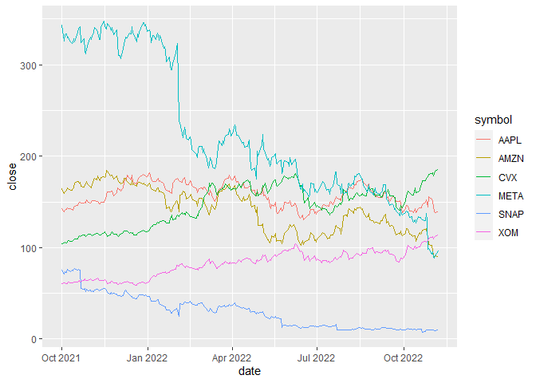

```r
library(ggplot2)
library(readr)
library(knitr)
library(tidyverse)
```

```
## ── Attaching packages ─────────────────────────────────────── tidyverse 1.3.2 ──
## ✔ tibble  3.1.8      ✔ dplyr   1.0.10
## ✔ tidyr   1.2.1      ✔ stringr 1.4.1 
## ✔ purrr   0.3.4      ✔ forcats 0.5.2 
## ── Conflicts ────────────────────────────────────────── tidyverse_conflicts() ──
## ✖ dplyr::filter() masks stats::filter()
## ✖ dplyr::lag()    masks stats::lag()
```

```r
library(dplyr)
library(forcats)
library(downloader)
library(corrplot)
```

```
## corrplot 0.92 loaded
```

```r
library(tidyquant)
```

```
## Loading required package: lubridate
## 
## Attaching package: 'lubridate'
## 
## The following objects are masked from 'package:base':
## 
##     date, intersect, setdiff, union
## 
## Loading required package: PerformanceAnalytics
## Loading required package: xts
## Loading required package: zoo
## 
## Attaching package: 'zoo'
## 
## The following objects are masked from 'package:base':
## 
##     as.Date, as.Date.numeric
## 
## 
## Attaching package: 'xts'
## 
## The following objects are masked from 'package:dplyr':
## 
##     first, last
## 
## 
## Attaching package: 'PerformanceAnalytics'
## 
## The following object is masked from 'package:graphics':
## 
##     legend
## 
## Loading required package: quantmod
## Loading required package: TTR
## Registered S3 method overwritten by 'quantmod':
##   method            from
##   as.zoo.data.frame zoo
```

```r
library(timetk)
library(dygraphs)
```

Friend's Picks: AMZN, META, SNAP

My Picks: XOM, CVX, AAPL


```r
(Amazon <- tq_get("AMZN", get = "stock.prices"))
```

```
## # A tibble: 2,731 × 8
##    symbol date        open  high   low close    volume adjusted
##    <chr>  <date>     <dbl> <dbl> <dbl> <dbl>     <dbl>    <dbl>
##  1 AMZN   2012-01-03  8.79  8.97  8.78  8.95 102216000     8.95
##  2 AMZN   2012-01-04  8.96  9.02  8.80  8.88  84104000     8.88
##  3 AMZN   2012-01-05  8.80  8.91  8.70  8.88  76182000     8.88
##  4 AMZN   2012-01-06  8.90  9.23  8.88  9.13 140168000     9.13
##  5 AMZN   2012-01-09  9.14  9.22  8.85  8.93 101138000     8.93
##  6 AMZN   2012-01-10  9.06  9.12  8.86  8.97  79716000     8.97
##  7 AMZN   2012-01-11  8.98  9.04  8.91  8.94  62054000     8.94
##  8 AMZN   2012-01-12  8.97  8.97  8.79  8.80 107716000     8.80
##  9 AMZN   2012-01-13  8.79  8.94  8.68  8.92  95070000     8.92
## 10 AMZN   2012-01-17  9.01  9.16  8.93  9.08 112890000     9.08
## # … with 2,721 more rows
```

```r
(META <- tq_get("META", get = "stock.prices"))
```

```
## # A tibble: 2,636 × 8
##    symbol date        open  high   low close    volume adjusted
##    <chr>  <date>     <dbl> <dbl> <dbl> <dbl>     <dbl>    <dbl>
##  1 META   2012-05-18  42.0  45    38    38.2 573576400     38.2
##  2 META   2012-05-21  36.5  36.7  33    34.0 168192700     34.0
##  3 META   2012-05-22  32.6  33.6  30.9  31   101786600     31  
##  4 META   2012-05-23  31.4  32.5  31.4  32    73600000     32  
##  5 META   2012-05-24  33.0  33.2  31.8  33.0  50237200     33.0
##  6 META   2012-05-25  32.9  33.0  31.1  31.9  37149800     31.9
##  7 META   2012-05-29  31.5  31.7  28.6  28.8  78063400     28.8
##  8 META   2012-05-30  28.7  29.5  27.9  28.2  57267900     28.2
##  9 META   2012-05-31  28.5  29.7  26.8  29.6 111639200     29.6
## 10 META   2012-06-01  28.9  29.2  27.4  27.7  41855500     27.7
## # … with 2,626 more rows
```

```r
(SNAP <- tq_get("SNAP", get = "stock.prices"))
```

```
## # A tibble: 1,433 × 8
##    symbol date        open  high   low close    volume adjusted
##    <chr>  <date>     <dbl> <dbl> <dbl> <dbl>     <dbl>    <dbl>
##  1 SNAP   2017-03-02  24    26.0  23.5  24.5 217048900     24.5
##  2 SNAP   2017-03-03  26.4  29.4  26.1  27.1 148166400     27.1
##  3 SNAP   2017-03-06  28.2  28.2  23.8  23.8  72903000     23.8
##  4 SNAP   2017-03-07  22.2  22.5  20.6  21.4  71857800     21.4
##  5 SNAP   2017-03-08  22.0  23.4  21.3  22.8  49819100     22.8
##  6 SNAP   2017-03-09  23.2  23.7  22.5  22.7  25803200     22.7
##  7 SNAP   2017-03-10  23.4  23.4  22    22.1  18337600     22.1
##  8 SNAP   2017-03-13  22.0  22.2  21.0  21.1  20605900     21.1
##  9 SNAP   2017-03-14  20.9  21.0  20.2  20.6  20033200     20.6
## 10 SNAP   2017-03-15  20.1  21.4  20.0  20.8  24985900     20.8
## # … with 1,423 more rows
```

```r
(Exxon <- tq_get("XOM", get = "stock.prices"))
```

```
## # A tibble: 2,731 × 8
##    symbol date        open  high   low close   volume adjusted
##    <chr>  <date>     <dbl> <dbl> <dbl> <dbl>    <dbl>    <dbl>
##  1 XOM    2012-01-03  86.0  86.7  85.9  86   20906800     55.4
##  2 XOM    2012-01-04  85.8  86.2  85.1  86.0 16130900     55.4
##  3 XOM    2012-01-05  85.6  85.9  84.9  85.8 17452800     55.2
##  4 XOM    2012-01-06  85.9  86    85.1  85.1 15942100     54.8
##  5 XOM    2012-01-09  85    85.6  85.0  85.5 11664200     55.0
##  6 XOM    2012-01-10  86.1  86.2  85.4  85.7 13080800     55.2
##  7 XOM    2012-01-11  85.1  85.4  84.5  85.1 14831400     54.8
##  8 XOM    2012-01-12  84.4  84.9  83.9  84.7 17357200     54.5
##  9 XOM    2012-01-13  84.2  84.9  83.8  84.9 15551600     54.6
## 10 XOM    2012-01-17  85.8  86.1  85.4  85.7 15627900     55.2
## # … with 2,721 more rows
```

```r
(Chevron <- tq_get("CVX", get = "stock.prices"))
```

```
## # A tibble: 2,731 × 8
##    symbol date        open  high   low close   volume adjusted
##    <chr>  <date>     <dbl> <dbl> <dbl> <dbl>    <dbl>    <dbl>
##  1 CVX    2012-01-03  109.  111.  109.  110. 11518700     71.2
##  2 CVX    2012-01-04  110.  110.  109.  110.  8019100     71.0
##  3 CVX    2012-01-05  109.  110.  108.  109.  7184900     70.3
##  4 CVX    2012-01-06  109.  110.  108.  108.  8214900     69.8
##  5 CVX    2012-01-09  108.  110.  108.  109.  7118800     70.6
##  6 CVX    2012-01-10  110.  111.  109.  109.  7641800     70.3
##  7 CVX    2012-01-11  109.  109.  107.  108.  7802500     69.5
##  8 CVX    2012-01-12  105.  106.  105.  105. 11897200     67.7
##  9 CVX    2012-01-13  105.  106.  104.  106.  8266900     68.4
## 10 CVX    2012-01-17  107.  108.  106.  107.  6925300     68.8
## # … with 2,721 more rows
```

```r
(Apple <- tq_get("AAPL", get = "stock.prices"))
```

```
## # A tibble: 2,731 × 8
##    symbol date        open  high   low close    volume adjusted
##    <chr>  <date>     <dbl> <dbl> <dbl> <dbl>     <dbl>    <dbl>
##  1 AAPL   2012-01-03  14.6  14.7  14.6  14.7 302220800     12.5
##  2 AAPL   2012-01-04  14.6  14.8  14.6  14.8 260022000     12.6
##  3 AAPL   2012-01-05  14.8  14.9  14.7  14.9 271269600     12.7
##  4 AAPL   2012-01-06  15.0  15.1  15.0  15.1 318292800     12.9
##  5 AAPL   2012-01-09  15.2  15.3  15.0  15.1 394024400     12.8
##  6 AAPL   2012-01-10  15.2  15.2  15.1  15.1 258196400     12.9
##  7 AAPL   2012-01-11  15.1  15.1  15.0  15.1 215084800     12.9
##  8 AAPL   2012-01-12  15.1  15.1  15.0  15.0 212587200     12.8
##  9 AAPL   2012-01-13  15.0  15.0  15.0  15.0 226021600     12.8
## 10 AAPL   2012-01-17  15.2  15.2  15.1  15.2 242897200     12.9
## # … with 2,721 more rows
```


```r
friend <- tq_get(c("AMZN", "META", "SNAP"), get = "stock.prices", from = "2021-10-01", to = today())
head(friend)
```

```
## # A tibble: 6 × 8
##   symbol date        open  high   low close   volume adjusted
##   <chr>  <date>     <dbl> <dbl> <dbl> <dbl>    <dbl>    <dbl>
## 1 AMZN   2021-10-01  164.  165.  163.  164. 56712000     164.
## 2 AMZN   2021-10-04  164.  164.  159.  159. 90462000     159.
## 3 AMZN   2021-10-05  160.  163.  160.  161. 65384000     161.
## 4 AMZN   2021-10-06  161.  163.  160.  163. 50660000     163.
## 5 AMZN   2021-10-07  165.  166.  164.  165. 48182000     165.
## 6 AMZN   2021-10-08  166.  166.  164.  164. 39964000     164.
```

```r
mine <- tq_get(c("XOM", "CVX", "AAPL"), get = "stock.prices", from = "2021-10-01", to = today())
head(mine)
```

```
## # A tibble: 6 × 8
##   symbol date        open  high   low close   volume adjusted
##   <chr>  <date>     <dbl> <dbl> <dbl> <dbl>    <dbl>    <dbl>
## 1 XOM    2021-10-01  59.4  61.0  59.4  60.9 24407300     58.3
## 2 XOM    2021-10-04  61.3  62.1  61.0  61.7 33946700     59.0
## 3 XOM    2021-10-05  62.5  62.7  61.0  61.6 29641600     59.0
## 4 XOM    2021-10-06  60.5  61.1  59.8  60.5 25284900     57.9
## 5 XOM    2021-10-07  60.6  61.1  60.1  60.7 19513600     58.0
## 6 XOM    2021-10-08  61.2  62.4  61.2  62.2 22186900     59.5
```

```r
combined <- tq_get(c("AMZN", "META", "SNAP", "XOM", "CVX", "AAPL"), get = "stock.prices", from = "2021-10-01", to = today())
head(combined)
```

```
## # A tibble: 6 × 8
##   symbol date        open  high   low close   volume adjusted
##   <chr>  <date>     <dbl> <dbl> <dbl> <dbl>    <dbl>    <dbl>
## 1 AMZN   2021-10-01  164.  165.  163.  164. 56712000     164.
## 2 AMZN   2021-10-04  164.  164.  159.  159. 90462000     159.
## 3 AMZN   2021-10-05  160.  163.  160.  161. 65384000     161.
## 4 AMZN   2021-10-06  161.  163.  160.  163. 50660000     163.
## 5 AMZN   2021-10-07  165.  166.  164.  165. 48182000     165.
## 6 AMZN   2021-10-08  166.  166.  164.  164. 39964000     164.
```


```r
stockprices <- ggplot(data = combined, mapping = aes(x = date, y = close, color = symbol)) +
  geom_line()

stockprices
```

<!-- -->


```r
stockpriceadjusted <- combined %>%
  select(symbol, date, adjusted) %>%
  pivot_wider(names_from = symbol, values_from = adjusted) %>%
  tk_xts(date_var = date)
```

```
## Warning: Non-numeric columns being dropped: date
```

```r
head(stockpriceadjusted)
```

```
##                AMZN   META  SNAP      XOM      CVX     AAPL
## 2021-10-01 164.1630 343.01 75.25 58.29349 100.3220 141.6202
## 2021-10-04 159.4890 326.23 71.23 59.04931 100.6970 138.1355
## 2021-10-05 161.0500 332.96 73.41 58.95364 101.7932 140.0913
## 2021-10-06 163.1005 333.64 73.13 57.87253 100.8990 140.9749
## 2021-10-07 165.1215 329.22 76.28 58.03518 101.6201 142.2556
## 2021-10-08 164.4310 330.05 75.00 59.48940 103.8991 141.8684
```


```r
dygraph(stockpriceadjusted, main = "Straw Broom Chart Percent") %>%
  dyRebase(percent = TRUE) %>%
  dyShading(from = "2021-10-01", to = today()) %>%
  dyRangeSelector()
```

```{=html}
<div id="htmlwidget-5793e5714553ee89e954" style="width:672px;height:480px;" class="dygraphs html-widget"></div>
<script type="application/json" data-for="htmlwidget-5793e5714553ee89e954">{"x":{"attrs":{"title":"Straw Broom Chart Percent","labels":["day","AMZN","META","SNAP","XOM","CVX","AAPL"],"legend":"auto","retainDateWindow":false,"axes":{"x":{"pixelsPerLabel":60}},"showRangeSelector":true,"rangeSelectorHeight":40,"rangeSelectorPlotFillColor":" #A7B1C4","rangeSelectorPlotStrokeColor":"#808FAB","interactionModel":"Dygraph.Interaction.defaultModel"},"scale":"daily","annotations":[],"shadings":[{"from":"2021-10-01T00:00:00.000Z","to":"2022-11-08T00:00:00.000Z","color":"#EFEFEF","axis":"x"}],"events":[],"format":"date","data":[["2021-10-01T00:00:00.000Z","2021-10-04T00:00:00.000Z","2021-10-05T00:00:00.000Z","2021-10-06T00:00:00.000Z","2021-10-07T00:00:00.000Z","2021-10-08T00:00:00.000Z","2021-10-11T00:00:00.000Z","2021-10-12T00:00:00.000Z","2021-10-13T00:00:00.000Z","2021-10-14T00:00:00.000Z","2021-10-15T00:00:00.000Z","2021-10-18T00:00:00.000Z","2021-10-19T00:00:00.000Z","2021-10-20T00:00:00.000Z","2021-10-21T00:00:00.000Z","2021-10-22T00:00:00.000Z","2021-10-25T00:00:00.000Z","2021-10-26T00:00:00.000Z","2021-10-27T00:00:00.000Z","2021-10-28T00:00:00.000Z","2021-10-29T00:00:00.000Z","2021-11-01T00:00:00.000Z","2021-11-02T00:00:00.000Z","2021-11-03T00:00:00.000Z","2021-11-04T00:00:00.000Z","2021-11-05T00:00:00.000Z","2021-11-08T00:00:00.000Z","2021-11-09T00:00:00.000Z","2021-11-10T00:00:00.000Z","2021-11-11T00:00:00.000Z","2021-11-12T00:00:00.000Z","2021-11-15T00:00:00.000Z","2021-11-16T00:00:00.000Z","2021-11-17T00:00:00.000Z","2021-11-18T00:00:00.000Z","2021-11-19T00:00:00.000Z","2021-11-22T00:00:00.000Z","2021-11-23T00:00:00.000Z","2021-11-24T00:00:00.000Z","2021-11-26T00:00:00.000Z","2021-11-29T00:00:00.000Z","2021-11-30T00:00:00.000Z","2021-12-01T00:00:00.000Z","2021-12-02T00:00:00.000Z","2021-12-03T00:00:00.000Z","2021-12-06T00:00:00.000Z","2021-12-07T00:00:00.000Z","2021-12-08T00:00:00.000Z","2021-12-09T00:00:00.000Z","2021-12-10T00:00:00.000Z","2021-12-13T00:00:00.000Z","2021-12-14T00:00:00.000Z","2021-12-15T00:00:00.000Z","2021-12-16T00:00:00.000Z","2021-12-17T00:00:00.000Z","2021-12-20T00:00:00.000Z","2021-12-21T00:00:00.000Z","2021-12-22T00:00:00.000Z","2021-12-23T00:00:00.000Z","2021-12-27T00:00:00.000Z","2021-12-28T00:00:00.000Z","2021-12-29T00:00:00.000Z","2021-12-30T00:00:00.000Z","2021-12-31T00:00:00.000Z","2022-01-03T00:00:00.000Z","2022-01-04T00:00:00.000Z","2022-01-05T00:00:00.000Z","2022-01-06T00:00:00.000Z","2022-01-07T00:00:00.000Z","2022-01-10T00:00:00.000Z","2022-01-11T00:00:00.000Z","2022-01-12T00:00:00.000Z","2022-01-13T00:00:00.000Z","2022-01-14T00:00:00.000Z","2022-01-18T00:00:00.000Z","2022-01-19T00:00:00.000Z","2022-01-20T00:00:00.000Z","2022-01-21T00:00:00.000Z","2022-01-24T00:00:00.000Z","2022-01-25T00:00:00.000Z","2022-01-26T00:00:00.000Z","2022-01-27T00:00:00.000Z","2022-01-28T00:00:00.000Z","2022-01-31T00:00:00.000Z","2022-02-01T00:00:00.000Z","2022-02-02T00:00:00.000Z","2022-02-03T00:00:00.000Z","2022-02-04T00:00:00.000Z","2022-02-07T00:00:00.000Z","2022-02-08T00:00:00.000Z","2022-02-09T00:00:00.000Z","2022-02-10T00:00:00.000Z","2022-02-11T00:00:00.000Z","2022-02-14T00:00:00.000Z","2022-02-15T00:00:00.000Z","2022-02-16T00:00:00.000Z","2022-02-17T00:00:00.000Z","2022-02-18T00:00:00.000Z","2022-02-22T00:00:00.000Z","2022-02-23T00:00:00.000Z","2022-02-24T00:00:00.000Z","2022-02-25T00:00:00.000Z","2022-02-28T00:00:00.000Z","2022-03-01T00:00:00.000Z","2022-03-02T00:00:00.000Z","2022-03-03T00:00:00.000Z","2022-03-04T00:00:00.000Z","2022-03-07T00:00:00.000Z","2022-03-08T00:00:00.000Z","2022-03-09T00:00:00.000Z","2022-03-10T00:00:00.000Z","2022-03-11T00:00:00.000Z","2022-03-14T00:00:00.000Z","2022-03-15T00:00:00.000Z","2022-03-16T00:00:00.000Z","2022-03-17T00:00:00.000Z","2022-03-18T00:00:00.000Z","2022-03-21T00:00:00.000Z","2022-03-22T00:00:00.000Z","2022-03-23T00:00:00.000Z","2022-03-24T00:00:00.000Z","2022-03-25T00:00:00.000Z","2022-03-28T00:00:00.000Z","2022-03-29T00:00:00.000Z","2022-03-30T00:00:00.000Z","2022-03-31T00:00:00.000Z","2022-04-01T00:00:00.000Z","2022-04-04T00:00:00.000Z","2022-04-05T00:00:00.000Z","2022-04-06T00:00:00.000Z","2022-04-07T00:00:00.000Z","2022-04-08T00:00:00.000Z","2022-04-11T00:00:00.000Z","2022-04-12T00:00:00.000Z","2022-04-13T00:00:00.000Z","2022-04-14T00:00:00.000Z","2022-04-18T00:00:00.000Z","2022-04-19T00:00:00.000Z","2022-04-20T00:00:00.000Z","2022-04-21T00:00:00.000Z","2022-04-22T00:00:00.000Z","2022-04-25T00:00:00.000Z","2022-04-26T00:00:00.000Z","2022-04-27T00:00:00.000Z","2022-04-28T00:00:00.000Z","2022-04-29T00:00:00.000Z","2022-05-02T00:00:00.000Z","2022-05-03T00:00:00.000Z","2022-05-04T00:00:00.000Z","2022-05-05T00:00:00.000Z","2022-05-06T00:00:00.000Z","2022-05-09T00:00:00.000Z","2022-05-10T00:00:00.000Z","2022-05-11T00:00:00.000Z","2022-05-12T00:00:00.000Z","2022-05-13T00:00:00.000Z","2022-05-16T00:00:00.000Z","2022-05-17T00:00:00.000Z","2022-05-18T00:00:00.000Z","2022-05-19T00:00:00.000Z","2022-05-20T00:00:00.000Z","2022-05-23T00:00:00.000Z","2022-05-24T00:00:00.000Z","2022-05-25T00:00:00.000Z","2022-05-26T00:00:00.000Z","2022-05-27T00:00:00.000Z","2022-05-31T00:00:00.000Z","2022-06-01T00:00:00.000Z","2022-06-02T00:00:00.000Z","2022-06-03T00:00:00.000Z","2022-06-06T00:00:00.000Z","2022-06-07T00:00:00.000Z","2022-06-08T00:00:00.000Z","2022-06-09T00:00:00.000Z","2022-06-10T00:00:00.000Z","2022-06-13T00:00:00.000Z","2022-06-14T00:00:00.000Z","2022-06-15T00:00:00.000Z","2022-06-16T00:00:00.000Z","2022-06-17T00:00:00.000Z","2022-06-21T00:00:00.000Z","2022-06-22T00:00:00.000Z","2022-06-23T00:00:00.000Z","2022-06-24T00:00:00.000Z","2022-06-27T00:00:00.000Z","2022-06-28T00:00:00.000Z","2022-06-29T00:00:00.000Z","2022-06-30T00:00:00.000Z","2022-07-01T00:00:00.000Z","2022-07-05T00:00:00.000Z","2022-07-06T00:00:00.000Z","2022-07-07T00:00:00.000Z","2022-07-08T00:00:00.000Z","2022-07-11T00:00:00.000Z","2022-07-12T00:00:00.000Z","2022-07-13T00:00:00.000Z","2022-07-14T00:00:00.000Z","2022-07-15T00:00:00.000Z","2022-07-18T00:00:00.000Z","2022-07-19T00:00:00.000Z","2022-07-20T00:00:00.000Z","2022-07-21T00:00:00.000Z","2022-07-22T00:00:00.000Z","2022-07-25T00:00:00.000Z","2022-07-26T00:00:00.000Z","2022-07-27T00:00:00.000Z","2022-07-28T00:00:00.000Z","2022-07-29T00:00:00.000Z","2022-08-01T00:00:00.000Z","2022-08-02T00:00:00.000Z","2022-08-03T00:00:00.000Z","2022-08-04T00:00:00.000Z","2022-08-05T00:00:00.000Z","2022-08-08T00:00:00.000Z","2022-08-09T00:00:00.000Z","2022-08-10T00:00:00.000Z","2022-08-11T00:00:00.000Z","2022-08-12T00:00:00.000Z","2022-08-15T00:00:00.000Z","2022-08-16T00:00:00.000Z","2022-08-17T00:00:00.000Z","2022-08-18T00:00:00.000Z","2022-08-19T00:00:00.000Z","2022-08-22T00:00:00.000Z","2022-08-23T00:00:00.000Z","2022-08-24T00:00:00.000Z","2022-08-25T00:00:00.000Z","2022-08-26T00:00:00.000Z","2022-08-29T00:00:00.000Z","2022-08-30T00:00:00.000Z","2022-08-31T00:00:00.000Z","2022-09-01T00:00:00.000Z","2022-09-02T00:00:00.000Z","2022-09-06T00:00:00.000Z","2022-09-07T00:00:00.000Z","2022-09-08T00:00:00.000Z","2022-09-09T00:00:00.000Z","2022-09-12T00:00:00.000Z","2022-09-13T00:00:00.000Z","2022-09-14T00:00:00.000Z","2022-09-15T00:00:00.000Z","2022-09-16T00:00:00.000Z","2022-09-19T00:00:00.000Z","2022-09-20T00:00:00.000Z","2022-09-21T00:00:00.000Z","2022-09-22T00:00:00.000Z","2022-09-23T00:00:00.000Z","2022-09-26T00:00:00.000Z","2022-09-27T00:00:00.000Z","2022-09-28T00:00:00.000Z","2022-09-29T00:00:00.000Z","2022-09-30T00:00:00.000Z","2022-10-03T00:00:00.000Z","2022-10-04T00:00:00.000Z","2022-10-05T00:00:00.000Z","2022-10-06T00:00:00.000Z","2022-10-07T00:00:00.000Z","2022-10-10T00:00:00.000Z","2022-10-11T00:00:00.000Z","2022-10-12T00:00:00.000Z","2022-10-13T00:00:00.000Z","2022-10-14T00:00:00.000Z","2022-10-17T00:00:00.000Z","2022-10-18T00:00:00.000Z","2022-10-19T00:00:00.000Z","2022-10-20T00:00:00.000Z","2022-10-21T00:00:00.000Z","2022-10-24T00:00:00.000Z","2022-10-25T00:00:00.000Z","2022-10-26T00:00:00.000Z","2022-10-27T00:00:00.000Z","2022-10-28T00:00:00.000Z","2022-10-31T00:00:00.000Z","2022-11-01T00:00:00.000Z","2022-11-02T00:00:00.000Z","2022-11-03T00:00:00.000Z","2022-11-04T00:00:00.000Z","2022-11-07T00:00:00.000Z"],[164.162994,159.488998,161.050003,163.100494,165.121506,164.431,162.315002,162.366501,164.214005,164.992996,170.451004,172.337006,172.207504,170.753006,171.750504,166.777496,166.018494,168.803497,169.624496,172.328506,168.621506,165.905502,165.637497,169.199997,173.850006,175.949493,174.449005,178.811493,174.102493,173.625,176.257507,177.283997,177.035004,177.449997,184.802994,183.828506,178.628494,179.001999,179.020493,175.227997,178.078506,175.3535,172.186005,171.867996,169.489502,171.3685,176.164505,176.158005,174.171005,172.212006,169.567505,169.091507,173.315002,168.871002,170.017502,167.078995,170.417007,171.037003,171.068497,169.669495,170.660995,169.201004,168.644501,166.716995,170.404495,167.522003,164.356995,163.253998,162.554001,161.485992,165.362,165.207001,161.214005,162.138,158.917496,156.298996,151.667496,142.643005,144.544006,139.985992,138.872498,139.637497,143.977997,149.573502,151.193497,150.612503,138.845505,157.639496,157.935501,161.413498,161.189499,159.003494,153.293503,155.167007,156.510498,158.100494,154.652496,152.601501,150.197495,144.826996,151.358002,153.788498,153.563004,151.141998,152.052505,147.898499,145.641006,137.453003,136.014496,139.279007,146.817505,145.524506,141.852997,147.366501,153.104004,157.238998,161.250504,161.491501,164.889008,163.408005,163.649506,164.773499,168.990494,169.315002,166.300995,162.997498,163.559998,168.346497,164.054993,158.755997,157.7845,154.460495,151.121994,150.787506,155.541,151.706497,152.785004,158.115494,153.998001,148.296005,144.350006,146.074005,139.391006,138.167007,144.596497,124.281502,124.5,124.253502,125.928497,116.406998,114.772499,108.789001,108.859001,105.372002,106.930496,113.055,110.810501,115.3685,107.112503,107.319,107.591003,107.556999,104.099998,106.775002,111.077499,115.1465,120.209503,121.683998,125.511002,122.349998,124.790001,123,121.18,116.150002,109.650002,103.669998,102.309998,107.669998,103.660004,106.220001,108.68,108.949997,112.440002,116.459999,113.220001,107.400002,108.919998,106.209999,109.559998,113.5,114.330002,116.330002,115.540001,111.75,109.220001,110.400002,110.629997,113.550003,113.760002,118.209999,122.769997,124.629997,122.419998,121.139999,114.809998,120.970001,122.279999,134.949997,135.389999,134.160004,139.520004,142.570007,140.800003,139.410004,137.830002,142.690002,140.639999,143.550003,143.179993,144.779999,142.100006,142.300003,138.229996,133.220001,133.619995,133.800003,137.279999,130.75,129.789993,128.729996,126.769997,127.82,127.510002,126.110001,129.479996,129.820007,133.270004,136.449997,126.82,128.550003,126.279999,123.529999,124.660004,122.190002,118.540001,117.309998,113.779999,115.150002,114.410004,118.010002,114.800003,113,115.879997,121.089996,120.949997,120.300003,114.559998,113.669998,112.209999,112.900002,112.529999,106.900002,113.790001,116.360001,115.07,115.25,119.32,119.82,120.599998,115.660004,110.959999,103.410004,102.440002,96.790001,92.120003,89.300003,90.980003,90.529999],[343.01001,326.230011,332.959991,333.640015,329.220001,330.049988,325.450012,323.769989,324.540009,328.529999,324.76001,335.339996,339.98999,340.779999,341.880005,324.609985,328.690002,315.809998,312.220001,316.920013,323.570007,329.980011,328.079987,331.619995,335.850006,341.130005,338.619995,335.369995,327.640015,327.73999,340.890015,347.559998,342.959991,340.769989,338.690002,345.299988,341.01001,337.25,341.059998,333.119995,338.029999,324.459991,310.600006,310.390015,306.839996,317.869995,322.809998,330.559998,329.820007,329.75,334.48999,333.73999,341.660004,334.899994,333.790009,325.450012,334.200012,330.450012,335.23999,346.179993,346.220001,342.940002,344.359985,336.350006,338.540009,336.529999,324.170013,332.459991,331.790009,328.070007,334.369995,333.26001,326.480011,331.899994,318.149994,319.589996,316.559998,303.170013,308.709991,300.149994,294.630005,294.640015,301.709991,313.26001,319,323,237.759995,237.089996,224.910004,220.179993,232,228.070007,219.550003,217.699997,221,216.539993,207.710007,206.160004,202.080002,198.449997,207.600006,210.479996,211.029999,203.490005,208.110001,202.970001,200.059998,187.470001,190.289993,198.5,195.210007,187.610001,186.630005,192.029999,203.630005,207.839996,216.490005,211.490005,216.649994,213.460007,219.570007,221.820007,223.589996,229.860001,227.850006,222.360001,224.850006,233.889999,231.839996,223.300003,222.949997,222.330002,216.460007,214.139999,214.990005,210.179993,210.770004,217.309998,200.419998,188.070007,184.110001,186.990005,180.949997,174.949997,205.729996,200.470001,211.130005,212.029999,223.410004,208.279999,203.770004,196.210007,197.649994,188.740005,191.240005,198.619995,200.039993,202.619995,192.240005,191.289993,193.539993,196.229996,181.279999,183.830002,191.630005,195.130005,193.639999,188.639999,198.860001,190.779999,194.25,195.649994,196.639999,184,175.570007,164.259995,163.729996,169.350006,160.869995,163.740005,157.050003,155.850006,158.75,170.160004,169.490005,160.679993,163.940002,161.25,160.029999,168.190002,169.770004,172.190002,170.880005,162.880005,163.270004,163.490005,158.050003,164.699997,167.229996,175.779999,183.089996,183.169998,169.270004,166.649994,159.149994,169.580002,160.720001,159.100006,159.929993,160.190002,168.800003,170.570007,167.110001,170.25,168.529999,178.339996,177.490005,180.5,180.889999,179.470001,174.850006,174.660004,167.960007,163.050003,161.110001,163.259995,168.779999,161.779999,159.169998,157.160004,162.929993,165.360001,160.320007,158.539993,160.389999,162.059998,169.149994,168.960007,153.130005,151.470001,149.550003,146.289993,148.020004,146.089996,142.119995,142.820007,140.410004,136.369995,134.399994,141.610001,136.410004,135.679993,138.610001,140.279999,138.979996,139.070007,133.449997,133.789993,128.539993,127.5,130.289993,126.760002,134.039993,132.800003,133.229996,131.529999,130.009995,129.720001,137.509995,129.820007,97.940002,99.199997,93.160004,95.199997,90.540001,88.910004,90.790001,96.720001],[75.25,71.230003,73.410004,73.129997,76.279999,75,73.529999,75.260002,74.949997,76.639999,77.339996,75.800003,76.43,75.650002,75.110001,55.139999,54.5,55.389999,52.02,54.389999,52.580002,53.98,52.200001,52.939999,52.259998,53.169998,54.900002,54.82,52.880001,53.290001,53.700001,55.529999,55.110001,54.560001,53.470001,51.32,49.259998,50.669998,49.66,49.759998,48.849998,47.610001,47.259998,47.91,46.790001,47.919998,50.400002,53.419998,52.360001,50.82,48.139999,46.849998,46.41,44.700001,45.290001,44.419998,46.099998,46.77,48.68,48.639999,47.709999,47.060001,48.029999,47.029999,46.59,44.029999,41.330002,41.68,41.360001,41.709999,43.310001,42.73,38.380001,38.040001,35.700001,35.049999,34.990002,32.119999,31.799999,30.66,28.629999,28.299999,30.42,32.540001,33.66,32.07,24.5,38.91,37.880001,37.560001,40.279999,40.619999,39.490002,39.619999,41.43,40.009998,39.450001,38.009998,36.869999,36.98,38.830002,39.150002,39.939999,37.84,37.369999,35.66,33.09,30.219999,31.219999,33.68,31.74,30.049999,28,29.58,32.560001,33.970001,36,35.169998,36.240002,35.880001,37.049999,35.400002,36.23,37.869999,36.84,35.990002,37.389999,39.34,38.25,36.470001,36.25,35.669998,34.400002,33.57,34.68,33.189999,32.639999,33.630001,30.76,29.42,29.76,29.91,28.690001,27.09,28.809999,28.459999,29.52,28.93,30.16,27.27,24.92,23.389999,22.889999,21.84,22.77,24.75,23.42,24.540001,22.73,23.200001,23.26,22.469999,12.79,14.16,14.81,15.58,14.11,13.93,14.9,14.49,15.15,15.28,15.17,14.1,13.28,12.02,11.91,13.2,12.22,12.42,12.85,13.08,13.94,14.7,14.56,13.73,13.96,13.13,13.17,14.38,14.28,15.1,14.96,14.06,14.04,13.83,13.17,13.65,13.92,14.15,15.51,16.35,9.96,9.95,9.63,9.55,9.67,9.88,9.54,9.87,10.32,10.25,10.18,10.41,10.16,10.57,11.11,11.62,12.24,12.61,12.09,12.56,11.56,11.01,10.6,10.86,11.21,10.67,10.27,10.01,10.88,11.64,11.22,10.77,11.46,12.53,12.65,12.65,11.77,11.52,11.9,11.3,11.35,11.12,10.85,10.46,10.32,10.18,10.45,10.76,10.19,9.82,9.98,10.82,11.2,11.35,10.66,10.41,10.31,10.51,10.58,9.99,10.59,10.6,10.86,10.79,7.76,8.31,9.6,9.58,9.56,10.08,9.91,10.25,9.54,9.16,9.14,10.01],[58.293491,59.049309,58.953636,57.872532,58.035175,59.489403,58.896233,58.590076,58.427433,59.317196,59.881664,59.852962,60.752281,61.087135,59.977337,60.388733,61.565506,62.991035,61.355022,61.527233,61.680313,62.790119,62.015167,61.163685,61.62291,62.206509,62.876225,63.488533,62.237766,62.354115,61.879021,62.412296,63.042522,62.354115,61.675407,58.824818,59.639271,61.210007,61.549358,59.38718,59.716839,58.020065,57.971584,59.416267,59.038128,59.70715,60.37616,60.550686,60.705818,61.093651,59.755627,59.668362,59.406574,59.503529,58.204285,57.360744,58.659992,59.13509,59.164177,60.007717,59.813797,59.290222,58.941174,59.329002,61.607536,63.924843,64.71991,66.242157,66.785118,66.387604,69.180008,68.976395,68.481903,69.684196,70.857391,70.886475,71.041603,69.975067,70.57621,72.651123,71.914238,72.83535,72.990479,73.649796,78.371689,78.168076,77.256668,78.934052,79.884247,77.819023,77.446495,76.701439,78.632698,77.426895,76.456352,76.809273,76.691643,75.838745,74.956444,75.260345,74.309425,76.309303,76.877899,77.613152,78.946411,79.446381,82.436401,85.406822,86.053841,81.161972,83.681435,83.250084,80.269859,75.7015,75.417198,77.426895,77.122986,80.583565,80.230644,81.495277,81.740364,83.524574,81.181572,80.750229,82.1325,80.965897,81.485481,81.524696,81.103149,82.005058,83.377533,85.132324,82.201118,83.91671,85.102913,86.102859,86.808701,86.034241,86.230301,85.318588,83.455956,80.642395,80.671806,82.975594,85.485245,83.573593,84.710785,86.45578,89.896751,88.534088,89.886955,82.799126,83.348114,85.083313,85.469559,88.004921,90.074806,91.223648,89.777702,90.262985,90.976051,92.986519,93.491615,95.373329,95.71006,96.650909,95.076218,96.898506,96.730141,98.136475,97.888885,102.375298,103.583549,101.345306,99.493294,94.927658,95.175255,93.976898,90.510574,85.29129,90.599716,87.014549,84.390045,86.063782,88.173286,90.619514,87.272049,84.81591,86.707535,83.993889,82.478615,85.113022,85.251678,84.81591,83.686874,84.023605,82.339966,83.726494,85.271477,87.420593,88.381264,86.905602,86.24205,89.114151,88.767509,90.688843,91.74855,95.997269,93.570847,93.164787,90.144135,86.350998,87.598862,88.094055,89.718269,90.57,93.190002,94,92.32,91.459999,92.199997,94.379997,94.080002,94.010002,98,98.580002,99.089996,97.870003,100.120003,96.309998,95.589996,93.870003,95.589996,94.949997,94.139999,94.910004,96.5,97.610001,95.330002,97.669998,94.830002,93.209999,93.199997,92.440002,90.949997,90.57,85.75,83.980003,85.739998,88.860001,88.68,87.309998,91.919998,95.269997,99.120003,102.059998,101.029999,98.839996,98,98.43,101.870003,99.190002,100.620003,100.800003,103.790001,103.93,105.860001,106.599998,105.879997,107.139999,107.550003,110.699997,110.809998,111.910004,109.610001,111.099998,112.309998,113.639999],[100.322006,100.697021,101.793213,100.898956,101.620132,103.899086,103.014427,103.033669,103.649071,104.62989,105.399155,105.351074,107.408867,108.812782,107.447334,108.466614,109.476265,109.716667,107.764648,108.774315,110.09169,110.13015,109.457039,108.668549,109.14933,110.332077,110.726326,111.543678,109.764748,109.774361,109.841675,112.332176,112.774506,112.2687,111.325188,108.854538,110.799934,113.12468,113.990379,111.383553,111.714264,109.78833,109.039352,111.996353,111.286285,113.027405,114.700439,115.215973,114.914436,115.108971,112.716141,113.046867,112.404869,113.455391,110.498398,110.547028,112.317345,112.959312,113.231674,115.546692,115.322968,114.729622,114.223816,114.146011,116.00386,118.114616,118.883049,119.894646,121.616318,121.694138,124.476051,123.853531,123.337997,125.439026,125.847557,125.390388,124.942947,123.445,123.707619,128.969925,129.067184,131.673996,127.043968,127.744316,131.109833,131.712921,130.53595,132.17009,134.767181,132.714813,134.027939,132.325714,135.020081,132.938507,131.965439,132.004745,131.326538,131.139801,130.137222,133.233398,132.545364,137.98085,141.538971,147.161209,151.505676,153.55014,155.938583,159.270645,167.615555,163.42836,167.900604,167.979248,163.870682,155.574921,155.014679,157.698013,158.965958,161.826218,161.285614,163.025375,163.457855,166.416412,163.507019,161.511703,162.651871,160.047165,161.413406,161.560837,160.568115,161.993317,164.244202,167.025803,162.730499,166.121536,168.736084,168.657455,170.918137,168.893341,169.581375,161.767258,158.19928,154.798416,153.854828,153.569794,159.024933,153.992432,157.019806,159.712982,164.725815,163.418533,167.772827,156.528336,158.032196,160.371521,161.89505,165.001022,170.053177,171.055756,166.546722,165.357529,166.308884,170.173767,171.08548,173.830536,174.999908,176.674698,173.087296,174.732346,174.415222,176.000824,175.237747,178.577408,179.499039,175.921539,173.820618,165.823288,166.041321,162.78093,154.079987,147.04393,153.197998,146.538513,141.147491,143.466431,146.241226,148.589874,145.656525,143.476334,145.190765,141.375427,139.51236,142.227692,141.484451,140.235779,137.669098,136.747482,134.715942,136.410538,138.323166,143.307877,145.200684,144.090759,142.891663,147.143021,145.993484,147.916,149.035828,162.305252,159.064697,157.707031,153.961075,149.779068,152.256561,152.028641,154.01062,154.416946,158.182709,158.410645,155.39801,155.001617,156.279999,159.020004,157.690002,156.899994,161.990005,163.190002,164.619995,163.410004,164.630005,160.619995,158.059998,155.539993,157.850006,157.119995,155.110001,155.949997,159.970001,162.5,159.410004,163.270004,160.619995,156.449997,156.899994,156.279999,155.009995,154.889999,144.770004,140.960007,141.020004,145.779999,144.770004,143.669998,151.729996,157.630005,158.529999,161.419998,160.029999,157.139999,157.169998,157.639999,165.279999,160.139999,161.309998,162.720001,168,168.960007,173.190002,173.130005,174.929993,177.089996,177.899994,179.979996,180.899994,182.220001,178.5,181.130005,183.419998,185.610001],[141.620178,138.135529,140.091293,140.974869,142.255569,141.868362,141.779022,140.488419,139.892746,142.722168,143.794357,145.49202,147.68605,148.182449,148.400864,147.616577,147.566925,148.24205,147.775436,151.468567,148.718567,147.884628,148.936966,150.396378,149.870193,150.407059,149.571915,149.939758,147.066467,147.016739,149.124527,149.13446,150.128677,152.604324,156.95903,159.623566,160.090866,160.478638,161.005554,155.905167,159.315369,164.346176,163.819229,162.815063,160.906143,164.366058,170.192245,174.069733,173.552734,178.41452,174.725937,173.324066,178.265396,171.265991,170.152466,168.770493,171.991791,174.626495,175.262802,179.289459,178.255432,178.344925,177.171738,176.54538,180.959747,178.663071,173.91066,171.007507,171.176544,171.196411,174.069733,174.517136,171.196411,172.07135,168.820206,165.270813,163.560715,161.472839,160.687408,158.858017,158.768539,158.301254,169.347153,173.771454,173.602448,174.825348,171.902313,171.613632,170.886917,174.042648,175.486099,171.344833,167.880524,168.119446,172.011826,171.772919,168.119446,166.546555,163.579971,159.349121,162.007095,164.10759,164.376373,162.465012,165.809891,165.481369,162.43515,158.582596,156.730957,162.216141,157.806107,154.033157,149.941666,154.391525,158.871262,159.896637,163.241486,164.635208,168.059708,169.443451,173.286072,173.933136,174.809189,178.154037,176.969406,173.823639,173.524979,177.636383,174.271606,171.056168,171.364746,169.32399,165.00354,166.904938,169.632584,164.545593,164.326599,166.646088,166.476852,165.670502,161.061356,162.146454,156.093842,155.864883,162.90303,156.940002,157.248611,158.761765,165.272324,156.06398,156.801712,151.597595,154.040131,146.054504,142.12648,146.662659,145.097427,148.786179,140.391785,136.932327,137.171585,142.674805,139.933167,140.092697,143.342758,149.184952,148.38739,148.257782,150.750183,144.937912,145.695602,148.257782,147.510071,142.206238,136.712997,131.478958,132.356277,135.018158,129.66449,131.159927,135.456833,134.938416,137.849533,141.229218,141.229218,137.022064,138.80661,136.304245,138.507507,141.129517,142.485397,145.904968,146.59285,144.429443,145.416443,145.047577,148.018509,149.713348,146.622772,150.540817,152.574615,154.877594,153.621414,152.484894,151.139008,156.313202,156.871521,162.015808,161.01886,159.523407,165.624817,165.305786,165.076172,164.596954,164.646866,168.959732,168.210968,171.814987,172.903183,172.743439,174.260925,173.861588,171.235947,167.292496,166.953049,167.252548,169.748413,163.349014,161.112747,158.646835,156.959625,157.69841,155.551956,154.274078,155.701721,154.204208,157.109375,163.159332,153.58522,155.05278,152.117645,150.450424,154.224152,156.640152,153.465424,152.487045,150.180862,150.520309,151.508667,149.591843,142.244034,137.971115,142.214081,145.858047,146.157532,145.189148,139.857986,140.187439,138.749832,138.110886,142.753204,138.150833,142.174164,143.511932,143.62175,143.152527,147.026108,149.202484,152.087708,149.102661,144.560196,155.482086,153.086044,150.400497,144.78981,138.650009,138.380005,138.919998]],"plugins":{"Rebase":"percent"}},"evals":["attrs.interactionModel"],"jsHooks":[]}</script>
```


```r
dygraph(stockpriceadjusted, main = "Straw Broom Chart") %>%
  dyRebase(value = 1000) %>% 
  dyAnnotation("2021-10-01", text = "A") %>%
  dyShading(from = "2021-10-01", to = today()) %>%
  dyRangeSelector()
```

```{=html}
<div id="htmlwidget-93837cc20f427017ee2b" style="width:672px;height:480px;" class="dygraphs html-widget"></div>
<script type="application/json" data-for="htmlwidget-93837cc20f427017ee2b">{"x":{"attrs":{"title":"Straw Broom Chart","labels":["day","AMZN","META","SNAP","XOM","CVX","AAPL"],"legend":"auto","retainDateWindow":false,"axes":{"x":{"pixelsPerLabel":60}},"showRangeSelector":true,"rangeSelectorHeight":40,"rangeSelectorPlotFillColor":" #A7B1C4","rangeSelectorPlotStrokeColor":"#808FAB","interactionModel":"Dygraph.Interaction.defaultModel"},"scale":"daily","annotations":[{"x":"2021-10-01T00:00:00.000Z","shortText":"A","attachAtBottom":false,"series":"AAPL"}],"shadings":[{"from":"2021-10-01T00:00:00.000Z","to":"2022-11-08T00:00:00.000Z","color":"#EFEFEF","axis":"x"}],"events":[],"format":"date","data":[["2021-10-01T00:00:00.000Z","2021-10-04T00:00:00.000Z","2021-10-05T00:00:00.000Z","2021-10-06T00:00:00.000Z","2021-10-07T00:00:00.000Z","2021-10-08T00:00:00.000Z","2021-10-11T00:00:00.000Z","2021-10-12T00:00:00.000Z","2021-10-13T00:00:00.000Z","2021-10-14T00:00:00.000Z","2021-10-15T00:00:00.000Z","2021-10-18T00:00:00.000Z","2021-10-19T00:00:00.000Z","2021-10-20T00:00:00.000Z","2021-10-21T00:00:00.000Z","2021-10-22T00:00:00.000Z","2021-10-25T00:00:00.000Z","2021-10-26T00:00:00.000Z","2021-10-27T00:00:00.000Z","2021-10-28T00:00:00.000Z","2021-10-29T00:00:00.000Z","2021-11-01T00:00:00.000Z","2021-11-02T00:00:00.000Z","2021-11-03T00:00:00.000Z","2021-11-04T00:00:00.000Z","2021-11-05T00:00:00.000Z","2021-11-08T00:00:00.000Z","2021-11-09T00:00:00.000Z","2021-11-10T00:00:00.000Z","2021-11-11T00:00:00.000Z","2021-11-12T00:00:00.000Z","2021-11-15T00:00:00.000Z","2021-11-16T00:00:00.000Z","2021-11-17T00:00:00.000Z","2021-11-18T00:00:00.000Z","2021-11-19T00:00:00.000Z","2021-11-22T00:00:00.000Z","2021-11-23T00:00:00.000Z","2021-11-24T00:00:00.000Z","2021-11-26T00:00:00.000Z","2021-11-29T00:00:00.000Z","2021-11-30T00:00:00.000Z","2021-12-01T00:00:00.000Z","2021-12-02T00:00:00.000Z","2021-12-03T00:00:00.000Z","2021-12-06T00:00:00.000Z","2021-12-07T00:00:00.000Z","2021-12-08T00:00:00.000Z","2021-12-09T00:00:00.000Z","2021-12-10T00:00:00.000Z","2021-12-13T00:00:00.000Z","2021-12-14T00:00:00.000Z","2021-12-15T00:00:00.000Z","2021-12-16T00:00:00.000Z","2021-12-17T00:00:00.000Z","2021-12-20T00:00:00.000Z","2021-12-21T00:00:00.000Z","2021-12-22T00:00:00.000Z","2021-12-23T00:00:00.000Z","2021-12-27T00:00:00.000Z","2021-12-28T00:00:00.000Z","2021-12-29T00:00:00.000Z","2021-12-30T00:00:00.000Z","2021-12-31T00:00:00.000Z","2022-01-03T00:00:00.000Z","2022-01-04T00:00:00.000Z","2022-01-05T00:00:00.000Z","2022-01-06T00:00:00.000Z","2022-01-07T00:00:00.000Z","2022-01-10T00:00:00.000Z","2022-01-11T00:00:00.000Z","2022-01-12T00:00:00.000Z","2022-01-13T00:00:00.000Z","2022-01-14T00:00:00.000Z","2022-01-18T00:00:00.000Z","2022-01-19T00:00:00.000Z","2022-01-20T00:00:00.000Z","2022-01-21T00:00:00.000Z","2022-01-24T00:00:00.000Z","2022-01-25T00:00:00.000Z","2022-01-26T00:00:00.000Z","2022-01-27T00:00:00.000Z","2022-01-28T00:00:00.000Z","2022-01-31T00:00:00.000Z","2022-02-01T00:00:00.000Z","2022-02-02T00:00:00.000Z","2022-02-03T00:00:00.000Z","2022-02-04T00:00:00.000Z","2022-02-07T00:00:00.000Z","2022-02-08T00:00:00.000Z","2022-02-09T00:00:00.000Z","2022-02-10T00:00:00.000Z","2022-02-11T00:00:00.000Z","2022-02-14T00:00:00.000Z","2022-02-15T00:00:00.000Z","2022-02-16T00:00:00.000Z","2022-02-17T00:00:00.000Z","2022-02-18T00:00:00.000Z","2022-02-22T00:00:00.000Z","2022-02-23T00:00:00.000Z","2022-02-24T00:00:00.000Z","2022-02-25T00:00:00.000Z","2022-02-28T00:00:00.000Z","2022-03-01T00:00:00.000Z","2022-03-02T00:00:00.000Z","2022-03-03T00:00:00.000Z","2022-03-04T00:00:00.000Z","2022-03-07T00:00:00.000Z","2022-03-08T00:00:00.000Z","2022-03-09T00:00:00.000Z","2022-03-10T00:00:00.000Z","2022-03-11T00:00:00.000Z","2022-03-14T00:00:00.000Z","2022-03-15T00:00:00.000Z","2022-03-16T00:00:00.000Z","2022-03-17T00:00:00.000Z","2022-03-18T00:00:00.000Z","2022-03-21T00:00:00.000Z","2022-03-22T00:00:00.000Z","2022-03-23T00:00:00.000Z","2022-03-24T00:00:00.000Z","2022-03-25T00:00:00.000Z","2022-03-28T00:00:00.000Z","2022-03-29T00:00:00.000Z","2022-03-30T00:00:00.000Z","2022-03-31T00:00:00.000Z","2022-04-01T00:00:00.000Z","2022-04-04T00:00:00.000Z","2022-04-05T00:00:00.000Z","2022-04-06T00:00:00.000Z","2022-04-07T00:00:00.000Z","2022-04-08T00:00:00.000Z","2022-04-11T00:00:00.000Z","2022-04-12T00:00:00.000Z","2022-04-13T00:00:00.000Z","2022-04-14T00:00:00.000Z","2022-04-18T00:00:00.000Z","2022-04-19T00:00:00.000Z","2022-04-20T00:00:00.000Z","2022-04-21T00:00:00.000Z","2022-04-22T00:00:00.000Z","2022-04-25T00:00:00.000Z","2022-04-26T00:00:00.000Z","2022-04-27T00:00:00.000Z","2022-04-28T00:00:00.000Z","2022-04-29T00:00:00.000Z","2022-05-02T00:00:00.000Z","2022-05-03T00:00:00.000Z","2022-05-04T00:00:00.000Z","2022-05-05T00:00:00.000Z","2022-05-06T00:00:00.000Z","2022-05-09T00:00:00.000Z","2022-05-10T00:00:00.000Z","2022-05-11T00:00:00.000Z","2022-05-12T00:00:00.000Z","2022-05-13T00:00:00.000Z","2022-05-16T00:00:00.000Z","2022-05-17T00:00:00.000Z","2022-05-18T00:00:00.000Z","2022-05-19T00:00:00.000Z","2022-05-20T00:00:00.000Z","2022-05-23T00:00:00.000Z","2022-05-24T00:00:00.000Z","2022-05-25T00:00:00.000Z","2022-05-26T00:00:00.000Z","2022-05-27T00:00:00.000Z","2022-05-31T00:00:00.000Z","2022-06-01T00:00:00.000Z","2022-06-02T00:00:00.000Z","2022-06-03T00:00:00.000Z","2022-06-06T00:00:00.000Z","2022-06-07T00:00:00.000Z","2022-06-08T00:00:00.000Z","2022-06-09T00:00:00.000Z","2022-06-10T00:00:00.000Z","2022-06-13T00:00:00.000Z","2022-06-14T00:00:00.000Z","2022-06-15T00:00:00.000Z","2022-06-16T00:00:00.000Z","2022-06-17T00:00:00.000Z","2022-06-21T00:00:00.000Z","2022-06-22T00:00:00.000Z","2022-06-23T00:00:00.000Z","2022-06-24T00:00:00.000Z","2022-06-27T00:00:00.000Z","2022-06-28T00:00:00.000Z","2022-06-29T00:00:00.000Z","2022-06-30T00:00:00.000Z","2022-07-01T00:00:00.000Z","2022-07-05T00:00:00.000Z","2022-07-06T00:00:00.000Z","2022-07-07T00:00:00.000Z","2022-07-08T00:00:00.000Z","2022-07-11T00:00:00.000Z","2022-07-12T00:00:00.000Z","2022-07-13T00:00:00.000Z","2022-07-14T00:00:00.000Z","2022-07-15T00:00:00.000Z","2022-07-18T00:00:00.000Z","2022-07-19T00:00:00.000Z","2022-07-20T00:00:00.000Z","2022-07-21T00:00:00.000Z","2022-07-22T00:00:00.000Z","2022-07-25T00:00:00.000Z","2022-07-26T00:00:00.000Z","2022-07-27T00:00:00.000Z","2022-07-28T00:00:00.000Z","2022-07-29T00:00:00.000Z","2022-08-01T00:00:00.000Z","2022-08-02T00:00:00.000Z","2022-08-03T00:00:00.000Z","2022-08-04T00:00:00.000Z","2022-08-05T00:00:00.000Z","2022-08-08T00:00:00.000Z","2022-08-09T00:00:00.000Z","2022-08-10T00:00:00.000Z","2022-08-11T00:00:00.000Z","2022-08-12T00:00:00.000Z","2022-08-15T00:00:00.000Z","2022-08-16T00:00:00.000Z","2022-08-17T00:00:00.000Z","2022-08-18T00:00:00.000Z","2022-08-19T00:00:00.000Z","2022-08-22T00:00:00.000Z","2022-08-23T00:00:00.000Z","2022-08-24T00:00:00.000Z","2022-08-25T00:00:00.000Z","2022-08-26T00:00:00.000Z","2022-08-29T00:00:00.000Z","2022-08-30T00:00:00.000Z","2022-08-31T00:00:00.000Z","2022-09-01T00:00:00.000Z","2022-09-02T00:00:00.000Z","2022-09-06T00:00:00.000Z","2022-09-07T00:00:00.000Z","2022-09-08T00:00:00.000Z","2022-09-09T00:00:00.000Z","2022-09-12T00:00:00.000Z","2022-09-13T00:00:00.000Z","2022-09-14T00:00:00.000Z","2022-09-15T00:00:00.000Z","2022-09-16T00:00:00.000Z","2022-09-19T00:00:00.000Z","2022-09-20T00:00:00.000Z","2022-09-21T00:00:00.000Z","2022-09-22T00:00:00.000Z","2022-09-23T00:00:00.000Z","2022-09-26T00:00:00.000Z","2022-09-27T00:00:00.000Z","2022-09-28T00:00:00.000Z","2022-09-29T00:00:00.000Z","2022-09-30T00:00:00.000Z","2022-10-03T00:00:00.000Z","2022-10-04T00:00:00.000Z","2022-10-05T00:00:00.000Z","2022-10-06T00:00:00.000Z","2022-10-07T00:00:00.000Z","2022-10-10T00:00:00.000Z","2022-10-11T00:00:00.000Z","2022-10-12T00:00:00.000Z","2022-10-13T00:00:00.000Z","2022-10-14T00:00:00.000Z","2022-10-17T00:00:00.000Z","2022-10-18T00:00:00.000Z","2022-10-19T00:00:00.000Z","2022-10-20T00:00:00.000Z","2022-10-21T00:00:00.000Z","2022-10-24T00:00:00.000Z","2022-10-25T00:00:00.000Z","2022-10-26T00:00:00.000Z","2022-10-27T00:00:00.000Z","2022-10-28T00:00:00.000Z","2022-10-31T00:00:00.000Z","2022-11-01T00:00:00.000Z","2022-11-02T00:00:00.000Z","2022-11-03T00:00:00.000Z","2022-11-04T00:00:00.000Z","2022-11-07T00:00:00.000Z"],[164.162994,159.488998,161.050003,163.100494,165.121506,164.431,162.315002,162.366501,164.214005,164.992996,170.451004,172.337006,172.207504,170.753006,171.750504,166.777496,166.018494,168.803497,169.624496,172.328506,168.621506,165.905502,165.637497,169.199997,173.850006,175.949493,174.449005,178.811493,174.102493,173.625,176.257507,177.283997,177.035004,177.449997,184.802994,183.828506,178.628494,179.001999,179.020493,175.227997,178.078506,175.3535,172.186005,171.867996,169.489502,171.3685,176.164505,176.158005,174.171005,172.212006,169.567505,169.091507,173.315002,168.871002,170.017502,167.078995,170.417007,171.037003,171.068497,169.669495,170.660995,169.201004,168.644501,166.716995,170.404495,167.522003,164.356995,163.253998,162.554001,161.485992,165.362,165.207001,161.214005,162.138,158.917496,156.298996,151.667496,142.643005,144.544006,139.985992,138.872498,139.637497,143.977997,149.573502,151.193497,150.612503,138.845505,157.639496,157.935501,161.413498,161.189499,159.003494,153.293503,155.167007,156.510498,158.100494,154.652496,152.601501,150.197495,144.826996,151.358002,153.788498,153.563004,151.141998,152.052505,147.898499,145.641006,137.453003,136.014496,139.279007,146.817505,145.524506,141.852997,147.366501,153.104004,157.238998,161.250504,161.491501,164.889008,163.408005,163.649506,164.773499,168.990494,169.315002,166.300995,162.997498,163.559998,168.346497,164.054993,158.755997,157.7845,154.460495,151.121994,150.787506,155.541,151.706497,152.785004,158.115494,153.998001,148.296005,144.350006,146.074005,139.391006,138.167007,144.596497,124.281502,124.5,124.253502,125.928497,116.406998,114.772499,108.789001,108.859001,105.372002,106.930496,113.055,110.810501,115.3685,107.112503,107.319,107.591003,107.556999,104.099998,106.775002,111.077499,115.1465,120.209503,121.683998,125.511002,122.349998,124.790001,123,121.18,116.150002,109.650002,103.669998,102.309998,107.669998,103.660004,106.220001,108.68,108.949997,112.440002,116.459999,113.220001,107.400002,108.919998,106.209999,109.559998,113.5,114.330002,116.330002,115.540001,111.75,109.220001,110.400002,110.629997,113.550003,113.760002,118.209999,122.769997,124.629997,122.419998,121.139999,114.809998,120.970001,122.279999,134.949997,135.389999,134.160004,139.520004,142.570007,140.800003,139.410004,137.830002,142.690002,140.639999,143.550003,143.179993,144.779999,142.100006,142.300003,138.229996,133.220001,133.619995,133.800003,137.279999,130.75,129.789993,128.729996,126.769997,127.82,127.510002,126.110001,129.479996,129.820007,133.270004,136.449997,126.82,128.550003,126.279999,123.529999,124.660004,122.190002,118.540001,117.309998,113.779999,115.150002,114.410004,118.010002,114.800003,113,115.879997,121.089996,120.949997,120.300003,114.559998,113.669998,112.209999,112.900002,112.529999,106.900002,113.790001,116.360001,115.07,115.25,119.32,119.82,120.599998,115.660004,110.959999,103.410004,102.440002,96.790001,92.120003,89.300003,90.980003,90.529999],[343.01001,326.230011,332.959991,333.640015,329.220001,330.049988,325.450012,323.769989,324.540009,328.529999,324.76001,335.339996,339.98999,340.779999,341.880005,324.609985,328.690002,315.809998,312.220001,316.920013,323.570007,329.980011,328.079987,331.619995,335.850006,341.130005,338.619995,335.369995,327.640015,327.73999,340.890015,347.559998,342.959991,340.769989,338.690002,345.299988,341.01001,337.25,341.059998,333.119995,338.029999,324.459991,310.600006,310.390015,306.839996,317.869995,322.809998,330.559998,329.820007,329.75,334.48999,333.73999,341.660004,334.899994,333.790009,325.450012,334.200012,330.450012,335.23999,346.179993,346.220001,342.940002,344.359985,336.350006,338.540009,336.529999,324.170013,332.459991,331.790009,328.070007,334.369995,333.26001,326.480011,331.899994,318.149994,319.589996,316.559998,303.170013,308.709991,300.149994,294.630005,294.640015,301.709991,313.26001,319,323,237.759995,237.089996,224.910004,220.179993,232,228.070007,219.550003,217.699997,221,216.539993,207.710007,206.160004,202.080002,198.449997,207.600006,210.479996,211.029999,203.490005,208.110001,202.970001,200.059998,187.470001,190.289993,198.5,195.210007,187.610001,186.630005,192.029999,203.630005,207.839996,216.490005,211.490005,216.649994,213.460007,219.570007,221.820007,223.589996,229.860001,227.850006,222.360001,224.850006,233.889999,231.839996,223.300003,222.949997,222.330002,216.460007,214.139999,214.990005,210.179993,210.770004,217.309998,200.419998,188.070007,184.110001,186.990005,180.949997,174.949997,205.729996,200.470001,211.130005,212.029999,223.410004,208.279999,203.770004,196.210007,197.649994,188.740005,191.240005,198.619995,200.039993,202.619995,192.240005,191.289993,193.539993,196.229996,181.279999,183.830002,191.630005,195.130005,193.639999,188.639999,198.860001,190.779999,194.25,195.649994,196.639999,184,175.570007,164.259995,163.729996,169.350006,160.869995,163.740005,157.050003,155.850006,158.75,170.160004,169.490005,160.679993,163.940002,161.25,160.029999,168.190002,169.770004,172.190002,170.880005,162.880005,163.270004,163.490005,158.050003,164.699997,167.229996,175.779999,183.089996,183.169998,169.270004,166.649994,159.149994,169.580002,160.720001,159.100006,159.929993,160.190002,168.800003,170.570007,167.110001,170.25,168.529999,178.339996,177.490005,180.5,180.889999,179.470001,174.850006,174.660004,167.960007,163.050003,161.110001,163.259995,168.779999,161.779999,159.169998,157.160004,162.929993,165.360001,160.320007,158.539993,160.389999,162.059998,169.149994,168.960007,153.130005,151.470001,149.550003,146.289993,148.020004,146.089996,142.119995,142.820007,140.410004,136.369995,134.399994,141.610001,136.410004,135.679993,138.610001,140.279999,138.979996,139.070007,133.449997,133.789993,128.539993,127.5,130.289993,126.760002,134.039993,132.800003,133.229996,131.529999,130.009995,129.720001,137.509995,129.820007,97.940002,99.199997,93.160004,95.199997,90.540001,88.910004,90.790001,96.720001],[75.25,71.230003,73.410004,73.129997,76.279999,75,73.529999,75.260002,74.949997,76.639999,77.339996,75.800003,76.43,75.650002,75.110001,55.139999,54.5,55.389999,52.02,54.389999,52.580002,53.98,52.200001,52.939999,52.259998,53.169998,54.900002,54.82,52.880001,53.290001,53.700001,55.529999,55.110001,54.560001,53.470001,51.32,49.259998,50.669998,49.66,49.759998,48.849998,47.610001,47.259998,47.91,46.790001,47.919998,50.400002,53.419998,52.360001,50.82,48.139999,46.849998,46.41,44.700001,45.290001,44.419998,46.099998,46.77,48.68,48.639999,47.709999,47.060001,48.029999,47.029999,46.59,44.029999,41.330002,41.68,41.360001,41.709999,43.310001,42.73,38.380001,38.040001,35.700001,35.049999,34.990002,32.119999,31.799999,30.66,28.629999,28.299999,30.42,32.540001,33.66,32.07,24.5,38.91,37.880001,37.560001,40.279999,40.619999,39.490002,39.619999,41.43,40.009998,39.450001,38.009998,36.869999,36.98,38.830002,39.150002,39.939999,37.84,37.369999,35.66,33.09,30.219999,31.219999,33.68,31.74,30.049999,28,29.58,32.560001,33.970001,36,35.169998,36.240002,35.880001,37.049999,35.400002,36.23,37.869999,36.84,35.990002,37.389999,39.34,38.25,36.470001,36.25,35.669998,34.400002,33.57,34.68,33.189999,32.639999,33.630001,30.76,29.42,29.76,29.91,28.690001,27.09,28.809999,28.459999,29.52,28.93,30.16,27.27,24.92,23.389999,22.889999,21.84,22.77,24.75,23.42,24.540001,22.73,23.200001,23.26,22.469999,12.79,14.16,14.81,15.58,14.11,13.93,14.9,14.49,15.15,15.28,15.17,14.1,13.28,12.02,11.91,13.2,12.22,12.42,12.85,13.08,13.94,14.7,14.56,13.73,13.96,13.13,13.17,14.38,14.28,15.1,14.96,14.06,14.04,13.83,13.17,13.65,13.92,14.15,15.51,16.35,9.96,9.95,9.63,9.55,9.67,9.88,9.54,9.87,10.32,10.25,10.18,10.41,10.16,10.57,11.11,11.62,12.24,12.61,12.09,12.56,11.56,11.01,10.6,10.86,11.21,10.67,10.27,10.01,10.88,11.64,11.22,10.77,11.46,12.53,12.65,12.65,11.77,11.52,11.9,11.3,11.35,11.12,10.85,10.46,10.32,10.18,10.45,10.76,10.19,9.82,9.98,10.82,11.2,11.35,10.66,10.41,10.31,10.51,10.58,9.99,10.59,10.6,10.86,10.79,7.76,8.31,9.6,9.58,9.56,10.08,9.91,10.25,9.54,9.16,9.14,10.01],[58.293491,59.049309,58.953636,57.872532,58.035175,59.489403,58.896233,58.590076,58.427433,59.317196,59.881664,59.852962,60.752281,61.087135,59.977337,60.388733,61.565506,62.991035,61.355022,61.527233,61.680313,62.790119,62.015167,61.163685,61.62291,62.206509,62.876225,63.488533,62.237766,62.354115,61.879021,62.412296,63.042522,62.354115,61.675407,58.824818,59.639271,61.210007,61.549358,59.38718,59.716839,58.020065,57.971584,59.416267,59.038128,59.70715,60.37616,60.550686,60.705818,61.093651,59.755627,59.668362,59.406574,59.503529,58.204285,57.360744,58.659992,59.13509,59.164177,60.007717,59.813797,59.290222,58.941174,59.329002,61.607536,63.924843,64.71991,66.242157,66.785118,66.387604,69.180008,68.976395,68.481903,69.684196,70.857391,70.886475,71.041603,69.975067,70.57621,72.651123,71.914238,72.83535,72.990479,73.649796,78.371689,78.168076,77.256668,78.934052,79.884247,77.819023,77.446495,76.701439,78.632698,77.426895,76.456352,76.809273,76.691643,75.838745,74.956444,75.260345,74.309425,76.309303,76.877899,77.613152,78.946411,79.446381,82.436401,85.406822,86.053841,81.161972,83.681435,83.250084,80.269859,75.7015,75.417198,77.426895,77.122986,80.583565,80.230644,81.495277,81.740364,83.524574,81.181572,80.750229,82.1325,80.965897,81.485481,81.524696,81.103149,82.005058,83.377533,85.132324,82.201118,83.91671,85.102913,86.102859,86.808701,86.034241,86.230301,85.318588,83.455956,80.642395,80.671806,82.975594,85.485245,83.573593,84.710785,86.45578,89.896751,88.534088,89.886955,82.799126,83.348114,85.083313,85.469559,88.004921,90.074806,91.223648,89.777702,90.262985,90.976051,92.986519,93.491615,95.373329,95.71006,96.650909,95.076218,96.898506,96.730141,98.136475,97.888885,102.375298,103.583549,101.345306,99.493294,94.927658,95.175255,93.976898,90.510574,85.29129,90.599716,87.014549,84.390045,86.063782,88.173286,90.619514,87.272049,84.81591,86.707535,83.993889,82.478615,85.113022,85.251678,84.81591,83.686874,84.023605,82.339966,83.726494,85.271477,87.420593,88.381264,86.905602,86.24205,89.114151,88.767509,90.688843,91.74855,95.997269,93.570847,93.164787,90.144135,86.350998,87.598862,88.094055,89.718269,90.57,93.190002,94,92.32,91.459999,92.199997,94.379997,94.080002,94.010002,98,98.580002,99.089996,97.870003,100.120003,96.309998,95.589996,93.870003,95.589996,94.949997,94.139999,94.910004,96.5,97.610001,95.330002,97.669998,94.830002,93.209999,93.199997,92.440002,90.949997,90.57,85.75,83.980003,85.739998,88.860001,88.68,87.309998,91.919998,95.269997,99.120003,102.059998,101.029999,98.839996,98,98.43,101.870003,99.190002,100.620003,100.800003,103.790001,103.93,105.860001,106.599998,105.879997,107.139999,107.550003,110.699997,110.809998,111.910004,109.610001,111.099998,112.309998,113.639999],[100.322006,100.697021,101.793213,100.898956,101.620132,103.899086,103.014427,103.033669,103.649071,104.62989,105.399155,105.351074,107.408867,108.812782,107.447334,108.466614,109.476265,109.716667,107.764648,108.774315,110.09169,110.13015,109.457039,108.668549,109.14933,110.332077,110.726326,111.543678,109.764748,109.774361,109.841675,112.332176,112.774506,112.2687,111.325188,108.854538,110.799934,113.12468,113.990379,111.383553,111.714264,109.78833,109.039352,111.996353,111.286285,113.027405,114.700439,115.215973,114.914436,115.108971,112.716141,113.046867,112.404869,113.455391,110.498398,110.547028,112.317345,112.959312,113.231674,115.546692,115.322968,114.729622,114.223816,114.146011,116.00386,118.114616,118.883049,119.894646,121.616318,121.694138,124.476051,123.853531,123.337997,125.439026,125.847557,125.390388,124.942947,123.445,123.707619,128.969925,129.067184,131.673996,127.043968,127.744316,131.109833,131.712921,130.53595,132.17009,134.767181,132.714813,134.027939,132.325714,135.020081,132.938507,131.965439,132.004745,131.326538,131.139801,130.137222,133.233398,132.545364,137.98085,141.538971,147.161209,151.505676,153.55014,155.938583,159.270645,167.615555,163.42836,167.900604,167.979248,163.870682,155.574921,155.014679,157.698013,158.965958,161.826218,161.285614,163.025375,163.457855,166.416412,163.507019,161.511703,162.651871,160.047165,161.413406,161.560837,160.568115,161.993317,164.244202,167.025803,162.730499,166.121536,168.736084,168.657455,170.918137,168.893341,169.581375,161.767258,158.19928,154.798416,153.854828,153.569794,159.024933,153.992432,157.019806,159.712982,164.725815,163.418533,167.772827,156.528336,158.032196,160.371521,161.89505,165.001022,170.053177,171.055756,166.546722,165.357529,166.308884,170.173767,171.08548,173.830536,174.999908,176.674698,173.087296,174.732346,174.415222,176.000824,175.237747,178.577408,179.499039,175.921539,173.820618,165.823288,166.041321,162.78093,154.079987,147.04393,153.197998,146.538513,141.147491,143.466431,146.241226,148.589874,145.656525,143.476334,145.190765,141.375427,139.51236,142.227692,141.484451,140.235779,137.669098,136.747482,134.715942,136.410538,138.323166,143.307877,145.200684,144.090759,142.891663,147.143021,145.993484,147.916,149.035828,162.305252,159.064697,157.707031,153.961075,149.779068,152.256561,152.028641,154.01062,154.416946,158.182709,158.410645,155.39801,155.001617,156.279999,159.020004,157.690002,156.899994,161.990005,163.190002,164.619995,163.410004,164.630005,160.619995,158.059998,155.539993,157.850006,157.119995,155.110001,155.949997,159.970001,162.5,159.410004,163.270004,160.619995,156.449997,156.899994,156.279999,155.009995,154.889999,144.770004,140.960007,141.020004,145.779999,144.770004,143.669998,151.729996,157.630005,158.529999,161.419998,160.029999,157.139999,157.169998,157.639999,165.279999,160.139999,161.309998,162.720001,168,168.960007,173.190002,173.130005,174.929993,177.089996,177.899994,179.979996,180.899994,182.220001,178.5,181.130005,183.419998,185.610001],[141.620178,138.135529,140.091293,140.974869,142.255569,141.868362,141.779022,140.488419,139.892746,142.722168,143.794357,145.49202,147.68605,148.182449,148.400864,147.616577,147.566925,148.24205,147.775436,151.468567,148.718567,147.884628,148.936966,150.396378,149.870193,150.407059,149.571915,149.939758,147.066467,147.016739,149.124527,149.13446,150.128677,152.604324,156.95903,159.623566,160.090866,160.478638,161.005554,155.905167,159.315369,164.346176,163.819229,162.815063,160.906143,164.366058,170.192245,174.069733,173.552734,178.41452,174.725937,173.324066,178.265396,171.265991,170.152466,168.770493,171.991791,174.626495,175.262802,179.289459,178.255432,178.344925,177.171738,176.54538,180.959747,178.663071,173.91066,171.007507,171.176544,171.196411,174.069733,174.517136,171.196411,172.07135,168.820206,165.270813,163.560715,161.472839,160.687408,158.858017,158.768539,158.301254,169.347153,173.771454,173.602448,174.825348,171.902313,171.613632,170.886917,174.042648,175.486099,171.344833,167.880524,168.119446,172.011826,171.772919,168.119446,166.546555,163.579971,159.349121,162.007095,164.10759,164.376373,162.465012,165.809891,165.481369,162.43515,158.582596,156.730957,162.216141,157.806107,154.033157,149.941666,154.391525,158.871262,159.896637,163.241486,164.635208,168.059708,169.443451,173.286072,173.933136,174.809189,178.154037,176.969406,173.823639,173.524979,177.636383,174.271606,171.056168,171.364746,169.32399,165.00354,166.904938,169.632584,164.545593,164.326599,166.646088,166.476852,165.670502,161.061356,162.146454,156.093842,155.864883,162.90303,156.940002,157.248611,158.761765,165.272324,156.06398,156.801712,151.597595,154.040131,146.054504,142.12648,146.662659,145.097427,148.786179,140.391785,136.932327,137.171585,142.674805,139.933167,140.092697,143.342758,149.184952,148.38739,148.257782,150.750183,144.937912,145.695602,148.257782,147.510071,142.206238,136.712997,131.478958,132.356277,135.018158,129.66449,131.159927,135.456833,134.938416,137.849533,141.229218,141.229218,137.022064,138.80661,136.304245,138.507507,141.129517,142.485397,145.904968,146.59285,144.429443,145.416443,145.047577,148.018509,149.713348,146.622772,150.540817,152.574615,154.877594,153.621414,152.484894,151.139008,156.313202,156.871521,162.015808,161.01886,159.523407,165.624817,165.305786,165.076172,164.596954,164.646866,168.959732,168.210968,171.814987,172.903183,172.743439,174.260925,173.861588,171.235947,167.292496,166.953049,167.252548,169.748413,163.349014,161.112747,158.646835,156.959625,157.69841,155.551956,154.274078,155.701721,154.204208,157.109375,163.159332,153.58522,155.05278,152.117645,150.450424,154.224152,156.640152,153.465424,152.487045,150.180862,150.520309,151.508667,149.591843,142.244034,137.971115,142.214081,145.858047,146.157532,145.189148,139.857986,140.187439,138.749832,138.110886,142.753204,138.150833,142.174164,143.511932,143.62175,143.152527,147.026108,149.202484,152.087708,149.102661,144.560196,155.482086,153.086044,150.400497,144.78981,138.650009,138.380005,138.919998]],"plugins":{"Rebase":1000}},"evals":["attrs.interactionModel"],"jsHooks":[]}</script>
```

It is clear beyond any reasonable doubt that I have dominated my friend with my stock picks in this competition. While my pick of Apple may hve been flat, barely gaining any value at all if not slightly losing value, my investments in oil and gas with Exxon-Mobil and Chevron have reaped huge rewards. The largest percentage-wise gaining stock in the competition was XOM at nearly 95%. My friend chose poorly, investing in e-commerce with AMZN, as well as hammered social media brands META and SNAP. This was a lopesided win for me.
