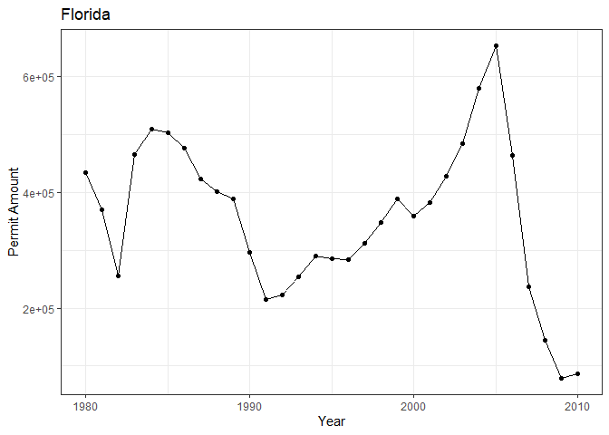

```r
library(tidyverse)
```

```
## ── Attaching packages ─────────────────────────────────────── tidyverse 1.3.2 ──
## ✔ ggplot2 3.3.6      ✔ purrr   0.3.4 
## ✔ tibble  3.1.8      ✔ dplyr   1.0.10
## ✔ tidyr   1.2.1      ✔ stringr 1.4.1 
## ✔ readr   2.1.3      ✔ forcats 0.5.2 
## ── Conflicts ────────────────────────────────────────── tidyverse_conflicts() ──
## ✖ dplyr::filter() masks stats::filter()
## ✖ dplyr::lag()    masks stats::lag()
```

```r
library(sf)
```

```
## Linking to GEOS 3.9.1, GDAL 3.4.3, PROJ 7.2.1; sf_use_s2() is TRUE
```

```r
library(USAboundaries)
```

```
## Warning: package 'USAboundaries' was built under R version 4.2.2
```

```r
library(USAboundariesData)
library(ggsflabel)
```

```
## 
## Attaching package: 'ggsflabel'
## 
## The following objects are masked from 'package:ggplot2':
## 
##     geom_sf_label, geom_sf_text, StatSfCoordinates
```

```r
library(remotes)
```

```
## Warning: package 'remotes' was built under R version 4.2.2
```

```r
library(devtools)
```

```
## Loading required package: usethis
## 
## Attaching package: 'usethis'
## 
## The following object is masked from 'package:remotes':
## 
##     git_credentials
## 
## 
## Attaching package: 'devtools'
## 
## The following objects are masked from 'package:remotes':
## 
##     dev_package_deps, install_bioc, install_bitbucket, install_cran,
##     install_deps, install_dev, install_git, install_github,
##     install_gitlab, install_local, install_svn, install_url,
##     install_version, update_packages
```

```r
library(ggplot2)
library(maps)
```

```
## Warning: package 'maps' was built under R version 4.2.2
```

```
## 
## Attaching package: 'maps'
## 
## The following object is masked from 'package:purrr':
## 
##     map
```

```r
library(knitr)
library(downloader)
```

```
## 
## Attaching package: 'downloader'
## 
## The following object is masked from 'package:devtools':
## 
##     source_url
```

```r
library(dplyr)
library(lubridate)
```

```
## 
## Attaching package: 'lubridate'
## 
## The following objects are masked from 'package:base':
## 
##     date, intersect, setdiff, union
```

```r
library(plotly)
```

```
## 
## Attaching package: 'plotly'
## 
## The following object is masked from 'package:ggplot2':
## 
##     last_plot
## 
## The following object is masked from 'package:stats':
## 
##     filter
## 
## The following object is masked from 'package:graphics':
## 
##     layout
```

```r
#install.packages('gridExtra')
library(gridExtra)
```

```
## Warning: package 'gridExtra' was built under R version 4.2.2
```

```
## 
## Attaching package: 'gridExtra'
## 
## The following object is masked from 'package:dplyr':
## 
##     combine
```


```r
permit_data <- tempfile()
download("https://raw.githubusercontent.com/WJC-Data-Science/DTS350/master/permits.csv", 
         permit_data, mode = "wb")
permits <- read_csv(permit_data)
```

```
## New names:
## Rows: 327422 Columns: 8
## ── Column specification
## ──────────────────────────────────────────────────────── Delimiter: "," chr
## (3): StateAbbr, countyname, variable dbl (5): ...1, state, county, year, value
## ℹ Use `spec()` to retrieve the full column specification for this data. ℹ
## Specify the column types or set `show_col_types = FALSE` to quiet this message.
## • `` -> `...1`
```


```r
head(permits)
```

```
## # A tibble: 6 × 8
##    ...1 state StateAbbr county countyname     variable     year value
##   <dbl> <dbl> <chr>      <dbl> <chr>          <chr>       <dbl> <dbl>
## 1     1     1 AL             1 Autauga County All Permits  2010   191
## 2     2     1 AL             1 Autauga County All Permits  2009   110
## 3     3     1 AL             1 Autauga County All Permits  2008   173
## 4     4     1 AL             1 Autauga County All Permits  2007   260
## 5     5     1 AL             1 Autauga County All Permits  2006   347
## 6     6     1 AL             1 Autauga County All Permits  2005   313
```

```r
counties <- us_counties()
```


```r
FIPSsetup<-permits%>%
  mutate(state=as.character(state), stateFIPS=str_pad(state, 2,pad="0")) %>%
  mutate(county=as.character(county), countyFIPS=str_pad(county, 3,pad="0"))
FIPSsetup
```

```
## # A tibble: 327,422 × 10
##     ...1 state StateAbbr county countyname   varia…¹  year value state…² count…³
##    <dbl> <chr> <chr>     <chr>  <chr>        <chr>   <dbl> <dbl> <chr>   <chr>  
##  1     1 1     AL        1      Autauga Cou… All Pe…  2010   191 01      001    
##  2     2 1     AL        1      Autauga Cou… All Pe…  2009   110 01      001    
##  3     3 1     AL        1      Autauga Cou… All Pe…  2008   173 01      001    
##  4     4 1     AL        1      Autauga Cou… All Pe…  2007   260 01      001    
##  5     5 1     AL        1      Autauga Cou… All Pe…  2006   347 01      001    
##  6     6 1     AL        1      Autauga Cou… All Pe…  2005   313 01      001    
##  7     7 1     AL        1      Autauga Cou… All Pe…  2004   367 01      001    
##  8     8 1     AL        1      Autauga Cou… All Pe…  2003   283 01      001    
##  9     9 1     AL        1      Autauga Cou… All Pe…  2002   276 01      001    
## 10    10 1     AL        1      Autauga Cou… All Pe…  2001   400 01      001    
## # … with 327,412 more rows, and abbreviated variable names ¹​variable,
## #   ²​stateFIPS, ³​countyFIPS
```


```r
FIPS <- FIPSsetup %>%
  mutate(geoid=paste0(stateFIPS,countyFIPS))
```


```r
county_FIPS_data <- merge(FIPS,counties, by = "geoid") %>%
  group_by(state_name,year) %>%
  summarise(across(value, sum))
```

```
## `summarise()` has grouped output by 'state_name'. You can override using the
## `.groups` argument.
```


```r
USA <- ggplot(data = county_FIPS_data, aes(x = year, y = value, color = state_name)) +
  geom_line() +
  geom_point() +
  labs(title="USA", x = "Year", y = "Permit Amount") +
  theme_bw() +
  theme(legend.position = 'none') 
USA
```

<!-- -->


```r
Missouri <- county_FIPS_data %>%
  filter(state_name == 'Missouri') %>%
  ggplot(aes(x = year, y = value)) +
  geom_point() +
  geom_line() +
  labs(title="Missouri",x = 'Year', y = 'Permit Amount') +
  theme_bw() +
  theme(legend.position = 'none')
Missouri
```

<!-- -->


```r
Florida <- county_FIPS_data %>%
  filter(state_name == 'Florida') %>%
  ggplot(aes(x = year, y = value)) +
  geom_point() +
  geom_line() +
  labs(title="Florida",x = 'Year', y = 'Permit Amount') +
  theme_bw() +
  theme(legend.position = 'none')
Florida
```

<!-- -->


```r
California <- county_FIPS_data %>%
  filter(state_name == 'California') %>%
  ggplot(aes(x = year, y = value)) +
  geom_point() +
  geom_line() +
  labs(title="California",x = 'Year', y = 'Permit Amount') +
  theme_bw() +
  theme(legend.position = 'none')
California
```

<!-- -->


```r
grid.arrange(USA, Missouri, Florida, California, nrow = 3)
```

<!-- -->

To illustrate the onset of the 2008 subprime mortgage and financial crisis, as evidenced by the collapse of new building permits nationwide, I chose to create visualizations that map county-level data, amalgamated into state-level data, for 3 states that I believe have data that are indicative of the overall nationwide trend, and tell a particular story for a representative region of the United States during this time. In addition, I included a line graph of building permit amounts for each state nationwide over time to show data for the USA as a whole. For my 3 representative states, I chose Missouri, FLorida, and California. In addition to each representing a distinct region of the US, these states all have an important story to tell with their permit data. My curent State of residence, Missouri, certainly experienced a fall in building permits in line with the nationwide trends of the onset of the recession. However, with permit numbers not being massive to begin with, some might argue that this leaves something to be desired as far as conclusions are concerned. To address this, I proceeded to look at the state of FLorida: a state widely considered to have experienced the worst collapse of the crisis due to housing bubbles in Miami, Tampa, and Orlando all bursting. In these data, the trend is even more drastic than national trends indicate. They show a higher peak pemit amount than any sate, with a steeper drop in permits than any other state. FInally, I looked at California, which I considered to be not only a good indicator of the West Coast's state of affairs, but also the nation's as a whole. Being the most populous state in the union, California acts as a natural bellweathe for trends typically. Her, while a dop off was seen, it was not nearly as drastic or sever as other states such as Florida. Here, the drop off was slow and steady, likely due to the fact that high housing values kept prices propped-up substantially longer than elsewhere. BY 2010, California's permit numbers even begin to tick upwards again.
