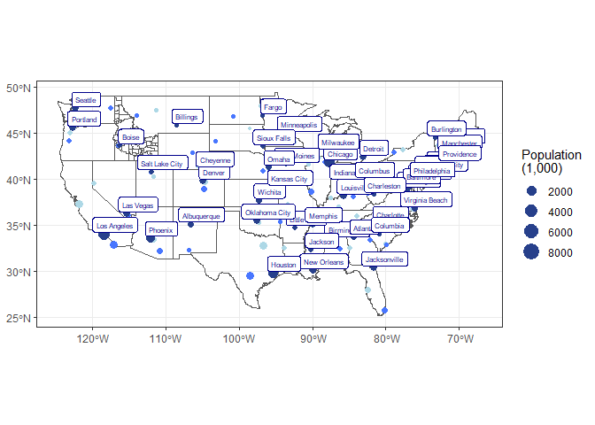

```r
library(tidyverse)
```

```
## ── Attaching packages ─────────────────────────────────────── tidyverse 1.3.2 ──
## ✔ ggplot2 3.3.6      ✔ purrr   0.3.4 
## ✔ tibble  3.1.8      ✔ dplyr   1.0.10
## ✔ tidyr   1.2.1      ✔ stringr 1.4.1 
## ✔ readr   2.1.3      ✔ forcats 0.5.2 
## ── Conflicts ────────────────────────────────────────── tidyverse_conflicts() ──
## ✖ dplyr::filter() masks stats::filter()
## ✖ dplyr::lag()    masks stats::lag()
```

```r
library(sf)
```

```
## Linking to GEOS 3.9.1, GDAL 3.4.3, PROJ 7.2.1; sf_use_s2() is TRUE
```

```r
library(USAboundaries)
```

```
## Warning: package 'USAboundaries' was built under R version 4.2.2
```

```r
library(USAboundariesData)
library(ggsflabel)
```

```
## 
## Attaching package: 'ggsflabel'
## 
## The following objects are masked from 'package:ggplot2':
## 
##     geom_sf_label, geom_sf_text, StatSfCoordinates
```

```r
library(remotes)
```

```
## Warning: package 'remotes' was built under R version 4.2.2
```

```r
library(devtools)
```

```
## Loading required package: usethis
## 
## Attaching package: 'usethis'
## 
## The following object is masked from 'package:remotes':
## 
##     git_credentials
## 
## 
## Attaching package: 'devtools'
## 
## The following objects are masked from 'package:remotes':
## 
##     dev_package_deps, install_bioc, install_bitbucket, install_cran,
##     install_deps, install_dev, install_git, install_github,
##     install_gitlab, install_local, install_svn, install_url,
##     install_version, update_packages
```

```r
library(ggplot2)
library(maps)
```

```
## Warning: package 'maps' was built under R version 4.2.2
```

```
## 
## Attaching package: 'maps'
## 
## The following object is masked from 'package:purrr':
## 
##     map
```


```r
cities <- us_cities() 
```

```
## City populations for contemporary data come from the 2010 census.
```

```r
states <- us_states()

county <- us_counties()

idahocounties <- us_counties(states = "ID")

statesmap <- sf::st_as_sf(map("state", plot = FALSE, fill = TRUE))
head(statesmap)
```

```
## Simple feature collection with 6 features and 1 field
## Geometry type: MULTIPOLYGON
## Dimension:     XY
## Bounding box:  xmin: -124.3834 ymin: 30.24071 xmax: -71.78015 ymax: 42.04937
## Geodetic CRS:  WGS 84
##            ID                           geom
## 1     alabama MULTIPOLYGON (((-87.46201 3...
## 2     arizona MULTIPOLYGON (((-114.6374 3...
## 3    arkansas MULTIPOLYGON (((-94.05103 3...
## 4  california MULTIPOLYGON (((-120.006 42...
## 5    colorado MULTIPOLYGON (((-102.0552 4...
## 6 connecticut MULTIPOLYGON (((-73.49902 4...
```

```r
no_alaskahawaii <- cities %>%
  filter(state_name != 'Alaska', state_name != 'Hawaii')
```


```r
top3pop <- no_alaskahawaii %>%
  group_by(state_name) %>%
  arrange(desc(population))
head(top3pop)
```

```
## Simple feature collection with 6 features and 12 fields
## Geometry type: POINT
## Dimension:     XY
## Bounding box:  xmin: -118.4108 ymin: 29.78047 xmax: -73.9385 ymax: 41.83755
## Geodetic CRS:  WGS 84
## # A tibble: 6 × 13
## # Groups:   state_name [6]
##   city    state…¹ state…² county count…³ stplf…⁴ name_…⁵ city_…⁶ popul…⁷ place…⁸
##   <chr>   <chr>   <chr>   <chr>  <chr>   <chr>   <chr>   <chr>   <chr>   <chr>  
## 1 New Yo… New Yo… NY      NEW Y… New Yo… 3651000 New Yo… US Cen… US Cen… Incorp…
## 2 Los An… Califo… CA      LOS A… Los An… 0644000 Los An… US Cen… US Cen… Incorp…
## 3 Chicago Illino… IL      COOK   Cook    1714000 Chicag… US Cen… US Cen… Incorp…
## 4 Houston Texas   TX      HARRIS Harris  4835000 Housto… US Cen… US Cen… Incorp…
## 5 Philad… Pennsy… PA      PHILA… Philad… 4260000 Philad… US Cen… US Cen… Incorp…
## 6 Phoenix Arizona AZ      MARIC… Marico… 0455000 Phoeni… US Cen… US Cen… Incorp…
## # … with 3 more variables: year <int>, population <int>, geometry <POINT [°]>,
## #   and abbreviated variable names ¹​state_name, ²​state_abbr, ³​county_name,
## #   ⁴​stplfips_2010, ⁵​name_2010, ⁶​city_source, ⁷​population_source, ⁸​place_type
```

```r
biggest_cities <- top3pop %>%
  slice(1:3)
head(biggest_cities)
```

```
## Simple feature collection with 6 features and 12 fields
## Geometry type: POINT
## Dimension:     XY
## Bounding box:  xmin: -112.088 ymin: 30.66843 xmax: -86.26859 ymax: 33.57216
## Geodetic CRS:  WGS 84
## # A tibble: 6 × 13
## # Groups:   state_name [2]
##   city    state…¹ state…² county count…³ stplf…⁴ name_…⁵ city_…⁶ popul…⁷ place…⁸
##   <chr>   <chr>   <chr>   <chr>  <chr>   <chr>   <chr>   <chr>   <chr>   <chr>  
## 1 Birmin… Alabama AL      JEFFE… Jeffer… 0107000 Birmin… US Cen… US Cen… Incorp…
## 2 Montgo… Alabama AL      MONTG… Montgo… 0151000 Montgo… US Cen… US Cen… Incorp…
## 3 Mobile  Alabama AL      MOBILE Mobile  0150000 Mobile… US Cen… US Cen… Incorp…
## 4 Phoenix Arizona AZ      MARIC… Marico… 0455000 Phoeni… US Cen… US Cen… Incorp…
## 5 Tucson  Arizona AZ      PIMA   Pima    0477000 Tucson… US Cen… US Cen… Incorp…
## 6 Mesa    Arizona AZ      MARIC… Marico… 0446000 Mesa c… US Cen… US Cen… Incorp…
## # … with 3 more variables: year <int>, population <int>, geometry <POINT [°]>,
## #   and abbreviated variable names ¹​state_name, ²​state_abbr, ³​county_name,
## #   ⁴​stplfips_2010, ⁵​name_2010, ⁶​city_source, ⁷​population_source, ⁸​place_type
```

```r
biggest <- biggest_cities %>%
  slice(1:1)
middle <- biggest_cities %>%
  slice(2:2)
smallest <- biggest_cities %>%
  slice(3:3)
```


```r
ggplot() +
  geom_sf(data = statesmap, fill = NA) +
  geom_sf(data = idahocounties, fill = NA) +
  geom_sf(data = smallest, aes(size = population/1000), color = "lightblue") +
  geom_sf(data = middle, aes(size = population/1000), color = "royalblue1") +
  geom_sf(data = biggest, aes(size = population/1000), color = "royalblue4") +
  geom_sf_label(data = biggest, aes(label = city), color = "darkblue", nudge_x = 1.5, nudge_y = 1, size = 2) +
  scale_size_continuous(name = 'Population\n(1,000)') +
  theme_bw() +
  theme(axis.title.x = element_blank(), axis.title.y = element_blank())
```

```
## Warning in st_point_on_surface.sfc(data$geometry): st_point_on_surface may not
## give correct results for longitude/latitude data
```

<!-- -->
