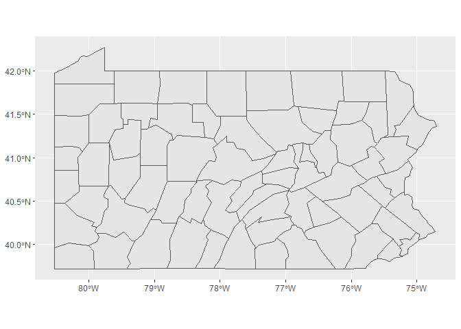

```r
library(ggplot2)
library(readr)
library(knitr)
library(tidyverse)
```

```
## ── Attaching packages ─────────────────────────────────────── tidyverse 1.3.2 ──
## ✔ tibble  3.1.8      ✔ dplyr   1.0.10
## ✔ tidyr   1.2.1      ✔ stringr 1.4.1 
## ✔ purrr   0.3.4      ✔ forcats 0.5.2 
## ── Conflicts ────────────────────────────────────────── tidyverse_conflicts() ──
## ✖ dplyr::filter() masks stats::filter()
## ✖ dplyr::lag()    masks stats::lag()
```

```r
library(dplyr)
library(forcats)
library(downloader)
library(corrplot)
```

```
## corrplot 0.92 loaded
```

```r
library(tidyquant)
```

```
## Loading required package: lubridate
## 
## Attaching package: 'lubridate'
## 
## The following objects are masked from 'package:base':
## 
##     date, intersect, setdiff, union
## 
## Loading required package: PerformanceAnalytics
## Loading required package: xts
## Loading required package: zoo
## 
## Attaching package: 'zoo'
## 
## The following objects are masked from 'package:base':
## 
##     as.Date, as.Date.numeric
## 
## 
## Attaching package: 'xts'
## 
## The following objects are masked from 'package:dplyr':
## 
##     first, last
## 
## 
## Attaching package: 'PerformanceAnalytics'
## 
## The following object is masked from 'package:graphics':
## 
##     legend
## 
## Loading required package: quantmod
## Loading required package: TTR
## Registered S3 method overwritten by 'quantmod':
##   method            from
##   as.zoo.data.frame zoo
```

```r
library(stringr)
library(plotly)
```

```
## 
## Attaching package: 'plotly'
## 
## The following object is masked from 'package:ggplot2':
## 
##     last_plot
## 
## The following object is masked from 'package:stats':
## 
##     filter
## 
## The following object is masked from 'package:graphics':
## 
##     layout
```

```r
library(gridExtra)
```

```
## Warning: package 'gridExtra' was built under R version 4.2.2
```

```
## 
## Attaching package: 'gridExtra'
## 
## The following object is masked from 'package:dplyr':
## 
##     combine
```

```r
library(USAboundaries)
```

```
## Warning: package 'USAboundaries' was built under R version 4.2.2
```

```r
library(sf)
```

```
## Linking to GEOS 3.9.1, GDAL 3.4.3, PROJ 7.2.1; sf_use_s2() is TRUE
```

```r
library(leaflet)
```

```
## Warning: package 'leaflet' was built under R version 4.2.2
```

```
## 
## Attaching package: 'leaflet'
## 
## The following object is masked from 'package:xts':
## 
##     addLegend
```


```r
permits <- read_csv("https://github.com/WJC-Data-Science/DTS350/raw/master/permits.csv")
```

```
## New names:
## Rows: 327422 Columns: 8
## ── Column specification
## ──────────────────────────────────────────────────────── Delimiter: "," chr
## (3): StateAbbr, countyname, variable dbl (5): ...1, state, county, year, value
## ℹ Use `spec()` to retrieve the full column specification for this data. ℹ
## Specify the column types or set `show_col_types = FALSE` to quiet this message.
## • `` -> `...1`
```

```r
head(permits)
```

```
## # A tibble: 6 × 8
##    ...1 state StateAbbr county countyname     variable     year value
##   <dbl> <dbl> <chr>      <dbl> <chr>          <chr>       <dbl> <dbl>
## 1     1     1 AL             1 Autauga County All Permits  2010   191
## 2     2     1 AL             1 Autauga County All Permits  2009   110
## 3     3     1 AL             1 Autauga County All Permits  2008   173
## 4     4     1 AL             1 Autauga County All Permits  2007   260
## 5     5     1 AL             1 Autauga County All Permits  2006   347
## 6     6     1 AL             1 Autauga County All Permits  2005   313
```


```r
permitsPA <- permits %>%
  filter(StateAbbr == "PA", year == 2010)
head(permitsPA)
```

```
## # A tibble: 6 × 8
##     ...1 state StateAbbr county countyname       variable             year value
##    <dbl> <dbl> <chr>      <dbl> <chr>            <chr>               <dbl> <dbl>
## 1 235713    42 PA             1 Adams County     All Permits          2010   306
## 2 235744    42 PA             1 Adams County     Single Family        2010   284
## 3 235775    42 PA             1 Adams County     All Multifamily      2010    22
## 4 235833    42 PA             1 Adams County     5+-Unit Multifamily  2010    22
## 5 235844    42 PA             3 Allegheny County All Permits          2010  1424
## 6 235875    42 PA             3 Allegheny County Single Family        2010  1407
```


```r
latlong <- read_csv("County_Latitude___Longitude_Points_For_Each_County_Static.csv")
```

```
## Rows: 68 Columns: 6
## ── Column specification ────────────────────────────────────────────────────────
## Delimiter: ","
## chr (2): County Name, Georeferenced Latitude & Longitude
## dbl (4): County Code Number, County Code text, Longitude, Latitude
## 
## ℹ Use `spec()` to retrieve the full column specification for this data.
## ℹ Specify the column types or set `show_col_types = FALSE` to quiet this message.
```

```r
head(latlong)
```

```
## # A tibble: 6 × 6
##   `County Name` `County Code Number` `County Code text` Longit…¹ Latit…² Geore…³
##   <chr>                        <dbl>              <dbl>    <dbl>   <dbl> <chr>  
## 1 Adams                            1                  1    -77.2    39.9 POINT …
## 2 Allegheny                        2                  2    -80.0    40.5 POINT …
## 3 Armstrong                        3                  3    -79.5    40.8 POINT …
## 4 Beaver                           4                  4    -80.4    40.7 POINT …
## 5 Bedford                          5                  5    -78.5    40.0 POINT …
## 6 Berks                            6                  6    -75.9    40.4 POINT …
## # … with abbreviated variable names ¹​Longitude, ²​Latitude,
## #   ³​`Georeferenced Latitude & Longitude`
```

```r
latlong1 <- latlong %>%
  mutate(countyname1 = as.character(`County Name`))
head(latlong1)
```

```
## # A tibble: 6 × 7
##   `County Name` `County Code Number` County Co…¹ Longi…² Latit…³ Geore…⁴ count…⁵
##   <chr>                        <dbl>       <dbl>   <dbl>   <dbl> <chr>   <chr>  
## 1 Adams                            1           1   -77.2    39.9 POINT … Adams  
## 2 Allegheny                        2           2   -80.0    40.5 POINT … Allegh…
## 3 Armstrong                        3           3   -79.5    40.8 POINT … Armstr…
## 4 Beaver                           4           4   -80.4    40.7 POINT … Beaver 
## 5 Bedford                          5           5   -78.5    40.0 POINT … Bedford
## 6 Berks                            6           6   -75.9    40.4 POINT … Berks  
## # … with abbreviated variable names ¹​`County Code text`, ²​Longitude, ³​Latitude,
## #   ⁴​`Georeferenced Latitude & Longitude`, ⁵​countyname1
```


```r
permitsPA1 <- permitsPA %>%
  mutate(countyname = as.character(countyname))
head(permitsPA1)
```

```
## # A tibble: 6 × 8
##     ...1 state StateAbbr county countyname       variable             year value
##    <dbl> <dbl> <chr>      <dbl> <chr>            <chr>               <dbl> <dbl>
## 1 235713    42 PA             1 Adams County     All Permits          2010   306
## 2 235744    42 PA             1 Adams County     Single Family        2010   284
## 3 235775    42 PA             1 Adams County     All Multifamily      2010    22
## 4 235833    42 PA             1 Adams County     5+-Unit Multifamily  2010    22
## 5 235844    42 PA             3 Allegheny County All Permits          2010  1424
## 6 235875    42 PA             3 Allegheny County Single Family        2010  1407
```

```r
permitsPA2 <- permitsPA1 %>%
  mutate(countyname1 = str_sub(countyname, end = -8))
  
str(permitsPA2)
```

```
## tibble [252 × 9] (S3: tbl_df/tbl/data.frame)
##  $ ...1       : num [1:252] 235713 235744 235775 235833 235844 ...
##  $ state      : num [1:252] 42 42 42 42 42 42 42 42 42 42 ...
##  $ StateAbbr  : chr [1:252] "PA" "PA" "PA" "PA" ...
##  $ county     : num [1:252] 1 1 1 1 3 3 3 3 3 5 ...
##  $ countyname : chr [1:252] "Adams County" "Adams County" "Adams County" "Adams County" ...
##  $ variable   : chr [1:252] "All Permits" "Single Family" "All Multifamily" "5+-Unit Multifamily" ...
##  $ year       : num [1:252] 2010 2010 2010 2010 2010 2010 2010 2010 2010 2010 ...
##  $ value      : num [1:252] 306 284 22 22 1424 ...
##  $ countyname1: chr [1:252] "Adams" "Adams" "Adams" "Adams" ...
```

```r
str(latlong1)
```

```
## tibble [68 × 7] (S3: tbl_df/tbl/data.frame)
##  $ County Name                       : chr [1:68] "Adams" "Allegheny" "Armstrong" "Beaver" ...
##  $ County Code Number                : num [1:68] 1 2 3 4 5 6 7 8 9 10 ...
##  $ County Code text                  : num [1:68] 1 2 3 4 5 6 7 8 9 10 ...
##  $ Longitude                         : num [1:68] -77.2 -80 -79.5 -80.4 -78.5 ...
##  $ Latitude                          : num [1:68] 39.9 40.5 40.8 40.7 40 ...
##  $ Georeferenced Latitude & Longitude: chr [1:68] "POINT (-77.22224271 39.87209565)" "POINT (-79.98619843 40.46735543)" "POINT (-79.47316899 40.81509526)" "POINT (-80.35107356 40.68349245)" ...
##  $ countyname1                       : chr [1:68] "Adams" "Allegheny" "Armstrong" "Beaver" ...
```


```r
combined <- left_join(latlong1, permitsPA2, by = 'countyname1')
head(combined)
```

```
## # A tibble: 6 × 15
##   County …¹ Count…² Count…³ Longi…⁴ Latit…⁵ Geore…⁶ count…⁷   ...1 state State…⁸
##   <chr>       <dbl>   <dbl>   <dbl>   <dbl> <chr>   <chr>    <dbl> <dbl> <chr>  
## 1 Adams           1       1   -77.2    39.9 POINT … Adams   235713    42 PA     
## 2 Adams           1       1   -77.2    39.9 POINT … Adams   235744    42 PA     
## 3 Adams           1       1   -77.2    39.9 POINT … Adams   235775    42 PA     
## 4 Adams           1       1   -77.2    39.9 POINT … Adams   235833    42 PA     
## 5 Allegheny       2       2   -80.0    40.5 POINT … Allegh… 235844    42 PA     
## 6 Allegheny       2       2   -80.0    40.5 POINT … Allegh… 235875    42 PA     
## # … with 5 more variables: county <dbl>, countyname <chr>, variable <chr>,
## #   year <dbl>, value <dbl>, and abbreviated variable names ¹​`County Name`,
## #   ²​`County Code Number`, ³​`County Code text`, ⁴​Longitude, ⁵​Latitude,
## #   ⁶​`Georeferenced Latitude & Longitude`, ⁷​countyname1, ⁸​StateAbbr
```

```r
combined1 <- combined %>%
  arrange(desc(value)) %>%
  mutate(value = as.character(value))
  
  
head(combined1)
```

```
## # A tibble: 6 × 15
##   County …¹ Count…² Count…³ Longi…⁴ Latit…⁵ Geore…⁶ count…⁷   ...1 state State…⁸
##   <chr>       <dbl>   <dbl>   <dbl>   <dbl> <chr>   <chr>    <dbl> <dbl> <chr>  
## 1 Allegheny       2       2   -80.0    40.5 POINT … Allegh… 235844    42 PA     
## 2 Allegheny       2       2   -80.0    40.5 POINT … Allegh… 235875    42 PA     
## 3 Lancaster      36      36   -76.3    40.0 POINT … Lancas… 240458    42 PA     
## 4 Lancaster      36      36   -76.3    40.0 POINT … Lancas… 240489    42 PA     
## 5 Chester        15      15   -75.8    40.0 POINT … Chester 237703    42 PA     
## 6 Montgome…      46      46   -75.4    40.2 POINT … Montgo… 241922    42 PA     
## # … with 5 more variables: county <dbl>, countyname <chr>, variable <chr>,
## #   year <dbl>, value <chr>, and abbreviated variable names ¹​`County Name`,
## #   ²​`County Code Number`, ³​`County Code text`, ⁴​Longitude, ⁵​Latitude,
## #   ⁶​`Georeferenced Latitude & Longitude`, ⁷​countyname1, ⁸​StateAbbr
```


```r
topcounty <- combined1 %>%
  filter(row_number() == 1)
topcounty
```

```
## # A tibble: 1 × 15
##   County …¹ Count…² Count…³ Longi…⁴ Latit…⁵ Geore…⁶ count…⁷   ...1 state State…⁸
##   <chr>       <dbl>   <dbl>   <dbl>   <dbl> <chr>   <chr>    <dbl> <dbl> <chr>  
## 1 Allegheny       2       2   -80.0    40.5 POINT … Allegh… 235844    42 PA     
## # … with 5 more variables: county <dbl>, countyname <chr>, variable <chr>,
## #   year <dbl>, value <chr>, and abbreviated variable names ¹​`County Name`,
## #   ²​`County Code Number`, ³​`County Code text`, ⁴​Longitude, ⁵​Latitude,
## #   ⁶​`Georeferenced Latitude & Longitude`, ⁷​countyname1, ⁸​StateAbbr
```


```r
PA <- us_counties(states = 'PA')
PAcounties <- ggplot(PA) +
  geom_sf()
PAcounties
```

<!-- -->


```r
combined1$quartile <- ntile(combined1$value, 4)
combined1
```

```
## # A tibble: 254 × 16
##    County…¹ Count…² Count…³ Longi…⁴ Latit…⁵ Geore…⁶ count…⁷   ...1 state State…⁸
##    <chr>      <dbl>   <dbl>   <dbl>   <dbl> <chr>   <chr>    <dbl> <dbl> <chr>  
##  1 Alleghe…       2       2   -80.0    40.5 POINT … Allegh… 235844    42 PA     
##  2 Alleghe…       2       2   -80.0    40.5 POINT … Allegh… 235875    42 PA     
##  3 Lancast…      36      36   -76.3    40.0 POINT … Lancas… 240458    42 PA     
##  4 Lancast…      36      36   -76.3    40.0 POINT … Lancas… 240489    42 PA     
##  5 Chester       15      15   -75.8    40.0 POINT … Chester 237703    42 PA     
##  6 Montgom…      46      46   -75.4    40.2 POINT … Montgo… 241922    42 PA     
##  7 York          67      67   -76.7    39.9 POINT … York    244544    42 PA     
##  8 Philade…      51      51   -75.1    40.0 POINT … Philad… 242632    42 PA     
##  9 Montgom…      46      46   -75.4    40.2 POINT … Montgo… 241953    42 PA     
## 10 York          67      67   -76.7    39.9 POINT … York    244575    42 PA     
## # … with 244 more rows, 6 more variables: county <dbl>, countyname <chr>,
## #   variable <chr>, year <dbl>, value <chr>, quartile <int>, and abbreviated
## #   variable names ¹​`County Name`, ²​`County Code Number`, ³​`County Code text`,
## #   ⁴​Longitude, ⁵​Latitude, ⁶​`Georeferenced Latitude & Longitude`, ⁷​countyname1,
## #   ⁸​StateAbbr
```

```r
ntile4 <- combined1 %>%
  filter(quartile == 4)
ntile4
```

```
## # A tibble: 63 × 16
##    County…¹ Count…² Count…³ Longi…⁴ Latit…⁵ Geore…⁶ count…⁷   ...1 state State…⁸
##    <chr>      <dbl>   <dbl>   <dbl>   <dbl> <chr>   <chr>    <dbl> <dbl> <chr>  
##  1 Philade…      51      51   -75.1    40.0 POINT … Philad… 242632    42 PA     
##  2 Montgom…      46      46   -75.4    40.2 POINT … Montgo… 241953    42 PA     
##  3 York          67      67   -76.7    39.9 POINT … York    244575    42 PA     
##  4 Chester       15      15   -75.8    40.0 POINT … Chester 237734    42 PA     
##  5 Cumberl…      21      21   -77.3    40.2 POINT … Cumber… 238489    42 PA     
##  6 Dauphin       22      22   -76.8    40.4 POINT … Dauphin 238671    42 PA     
##  7 Cumberl…      21      21   -77.3    40.2 POINT … Cumber… 238520    42 PA     
##  8 Dauphin       22      22   -76.8    40.4 POINT … Dauphin 238702    42 PA     
##  9 Lehigh        39      39   -75.6    40.6 POINT … Lehigh  240901    42 PA     
## 10 Hunting…      31      31   -78.0    40.4 POINT … Huntin… 239825    42 PA     
## # … with 53 more rows, 6 more variables: county <dbl>, countyname <chr>,
## #   variable <chr>, year <dbl>, value <chr>, quartile <int>, and abbreviated
## #   variable names ¹​`County Name`, ²​`County Code Number`, ³​`County Code text`,
## #   ⁴​Longitude, ⁵​Latitude, ⁶​`Georeferenced Latitude & Longitude`, ⁷​countyname1,
## #   ⁸​StateAbbr
```

```r
ntile3 <- combined1 %>%
  filter(quartile == 3)
ntile3
```

```
## # A tibble: 63 × 16
##    County…¹ Count…² Count…³ Longi…⁴ Latit…⁵ Geore…⁶ count…⁷   ...1 state State…⁸
##    <chr>      <dbl>   <dbl>   <dbl>   <dbl> <chr>   <chr>    <dbl> <dbl> <chr>  
##  1 Erie          25      25   -80.0    42.0 POINT … Erie    239131    42 PA     
##  2 Franklin      28      28   -77.7    39.9 POINT … Frankl… 239546    42 PA     
##  3 Westmor…      65      65   -79.5    40.3 POINT … Westmo… 244258    42 PA     
##  4 Philade…      51      51   -75.1    40.0 POINT … Philad… 242694    42 PA     
##  5 Butler        10      10   -79.9    40.9 POINT … Butler  237039    42 PA     
##  6 Franklin      28      28   -77.7    39.9 POINT … Frankl… 239577    42 PA     
##  7 Westmor…      65      65   -79.5    40.3 POINT … Westmo… 244289    42 PA     
##  8 Lehigh        39      39   -75.6    40.6 POINT … Lehigh  240932    42 PA     
##  9 Northam…      48      48   -75.3    40.8 POINT … Northa… 242214    42 PA     
## 10 Bucks          9       9   -75.1    40.3 POINT … Bucks   236866    42 PA     
## # … with 53 more rows, 6 more variables: county <dbl>, countyname <chr>,
## #   variable <chr>, year <dbl>, value <chr>, quartile <int>, and abbreviated
## #   variable names ¹​`County Name`, ²​`County Code Number`, ³​`County Code text`,
## #   ⁴​Longitude, ⁵​Latitude, ⁶​`Georeferenced Latitude & Longitude`, ⁷​countyname1,
## #   ⁸​StateAbbr
```

```r
ntile2 <- combined1 %>%
  filter(quartile == 2)
ntile2
```

```
## # A tibble: 63 × 16
##    County…¹ Count…² Count…³ Longi…⁴ Latit…⁵ Geore…⁶ count…⁷   ...1 state State…⁸
##    <chr>      <dbl>   <dbl>   <dbl>   <dbl> <chr>   <chr>    <dbl> <dbl> <chr>  
##  1 Adams          1       1   -77.2    39.9 POINT … Adams   235713    42 PA     
##  2 Beaver         4       4   -80.4    40.7 POINT … Beaver  236164    42 PA     
##  3 Adams          1       1   -77.2    39.9 POINT … Adams   235744    42 PA     
##  4 Chester       15      15   -75.8    40.0 POINT … Chester 237765    42 PA     
##  5 Lackawa…      35      35   -75.6    41.4 POINT … Lackaw… 240285    42 PA     
##  6 Monroe        45      45   -75.3    41.1 POINT … Monroe  241750    42 PA     
##  7 Lackawa…      35      35   -75.6    41.4 POINT … Lackaw… 240316    42 PA     
##  8 Chester       15      15   -75.8    40.0 POINT … Chester 237852    42 PA     
##  9 Fayette       26      26   -79.7    39.9 POINT … Fayette 239315    42 PA     
## 10 Lebanon       38      38   -76.5    40.4 POINT … Lebanon 240778    42 PA     
## # … with 53 more rows, 6 more variables: county <dbl>, countyname <chr>,
## #   variable <chr>, year <dbl>, value <chr>, quartile <int>, and abbreviated
## #   variable names ¹​`County Name`, ²​`County Code Number`, ³​`County Code text`,
## #   ⁴​Longitude, ⁵​Latitude, ⁶​`Georeferenced Latitude & Longitude`, ⁷​countyname1,
## #   ⁸​StateAbbr
```

```r
ntile1 <- combined1 %>%
  filter(quartile == 1)
ntile1
```

```
## # A tibble: 63 × 16
##    County…¹ Count…² Count…³ Longi…⁴ Latit…⁵ Geore…⁶ count…⁷   ...1 state State…⁸
##    <chr>      <dbl>   <dbl>   <dbl>   <dbl> <chr>   <chr>    <dbl> <dbl> <chr>  
##  1 Alleghe…       2       2   -80.0    40.5 POINT … Allegh… 235844    42 PA     
##  2 Alleghe…       2       2   -80.0    40.5 POINT … Allegh… 235875    42 PA     
##  3 Lancast…      36      36   -76.3    40.0 POINT … Lancas… 240458    42 PA     
##  4 Lancast…      36      36   -76.3    40.0 POINT … Lancas… 240489    42 PA     
##  5 Chester       15      15   -75.8    40.0 POINT … Chester 237703    42 PA     
##  6 Montgom…      46      46   -75.4    40.2 POINT … Montgo… 241922    42 PA     
##  7 York          67      67   -76.7    39.9 POINT … York    244544    42 PA     
##  8 Wayne         64      64   -75.3    41.6 POINT … Wayne   244147    42 PA     
##  9 Wayne         64      64   -75.3    41.6 POINT … Wayne   244178    42 PA     
## 10 Cumberl…      21      21   -77.3    40.2 POINT … Cumber… 238642    42 PA     
## # … with 53 more rows, 6 more variables: county <dbl>, countyname <chr>,
## #   variable <chr>, year <dbl>, value <chr>, quartile <int>, and abbreviated
## #   variable names ¹​`County Name`, ²​`County Code Number`, ³​`County Code text`,
## #   ⁴​Longitude, ⁵​Latitude, ⁶​`Georeferenced Latitude & Longitude`, ⁷​countyname1,
## #   ⁸​StateAbbr
```

FOR REFERENCE, IN THIS CASE:

Quartile 4 is top 25% of counties by number of building permits.
Quartile 3 is top 25-50%  of counties by number of building permits.
Quartile 2 is bottom 25-50%  of counties by number of building permits.
Quartile 1 is bottom 25%  of counties by number of building permits.


```r
leaflet(combined1) %>%
  addTiles() %>%
  addCircleMarkers(data = ntile4, radius = 7, color = 'blue', stroke = FALSE, fillOpacity = 1, popup = ~value) %>%
  addCircleMarkers(data = ntile3, radius = 7, color = 'red', stroke = FALSE, fillOpacity = 1, popup = ~value) %>%
  addCircleMarkers(data = ntile2, radius = 7, color = 'green', stroke = FALSE, fillOpacity = 1, popup = ~value) %>%
  addCircleMarkers(data = ntile1, radius = 7, color = 'white', stroke = FALSE, fillOpacity = 1, popup = ~value) %>%
  addCircleMarkers(data = topcounty, radius = 7, color = 'yellow', stroke = FALSE, fillOpacity = 1, popup = ~value) 
```

```
## Assuming "Longitude" and "Latitude" are longitude and latitude, respectively
## Assuming "Longitude" and "Latitude" are longitude and latitude, respectively
## Assuming "Longitude" and "Latitude" are longitude and latitude, respectively
## Assuming "Longitude" and "Latitude" are longitude and latitude, respectively
## Assuming "Longitude" and "Latitude" are longitude and latitude, respectively
```

```{=html}
<div id="htmlwidget-25c80d7f2153770b3be6" style="width:672px;height:480px;" class="leaflet html-widget"></div>
<script type="application/json" data-for="htmlwidget-25c80d7f2153770b3be6">{"x":{"options":{"crs":{"crsClass":"L.CRS.EPSG3857","code":null,"proj4def":null,"projectedBounds":null,"options":{}}},"calls":[{"method":"addTiles","args":["https://{s}.tile.openstreetmap.org/{z}/{x}/{y}.png",null,null,{"minZoom":0,"maxZoom":18,"tileSize":256,"subdomains":"abc","errorTileUrl":"","tms":false,"noWrap":false,"zoomOffset":0,"zoomReverse":false,"opacity":1,"zIndex":1,"detectRetina":false,"attribution":"&copy; <a href=\"https://openstreetmap.org\">OpenStreetMap<\/a> contributors, <a href=\"https://creativecommons.org/licenses/by-sa/2.0/\">CC-BY-SA<\/a>"}]},{"method":"addCircleMarkers","args":[[40.00444354,40.20989874,39.92192531,39.97487056,40.16759839,40.41974636,40.16759839,40.41974636,40.61464794,40.416105,41.77333834,41.77333834,40.00737536,40.61464794,41.68546907,40.416105,40.96473131,40.40415317,40.40415317,40.77113737,40.65295497,40.41974636,40.41974636,41.13139091,40.9193135,40.61274928,40.61274928,40.96473131,40.9193135,40.77113737,40.65295497,41.8205686,41.8205686,40.310315,41.40341259,41.40341259,40.41939635,40.41939635,41.02801824,41.02801824,41.51892488,41.51892488,40.81509526,40.81509526,40.91083185,39.91657867,41.68546907,41.99413787,39.9194478,39.9194478,39.92786197,41.34459792,40.77113737,40.96473131,40.48555024,40.33501133,40.16759839,39.91657867,40.00737536,40.33501133,40.416105,40.416105,40.77113737],[-75.140236,-75.37252001,-76.72576052,-75.75626498,-77.26866271,-76.77960568,-77.26866271,-76.77960568,-75.60099481,-77.9827661,-77.25788076,-77.25788076,-78.49116474,-75.60099481,-80.11321083,-77.9827661,-77.06415803,-77.25907385,-77.25907385,-77.07255968,-79.09333493,-76.77960568,-76.77960568,-79.00101814,-77.82500112,-77.62003089,-77.62003089,-77.06415803,-77.82500112,-77.07255968,-79.09333493,-75.80250303,-75.80250303,-79.47134118,-79.76286561,-79.76286561,-75.93077327,-75.93077327,-76.66470527,-76.66470527,-76.01813003,-76.01813003,-79.47316899,-79.47316899,-79.91711779,-75.40627712,-80.11321083,-80.0407591,-79.65189635,-79.65189635,-77.72398845,-77.06942457,-77.07255968,-77.06415803,-78.34907687,-75.11291241,-77.26866271,-75.40627712,-78.49116474,-75.11291241,-77.9827661,-77.9827661,-77.07255968],7,null,null,{"interactive":true,"className":"","stroke":false,"color":"blue","weight":5,"opacity":0.5,"fill":true,"fillColor":"blue","fillOpacity":1},null,null,["984","879","858","839","832","691","620","606","589","99","99","99","98","98","96","93","91","89","89","89","88","85","82","81","79","79","79","79","77","75","74","73","73","71","68","66","65","65","65","65","63","61","60","60","60","9","8","8","8","8","8","8","8","8","7","7","7","7","6","6","6","6","6"],null,null,{"interactive":false,"permanent":false,"direction":"auto","opacity":1,"offset":[0,0],"textsize":"10px","textOnly":false,"className":"","sticky":true},null]},{"method":"addCircleMarkers","args":[[41.99413787,39.92786197,40.310315,40.00444354,40.91083185,39.92786197,40.310315,40.61464794,40.7545954,40.33501133,40.19109663,40.91083185,40.00444354,40.33501133,40.19109663,40.9193135,40.41939635,40.7545954,41.99413787,39.91657867,41.17836439,41.17836439,39.91657867,40.41939635,40.9193135,40.68349245,39.92786197,41.13139091,40.7545954,40.20989874,40.310315,40.48555024,41.19279129,41.19279129,39.85480393,39.85480393,40.53433008,40.53433008,40.91083185,41.42819416,41.42819416,41.81037074,41.81037074,40.68349245,40.04590796,41.81675237,41.81675237,41.23286274,41.23286274,40.7545954,40.00737536,41.79117814,41.79117814,41.68546907,41.43910064,40.61464794,41.34459792,41.34459792,40.20989874,39.97146299,39.97146299,40.96473131,39.92192531],[-80.0407591,-77.72398845,-79.47134118,-75.140236,-79.91711779,-77.72398845,-79.47134118,-75.60099481,-75.31263726,-75.11291241,-80.25180083,-79.91711779,-75.140236,-75.11291241,-80.25180083,-77.82500112,-75.93077327,-75.31263726,-80.0407591,-75.40627712,-75.9919961,-75.9919961,-75.40627712,-75.93077327,-77.82500112,-80.35107356,-77.72398845,-79.00101814,-75.31263726,-75.37252001,-79.47134118,-78.34907687,-79.42483608,-79.42483608,-80.22943817,-80.22943817,-77.405775,-77.405775,-79.91711779,-78.64947713,-78.64947713,-78.5712202,-78.5712202,-80.35107356,-76.25138768,-79.27858158,-79.27858158,-77.6428376,-77.6428376,-75.31263726,-78.49116474,-76.51825624,-76.51825624,-80.11321083,-75.61218345,-75.60099481,-77.06942457,-77.06942457,-75.37252001,-79.03100206,-79.03100206,-77.06415803,-76.72576052],7,null,null,{"interactive":true,"className":"","stroke":false,"color":"red","weight":5,"opacity":0.5,"fill":true,"fillColor":"red","fillOpacity":1},null,null,["586","570","560","537","523","513","489","487","478","474","471","463","447","444","442","426","415","377","369","363","359","357","354","350","347","337","57","57","54","50","50","47","47","47","41","41","41","41","37","36","36","35","35","32","32","32","32","31","31","31","4","4","4","4","4","4","4","4","4","4","4","4","4"],null,null,{"interactive":false,"permanent":false,"direction":"auto","opacity":1,"offset":[0,0],"textsize":"10px","textOnly":false,"className":"","sticky":true},null]},{"method":"addCircleMarkers","args":[[39.87209565,40.68349245,39.87209565,39.97487056,41.43910064,41.06091787,41.43910064,39.97487056,39.9194478,40.367597,40.367597,41.06091787,39.9194478,40.04590796,41.99413787,40.16759839,41.34459792,40.00444354,39.92192531,40.00444354,41.34459792,39.92192531,40.33501133,41.74420644,41.74420644,39.92786197,40.19109663,40.19109663,41.30237777,41.30237777,40.48555024,39.92487511,39.92487511,41.13139091,41.13139091,41.4480994,41.4480994,40.91083185,41.06091787,39.87209565,39.87209565,41.06091787,40.310315,40.68349245,39.92786197,40.04590796,40.41974636,40.46735543,40.9193135,39.91657867,40.99325035,40.99325035,41.17836439,41.17836439,41.06091787,40.85150926,40.85150926,40.70751243,40.70751243,41.40341259,41.40341259,41.51892488,41.51892488],[-77.22224271,-80.35107356,-77.22224271,-75.75626498,-75.61218345,-75.34083603,-75.61218345,-75.75626498,-79.65189635,-76.46182575,-76.46182575,-75.34083603,-79.65189635,-76.25138768,-80.0407591,-77.26866271,-77.06942457,-75.140236,-76.72576052,-75.140236,-77.06942457,-76.72576052,-75.11291241,-77.89879229,-77.89879229,-77.72398845,-80.25180083,-80.25180083,-80.26009411,-80.26009411,-78.34907687,-78.11485045,-78.11485045,-79.00101814,-79.00101814,-76.5147922,-76.5147922,-79.91711779,-75.34083603,-77.22224271,-77.22224271,-75.34083603,-79.47134118,-80.35107356,-77.72398845,-76.25138768,-76.77960568,-79.98619843,-77.82500112,-75.40627712,-80.33754114,-80.33754114,-75.9919961,-75.9919961,-75.34083603,-76.71188423,-76.71188423,-76.22332385,-76.22332385,-79.76286561,-79.76286561,-76.01813003,-76.01813003],7,null,null,{"interactive":true,"className":"","stroke":false,"color":"green","weight":5,"opacity":0.5,"fill":true,"fillColor":"green","fillOpacity":1},null,null,["306","305","284","273","265","263","247","246","240","240","240","240","232","232","217","212","207","204","201","200","199","197","30","30","30","29","29","29","25","25","24","24","24","24","24","24","24","23","23","22","22","21","21","20","20","20","3","2","2","2","2","2","2","2","2","2","2","2","2","2","2","2","2"],null,null,{"interactive":false,"permanent":false,"direction":"auto","opacity":1,"offset":[0,0],"textsize":"10px","textOnly":false,"className":"","sticky":true},null]},{"method":"addCircleMarkers","args":[[40.46735543,40.46735543,40.04590796,40.04590796,39.97487056,40.20989874,39.92192531,41.64969805,41.64969805,40.16759839,41.99413787,41.332572,41.332572,40.70751243,40.70751243,40.20989874,40.04590796,41.79117814,41.79117814,40.48555024,41.30237777,40.91936701,40.91936701,40.00444354,40.20989874,41.30237777,41.000429,41.000429,40.85150926,41.04912086,41.04912086,40.85150926,40.49127491,40.49127491,39.97146299,40.48555024,39.97146299,40.00737536,41.68546907,40.99325035,40.99325035,40.61464794,40.7545954,41.43910064,40.46735543,40.33501133,39.97487056,40.48555024,40.7545954,40.46735543,41.99413787,40.65295497,40.65295497,41.43910064,40.77113737,40.68349245,41.68546907,40.96473131,40.00737536,39.97487056,40.16759839,41.51357876,41.51357876],[-79.98619843,-79.98619843,-76.25138768,-76.25138768,-75.75626498,-75.37252001,-76.72576052,-75.3051535,-75.3051535,-77.26866271,-80.0407591,-75.03270924,-75.03270924,-76.22332385,-76.22332385,-75.37252001,-76.25138768,-76.51825624,-76.51825624,-78.34907687,-80.26009411,-75.71107039,-75.71107039,-75.140236,-75.37252001,-80.26009411,-78.47558343,-78.47558343,-76.71188423,-76.4100218,-76.4100218,-76.71188423,-78.71894174,-78.71894174,-79.03100206,-78.34907687,-79.03100206,-78.49116474,-80.11321083,-80.33754114,-80.33754114,-75.60099481,-75.31263726,-75.61218345,-79.98619843,-75.11291241,-75.75626498,-78.34907687,-75.31263726,-79.98619843,-80.0407591,-79.09333493,-79.09333493,-75.61218345,-77.07255968,-80.35107356,-80.11321083,-77.06415803,-78.49116474,-75.75626498,-77.26866271,-79.23780995,-79.23780995],7,null,null,{"interactive":true,"className":"","stroke":false,"color":"white","weight":5,"opacity":0.5,"fill":true,"fillColor":"white","fillOpacity":1},null,null,["1424","1407","1381","1149","1112","1061","1059","196","196","195","195","189","189","188","186","182","180","175","171","159","152","149","149","133","128","127","124","124","124","123","123","122","117","117","115","112","111","108","108","105","103","102","101","18","17","17","17","16","16","15","14","14","14","14","14","12","12","12","10","10","10","10","10"],null,null,{"interactive":false,"permanent":false,"direction":"auto","opacity":1,"offset":[0,0],"textsize":"10px","textOnly":false,"className":"","sticky":true},null]},{"method":"addCircleMarkers","args":[40.46735543,-79.98619843,7,null,null,{"interactive":true,"className":"","stroke":false,"color":"yellow","weight":5,"opacity":0.5,"fill":true,"fillColor":"yellow","fillOpacity":1},null,null,"1424",null,null,{"interactive":false,"permanent":false,"direction":"auto","opacity":1,"offset":[0,0],"textsize":"10px","textOnly":false,"className":"","sticky":true},null]}],"limits":{"lat":[39.85480393,41.99413787],"lng":[-80.35107356,-75.03270924]}},"evals":[],"jsHooks":[]}</script>
```

```r
head(combined1) %>%
  filter(year==2010) %>%
  select("County Name", "value", "quartile")
```

```
## # A tibble: 6 × 3
##   `County Name` value quartile
##   <chr>         <chr>    <int>
## 1 Allegheny     1424         1
## 2 Allegheny     1407         1
## 3 Lancaster     1381         1
## 4 Lancaster     1149         1
## 5 Chester       1112         1
## 6 Montgomery    1061         1
```

From my visualization, it is clear to see that Allegheny COunty and the Pittsburg metropolitan area are the most desirable place to live in Pennsylvania by the volume of new home building permits. The high number of new permits is indicative not only of urban sprawl and bussle, but also the pesence of available jobs and desirable living ammenities. Moreover, consistent growth in Allegheny COunty likely means that property values will hold or appreciate over the course of the next few years or even decades.
