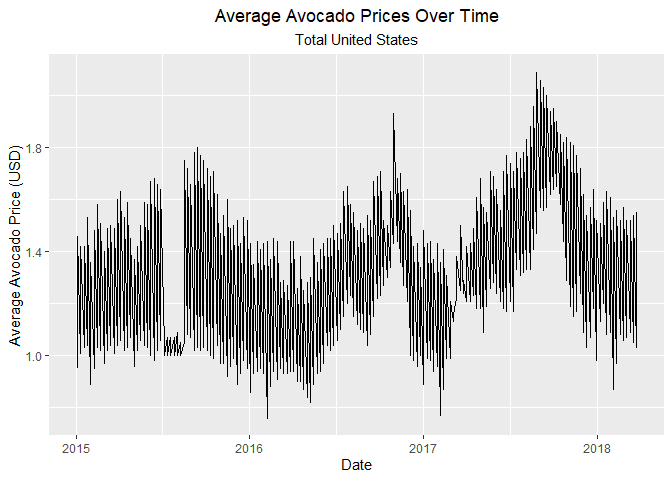
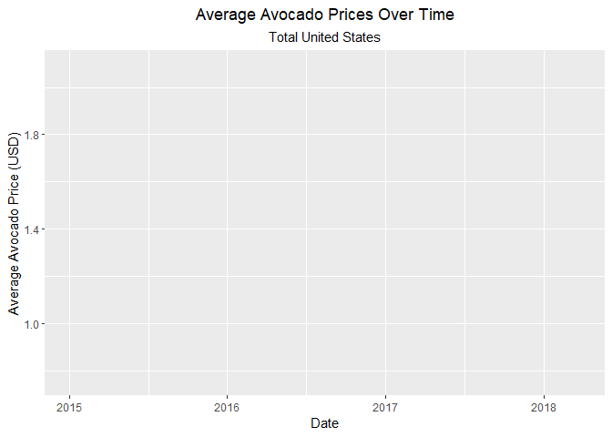
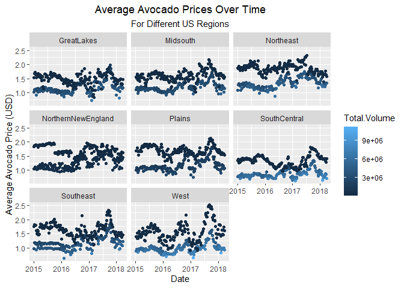
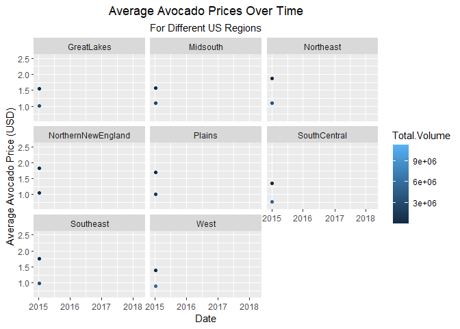
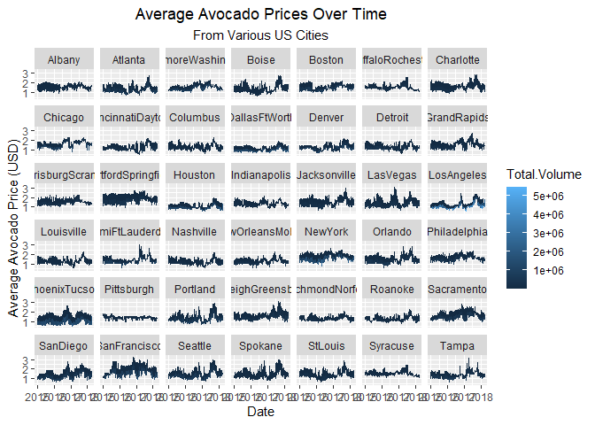

```r
library(knitr)
library(downloader)
library(tidyverse)
```

```
## ── Attaching packages ─────────────────────────────────────── tidyverse 1.3.2 ──
## ✔ ggplot2 3.3.6      ✔ purrr   0.3.4 
## ✔ tibble  3.1.8      ✔ dplyr   1.0.10
## ✔ tidyr   1.2.1      ✔ stringr 1.4.1 
## ✔ readr   2.1.3      ✔ forcats 0.5.2 
## ── Conflicts ────────────────────────────────────────── tidyverse_conflicts() ──
## ✖ dplyr::filter() masks stats::filter()
## ✖ dplyr::lag()    masks stats::lag()
```

```r
library(USAboundaries)
```

```
## Warning: package 'USAboundaries' was built under R version 4.2.2
```

```r
library(USAboundariesData)
library(ggsflabel)
```

```
## 
## Attaching package: 'ggsflabel'
## 
## The following objects are masked from 'package:ggplot2':
## 
##     geom_sf_label, geom_sf_text, StatSfCoordinates
```

```r
library(remotes)
```

```
## Warning: package 'remotes' was built under R version 4.2.2
```

```r
library(devtools)
```

```
## Loading required package: usethis
## 
## Attaching package: 'usethis'
## 
## The following object is masked from 'package:remotes':
## 
##     git_credentials
## 
## 
## Attaching package: 'devtools'
## 
## The following objects are masked from 'package:remotes':
## 
##     dev_package_deps, install_bioc, install_bitbucket, install_cran,
##     install_deps, install_dev, install_git, install_github,
##     install_gitlab, install_local, install_svn, install_url,
##     install_version, update_packages
## 
## The following object is masked from 'package:downloader':
## 
##     source_url
```

```r
library(ggplot2)
library(maps)
```

```
## Warning: package 'maps' was built under R version 4.2.2
```

```
## 
## Attaching package: 'maps'
## 
## The following object is masked from 'package:purrr':
## 
##     map
```

```r
library(leaflet)
```

```
## Warning: package 'leaflet' was built under R version 4.2.2
```

```r
library(ggplot2)
library(gganimate)
```

```
## Warning: package 'gganimate' was built under R version 4.2.2
```

```r
library(gifski)
```

```
## Warning: package 'gifski' was built under R version 4.2.2
```

```r
library(timetk)
library(dygraphs)
library(tidyquant)
```

```
## Loading required package: lubridate
## 
## Attaching package: 'lubridate'
## 
## The following objects are masked from 'package:base':
## 
##     date, intersect, setdiff, union
## 
## Loading required package: PerformanceAnalytics
## Loading required package: xts
## Loading required package: zoo
## 
## Attaching package: 'zoo'
## 
## The following objects are masked from 'package:base':
## 
##     as.Date, as.Date.numeric
## 
## 
## Attaching package: 'xts'
## 
## The following object is masked from 'package:leaflet':
## 
##     addLegend
## 
## The following objects are masked from 'package:dplyr':
## 
##     first, last
## 
## 
## Attaching package: 'PerformanceAnalytics'
## 
## The following object is masked from 'package:graphics':
## 
##     legend
## 
## Loading required package: quantmod
## Loading required package: TTR
## Registered S3 method overwritten by 'quantmod':
##   method            from
##   as.zoo.data.frame zoo
```


```r
avocados <- read.csv("avocados.csv")
head(avocados)
```

```
##   X       Date AveragePrice Total.Volume   X4046     X4225  X4770 Total.Bags
## 1 0 2015-12-27         1.33     64236.62 1036.74  54454.85  48.16    8696.87
## 2 1 2015-12-20         1.35     54876.98  674.28  44638.81  58.33    9505.56
## 3 2 2015-12-13         0.93    118220.22  794.70 109149.67 130.50    8145.35
## 4 3 2015-12-06         1.08     78992.15 1132.00  71976.41  72.58    5811.16
## 5 4 2015-11-29         1.28     51039.60  941.48  43838.39  75.78    6183.95
## 6 5 2015-11-22         1.26     55979.78 1184.27  48067.99  43.61    6683.91
##   Small.Bags Large.Bags XLarge.Bags         type year region
## 1    8603.62      93.25           0 conventional 2015 Albany
## 2    9408.07      97.49           0 conventional 2015 Albany
## 3    8042.21     103.14           0 conventional 2015 Albany
## 4    5677.40     133.76           0 conventional 2015 Albany
## 5    5986.26     197.69           0 conventional 2015 Albany
## 6    6556.47     127.44           0 conventional 2015 Albany
```

```r
str(avocados)
```

```
## 'data.frame':	18249 obs. of  14 variables:
##  $ X           : int  0 1 2 3 4 5 6 7 8 9 ...
##  $ Date        : chr  "2015-12-27" "2015-12-20" "2015-12-13" "2015-12-06" ...
##  $ AveragePrice: num  1.33 1.35 0.93 1.08 1.28 1.26 0.99 0.98 1.02 1.07 ...
##  $ Total.Volume: num  64237 54877 118220 78992 51040 ...
##  $ X4046       : num  1037 674 795 1132 941 ...
##  $ X4225       : num  54455 44639 109150 71976 43838 ...
##  $ X4770       : num  48.2 58.3 130.5 72.6 75.8 ...
##  $ Total.Bags  : num  8697 9506 8145 5811 6184 ...
##  $ Small.Bags  : num  8604 9408 8042 5677 5986 ...
##  $ Large.Bags  : num  93.2 97.5 103.1 133.8 197.7 ...
##  $ XLarge.Bags : num  0 0 0 0 0 0 0 0 0 0 ...
##  $ type        : chr  "conventional" "conventional" "conventional" "conventional" ...
##  $ year        : int  2015 2015 2015 2015 2015 2015 2015 2015 2015 2015 ...
##  $ region      : chr  "Albany" "Albany" "Albany" "Albany" ...
```

```r
avocados$Date <- as.Date(avocados$Date)

unique(avocados$region)
```

```
##  [1] "Albany"              "Atlanta"             "BaltimoreWashington"
##  [4] "Boise"               "Boston"              "BuffaloRochester"   
##  [7] "California"          "Charlotte"           "Chicago"            
## [10] "CincinnatiDayton"    "Columbus"            "DallasFtWorth"      
## [13] "Denver"              "Detroit"             "GrandRapids"        
## [16] "GreatLakes"          "HarrisburgScranton"  "HartfordSpringfield"
## [19] "Houston"             "Indianapolis"        "Jacksonville"       
## [22] "LasVegas"            "LosAngeles"          "Louisville"         
## [25] "MiamiFtLauderdale"   "Midsouth"            "Nashville"          
## [28] "NewOrleansMobile"    "NewYork"             "Northeast"          
## [31] "NorthernNewEngland"  "Orlando"             "Philadelphia"       
## [34] "PhoenixTucson"       "Pittsburgh"          "Plains"             
## [37] "Portland"            "RaleighGreensboro"   "RichmondNorfolk"    
## [40] "Roanoke"             "Sacramento"          "SanDiego"           
## [43] "SanFrancisco"        "Seattle"             "SouthCarolina"      
## [46] "SouthCentral"        "Southeast"           "Spokane"            
## [49] "StLouis"             "Syracuse"            "Tampa"              
## [52] "TotalUS"             "West"                "WestTexNewMexico"
```

```r
unique(avocados$year)
```

```
## [1] 2015 2016 2017 2018
```

```r
cities <- avocados %>%
  filter(region %in%  c("Albany","Atlanta","BaltimoreWashington","Boise","Boston",
 "BuffaloRochester","Charlotte","Chicago","CincinnatiDayton","Columbus","DallasFtWorth",
 "Denver","Detroit","GrandRapids","HarrisburgScranton","HartfordSpringfield","Houston",
 "Indianapolis","Jacksonville","LasVegas","LosAngeles","Louisville","MiamiFtLauderdale",
 "Nashville","NewOrleansMobile","NewYork","Orlando","Philadelphia","PhoenixTucson",
 "Pittsburgh","Portland","RaleighGreensboro","RichmondNorfolk","Roanoke","Sacramento",         "SanDiego","SanFrancisco","Seattle","Spokane","StLouis","Syracuse","Tampa"))

states <- avocados %>%
   filter(region %in%  c("California","SouthCarolina","WestTexNewMexico"))

usregions <- avocados %>%
   filter(region %in%  c("GreatLakes","Midsouth","Northeast","NorthernNewEngland","Plains",
                         "SouthCentral","Southeast","West"))
head(usregions)
```

```
##   X       Date AveragePrice Total.Volume    X4046   X4225    X4770 Total.Bags
## 1 0 2015-12-27         1.01      2580603 336673.7 1411809 254629.9   577490.5
## 2 1 2015-12-20         1.01      2504745 383701.8 1337404 241580.6   542059.1
## 3 2 2015-12-13         1.03      2608448 463349.7 1342450 228576.5   574072.0
## 4 3 2015-12-06         1.00      2981347 401676.1 1680591 398320.6   500759.0
## 5 4 2015-11-29         1.07      2198409 318661.4 1199426 248818.7   431502.7
## 6 5 2015-11-22         1.03      2601822 347803.3 1471865 280544.0   501609.2
##   Small.Bags Large.Bags XLarge.Bags         type year     region
## 1   400003.8   98401.09    79085.61 conventional 2015 GreatLakes
## 2   358218.7  122999.48    60840.92 conventional 2015 GreatLakes
## 3   409909.7  148004.93    16157.38 conventional 2015 GreatLakes
## 4   325850.0  124306.44    50602.55 conventional 2015 GreatLakes
## 5   328369.5   83149.01    19984.20 conventional 2015 GreatLakes
## 6   391454.6   89472.08    20682.52 conventional 2015 GreatLakes
```

```r
totalus <- avocados %>%
   filter(region == "TotalUS")
head(totalus)
```

```
##   X       Date AveragePrice Total.Volume   X4046    X4225     X4770 Total.Bags
## 1 0 2015-12-27         0.95     27297984 9626901 10197890 1184340.1    6288852
## 2 1 2015-12-20         0.98     25083647 8710022  9329862 1201020.0    5842744
## 3 2 2015-12-13         0.93     28041335 9855054 10805839 1016163.2    6364280
## 4 3 2015-12-06         0.89     28800397 9405464 12160839  931830.6    6302263
## 5 4 2015-11-29         0.99     22617999 8094804  9003178  731008.4    4789009
## 6 5 2015-11-22         0.96     25114228 8571850 10389880  804662.8    5347836
##   Small.Bags Large.Bags XLarge.Bags         type year  region
## 1    4850404  1252626.3   185822.04 conventional 2015 TotalUS
## 2    4618390  1025048.8   199305.12 conventional 2015 TotalUS
## 3    4964462  1371440.3    28377.23 conventional 2015 TotalUS
## 4    5005077  1233956.2    63229.39 conventional 2015 TotalUS
## 5    3901953   856560.3    30495.62 conventional 2015 TotalUS
## 6    4178583  1137229.8    32022.60 conventional 2015 TotalUS
```


```r
usplot <- ggplot(data = totalus, mapping = aes(x = Date, y = AveragePrice)) +
  geom_line() + 
  labs(title = "Average Avocado Prices Over Time", subtitle = "Total United States", x = "Date", y = "Average Avocado Price (USD)") +
  theme(plot.title = element_text(hjust = .5)) +
  theme(plot.subtitle = element_text(hjust = .5))
usplot
```

<!-- -->

```r
usplot + transition_reveal(Date)
```

```
## geom_path: Each group consists of only one observation. Do you need to adjust
## the group aesthetic?
## geom_path: Each group consists of only one observation. Do you need to adjust
## the group aesthetic?
```

<!-- -->


```r
regionsplot <- ggplot(data = usregions, mapping = aes(x = Date, y = AveragePrice, color = Total.Volume)) +
  geom_point() +
  facet_wrap(~region) +
  labs(title = "Average Avocado Prices Over Time", subtitle = "For Different US Regions", x = "Date", y = "Average Avocado Price (USD)") +
  theme(plot.title = element_text(hjust = .5)) +
  theme(plot.subtitle = element_text(hjust = .5))
regionsplot
```

<!-- -->

```r
regionsplot + transition_time(Date) + shadow_mark(size = 0.5)
```

<!-- -->


```r
cityplot <- ggplot(data = cities, mapping = aes(x = Date, y = AveragePrice, color = Total.Volume)) +
  geom_line() +
  facet_wrap(~region) +
  labs(title = "Average Avocado Prices Over Time", subtitle = "From Various US Cities", x = "Date", y = "Average Avocado Price (USD)") +
  theme(plot.title = element_text(hjust = .5)) +
  theme(plot.subtitle = element_text(hjust = .5))
  
cityplot
```

<!-- -->
From what I can observe, Pittsburgh seems to be the most ideal city to relocate to based purely on the local average price of avocados. Prices in the city have remained consistently low and have even defied some national trends that sent prices jumping in other major US cities.


ANALYSIS OF STOCK PRICES FOR 2 NATIONAL GROWERS

```r
avocado_stock <- tq_get(c("CVGW", "AVO"), get = "stock.prices", from = today()-years(2), to = today())
head(avocado_stock)
```

```
## # A tibble: 6 × 8
##   symbol date        open  high   low close volume adjusted
##   <chr>  <date>     <dbl> <dbl> <dbl> <dbl>  <dbl>    <dbl>
## 1 CVGW   2020-11-30  72.6  72.6  71.4  71.6  65500     69.1
## 2 CVGW   2020-12-01  72.2  72.5  70.7  71.7  82700     69.1
## 3 CVGW   2020-12-02  71.9  72.5  70.3  70.8  51500     68.3
## 4 CVGW   2020-12-03  70.6  72.3  70.6  71.2  57200     68.7
## 5 CVGW   2020-12-04  72.0  72.2  70.9  71.4  39700     68.9
## 6 CVGW   2020-12-07  71.3  72.3  70.6  71.4  52600     68.9
```


```r
avocadostockplot <- avocado_stock %>%
  select(symbol, date, adjusted) %>%
  pivot_wider(names_from = symbol, values_from = adjusted) %>%
  tk_xts(date_var = date)
```

```
## Warning: Non-numeric columns being dropped: date
```

```r
head(avocadostockplot)
```

```
##                CVGW   AVO
## 2020-11-30 69.09941 13.45
## 2020-12-01 69.12836 13.60
## 2020-12-02 68.26015 13.46
## 2020-12-03 68.69424 13.37
## 2020-12-04 68.89683 13.63
## 2020-12-07 68.85824 13.68
```


```r
dygraph(avocadostockplot, main = "Avocado Stock Prices for Calavo Growers (CVGW) and Mission Produce (AVO)") %>%
  dyRebase(percent = TRUE) %>%
  dyShading(from = today()-years(2), to = today()) %>%
  dyRangeSelector()
```

```{=html}
<div id="htmlwidget-c40720ffac02f4d27bc1" style="width:672px;height:480px;" class="dygraphs html-widget"></div>
<script type="application/json" data-for="htmlwidget-c40720ffac02f4d27bc1">{"x":{"attrs":{"title":"Avocado Stock Prices for Calavo Growers (CVGW) and Mission Produce (AVO)","labels":["day","CVGW","AVO"],"legend":"auto","retainDateWindow":false,"axes":{"x":{"pixelsPerLabel":60}},"showRangeSelector":true,"rangeSelectorHeight":40,"rangeSelectorPlotFillColor":" #A7B1C4","rangeSelectorPlotStrokeColor":"#808FAB","interactionModel":"Dygraph.Interaction.defaultModel"},"scale":"daily","annotations":[],"shadings":[{"from":"2020-11-29T00:00:00.000Z","to":"2022-11-29T00:00:00.000Z","color":"#EFEFEF","axis":"x"}],"events":[],"format":"date","data":[["2020-11-30T00:00:00.000Z","2020-12-01T00:00:00.000Z","2020-12-02T00:00:00.000Z","2020-12-03T00:00:00.000Z","2020-12-04T00:00:00.000Z","2020-12-07T00:00:00.000Z","2020-12-08T00:00:00.000Z","2020-12-09T00:00:00.000Z","2020-12-10T00:00:00.000Z","2020-12-11T00:00:00.000Z","2020-12-14T00:00:00.000Z","2020-12-15T00:00:00.000Z","2020-12-16T00:00:00.000Z","2020-12-17T00:00:00.000Z","2020-12-18T00:00:00.000Z","2020-12-21T00:00:00.000Z","2020-12-22T00:00:00.000Z","2020-12-23T00:00:00.000Z","2020-12-24T00:00:00.000Z","2020-12-28T00:00:00.000Z","2020-12-29T00:00:00.000Z","2020-12-30T00:00:00.000Z","2020-12-31T00:00:00.000Z","2021-01-04T00:00:00.000Z","2021-01-05T00:00:00.000Z","2021-01-06T00:00:00.000Z","2021-01-07T00:00:00.000Z","2021-01-08T00:00:00.000Z","2021-01-11T00:00:00.000Z","2021-01-12T00:00:00.000Z","2021-01-13T00:00:00.000Z","2021-01-14T00:00:00.000Z","2021-01-15T00:00:00.000Z","2021-01-19T00:00:00.000Z","2021-01-20T00:00:00.000Z","2021-01-21T00:00:00.000Z","2021-01-22T00:00:00.000Z","2021-01-25T00:00:00.000Z","2021-01-26T00:00:00.000Z","2021-01-27T00:00:00.000Z","2021-01-28T00:00:00.000Z","2021-01-29T00:00:00.000Z","2021-02-01T00:00:00.000Z","2021-02-02T00:00:00.000Z","2021-02-03T00:00:00.000Z","2021-02-04T00:00:00.000Z","2021-02-05T00:00:00.000Z","2021-02-08T00:00:00.000Z","2021-02-09T00:00:00.000Z","2021-02-10T00:00:00.000Z","2021-02-11T00:00:00.000Z","2021-02-12T00:00:00.000Z","2021-02-16T00:00:00.000Z","2021-02-17T00:00:00.000Z","2021-02-18T00:00:00.000Z","2021-02-19T00:00:00.000Z","2021-02-22T00:00:00.000Z","2021-02-23T00:00:00.000Z","2021-02-24T00:00:00.000Z","2021-02-25T00:00:00.000Z","2021-02-26T00:00:00.000Z","2021-03-01T00:00:00.000Z","2021-03-02T00:00:00.000Z","2021-03-03T00:00:00.000Z","2021-03-04T00:00:00.000Z","2021-03-05T00:00:00.000Z","2021-03-08T00:00:00.000Z","2021-03-09T00:00:00.000Z","2021-03-10T00:00:00.000Z","2021-03-11T00:00:00.000Z","2021-03-12T00:00:00.000Z","2021-03-15T00:00:00.000Z","2021-03-16T00:00:00.000Z","2021-03-17T00:00:00.000Z","2021-03-18T00:00:00.000Z","2021-03-19T00:00:00.000Z","2021-03-22T00:00:00.000Z","2021-03-23T00:00:00.000Z","2021-03-24T00:00:00.000Z","2021-03-25T00:00:00.000Z","2021-03-26T00:00:00.000Z","2021-03-29T00:00:00.000Z","2021-03-30T00:00:00.000Z","2021-03-31T00:00:00.000Z","2021-04-01T00:00:00.000Z","2021-04-05T00:00:00.000Z","2021-04-06T00:00:00.000Z","2021-04-07T00:00:00.000Z","2021-04-08T00:00:00.000Z","2021-04-09T00:00:00.000Z","2021-04-12T00:00:00.000Z","2021-04-13T00:00:00.000Z","2021-04-14T00:00:00.000Z","2021-04-15T00:00:00.000Z","2021-04-16T00:00:00.000Z","2021-04-19T00:00:00.000Z","2021-04-20T00:00:00.000Z","2021-04-21T00:00:00.000Z","2021-04-22T00:00:00.000Z","2021-04-23T00:00:00.000Z","2021-04-26T00:00:00.000Z","2021-04-27T00:00:00.000Z","2021-04-28T00:00:00.000Z","2021-04-29T00:00:00.000Z","2021-04-30T00:00:00.000Z","2021-05-03T00:00:00.000Z","2021-05-04T00:00:00.000Z","2021-05-05T00:00:00.000Z","2021-05-06T00:00:00.000Z","2021-05-07T00:00:00.000Z","2021-05-10T00:00:00.000Z","2021-05-11T00:00:00.000Z","2021-05-12T00:00:00.000Z","2021-05-13T00:00:00.000Z","2021-05-14T00:00:00.000Z","2021-05-17T00:00:00.000Z","2021-05-18T00:00:00.000Z","2021-05-19T00:00:00.000Z","2021-05-20T00:00:00.000Z","2021-05-21T00:00:00.000Z","2021-05-24T00:00:00.000Z","2021-05-25T00:00:00.000Z","2021-05-26T00:00:00.000Z","2021-05-27T00:00:00.000Z","2021-05-28T00:00:00.000Z","2021-06-01T00:00:00.000Z","2021-06-02T00:00:00.000Z","2021-06-03T00:00:00.000Z","2021-06-04T00:00:00.000Z","2021-06-07T00:00:00.000Z","2021-06-08T00:00:00.000Z","2021-06-09T00:00:00.000Z","2021-06-10T00:00:00.000Z","2021-06-11T00:00:00.000Z","2021-06-14T00:00:00.000Z","2021-06-15T00:00:00.000Z","2021-06-16T00:00:00.000Z","2021-06-17T00:00:00.000Z","2021-06-18T00:00:00.000Z","2021-06-21T00:00:00.000Z","2021-06-22T00:00:00.000Z","2021-06-23T00:00:00.000Z","2021-06-24T00:00:00.000Z","2021-06-25T00:00:00.000Z","2021-06-28T00:00:00.000Z","2021-06-29T00:00:00.000Z","2021-06-30T00:00:00.000Z","2021-07-01T00:00:00.000Z","2021-07-02T00:00:00.000Z","2021-07-06T00:00:00.000Z","2021-07-07T00:00:00.000Z","2021-07-08T00:00:00.000Z","2021-07-09T00:00:00.000Z","2021-07-12T00:00:00.000Z","2021-07-13T00:00:00.000Z","2021-07-14T00:00:00.000Z","2021-07-15T00:00:00.000Z","2021-07-16T00:00:00.000Z","2021-07-19T00:00:00.000Z","2021-07-20T00:00:00.000Z","2021-07-21T00:00:00.000Z","2021-07-22T00:00:00.000Z","2021-07-23T00:00:00.000Z","2021-07-26T00:00:00.000Z","2021-07-27T00:00:00.000Z","2021-07-28T00:00:00.000Z","2021-07-29T00:00:00.000Z","2021-07-30T00:00:00.000Z","2021-08-02T00:00:00.000Z","2021-08-03T00:00:00.000Z","2021-08-04T00:00:00.000Z","2021-08-05T00:00:00.000Z","2021-08-06T00:00:00.000Z","2021-08-09T00:00:00.000Z","2021-08-10T00:00:00.000Z","2021-08-11T00:00:00.000Z","2021-08-12T00:00:00.000Z","2021-08-13T00:00:00.000Z","2021-08-16T00:00:00.000Z","2021-08-17T00:00:00.000Z","2021-08-18T00:00:00.000Z","2021-08-19T00:00:00.000Z","2021-08-20T00:00:00.000Z","2021-08-23T00:00:00.000Z","2021-08-24T00:00:00.000Z","2021-08-25T00:00:00.000Z","2021-08-26T00:00:00.000Z","2021-08-27T00:00:00.000Z","2021-08-30T00:00:00.000Z","2021-08-31T00:00:00.000Z","2021-09-01T00:00:00.000Z","2021-09-02T00:00:00.000Z","2021-09-03T00:00:00.000Z","2021-09-07T00:00:00.000Z","2021-09-08T00:00:00.000Z","2021-09-09T00:00:00.000Z","2021-09-10T00:00:00.000Z","2021-09-13T00:00:00.000Z","2021-09-14T00:00:00.000Z","2021-09-15T00:00:00.000Z","2021-09-16T00:00:00.000Z","2021-09-17T00:00:00.000Z","2021-09-20T00:00:00.000Z","2021-09-21T00:00:00.000Z","2021-09-22T00:00:00.000Z","2021-09-23T00:00:00.000Z","2021-09-24T00:00:00.000Z","2021-09-27T00:00:00.000Z","2021-09-28T00:00:00.000Z","2021-09-29T00:00:00.000Z","2021-09-30T00:00:00.000Z","2021-10-01T00:00:00.000Z","2021-10-04T00:00:00.000Z","2021-10-05T00:00:00.000Z","2021-10-06T00:00:00.000Z","2021-10-07T00:00:00.000Z","2021-10-08T00:00:00.000Z","2021-10-11T00:00:00.000Z","2021-10-12T00:00:00.000Z","2021-10-13T00:00:00.000Z","2021-10-14T00:00:00.000Z","2021-10-15T00:00:00.000Z","2021-10-18T00:00:00.000Z","2021-10-19T00:00:00.000Z","2021-10-20T00:00:00.000Z","2021-10-21T00:00:00.000Z","2021-10-22T00:00:00.000Z","2021-10-25T00:00:00.000Z","2021-10-26T00:00:00.000Z","2021-10-27T00:00:00.000Z","2021-10-28T00:00:00.000Z","2021-10-29T00:00:00.000Z","2021-11-01T00:00:00.000Z","2021-11-02T00:00:00.000Z","2021-11-03T00:00:00.000Z","2021-11-04T00:00:00.000Z","2021-11-05T00:00:00.000Z","2021-11-08T00:00:00.000Z","2021-11-09T00:00:00.000Z","2021-11-10T00:00:00.000Z","2021-11-11T00:00:00.000Z","2021-11-12T00:00:00.000Z","2021-11-15T00:00:00.000Z","2021-11-16T00:00:00.000Z","2021-11-17T00:00:00.000Z","2021-11-18T00:00:00.000Z","2021-11-19T00:00:00.000Z","2021-11-22T00:00:00.000Z","2021-11-23T00:00:00.000Z","2021-11-24T00:00:00.000Z","2021-11-26T00:00:00.000Z","2021-11-29T00:00:00.000Z","2021-11-30T00:00:00.000Z","2021-12-01T00:00:00.000Z","2021-12-02T00:00:00.000Z","2021-12-03T00:00:00.000Z","2021-12-06T00:00:00.000Z","2021-12-07T00:00:00.000Z","2021-12-08T00:00:00.000Z","2021-12-09T00:00:00.000Z","2021-12-10T00:00:00.000Z","2021-12-13T00:00:00.000Z","2021-12-14T00:00:00.000Z","2021-12-15T00:00:00.000Z","2021-12-16T00:00:00.000Z","2021-12-17T00:00:00.000Z","2021-12-20T00:00:00.000Z","2021-12-21T00:00:00.000Z","2021-12-22T00:00:00.000Z","2021-12-23T00:00:00.000Z","2021-12-27T00:00:00.000Z","2021-12-28T00:00:00.000Z","2021-12-29T00:00:00.000Z","2021-12-30T00:00:00.000Z","2021-12-31T00:00:00.000Z","2022-01-03T00:00:00.000Z","2022-01-04T00:00:00.000Z","2022-01-05T00:00:00.000Z","2022-01-06T00:00:00.000Z","2022-01-07T00:00:00.000Z","2022-01-10T00:00:00.000Z","2022-01-11T00:00:00.000Z","2022-01-12T00:00:00.000Z","2022-01-13T00:00:00.000Z","2022-01-14T00:00:00.000Z","2022-01-18T00:00:00.000Z","2022-01-19T00:00:00.000Z","2022-01-20T00:00:00.000Z","2022-01-21T00:00:00.000Z","2022-01-24T00:00:00.000Z","2022-01-25T00:00:00.000Z","2022-01-26T00:00:00.000Z","2022-01-27T00:00:00.000Z","2022-01-28T00:00:00.000Z","2022-01-31T00:00:00.000Z","2022-02-01T00:00:00.000Z","2022-02-02T00:00:00.000Z","2022-02-03T00:00:00.000Z","2022-02-04T00:00:00.000Z","2022-02-07T00:00:00.000Z","2022-02-08T00:00:00.000Z","2022-02-09T00:00:00.000Z","2022-02-10T00:00:00.000Z","2022-02-11T00:00:00.000Z","2022-02-14T00:00:00.000Z","2022-02-15T00:00:00.000Z","2022-02-16T00:00:00.000Z","2022-02-17T00:00:00.000Z","2022-02-18T00:00:00.000Z","2022-02-22T00:00:00.000Z","2022-02-23T00:00:00.000Z","2022-02-24T00:00:00.000Z","2022-02-25T00:00:00.000Z","2022-02-28T00:00:00.000Z","2022-03-01T00:00:00.000Z","2022-03-02T00:00:00.000Z","2022-03-03T00:00:00.000Z","2022-03-04T00:00:00.000Z","2022-03-07T00:00:00.000Z","2022-03-08T00:00:00.000Z","2022-03-09T00:00:00.000Z","2022-03-10T00:00:00.000Z","2022-03-11T00:00:00.000Z","2022-03-14T00:00:00.000Z","2022-03-15T00:00:00.000Z","2022-03-16T00:00:00.000Z","2022-03-17T00:00:00.000Z","2022-03-18T00:00:00.000Z","2022-03-21T00:00:00.000Z","2022-03-22T00:00:00.000Z","2022-03-23T00:00:00.000Z","2022-03-24T00:00:00.000Z","2022-03-25T00:00:00.000Z","2022-03-28T00:00:00.000Z","2022-03-29T00:00:00.000Z","2022-03-30T00:00:00.000Z","2022-03-31T00:00:00.000Z","2022-04-01T00:00:00.000Z","2022-04-04T00:00:00.000Z","2022-04-05T00:00:00.000Z","2022-04-06T00:00:00.000Z","2022-04-07T00:00:00.000Z","2022-04-08T00:00:00.000Z","2022-04-11T00:00:00.000Z","2022-04-12T00:00:00.000Z","2022-04-13T00:00:00.000Z","2022-04-14T00:00:00.000Z","2022-04-18T00:00:00.000Z","2022-04-19T00:00:00.000Z","2022-04-20T00:00:00.000Z","2022-04-21T00:00:00.000Z","2022-04-22T00:00:00.000Z","2022-04-25T00:00:00.000Z","2022-04-26T00:00:00.000Z","2022-04-27T00:00:00.000Z","2022-04-28T00:00:00.000Z","2022-04-29T00:00:00.000Z","2022-05-02T00:00:00.000Z","2022-05-03T00:00:00.000Z","2022-05-04T00:00:00.000Z","2022-05-05T00:00:00.000Z","2022-05-06T00:00:00.000Z","2022-05-09T00:00:00.000Z","2022-05-10T00:00:00.000Z","2022-05-11T00:00:00.000Z","2022-05-12T00:00:00.000Z","2022-05-13T00:00:00.000Z","2022-05-16T00:00:00.000Z","2022-05-17T00:00:00.000Z","2022-05-18T00:00:00.000Z","2022-05-19T00:00:00.000Z","2022-05-20T00:00:00.000Z","2022-05-23T00:00:00.000Z","2022-05-24T00:00:00.000Z","2022-05-25T00:00:00.000Z","2022-05-26T00:00:00.000Z","2022-05-27T00:00:00.000Z","2022-05-31T00:00:00.000Z","2022-06-01T00:00:00.000Z","2022-06-02T00:00:00.000Z","2022-06-03T00:00:00.000Z","2022-06-06T00:00:00.000Z","2022-06-07T00:00:00.000Z","2022-06-08T00:00:00.000Z","2022-06-09T00:00:00.000Z","2022-06-10T00:00:00.000Z","2022-06-13T00:00:00.000Z","2022-06-14T00:00:00.000Z","2022-06-15T00:00:00.000Z","2022-06-16T00:00:00.000Z","2022-06-17T00:00:00.000Z","2022-06-21T00:00:00.000Z","2022-06-22T00:00:00.000Z","2022-06-23T00:00:00.000Z","2022-06-24T00:00:00.000Z","2022-06-27T00:00:00.000Z","2022-06-28T00:00:00.000Z","2022-06-29T00:00:00.000Z","2022-06-30T00:00:00.000Z","2022-07-01T00:00:00.000Z","2022-07-05T00:00:00.000Z","2022-07-06T00:00:00.000Z","2022-07-07T00:00:00.000Z","2022-07-08T00:00:00.000Z","2022-07-11T00:00:00.000Z","2022-07-12T00:00:00.000Z","2022-07-13T00:00:00.000Z","2022-07-14T00:00:00.000Z","2022-07-15T00:00:00.000Z","2022-07-18T00:00:00.000Z","2022-07-19T00:00:00.000Z","2022-07-20T00:00:00.000Z","2022-07-21T00:00:00.000Z","2022-07-22T00:00:00.000Z","2022-07-25T00:00:00.000Z","2022-07-26T00:00:00.000Z","2022-07-27T00:00:00.000Z","2022-07-28T00:00:00.000Z","2022-07-29T00:00:00.000Z","2022-08-01T00:00:00.000Z","2022-08-02T00:00:00.000Z","2022-08-03T00:00:00.000Z","2022-08-04T00:00:00.000Z","2022-08-05T00:00:00.000Z","2022-08-08T00:00:00.000Z","2022-08-09T00:00:00.000Z","2022-08-10T00:00:00.000Z","2022-08-11T00:00:00.000Z","2022-08-12T00:00:00.000Z","2022-08-15T00:00:00.000Z","2022-08-16T00:00:00.000Z","2022-08-17T00:00:00.000Z","2022-08-18T00:00:00.000Z","2022-08-19T00:00:00.000Z","2022-08-22T00:00:00.000Z","2022-08-23T00:00:00.000Z","2022-08-24T00:00:00.000Z","2022-08-25T00:00:00.000Z","2022-08-26T00:00:00.000Z","2022-08-29T00:00:00.000Z","2022-08-30T00:00:00.000Z","2022-08-31T00:00:00.000Z","2022-09-01T00:00:00.000Z","2022-09-02T00:00:00.000Z","2022-09-06T00:00:00.000Z","2022-09-07T00:00:00.000Z","2022-09-08T00:00:00.000Z","2022-09-09T00:00:00.000Z","2022-09-12T00:00:00.000Z","2022-09-13T00:00:00.000Z","2022-09-14T00:00:00.000Z","2022-09-15T00:00:00.000Z","2022-09-16T00:00:00.000Z","2022-09-19T00:00:00.000Z","2022-09-20T00:00:00.000Z","2022-09-21T00:00:00.000Z","2022-09-22T00:00:00.000Z","2022-09-23T00:00:00.000Z","2022-09-26T00:00:00.000Z","2022-09-27T00:00:00.000Z","2022-09-28T00:00:00.000Z","2022-09-29T00:00:00.000Z","2022-09-30T00:00:00.000Z","2022-10-03T00:00:00.000Z","2022-10-04T00:00:00.000Z","2022-10-05T00:00:00.000Z","2022-10-06T00:00:00.000Z","2022-10-07T00:00:00.000Z","2022-10-10T00:00:00.000Z","2022-10-11T00:00:00.000Z","2022-10-12T00:00:00.000Z","2022-10-13T00:00:00.000Z","2022-10-14T00:00:00.000Z","2022-10-17T00:00:00.000Z","2022-10-18T00:00:00.000Z","2022-10-19T00:00:00.000Z","2022-10-20T00:00:00.000Z","2022-10-21T00:00:00.000Z","2022-10-24T00:00:00.000Z","2022-10-25T00:00:00.000Z","2022-10-26T00:00:00.000Z","2022-10-27T00:00:00.000Z","2022-10-28T00:00:00.000Z","2022-10-31T00:00:00.000Z","2022-11-01T00:00:00.000Z","2022-11-02T00:00:00.000Z","2022-11-03T00:00:00.000Z","2022-11-04T00:00:00.000Z","2022-11-07T00:00:00.000Z","2022-11-08T00:00:00.000Z","2022-11-09T00:00:00.000Z","2022-11-10T00:00:00.000Z","2022-11-11T00:00:00.000Z","2022-11-14T00:00:00.000Z","2022-11-15T00:00:00.000Z","2022-11-16T00:00:00.000Z","2022-11-17T00:00:00.000Z","2022-11-18T00:00:00.000Z","2022-11-21T00:00:00.000Z","2022-11-22T00:00:00.000Z","2022-11-23T00:00:00.000Z","2022-11-25T00:00:00.000Z","2022-11-28T00:00:00.000Z"],[69.099411,69.128357,68.260147,68.694244,68.896828,68.858238,70.980522,72.996681,71.491798,72.080246,71.482147,71.974136,71.56897,71.665436,69.533516,69.716797,64.015594,68.732841,66.851723,66.793846,66.581612,67.719933,66.977135,68.125092,69.65892,73.122093,70.208778,67.613815,68.588135,68.800362,68.34697,70.430664,70.700768,70.903351,71.385681,70.498184,71.443558,72.003075,73.17997,74.694504,72.591522,73.459732,74.356873,75.215431,73.884178,74.163933,72.755516,74.00959,75.77494,74.935669,74.356873,73.961357,73.787712,73.517609,72.360001,72.620453,72.977386,73.662308,74.212166,73.22821,72.591522,76.228333,75.012848,77.048302,75.591644,79.894081,81.987419,80.646523,80.984161,77.578865,78.186623,78.312027,77.829689,77.733215,77.598167,75.736351,74.98391,72.195999,72.350349,73.102798,74.954964,74.665565,74.800621,74.897087,74.511215,75.630241,75.88105,75.533768,75.070724,74.038528,74.935669,75.022491,75.582001,75.610939,77.183357,77.086899,76.4888,77.405228,76.951828,76.97113,76.315155,74.974266,74.993546,76.836075,75.369774,76.353745,75.302246,76.652786,75.784584,76.209038,74.877792,71.385681,69.986916,73.112442,72.408226,71.98378,71.723312,70.999809,70.951584,70.951584,70.999809,69.273048,68.742485,69.292351,68.684601,68.945068,71.414619,70.208778,70.285957,71.183098,70.758644,65.732712,66.137863,65.983521,64.546165,63.407856,62.385296,61.256634,60.890057,61.584621,61.700378,61.41098,61.729321,61.574978,61.237339,61.275928,61.179455,61.266277,61.3531,60.176201,59.529869,58.835312,59.423756,58.430145,56.896317,55.613308,55.777298,55.44931,55.468605,56.365749,55.86412,54.253117,54.841568,54.687222,54.108418,54.725807,54.253117,54.349586,54.436405,54.233826,50.433018,49.873512,49.603401,49.516582,50.867123,50.46196,50.172558,50.182205,50.114677,49.632343,47.886288,46.931263,47.65477,47.442539,46.487511,45.513199,44.828278,46.053413,45.02121,45.262379,45.185207,44.876514,44.866863,46.381401,45.59037,37.815121,37.60289,34.139717,34.535233,33.628445,35.306973,39.329655,38.644737,39.541882,38.828022,38.191341,37.622185,37.718647,36.146236,37.352077,36.889034,37.409954,38.181694,37.853706,37.66077,37.139847,35.847187,35.297325,36.474228,36.946911,37.737946,37.217022,37.438896,37.651123,37.921234,39.840927,40.603016,39.783051,39.194599,39.078838,39.840927,38.779793,40.603016,40.217148,40.255737,40.410084,41.567688,40.97924,40.477612,40.398262,40.29908,41.261173,41.757103,42.40181,42.044743,41.340527,42.312542,41.816616,43.810242,42.897739,41.40004,41.01321,40.209812,39.336979,40.318916,40.021355,41.598408,39.158443,39.346893,39.515511,39.753559,40.19989,40.378426,41.677757,40.636311,41.30085,39.406406,42.709286,42.21336,41.776939,42.560505,43.473015,42.629936,43.244884,42.054661,42.292706,42.788631,42.491077,43.145702,43.363911,42.6101,42.798553,42.014988,43.046516,42.699368,42.441486,42.828308,41.390118,40.933865,42.897739,41.697594,40.507366,39.852741,40.428017,41.072723,41.052887,40.884274,41.439709,41.320686,40.953701,41.876129,42.233196,41.499222,42.758877,42.074497,41.608326,40.914028,40.517284,41.003296,40.170135,40.051113,40.388344,41.915798,42.342297,42.699368,42.838226,43.294479,43.135784,44.097881,43.21513,38.960072,38.979908,35.835728,34.843876,34.843876,35.994427,35.746464,34.367783,36.619293,37.303677,37.254082,36.133286,36.738319,35.934914,37.224323,37.154896,36.153122,37.184654,36.807747,36.847424,36.63913,36.956524,36.668888,37.05571,37.462372,37.968216,38.15667,37.670662,37.958298,38.196342,38.067402,37.333427,37.085464,36.252308,36.202717,36.867256,35.944836,35.409233,35.111675,34.010715,31.580669,30.172235,30.529305,29.041521,29.329159,30.400362,30.935965,32.463421,32.235294,31.808796,30.846697,30.807022,31.223602,31.779041,32.433666,32.503094,33.048615,33.772671,33.346172,32.919674,37.531799,38.722027,39.277466,38.275692,38.265774,38.305447,38.057484,37.650822,38.722027,38.940235,38.563332,39.495674,39.961845,40.29908,41.677757,40.993378,41.052887,40.914028,41.380199,41.697594,42.19352,42.253029,43.145702,42.560505,42.11417,42.11417,42.064579,42.788631,42.917576,42.302628,43.611874,43.750732,42.788631,42.808472,42.600182,42.421646,41.310772,41.360363,39.971764,41.251259,40.725574,41.062805,40.755329,40.973541,41.350441,41.042969,42.391891,42.828308,43.185375,43.542446,43.899509,44.147472,44.871532,44.484703,43.651546,42.500996,42.550591,43.294479,42.292706,42.362133,41.330605,41.697594,41.380199,34.804199,36.668888,36.470516,34.85379,37.016037,36.559784,35.081917,34.734768,34.437214,34.625664,34.367783,34.04047,34.060307,33.871857,32.681629,32.651871,32.036922,32.384075,31.967493,31.491404,31.253357,32.215458,31.263277,30.459873,29.468018,30.539223,31.045067,31.015312,31.927818,31.203764,32.076599,32.403908,31.79888,31.045067,31.402136,31.818716,32.73122,32.969269,33.455276,34.24876,34.308273,34.318188,34.070225,34.000793,34.595909,35.875401,35.191021,34.486805,35.63736,34.85379,35.072002,36.5,36.439999,36.75,37.119999,37.41,36.619999,36.380001,36.310001,36.09],[13.45,13.6,13.46,13.37,13.63,13.68,13.81,13.61,13.14,13.31,13.41,13.65,14.23,14.87,14.29,14.71,14.12,14.5,14.65,14.78,14.66,15.04,15.05,15,15.2,15.68,15.52,15.7,15.27,15.17,15.29,15.66,15.64,16.18,16.24,16.309999,16.200001,16.24,16.34,17.08,18.35,19.23,18.809999,19.4,20.16,20.08,20.74,21.16,21.24,21.07,21.290001,21.74,21.26,20.85,20.82,20.870001,20.42,19.9,21.309999,21.49,20.959999,21.42,21.559999,21.27,19.76,20.93,21.49,21.139999,21.209999,21.469999,20.26,21,20.74,20.51,20.639999,20.82,20.389999,20.219999,19.809999,20.09,20.200001,18.4,18.105,19.01,19.16,19.73,19.82,19.82,19.83,19.879999,19.629999,19.530001,19.860001,19.969999,19.91,19.629999,19.6,19.809999,19.690001,19.92,20.059999,20.32,20.43,20.379999,20.200001,20.5,20.27,20.48,19.34,19.85,19.77,18.360001,18.91,18.940001,19.690001,19.549999,19.700001,19.540001,20.43,20.290001,20.639999,20.110001,20.32,20.469999,20.309999,20.440001,20.48,20.24,20.299999,21.99,22,21.93,21.879999,22.690001,22.299999,22.42,22.610001,22.530001,21.059999,22.049999,21.700001,21.43,21.66,21.309999,20.889999,20.780001,20.709999,20.9,20.809999,20.65,20.299999,20.379999,20.65,20.49,20.08,19.370001,19.65,19.389999,19.27,19.780001,19.76,19.27,19.370001,19.309999,19.219999,19.42,19.68,19.370001,19.030001,19,18.68,19.08,19.5,19.459999,19.469999,19.610001,19.41,19.530001,19.530001,19.549999,19.450001,19.559999,19.76,19.93,19.639999,20.049999,20.290001,20.91,20.5,20.74,20.799999,20.25,20.18,19.68,19.809999,19.82,20.58,20.48,18.469999,18.059999,19.15,19.99,19.59,19.379999,19.440001,19.5,19.35,19.360001,18.559999,18.860001,18.379999,18.73,18.530001,18.77,18.200001,18.9,18.5,18.67,18.860001,18.950001,19.01,19.030001,18.860001,18.809999,18.709999,18.75,18.780001,18.799999,18.68,18.42,18.65,18.99,19.440001,19.93,20.200001,20.030001,20.41,20.07,19.98,20.35,20.52,20.33,20.15,20.07,19.49,19.01,19.32,19.370001,19.559999,19.530001,18.709999,18.43,17.709999,17.35,17.709999,17.969999,18.299999,18.940001,18.73,18.66,18.440001,18.23,17.780001,18.07,17.809999,18.25,17.799999,17.780001,17.290001,15.82,15.85,15.87,15.81,15.76,15.7,15.89,15.28,15.03,15.11,14.94,14.48,14.58,14.24,14.01,13.86,13.58,13.8,13.74,13.55,13.92,13.7,13.64,13.54,13.63,14.27,14.02,13.93,13.46,13.42,13.39,13.61,13.55,13.3,13.4,12.96,13.08,13.28,13.39,13.28,13.26,12.85,13,13.27,12.98,12.94,13.21,13.41,13.27,13.47,13.32,13.3,13.34,11.88,11.72,11.58,11.83,11.75,11.75,11.78,12.21,11.83,12.07,12.28,12.65,12.84,12.82,12.65,12.93,12.65,12.3,12.33,12.61,13.02,12.59,12.53,12.9,13.17,12.71,13.18,13.33,13.15,12.96,12.81,12.66,12.74,12.96,12.72,12.74,12.64,12.88,12.415,12.42,12.6,12.6,12.56,12.99,13.79,13.69,13.95,13.23,12.94,12.91,12.94,13.2,13.34,13.38,13.7,13.37,13.31,13.45,13.76,13.6,13.94,13.92,14.68,14.19,13.88,13.91,14.3,14.2,14.36,14.56,14.69,14.47,14.58,14.44,14.56,14.33,14.25,14.59,14.7,14.64,14.72,14.6,14.36,14.38,14.53,14.53,14.79,14.55,14.76,14.75,14.69,14.43,14.6,14.46,14.65,14.59,14.18,14.67,14.57,14.79,15.15,15.07,15.17,15.28,15.66,15.56,16.200001,16.18,15.99,16.370001,16.809999,16.52,16.75,16.290001,16.25,16.049999,16.4,16.110001,15.81,16.1,15.38,15.42,15.7,15.54,15.45,15.58,15.82,15.37,15.45,15.37,15.47,15.23,15.38,15.39,15.33,14.87,14.61,14.6,14.87,14.67,14.46,14.63,15.18,14.81,14.65,14.41,14.75,14.87,14.765,15.19,15.08,15.47,15.56,15.59,15.47,15.62,15.71,16.17,16.16,16.120001,16.52,16.639999,16.530001,16.41,16.200001,16.139999,16.59,16.33,15.91,16.639999,16.23,16.1,16.42,16.440001,16.309999,16.33,16.57,16.49,16.469999,16.43,16.200001]],"plugins":{"Rebase":"percent"}},"evals":["attrs.interactionModel"],"jsHooks":[]}</script>
```

I thought all of my visualizations came about in a pretty intuitive fashion, as they presented all the necessary information requested, and were visually subset to discern the various regions/cities of interest. In all of my visualizations, the idea of obtaining data that showed the prices and price movements of avocados over time in specific locations was at the forefront. All in all, based on the requested metrics, I believe that my visualizations help my friend make an informed decision on where he should move to and seek employment.
