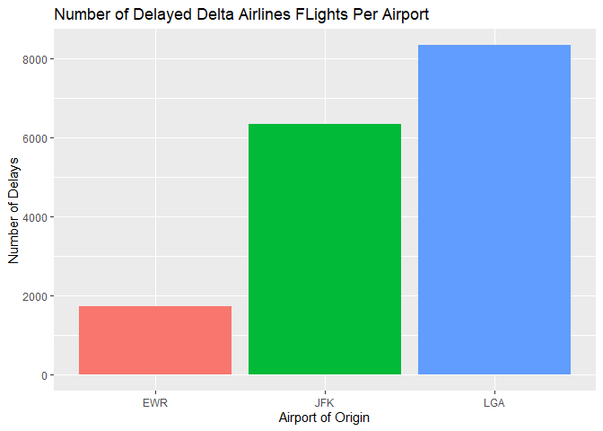
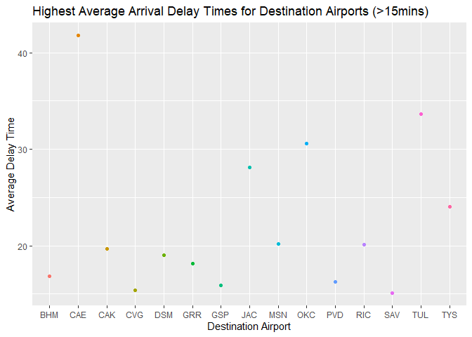

```r
library(lubridate)
```

```
## 
## Attaching package: 'lubridate'
```

```
## The following objects are masked from 'package:base':
## 
##     date, intersect, setdiff, union
```

```r
library(readr)
library(tidyverse)
```

```
## ── Attaching packages
## ───────────────────────────────────────
## tidyverse 1.3.2 ──
```

```
## ✔ ggplot2 3.3.6     ✔ dplyr   1.0.9
## ✔ tibble  3.1.8     ✔ stringr 1.4.1
## ✔ tidyr   1.2.0     ✔ forcats 0.5.2
## ✔ purrr   0.3.4     
## ── Conflicts ────────────────────────────────────────── tidyverse_conflicts() ──
## ✖ lubridate::as.difftime() masks base::as.difftime()
## ✖ lubridate::date()        masks base::date()
## ✖ dplyr::filter()          masks stats::filter()
## ✖ lubridate::intersect()   masks base::intersect()
## ✖ dplyr::lag()             masks stats::lag()
## ✖ lubridate::setdiff()     masks base::setdiff()
## ✖ lubridate::union()       masks base::union()
```

```r
library(knitr)
library(downloader)
library(dplyr)
```


```r
library(nycflights13)
?flights
```

```
## starting httpd help server ... done
```

```r
head(flights)
```

```
## # A tibble: 6 × 19
##    year month   day dep_time sched_dep…¹ dep_d…² arr_t…³ sched…⁴ arr_d…⁵ carrier
##   <int> <int> <int>    <int>       <int>   <dbl>   <int>   <int>   <dbl> <chr>  
## 1  2013     1     1      517         515       2     830     819      11 UA     
## 2  2013     1     1      533         529       4     850     830      20 UA     
## 3  2013     1     1      542         540       2     923     850      33 AA     
## 4  2013     1     1      544         545      -1    1004    1022     -18 B6     
## 5  2013     1     1      554         600      -6     812     837     -25 DL     
## 6  2013     1     1      554         558      -4     740     728      12 UA     
## # … with 9 more variables: flight <int>, tailnum <chr>, origin <chr>,
## #   dest <chr>, air_time <dbl>, distance <dbl>, hour <dbl>, minute <dbl>,
## #   time_hour <dttm>, and abbreviated variable names ¹​sched_dep_time,
## #   ²​dep_delay, ³​arr_time, ⁴​sched_arr_time, ⁵​arr_delay
```

```r
str(flights)
```

```
## tibble [336,776 × 19] (S3: tbl_df/tbl/data.frame)
##  $ year          : int [1:336776] 2013 2013 2013 2013 2013 2013 2013 2013 2013 2013 ...
##  $ month         : int [1:336776] 1 1 1 1 1 1 1 1 1 1 ...
##  $ day           : int [1:336776] 1 1 1 1 1 1 1 1 1 1 ...
##  $ dep_time      : int [1:336776] 517 533 542 544 554 554 555 557 557 558 ...
##  $ sched_dep_time: int [1:336776] 515 529 540 545 600 558 600 600 600 600 ...
##  $ dep_delay     : num [1:336776] 2 4 2 -1 -6 -4 -5 -3 -3 -2 ...
##  $ arr_time      : int [1:336776] 830 850 923 1004 812 740 913 709 838 753 ...
##  $ sched_arr_time: int [1:336776] 819 830 850 1022 837 728 854 723 846 745 ...
##  $ arr_delay     : num [1:336776] 11 20 33 -18 -25 12 19 -14 -8 8 ...
##  $ carrier       : chr [1:336776] "UA" "UA" "AA" "B6" ...
##  $ flight        : int [1:336776] 1545 1714 1141 725 461 1696 507 5708 79 301 ...
##  $ tailnum       : chr [1:336776] "N14228" "N24211" "N619AA" "N804JB" ...
##  $ origin        : chr [1:336776] "EWR" "LGA" "JFK" "JFK" ...
##  $ dest          : chr [1:336776] "IAH" "IAH" "MIA" "BQN" ...
##  $ air_time      : num [1:336776] 227 227 160 183 116 150 158 53 140 138 ...
##  $ distance      : num [1:336776] 1400 1416 1089 1576 762 ...
##  $ hour          : num [1:336776] 5 5 5 5 6 5 6 6 6 6 ...
##  $ minute        : num [1:336776] 15 29 40 45 0 58 0 0 0 0 ...
##  $ time_hour     : POSIXct[1:336776], format: "2013-01-01 05:00:00" "2013-01-01 05:00:00" ...
```

2. Which origin airport is best to minimize my chances of a late arrival when I am using Delta Airlines?

From my findings, I can tell you that Newark (EWR) had the fewest delayed Delta Airlines flights. On the other hand, LGA had the most Delta fliughts that were delayed. As such, when using Delta Airlines, I would say that EWR is the best airport to use if you are looking to avoid any kind of late arrival.


```r
freq_delay <- flights %>%
  filter(carrier == "DL", arr_delay > 0) %>%
  group_by(origin) %>%
  count()

freq_delay
```

```
## # A tibble: 3 × 2
## # Groups:   origin [3]
##   origin     n
##   <chr>  <int>
## 1 EWR     1725
## 2 JFK     6353
## 3 LGA     8335
```

```r
delta_delay_plot <- ggplot(data=freq_delay, mapping=aes(origin, n, fill=origin)) +
  geom_bar(stat="identity", position="dodge") +
  labs(y = "Number of Delays",
       x = "Airport of Origin",
       title = "Number of Delayed Delta Airlines FLights Per Airport") +
  theme(legend.position = "none")

delta_delay_plot
```

<!-- -->

3. Which destination airport is the worst airport for arrival time?

Among destination airports, CAE (Columbia Metropolitan Airport in South Carolina) was by far the worst airport for arrival times. To gauge this metric, I used the average arrival delay time, in which a negative number denotes a flight that arrived early and a positive number is a flight that arrived late. With the arrival times of all flights taken into account, CAE had an average arrival time of 41.8 minutes delayed! There 15 destination airports nationally with average arrival times being at least 15 minutes or more dleayed on average. 


```r
dest_delay <- flights %>%
  group_by(dest) %>%
  summarise(avg_delaytime = mean(arr_delay, na.rm = TRUE)) %>%
  filter(avg_delaytime > 15)

dest_delay
```

```
## # A tibble: 15 × 2
##    dest  avg_delaytime
##    <chr>         <dbl>
##  1 BHM            16.9
##  2 CAE            41.8
##  3 CAK            19.7
##  4 CVG            15.4
##  5 DSM            19.0
##  6 GRR            18.2
##  7 GSP            15.9
##  8 JAC            28.1
##  9 MSN            20.2
## 10 OKC            30.6
## 11 PVD            16.2
## 12 RIC            20.1
## 13 SAV            15.1
## 14 TUL            33.7
## 15 TYS            24.1
```

```r
destplot <- ggplot(data=dest_delay, mapping=aes(dest, avg_delaytime, color=dest)) +
  geom_point() +
  labs(y = "Average Delay Time",
       x = "Destination Airport",
       title = "Highest Average Arrival Delay Times for Destination Airports (>15mins)") +
  theme(legend.position = "none")

destplot
```

<!-- -->
