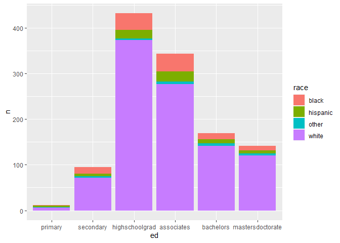
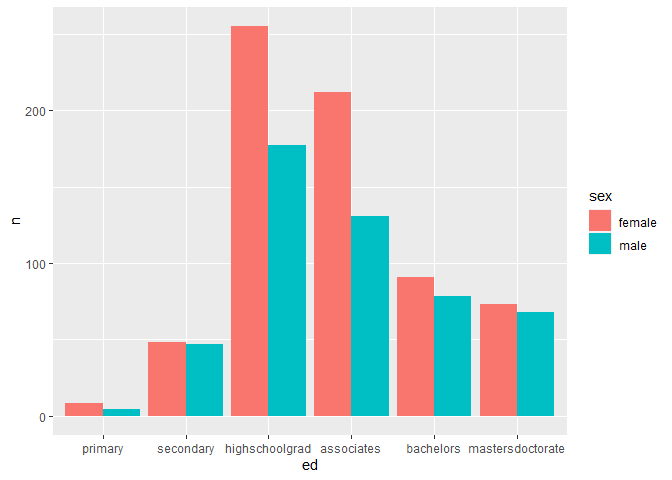
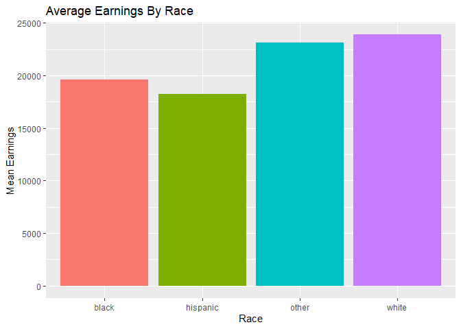

```r
library(lubridate)
```

```
## 
## Attaching package: 'lubridate'
```

```
## The following objects are masked from 'package:base':
## 
##     date, intersect, setdiff, union
```

```r
library(readr)
library(tidyverse)
```

```
## ── Attaching packages
## ───────────────────────────────────────
## tidyverse 1.3.2 ──
```

```
## ✔ ggplot2 3.3.6     ✔ dplyr   1.0.9
## ✔ tibble  3.1.8     ✔ stringr 1.4.1
## ✔ tidyr   1.2.0     ✔ forcats 0.5.2
## ✔ purrr   0.3.4     
## ── Conflicts ────────────────────────────────────────── tidyverse_conflicts() ──
## ✖ lubridate::as.difftime() masks base::as.difftime()
## ✖ lubridate::date()        masks base::date()
## ✖ dplyr::filter()          masks stats::filter()
## ✖ lubridate::intersect()   masks base::intersect()
## ✖ dplyr::lag()             masks stats::lag()
## ✖ lubridate::setdiff()     masks base::setdiff()
## ✖ lubridate::union()       masks base::union()
```

```r
library(knitr)
library(downloader)
library(dplyr)
```


```r
download.file("https://raw.githubusercontent.com/hadley/r4ds/master/data/heights.csv", "heights")

Heights <- read_csv("heights")
```

```
## Rows: 1192 Columns: 6
## ── Column specification ────────────────────────────────────────────────────────
## Delimiter: ","
## chr (2): sex, race
## dbl (4): earn, height, ed, age
## 
## ℹ Use `spec()` to retrieve the full column specification for this data.
## ℹ Specify the column types or set `show_col_types = FALSE` to quiet this message.
```

```r
head(Heights)
```

```
## # A tibble: 6 × 6
##    earn height sex       ed   age race 
##   <dbl>  <dbl> <chr>  <dbl> <dbl> <chr>
## 1 50000   74.4 male      16    45 white
## 2 60000   65.5 female    16    58 white
## 3 30000   63.6 female    16    29 white
## 4 50000   63.1 female    16    91 other
## 5 51000   63.4 female    17    39 white
## 6  9000   64.4 female    15    26 white
```

```r
str(Heights)
```

```
## spec_tbl_df [1,192 × 6] (S3: spec_tbl_df/tbl_df/tbl/data.frame)
##  $ earn  : num [1:1192] 50000 60000 30000 50000 51000 9000 29000 32000 2000 27000 ...
##  $ height: num [1:1192] 74.4 65.5 63.6 63.1 63.4 ...
##  $ sex   : chr [1:1192] "male" "female" "female" "female" ...
##  $ ed    : num [1:1192] 16 16 16 16 17 15 12 17 15 12 ...
##  $ age   : num [1:1192] 45 58 29 91 39 26 49 46 21 26 ...
##  $ race  : chr [1:1192] "white" "white" "white" "other" ...
##  - attr(*, "spec")=
##   .. cols(
##   ..   earn = col_double(),
##   ..   height = col_double(),
##   ..   sex = col_character(),
##   ..   ed = col_double(),
##   ..   age = col_double(),
##   ..   race = col_character()
##   .. )
##  - attr(*, "problems")=<externalptr>
```


```r
HeightEd <- Heights %>%
  mutate(ed = as.factor(ed)) %>%
  mutate(ed = fct_recode(ed,
                         "primary" = "3",
                         "primary" = "4",
                         "primary" = "5",
                         "primary" = "6",
                         "secondary" = "7",
                         "secondary" = "8",
                         "secondary" = "9",
                         "secondary" = "10",
                         "secondary" = "11",
                         "highschoolgrad" = "12",
                         "associates" = "13",
                         "associates" = "14",
                         "associates" = "15",
                         "bachelors" =  "16",
                         "mastersdoctorate" = "17",
                         "mastersdoctorate" = "18"))
HeightEd
```

```
## # A tibble: 1,192 × 6
##     earn height sex    ed                 age race    
##    <dbl>  <dbl> <chr>  <fct>            <dbl> <chr>   
##  1 50000   74.4 male   bachelors           45 white   
##  2 60000   65.5 female bachelors           58 white   
##  3 30000   63.6 female bachelors           29 white   
##  4 50000   63.1 female bachelors           91 other   
##  5 51000   63.4 female mastersdoctorate    39 white   
##  6  9000   64.4 female associates          26 white   
##  7 29000   61.7 female highschoolgrad      49 white   
##  8 32000   72.7 male   mastersdoctorate    46 white   
##  9  2000   72.0 male   associates          21 hispanic
## 10 27000   72.2 male   highschoolgrad      26 white   
## # … with 1,182 more rows
```


```r
race_ed <- HeightEd %>%
  group_by(race) %>%
  count(ed)

race_ed
```

```
## # A tibble: 24 × 3
## # Groups:   race [4]
##    race     ed                   n
##    <chr>    <fct>            <int>
##  1 black    primary              2
##  2 black    secondary           14
##  3 black    highschoolgrad      36
##  4 black    associates          38
##  5 black    bachelors           13
##  6 black    mastersdoctorate     9
##  7 hispanic primary              3
##  8 hispanic secondary            6
##  9 hispanic highschoolgrad      19
## 10 hispanic associates          22
## # … with 14 more rows
```

```r
ggplot(data=race_ed, mapping=aes(ed, n, fill=race)) +
  geom_bar(stat="identity", position="stack") 
```

<!-- -->


```r
sex_ed <- HeightEd %>%
  group_by(sex) %>%
  count(ed)

sex_ed
```

```
## # A tibble: 12 × 3
## # Groups:   sex [2]
##    sex    ed                   n
##    <chr>  <fct>            <int>
##  1 female primary              8
##  2 female secondary           48
##  3 female highschoolgrad     255
##  4 female associates         212
##  5 female bachelors           91
##  6 female mastersdoctorate    73
##  7 male   primary              4
##  8 male   secondary           47
##  9 male   highschoolgrad     177
## 10 male   associates         131
## 11 male   bachelors           78
## 12 male   mastersdoctorate    68
```

```r
ggplot(data=sex_ed, mapping=aes(ed, n, fill=sex)) +
  geom_bar(stat="identity", position="dodge") 
```

<!-- -->


```r
race_earn <- HeightEd %>%
  group_by(race) %>%
  summarise(Avg = mean(earn))

race_earn
```

```
## # A tibble: 4 × 2
##   race        Avg
##   <chr>     <dbl>
## 1 black    19624.
## 2 hispanic 18264.
## 3 other    23097.
## 4 white    23882.
```

```r
ggplot(data=race_earn, mapping=aes(race, Avg, fill=race)) +
  geom_bar(stat="identity", position="dodge") +
  labs(y = "Mean Earnings",
       x = "Race",
       title = "Average Earnings By Race") +
  theme(legend.position = "none")
```

<!-- -->

By undergoing this process, I learned how to expertly layer and structure items within ggplot. Moreover, I learned how to alter and manipulate datasets to draw out specific information using dplyr commands (mutate, summarise, etc.). Finally, I became more and more acquaintdd with the mechanics and inner workings of r, such as manipulating datatypes to becomes factors for ease of creating visualizations. 
