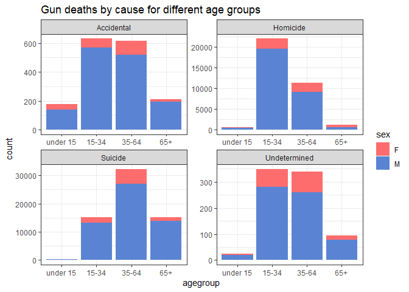
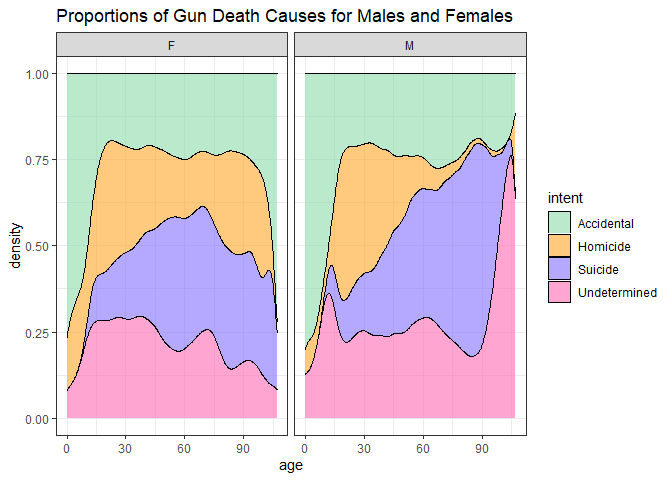
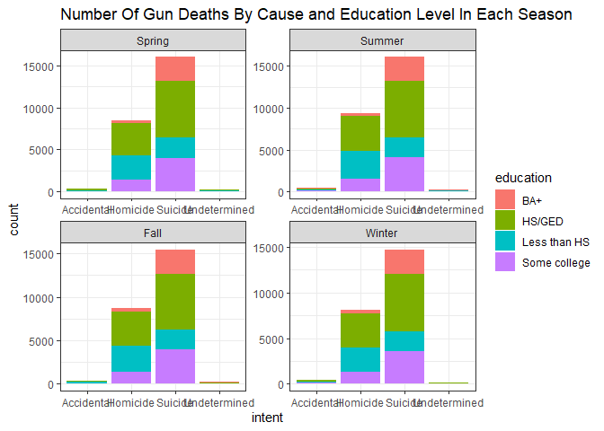
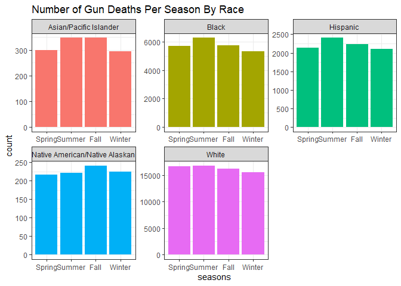

```r
library(tidyverse)
```

```
## ── Attaching packages ─────────────────────────────────────── tidyverse 1.3.2 ──
## ✔ ggplot2 3.3.6     ✔ purrr   0.3.4
## ✔ tibble  3.1.8     ✔ dplyr   1.0.9
## ✔ tidyr   1.2.0     ✔ stringr 1.4.1
## ✔ readr   2.1.2     ✔ forcats 0.5.2
## ── Conflicts ────────────────────────────────────────── tidyverse_conflicts() ──
## ✖ dplyr::filter() masks stats::filter()
## ✖ dplyr::lag()    masks stats::lag()
```

```r
library(downloader)
library(readxl)
```

A brief summary of the article: The FiveThirtyEight article discusses the methodology and structure of the site's datatset of firearm related deaths and their specific causes. The article discusses where the information was sourced, how it determined where ambiguous events fit into their categories, how it segmented information by race, gender, age, etc. and overall how the information wascompiled for public viewing and use in research. All in all, the article seeks to provide the information and an outline for finding data-driven solutions to the problem of firearm-related deaths in the United States.


```r
GunData <- tempfile()
download("https://raw.githubusercontent.com/fivethirtyeight/guns-data/master/full_data.csv", GunData, mode = "wb")
gunData <- read_csv(GunData)
```

```
## New names:
## Rows: 100798 Columns: 11
## ── Column specification
## ──────────────────────────────────────────────────────── Delimiter: "," chr
## (6): month, intent, sex, race, place, education dbl (5): ...1, year, police,
## age, hispanic
## ℹ Use `spec()` to retrieve the full column specification for this data. ℹ
## Specify the column types or set `show_col_types = FALSE` to quiet this message.
## • `` -> `...1`
```

```r
gunData_new <- gunData %>%
  filter(age != "", intent != "")
str(gunData)
```

```
## spec_tbl_df [100,798 × 11] (S3: spec_tbl_df/tbl_df/tbl/data.frame)
##  $ ...1     : num [1:100798] 1 2 3 4 5 6 7 8 9 10 ...
##  $ year     : num [1:100798] 2012 2012 2012 2012 2012 ...
##  $ month    : chr [1:100798] "01" "01" "01" "02" ...
##  $ intent   : chr [1:100798] "Suicide" "Suicide" "Suicide" "Suicide" ...
##  $ police   : num [1:100798] 0 0 0 0 0 0 0 0 0 0 ...
##  $ sex      : chr [1:100798] "M" "F" "M" "M" ...
##  $ age      : num [1:100798] 34 21 60 64 31 17 48 41 50 NA ...
##  $ race     : chr [1:100798] "Asian/Pacific Islander" "White" "White" "White" ...
##  $ hispanic : num [1:100798] 100 100 100 100 100 100 100 100 100 998 ...
##  $ place    : chr [1:100798] "Home" "Street" "Other specified" "Home" ...
##  $ education: chr [1:100798] "BA+" "Some college" "BA+" "BA+" ...
##  - attr(*, "spec")=
##   .. cols(
##   ..   ...1 = col_double(),
##   ..   year = col_double(),
##   ..   month = col_character(),
##   ..   intent = col_character(),
##   ..   police = col_double(),
##   ..   sex = col_character(),
##   ..   age = col_double(),
##   ..   race = col_character(),
##   ..   hispanic = col_double(),
##   ..   place = col_character(),
##   ..   education = col_character()
##   .. )
##  - attr(*, "problems")=<externalptr>
```

```r
head(gunData)
```

```
## # A tibble: 6 × 11
##    ...1  year month intent  police sex     age race        hispa…¹ place educa…²
##   <dbl> <dbl> <chr> <chr>    <dbl> <chr> <dbl> <chr>         <dbl> <chr> <chr>  
## 1     1  2012 01    Suicide      0 M        34 Asian/Paci…     100 Home  BA+    
## 2     2  2012 01    Suicide      0 F        21 White           100 Stre… Some c…
## 3     3  2012 01    Suicide      0 M        60 White           100 Othe… BA+    
## 4     4  2012 02    Suicide      0 M        64 White           100 Home  BA+    
## 5     5  2012 02    Suicide      0 M        31 White           100 Othe… HS/GED 
## 6     6  2012 02    Suicide      0 M        17 Native Ame…     100 Home  Less t…
## # … with abbreviated variable names ¹​hispanic, ²​education
```


```r
gunsData <- gunData_new %>%
  mutate(agegroup =
          case_when(
            age >= 0 & age <= 14 ~ "under 15",
            age >= 15 & age <= 34 ~ "15-34",
            age >= 35 & age <= 64 ~ "35-64",
            age >= 65 ~ "65+"),
         agegroup = fct_relevel(agegroup, 
            "under 15", "15-34", "35-64", 
            "65+"))
```


```r
ggplot(data = gunsData, aes(x = agegroup, fill = sex)) +
  geom_bar() +
  facet_wrap(~intent, nrow = 2, scales = 'free') +
  scale_fill_manual(values = c('#FD6D6D', '#5A84D3')) +
  ggtitle("Gun deaths by cause for different age groups") +
  theme_bw()
```

<!-- -->


```r
ggplot(data = gunData_new, aes(x = age, fill = intent)) +
  geom_density(position = 'fill', alpha = .6) +
  facet_wrap(~sex) +
  scale_fill_manual(values = c("#8CDBAA","#FFA727","lightslateblue","hotpink")) +
  ggtitle("Proportions of Gun Death Causes for Males and Females") +
  theme_bw()
```

<!-- -->


```r
season <- gunData_new %>%
  filter(education != "") %>%
  mutate(seasons = as.factor(fct_collapse(month,
          "Spring" = c("03", "04", "05"),
          "Summer" = c("06", "07", "08"),
          "Fall" = c("09", "10", "11"),
          "Winter" = c("12", "01", "02"))),
         seasons = fct_relevel(seasons, 
            "Spring", "Summer", "Fall", 
            "Winter")
  )

head(season)
```

```
## # A tibble: 6 × 12
##    ...1  year month intent  police sex     age race        hispa…¹ place educa…²
##   <dbl> <dbl> <chr> <chr>    <dbl> <chr> <dbl> <chr>         <dbl> <chr> <chr>  
## 1     1  2012 01    Suicide      0 M        34 Asian/Paci…     100 Home  BA+    
## 2     2  2012 01    Suicide      0 F        21 White           100 Stre… Some c…
## 3     3  2012 01    Suicide      0 M        60 White           100 Othe… BA+    
## 4     4  2012 02    Suicide      0 M        64 White           100 Home  BA+    
## 5     5  2012 02    Suicide      0 M        31 White           100 Othe… HS/GED 
## 6     6  2012 02    Suicide      0 M        17 Native Ame…     100 Home  Less t…
## # … with 1 more variable: seasons <fct>, and abbreviated variable names
## #   ¹​hispanic, ²​education
```

```r
ggplot(season, aes(intent, fill = education)) +
  geom_bar() +
  facet_wrap(~seasons, scales = "free") +
  ggtitle("Number Of Gun Deaths By Cause and Education Level In Each Season") +
  theme_bw()
```

<!-- -->
In this plot, the number of gun deaths by intent are plotted for each season in a bar chart. The bar charts' bars are broken into sections by victims' level of education.


```r
ggplot(season, aes(seasons, fill = race)) +
  geom_bar() +
  facet_wrap(~race, scales = 'free') +
  ggtitle("Number of Gun Deaths Per Season By Race") +
  theme_bw() +
  theme(legend.position = 'none')
```

<!-- -->
In this plot, the number of gun deaths per season by victims' race are plotted in a bar chart. The bar charts are faceted so that each chart represents the seasonal statistic data of a different race.
