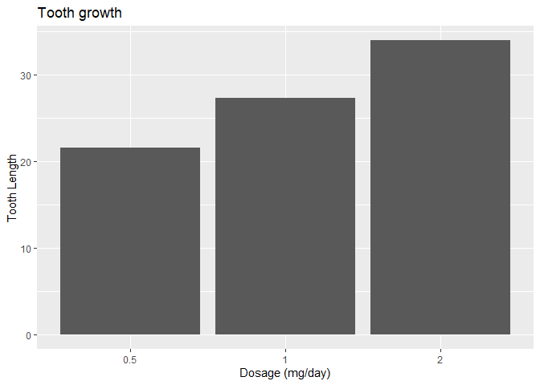

```r
library(lubridate)
```

```
## 
## Attaching package: 'lubridate'
```

```
## The following objects are masked from 'package:base':
## 
##     date, intersect, setdiff, union
```

```r
library(readr)
library(tidyverse)
```

```
## ── Attaching packages
## ───────────────────────────────────────
## tidyverse 1.3.2 ──
```

```
## ✔ ggplot2 3.3.6     ✔ dplyr   1.0.9
## ✔ tibble  3.1.8     ✔ stringr 1.4.1
## ✔ tidyr   1.2.0     ✔ forcats 0.5.2
## ✔ purrr   0.3.4     
## ── Conflicts ────────────────────────────────────────── tidyverse_conflicts() ──
## ✖ lubridate::as.difftime() masks base::as.difftime()
## ✖ lubridate::date()        masks base::date()
## ✖ dplyr::filter()          masks stats::filter()
## ✖ lubridate::intersect()   masks base::intersect()
## ✖ dplyr::lag()             masks stats::lag()
## ✖ lubridate::setdiff()     masks base::setdiff()
## ✖ lubridate::union()       masks base::union()
```

```r
library(knitr)
library(downloader)
library(dplyr)
```


```r
?ToothGrowth
```

```
## starting httpd help server ... done
```

```r
head(ToothGrowth)
```

```
##    len supp dose
## 1  4.2   VC  0.5
## 2 11.5   VC  0.5
## 3  7.3   VC  0.5
## 4  5.8   VC  0.5
## 5  6.4   VC  0.5
## 6 10.0   VC  0.5
```

```r
str(ToothGrowth)
```

```
## 'data.frame':	60 obs. of  3 variables:
##  $ len : num  4.2 11.5 7.3 5.8 6.4 10 11.2 11.2 5.2 7 ...
##  $ supp: Factor w/ 2 levels "OJ","VC": 2 2 2 2 2 2 2 2 2 2 ...
##  $ dose: num  0.5 0.5 0.5 0.5 0.5 0.5 0.5 0.5 0.5 0.5 ...
```


```r
plotski1 <- ggplot(data=ToothGrowth, mapping=aes(as.factor(dose), len)) +
  geom_bar(stat="identity", position="dodge") +
  labs(y = "Tooth Length",
       x = "Dosage (mg/day)",
       title = "Tooth growth") +
  theme(legend.position = "bottom")

plotski1
```

<!-- -->
This plot is a bar chart of Dosage in mg per day vs. tooth length. While extremely simple, it conveys the necessary information effectively and clearly. I utilize geom_bar as a geometry, and include x and y labs, title, theme, and legend as layers.


```r
TG <- ToothGrowth %>%
  mutate(dose = as.factor(dose))

plotski2 <- ggplot(data=TG, mapping=aes(supp, len, color=dose)) +
  geom_point() +
  labs(y = "Tooth Length",
       x = "Supplement type",
       title = "Tooth growth") +
  theme(legend.position = "bottom")

plotski2
```

<!-- -->
This plot is a dot plot of tooth length by supplement type, with each point's dosage size indicated by color. The two supplement types, orange juice and ascorbic acid (Vit C) appear on the x axis, and as tooth growth increases, the color of dots indicates dosage increased as well. I utilize geom_point as a geometry, and include x and y labs, title, theme, and legend as layers.


```r
?mtcars
head(mtcars)
```

```
##                    mpg cyl disp  hp drat    wt  qsec vs am gear carb
## Mazda RX4         21.0   6  160 110 3.90 2.620 16.46  0  1    4    4
## Mazda RX4 Wag     21.0   6  160 110 3.90 2.875 17.02  0  1    4    4
## Datsun 710        22.8   4  108  93 3.85 2.320 18.61  1  1    4    1
## Hornet 4 Drive    21.4   6  258 110 3.08 3.215 19.44  1  0    3    1
## Hornet Sportabout 18.7   8  360 175 3.15 3.440 17.02  0  0    3    2
## Valiant           18.1   6  225 105 2.76 3.460 20.22  1  0    3    1
```

```r
str(mtcars)
```

```
## 'data.frame':	32 obs. of  11 variables:
##  $ mpg : num  21 21 22.8 21.4 18.7 18.1 14.3 24.4 22.8 19.2 ...
##  $ cyl : num  6 6 4 6 8 6 8 4 4 6 ...
##  $ disp: num  160 160 108 258 360 ...
##  $ hp  : num  110 110 93 110 175 105 245 62 95 123 ...
##  $ drat: num  3.9 3.9 3.85 3.08 3.15 2.76 3.21 3.69 3.92 3.92 ...
##  $ wt  : num  2.62 2.88 2.32 3.21 3.44 ...
##  $ qsec: num  16.5 17 18.6 19.4 17 ...
##  $ vs  : num  0 0 1 1 0 1 0 1 1 1 ...
##  $ am  : num  1 1 1 0 0 0 0 0 0 0 ...
##  $ gear: num  4 4 4 3 3 3 3 4 4 4 ...
##  $ carb: num  4 4 1 1 2 1 4 2 2 4 ...
```

```r
vroom <- mtcars %>%
  mutate(cyl = as.factor(cyl))

plotski3 <- ggplot(data=vroom, mapping=aes(wt, mpg, color=cyl)) +
  geom_point() +
  labs(y = "MPG",
       x = "Weight (1000 lbs)",
       title = "Weight vs. MPG By Number of Cylinders") +
  theme(legend.position = "bottom")

plotski3
```

<!-- -->
Utilizing the mtcars data set, this plot is a dot plot of cars' weight vs. their mpg, with each vehicle's number of cylinders indicated by color. Cylinder quantities of 4, 6 and 8 appear on the x axis, and as the weight of cars increases, the color of dots indicates the number of cylinders increased in general as well. All in all, the heavier cars got, the lower mpg they registered, which makes sense. I utilize geom_point as a geometry, and include x and y labs, title, theme, and legend as layers.


```r
plotski4 <- ggplot(data=vroom, mapping=aes(mpg, qsec)) +
  geom_point(color= "red") +
  geom_smooth(method = "lm") +
  labs(y = "1/4 Mile Time",
       x = "MPG",
       title = "Are Fuel-Efficient Cars The Fastest?",
       subtitle = "Absolutely Not.") +
  theme(legend.position = "bottom") 

plotski4
```

```
## `geom_smooth()` using formula 'y ~ x'
```

<!-- -->
Utilizing the mtcars data set, this plot is a dot plot of cars' mpg vs. their 1/4 mile time, with the goal of seeing if the most fuel efficient cars are also among the fastest. All in all, the scatter plot clearly indicates that the most fuel efficient cars (those with mpg readings in excess of 30) are not among the fastest, and that the fastest 1/4 mile times belong to cars that are much less fuel efficient.I utilize geom_point as a geometry to display each data point, while also adding a linear regression using geom_smooth to illustrate the relationship between the variables. Labs for X and Y, title, subtitle, theme, and legend are added as layers.
