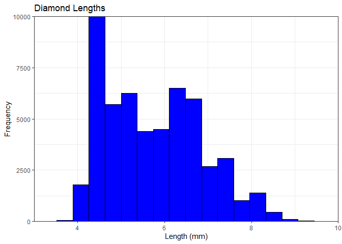
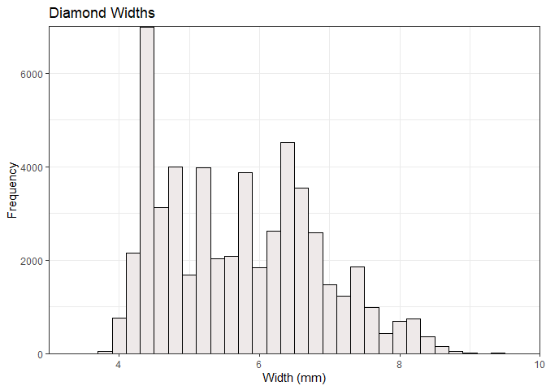
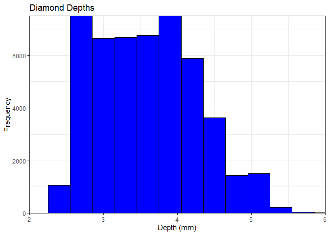
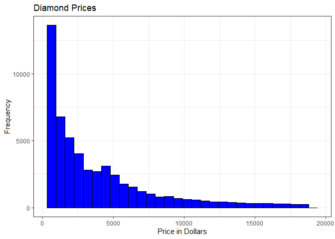
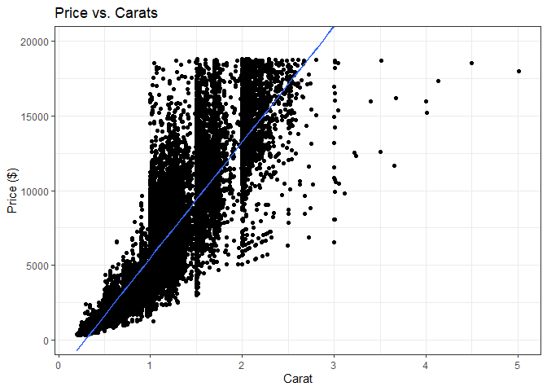
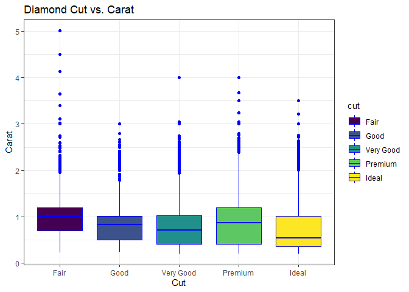
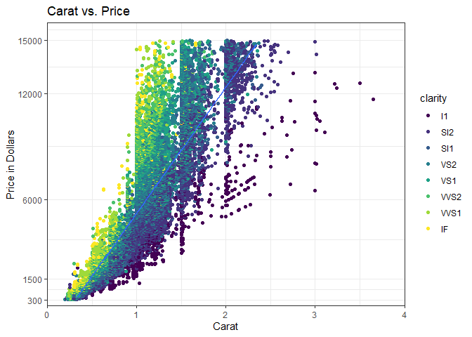
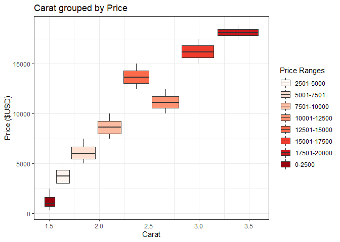
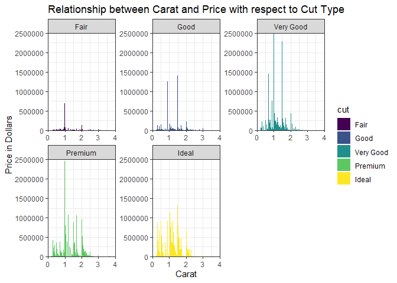

```r
library(lubridate)
```

```
## 
## Attaching package: 'lubridate'
```

```
## The following objects are masked from 'package:base':
## 
##     date, intersect, setdiff, union
```

```r
library(readr)
library(tidyverse)
```

```
## ── Attaching packages
## ───────────────────────────────────────
## tidyverse 1.3.2 ──
```

```
## ✔ ggplot2 3.3.6     ✔ dplyr   1.0.9
## ✔ tibble  3.1.8     ✔ stringr 1.4.1
## ✔ tidyr   1.2.0     ✔ forcats 0.5.2
## ✔ purrr   0.3.4     
## ── Conflicts ────────────────────────────────────────── tidyverse_conflicts() ──
## ✖ lubridate::as.difftime() masks base::as.difftime()
## ✖ lubridate::date()        masks base::date()
## ✖ dplyr::filter()          masks stats::filter()
## ✖ lubridate::intersect()   masks base::intersect()
## ✖ dplyr::lag()             masks stats::lag()
## ✖ lubridate::setdiff()     masks base::setdiff()
## ✖ lubridate::union()       masks base::union()
```

```r
library(knitr)
library(downloader)
library(dplyr)
```


```r
?diamonds
```

```
## starting httpd help server ... done
```

```r
head(diamonds)
```

```
## # A tibble: 6 × 10
##   carat cut       color clarity depth table price     x     y     z
##   <dbl> <ord>     <ord> <ord>   <dbl> <dbl> <int> <dbl> <dbl> <dbl>
## 1  0.23 Ideal     E     SI2      61.5    55   326  3.95  3.98  2.43
## 2  0.21 Premium   E     SI1      59.8    61   326  3.89  3.84  2.31
## 3  0.23 Good      E     VS1      56.9    65   327  4.05  4.07  2.31
## 4  0.29 Premium   I     VS2      62.4    58   334  4.2   4.23  2.63
## 5  0.31 Good      J     SI2      63.3    58   335  4.34  4.35  2.75
## 6  0.24 Very Good J     VVS2     62.8    57   336  3.94  3.96  2.48
```

```r
str(diamonds)
```

```
## tibble [53,940 × 10] (S3: tbl_df/tbl/data.frame)
##  $ carat  : num [1:53940] 0.23 0.21 0.23 0.29 0.31 0.24 0.24 0.26 0.22 0.23 ...
##  $ cut    : Ord.factor w/ 5 levels "Fair"<"Good"<..: 5 4 2 4 2 3 3 3 1 3 ...
##  $ color  : Ord.factor w/ 7 levels "D"<"E"<"F"<"G"<..: 2 2 2 6 7 7 6 5 2 5 ...
##  $ clarity: Ord.factor w/ 8 levels "I1"<"SI2"<"SI1"<..: 2 3 5 4 2 6 7 3 4 5 ...
##  $ depth  : num [1:53940] 61.5 59.8 56.9 62.4 63.3 62.8 62.3 61.9 65.1 59.4 ...
##  $ table  : num [1:53940] 55 61 65 58 58 57 57 55 61 61 ...
##  $ price  : int [1:53940] 326 326 327 334 335 336 336 337 337 338 ...
##  $ x      : num [1:53940] 3.95 3.89 4.05 4.2 4.34 3.94 3.95 4.07 3.87 4 ...
##  $ y      : num [1:53940] 3.98 3.84 4.07 4.23 4.35 3.96 3.98 4.11 3.78 4.05 ...
##  $ z      : num [1:53940] 2.43 2.31 2.31 2.63 2.75 2.48 2.47 2.53 2.49 2.39 ...
```

I stopped naming the code chunks so that my visualizations would output properly when I pushed everything to GitHub.


```r
ggplot(diamonds, aes(x)) +
  geom_histogram(color = 'black', fill = 'blue') +
  labs(x = 'Length (mm)', y = 'Frequency', title = 'Diamond Lengths') +
  coord_cartesian(xlim = c(3,10),ylim = c(0, 10000), expand = FALSE) +
  theme_bw()
```

```
## `stat_bin()` using `bins = 30`. Pick better value with `binwidth`.
```

<!-- -->


```r
ggplot(diamonds, aes(y)) +
  geom_histogram(color = 'black', fill = 'snow2', binwidth = .20) +
  labs(x = 'Width (mm)', y = 'Frequency', title = 'Diamond Widths') +
  coord_cartesian(xlim = c(3,10), ylim = c(0, 7000), expand = FALSE) +
  theme_bw()
```

<!-- -->


```r
ggplot(diamonds, aes(z)) +
  geom_histogram(color = 'black', fill = 'blue', binwidth = .3) +
  labs(x = 'Depth (mm)', y = 'Frequency', title = 'Diamond Depths') +
  coord_cartesian(xlim = c(2,6), ylim = c(0, 7500), expand = FALSE) +
  theme_bw()
```

<!-- -->


```r
ggplot(diamonds, aes(price)) +
  geom_histogram(color = 'black', fill = 'blue') +
  labs(x = 'Price in Dollars', y = 'Frequency', title = 'Diamond Prices') +
  theme_bw()
```

```
## `stat_bin()` using `bins = 30`. Pick better value with `binwidth`.
```

<!-- -->
Distribution is heavily right skewed with the vast majority of diamonds being under $5000 in price.


```r
ggplot(diamonds, aes(carat, price)) +
  geom_point() +
  geom_smooth(method = "lm") +
  labs(x = 'Carat', y = 'Price ($)', title = 'Price vs. Carats') +
  coord_cartesian(ylim = c(0, 20000), expand = TRUE) +
  theme_bw()
```

```
## `geom_smooth()` using formula 'y ~ x'
```

<!-- -->


```r
ggplot(diamonds, aes(cut, carat)) +
  geom_boxplot(aes(fill = cut), color = 'blue') +
  labs(x = 'Cut', y = 'Carat', title = 'Diamond Cut vs. Carat') +
  theme_bw()
```

<!-- -->


```r
ggplot(data = diamonds, aes(x = carat, y = price)) + 
  geom_point(aes(color = clarity), alpha = 1) +
  geom_smooth(method = "lm") +
  scale_y_continuous(limits = c(350, 15000),
    breaks = c(300, 1500, 6000, 12000, 15000)) +
  coord_cartesian(xlim = c(0, 4), ylim = c(0,16000), expand = FALSE) +
  labs(x = 'Carat', y = 'Price in Dollars', title = 'Carat vs. Price') +
  theme_bw()
```

```
## `geom_smooth()` using formula 'y ~ x'
```

```
## Warning: Removed 1672 rows containing non-finite values (stat_smooth).
```

```
## Warning: Removed 1672 rows containing missing values (geom_point).
```

```
## Warning: Removed 33 rows containing missing values (geom_smooth).
```

<!-- -->
While more carots certainly command a higher price, the same is not necessarily true of clarity.


```r
diamonds %>%
  mutate(price_part =
           case_when(
             price >= 0 & price <= 2500 ~ '0-2500',
             price >= 2501 & price <= 5000 ~ '2501-5000',
             price >= 5001 & price <= 7500 ~ '5001-7501',
             price >= 7501 & price <= 10000 ~ '7501-10000',
             price >= 10001 & price <= 12500 ~ '10001-12500',
             price >= 12501 & price <= 15000 ~ '12501-15000',
             price >= 15001 & price <= 17500 ~ '15001-17500',
             price >= 17501 & price <= 20000 ~ '17501-20000',
             price >= 20001 & price <= 22500 ~ '20001-22500',
             price >= 22501 & price <= 25000 ~ '22501-25000'),
         price_part =  fct_relevel(price_part,'0-3000','2501-5000','5001-7501','7501-10000','10001-12500','12501-15000','15001-17500','17501-20000','20001-22500','22501-25000')) %>%
  ggplot(aes(carat, price, fill = price_part)) +
    geom_boxplot() +
    scale_fill_brewer(palette = 'Reds') +
    labs(x = 'Carat', y = 'Price ($USD)', title = 'Carat grouped by Price', fill = "Price Ranges") +
    theme_bw()
```

```
## Warning: 3 unknown levels in `f`: 0-3000, 20001-22500, and 22501-25000
```

<!-- -->


```r
Large <- diamonds %>%
  filter(carat >= 4) %>%
  ggplot(aes(price)) +
    geom_histogram(color = 'black', fill = 'blue') +
    labs(x = 'Price in Dollars', y = 'Occurances', title = 'Large Diamond Price Distribution', subtitle = 'Carat >= 4') +
    theme_bw()
```


```r
Small <- diamonds %>%
  filter(carat <= 1) %>%
  ggplot(aes(price)) +
    geom_histogram(color = 'black', fill = 'red') +
    labs(x = 'Price in Dollars', y = 'Occurances', title = 'Small Diamond Price Distribution', subtitle = 'Carat <= 1') +
    theme_bw()
```
The graphs predictably prove that large diamonds, being with at least carats or more, are going to be more expensive on average than smaller diamonds. 


```r
ggplot(diamonds, aes(x = carat, y = price, fill = cut)) +
    geom_col(alpha = 1) +
    coord_cartesian(xlim = c(0,4), ylim = c(0, 2500000), expand = FALSE) +
    facet_wrap(~cut, scales = 'free') +
    labs(x = 'Carat', y = 'Price in Dollars', title = 'Relationship between Carat and Price with respect to Cut Type') +
    theme_bw() 
```

<!-- -->
