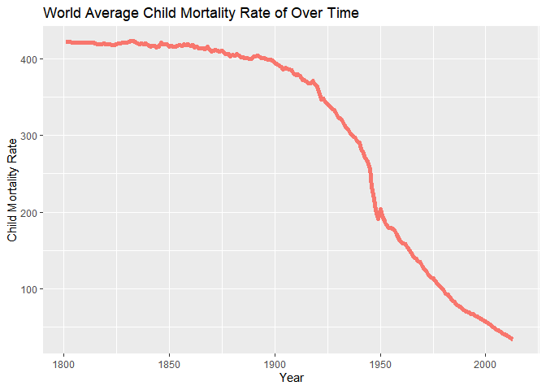

```r
library(lubridate)
```

```
## 
## Attaching package: 'lubridate'
```

```
## The following objects are masked from 'package:base':
## 
##     date, intersect, setdiff, union
```

```r
library(readr)
library(tidyverse)
```

```
## ── Attaching packages
## ───────────────────────────────────────
## tidyverse 1.3.2 ──
```

```
## ✔ ggplot2 3.3.6     ✔ dplyr   1.0.9
## ✔ tibble  3.1.8     ✔ stringr 1.4.1
## ✔ tidyr   1.2.0     ✔ forcats 0.5.2
## ✔ purrr   0.3.4     
## ── Conflicts ────────────────────────────────────────── tidyverse_conflicts() ──
## ✖ lubridate::as.difftime() masks base::as.difftime()
## ✖ lubridate::date()        masks base::date()
## ✖ dplyr::filter()          masks stats::filter()
## ✖ lubridate::intersect()   masks base::intersect()
## ✖ dplyr::lag()             masks stats::lag()
## ✖ lubridate::setdiff()     masks base::setdiff()
## ✖ lubridate::union()       masks base::union()
```

```r
library(knitr)
library(downloader)
library(dplyr)
```


```r
#install.packages("devtools") 
library(devtools)
```

```
## Loading required package: usethis
```

```
## 
## Attaching package: 'devtools'
```

```
## The following object is masked from 'package:downloader':
## 
##     source_url
```

```r
devtools::install_github("drsimonj/ourworldindata")
```

```
## WARNING: Rtools is required to build R packages, but is not currently installed.
## 
## Please download and install Rtools 4.2 from https://cran.r-project.org/bin/windows/Rtools/ or https://www.r-project.org/nosvn/winutf8/ucrt3/.
```

```
## Skipping install of 'ourworldindata' from a github remote, the SHA1 (ed2fc17b) has not changed since last install.
##   Use `force = TRUE` to force installation
```

```r
library(ourworldindata)

head(financing_healthcare)
```

```
## # A tibble: 6 × 17
##    year country  conti…¹ healt…² healt…³ healt…⁴ nhs_exp healt…⁵ healt…⁶ healt…⁷
##   <int> <chr>    <chr>     <dbl>   <dbl>   <int>   <dbl>   <dbl>   <dbl>   <dbl>
## 1  2015 Abkhazia <NA>         NA      NA      NA      NA      NA      NA      NA
## 2  1800 Afghani… Asia         NA      NA      NA      NA      NA      NA      NA
## 3  1801 Afghani… Asia         NA      NA      NA      NA      NA      NA      NA
## 4  1802 Afghani… Asia         NA      NA      NA      NA      NA      NA      NA
## 5  1803 Afghani… Asia         NA      NA      NA      NA      NA      NA      NA
## 6  1804 Afghani… Asia         NA      NA      NA      NA      NA      NA      NA
## # … with 7 more variables: health_insurance_any <dbl>,
## #   health_exp_public_percent <dbl>, health_exp_oop_percent <dbl>,
## #   no_health_insurance <dbl>, gdp <dbl>, life_expectancy <dbl>,
## #   child_mort <dbl>, and abbreviated variable names ¹​continent,
## #   ²​health_exp_total, ³​health_exp_public, ⁴​health_insurance,
## #   ⁵​health_exp_private, ⁶​health_insurance_govt, ⁷​health_insurance_private
```

```r
?financing_healthcare
```

```
## starting httpd help server ...
```

```
##  done
```

```r
str(financing_healthcare)
```

```
## tibble [36,873 × 17] (S3: tbl_df/tbl/data.frame)
##  $ year                     : int [1:36873] 2015 1800 1801 1802 1803 1804 1805 1806 1807 1808 ...
##  $ country                  : chr [1:36873] "Abkhazia" "Afghanistan" "Afghanistan" "Afghanistan" ...
##  $ continent                : chr [1:36873] NA "Asia" "Asia" "Asia" ...
##  $ health_exp_total         : num [1:36873] NA NA NA NA NA NA NA NA NA NA ...
##  $ health_exp_public        : num [1:36873] NA NA NA NA NA NA NA NA NA NA ...
##  $ health_insurance         : int [1:36873] NA NA NA NA NA NA NA NA NA NA ...
##  $ nhs_exp                  : num [1:36873] NA NA NA NA NA NA NA NA NA NA ...
##  $ health_exp_private       : num [1:36873] NA NA NA NA NA NA NA NA NA NA ...
##  $ health_insurance_govt    : num [1:36873] NA NA NA NA NA NA NA NA NA NA ...
##  $ health_insurance_private : num [1:36873] NA NA NA NA NA NA NA NA NA NA ...
##  $ health_insurance_any     : num [1:36873] NA NA NA NA NA NA NA NA NA NA ...
##  $ health_exp_public_percent: num [1:36873] NA NA NA NA NA NA NA NA NA NA ...
##  $ health_exp_oop_percent   : num [1:36873] NA NA NA NA NA NA NA NA NA NA ...
##  $ no_health_insurance      : num [1:36873] NA NA NA NA NA NA NA NA NA NA ...
##  $ gdp                      : num [1:36873] NA NA NA NA NA NA NA NA NA NA ...
##  $ life_expectancy          : num [1:36873] NA NA NA NA NA NA NA NA NA NA ...
##  $ child_mort               : num [1:36873] NA 469 469 469 469 ...
```


```r
financing_healthcare2 <- financing_healthcare %>%
  group_by(year) %>%
  filter(year > 1800) %>%
  summarise(avg_cm = mean(child_mort, na.rm = TRUE))

head(financing_healthcare2)
```

```
## # A tibble: 6 × 2
##    year avg_cm
##   <int>  <dbl>
## 1  1801   422.
## 2  1802   422.
## 3  1803   422.
## 4  1804   422.
## 5  1805   421.
## 6  1806   421.
```

```r
cmplot <- ggplot(data=financing_healthcare2, mapping=aes(x=year, y=avg_cm, color="red")) +
  geom_path(size = 1.9) +
  labs(y = "Child Mortality Rate",
       x = "Year",
       title = "World Average Child Mortality Rate of Over Time") +
  theme(legend.position = "none")

cmplot
```

```
## Warning: Removed 2 row(s) containing missing values (geom_path).
```

<!-- -->

