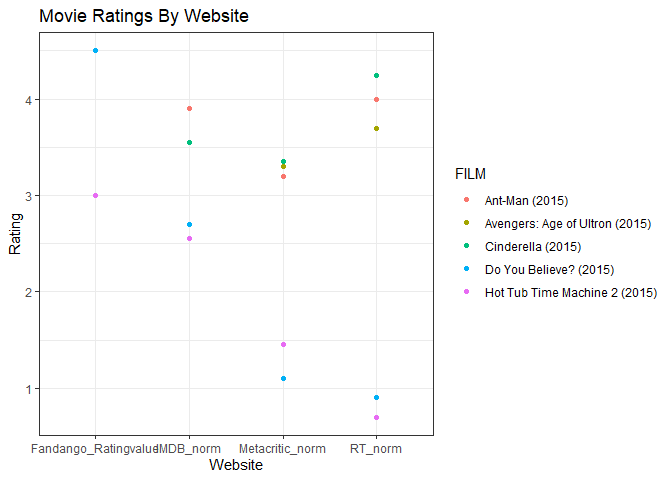

```r
library(lubridate)
```

```
## 
## Attaching package: 'lubridate'
```

```
## The following objects are masked from 'package:base':
## 
##     date, intersect, setdiff, union
```

```r
library(readr)
library(tidyverse)
```

```
## ── Attaching packages
## ───────────────────────────────────────
## tidyverse 1.3.2 ──
```

```
## ✔ ggplot2 3.3.6     ✔ dplyr   1.0.9
## ✔ tibble  3.1.8     ✔ stringr 1.4.1
## ✔ tidyr   1.2.0     ✔ forcats 0.5.2
## ✔ purrr   0.3.4     
## ── Conflicts ────────────────────────────────────────── tidyverse_conflicts() ──
## ✖ lubridate::as.difftime() masks base::as.difftime()
## ✖ lubridate::date()        masks base::date()
## ✖ dplyr::filter()          masks stats::filter()
## ✖ lubridate::intersect()   masks base::intersect()
## ✖ dplyr::lag()             masks stats::lag()
## ✖ lubridate::setdiff()     masks base::setdiff()
## ✖ lubridate::union()       masks base::union()
```

```r
library(knitr)
library(downloader)
library(dplyr)
```


```r
movie_data <- tempfile()
download("https://raw.githubusercontent.com/fivethirtyeight/data/master/fandango/fandango_score_comparison.csv", movie_data, mode = "wb")
MovieData <- read_csv(movie_data)
```

```
## Rows: 146 Columns: 22
## ── Column specification ────────────────────────────────────────────────────────
## Delimiter: ","
## chr  (1): FILM
## dbl (21): RottenTomatoes, RottenTomatoes_User, Metacritic, Metacritic_User, ...
## 
## ℹ Use `spec()` to retrieve the full column specification for this data.
## ℹ Specify the column types or set `show_col_types = FALSE` to quiet this message.
```

```r
str(MovieData)
```

```
## spec_tbl_df [146 × 22] (S3: spec_tbl_df/tbl_df/tbl/data.frame)
##  $ FILM                      : chr [1:146] "Avengers: Age of Ultron (2015)" "Cinderella (2015)" "Ant-Man (2015)" "Do You Believe? (2015)" ...
##  $ RottenTomatoes            : num [1:146] 74 85 80 18 14 63 42 86 99 89 ...
##  $ RottenTomatoes_User       : num [1:146] 86 80 90 84 28 62 53 64 82 87 ...
##  $ Metacritic                : num [1:146] 66 67 64 22 29 50 53 81 81 80 ...
##  $ Metacritic_User           : num [1:146] 7.1 7.5 8.1 4.7 3.4 6.8 7.6 6.8 8.8 8.5 ...
##  $ IMDB                      : num [1:146] 7.8 7.1 7.8 5.4 5.1 7.2 6.9 6.5 7.4 7.8 ...
##  $ Fandango_Stars            : num [1:146] 5 5 5 5 3.5 4.5 4 4 4.5 4.5 ...
##  $ Fandango_Ratingvalue      : num [1:146] 4.5 4.5 4.5 4.5 3 4 3.5 3.5 4 4 ...
##  $ RT_norm                   : num [1:146] 3.7 4.25 4 0.9 0.7 3.15 2.1 4.3 4.95 4.45 ...
##  $ RT_user_norm              : num [1:146] 4.3 4 4.5 4.2 1.4 3.1 2.65 3.2 4.1 4.35 ...
##  $ Metacritic_norm           : num [1:146] 3.3 3.35 3.2 1.1 1.45 2.5 2.65 4.05 4.05 4 ...
##  $ Metacritic_user_nom       : num [1:146] 3.55 3.75 4.05 2.35 1.7 3.4 3.8 3.4 4.4 4.25 ...
##  $ IMDB_norm                 : num [1:146] 3.9 3.55 3.9 2.7 2.55 3.6 3.45 3.25 3.7 3.9 ...
##  $ RT_norm_round             : num [1:146] 3.5 4.5 4 1 0.5 3 2 4.5 5 4.5 ...
##  $ RT_user_norm_round        : num [1:146] 4.5 4 4.5 4 1.5 3 2.5 3 4 4.5 ...
##  $ Metacritic_norm_round     : num [1:146] 3.5 3.5 3 1 1.5 2.5 2.5 4 4 4 ...
##  $ Metacritic_user_norm_round: num [1:146] 3.5 4 4 2.5 1.5 3.5 4 3.5 4.5 4.5 ...
##  $ IMDB_norm_round           : num [1:146] 4 3.5 4 2.5 2.5 3.5 3.5 3.5 3.5 4 ...
##  $ Metacritic_user_vote_count: num [1:146] 1330 249 627 31 88 34 17 124 62 54 ...
##  $ IMDB_user_vote_count      : num [1:146] 271107 65709 103660 3136 19560 ...
##  $ Fandango_votes            : num [1:146] 14846 12640 12055 1793 1021 ...
##  $ Fandango_Difference       : num [1:146] 0.5 0.5 0.5 0.5 0.5 0.5 0.5 0.5 0.5 0.5 ...
##  - attr(*, "spec")=
##   .. cols(
##   ..   FILM = col_character(),
##   ..   RottenTomatoes = col_double(),
##   ..   RottenTomatoes_User = col_double(),
##   ..   Metacritic = col_double(),
##   ..   Metacritic_User = col_double(),
##   ..   IMDB = col_double(),
##   ..   Fandango_Stars = col_double(),
##   ..   Fandango_Ratingvalue = col_double(),
##   ..   RT_norm = col_double(),
##   ..   RT_user_norm = col_double(),
##   ..   Metacritic_norm = col_double(),
##   ..   Metacritic_user_nom = col_double(),
##   ..   IMDB_norm = col_double(),
##   ..   RT_norm_round = col_double(),
##   ..   RT_user_norm_round = col_double(),
##   ..   Metacritic_norm_round = col_double(),
##   ..   Metacritic_user_norm_round = col_double(),
##   ..   IMDB_norm_round = col_double(),
##   ..   Metacritic_user_vote_count = col_double(),
##   ..   IMDB_user_vote_count = col_double(),
##   ..   Fandango_votes = col_double(),
##   ..   Fandango_Difference = col_double()
##   .. )
##  - attr(*, "problems")=<externalptr>
```

```r
head(MovieData)
```

```
## # A tibble: 6 × 22
##   FILM     Rotte…¹ Rotte…² Metac…³ Metac…⁴  IMDB Fanda…⁵ Fanda…⁶ RT_norm RT_us…⁷
##   <chr>      <dbl>   <dbl>   <dbl>   <dbl> <dbl>   <dbl>   <dbl>   <dbl>   <dbl>
## 1 Avenger…      74      86      66     7.1   7.8     5       4.5    3.7      4.3
## 2 Cindere…      85      80      67     7.5   7.1     5       4.5    4.25     4  
## 3 Ant-Man…      80      90      64     8.1   7.8     5       4.5    4        4.5
## 4 Do You …      18      84      22     4.7   5.4     5       4.5    0.9      4.2
## 5 Hot Tub…      14      28      29     3.4   5.1     3.5     3      0.7      1.4
## 6 The Wat…      63      62      50     6.8   7.2     4.5     4      3.15     3.1
## # … with 12 more variables: Metacritic_norm <dbl>, Metacritic_user_nom <dbl>,
## #   IMDB_norm <dbl>, RT_norm_round <dbl>, RT_user_norm_round <dbl>,
## #   Metacritic_norm_round <dbl>, Metacritic_user_norm_round <dbl>,
## #   IMDB_norm_round <dbl>, Metacritic_user_vote_count <dbl>,
## #   IMDB_user_vote_count <dbl>, Fandango_votes <dbl>,
## #   Fandango_Difference <dbl>, and abbreviated variable names ¹​RottenTomatoes,
## #   ²​RottenTomatoes_User, ³​Metacritic, ⁴​Metacritic_User, ⁵​Fandango_Stars, …
```

```r
tail(MovieData)
```

```
## # A tibble: 6 × 22
##   FILM     Rotte…¹ Rotte…² Metac…³ Metac…⁴  IMDB Fanda…⁵ Fanda…⁶ RT_norm RT_us…⁷
##   <chr>      <dbl>   <dbl>   <dbl>   <dbl> <dbl>   <dbl>   <dbl>   <dbl>   <dbl>
## 1 Inside …      98      90      94     8.9   8.6     4.5     4.5    4.9     4.5 
## 2 Mr. Hol…      87      78      67     7.9   7.4     4       4      4.35    3.9 
## 3 '71 (20…      97      82      83     7.5   7.2     3.5     3.5    4.85    4.1 
## 4 Two Day…      97      78      89     8.8   7.4     3.5     3.5    4.85    3.9 
## 5 Gett: T…     100      81      90     7.3   7.8     3.5     3.5    5       4.05
## 6 Kumiko,…      87      63      68     6.4   6.7     3.5     3.5    4.35    3.15
## # … with 12 more variables: Metacritic_norm <dbl>, Metacritic_user_nom <dbl>,
## #   IMDB_norm <dbl>, RT_norm_round <dbl>, RT_user_norm_round <dbl>,
## #   Metacritic_norm_round <dbl>, Metacritic_user_norm_round <dbl>,
## #   IMDB_norm_round <dbl>, Metacritic_user_vote_count <dbl>,
## #   IMDB_user_vote_count <dbl>, Fandango_votes <dbl>,
## #   Fandango_Difference <dbl>, and abbreviated variable names ¹​RottenTomatoes,
## #   ²​RottenTomatoes_User, ³​Metacritic, ⁴​Metacritic_User, ⁵​Fandango_Stars, …
```


```r
tidy_movdat <- MovieData %>%
  select(FILM, RT_norm, Metacritic_norm, IMDB_norm, Fandango_Ratingvalue) %>%
  pivot_longer(2:5, names_to = "websites", values_to = "ratings") %>%
  select(FILM, websites, ratings)

tidy_movdat
```

```
## # A tibble: 584 × 3
##    FILM                           websites             ratings
##    <chr>                          <chr>                  <dbl>
##  1 Avengers: Age of Ultron (2015) RT_norm                 3.7 
##  2 Avengers: Age of Ultron (2015) Metacritic_norm         3.3 
##  3 Avengers: Age of Ultron (2015) IMDB_norm               3.9 
##  4 Avengers: Age of Ultron (2015) Fandango_Ratingvalue    4.5 
##  5 Cinderella (2015)              RT_norm                 4.25
##  6 Cinderella (2015)              Metacritic_norm         3.35
##  7 Cinderella (2015)              IMDB_norm               3.55
##  8 Cinderella (2015)              Fandango_Ratingvalue    4.5 
##  9 Ant-Man (2015)                 RT_norm                 4   
## 10 Ant-Man (2015)                 Metacritic_norm         3.2 
## # … with 574 more rows
```


```r
first_20 <- head(tidy_movdat, n = 20)
first_20
```

```
## # A tibble: 20 × 3
##    FILM                           websites             ratings
##    <chr>                          <chr>                  <dbl>
##  1 Avengers: Age of Ultron (2015) RT_norm                 3.7 
##  2 Avengers: Age of Ultron (2015) Metacritic_norm         3.3 
##  3 Avengers: Age of Ultron (2015) IMDB_norm               3.9 
##  4 Avengers: Age of Ultron (2015) Fandango_Ratingvalue    4.5 
##  5 Cinderella (2015)              RT_norm                 4.25
##  6 Cinderella (2015)              Metacritic_norm         3.35
##  7 Cinderella (2015)              IMDB_norm               3.55
##  8 Cinderella (2015)              Fandango_Ratingvalue    4.5 
##  9 Ant-Man (2015)                 RT_norm                 4   
## 10 Ant-Man (2015)                 Metacritic_norm         3.2 
## 11 Ant-Man (2015)                 IMDB_norm               3.9 
## 12 Ant-Man (2015)                 Fandango_Ratingvalue    4.5 
## 13 Do You Believe? (2015)         RT_norm                 0.9 
## 14 Do You Believe? (2015)         Metacritic_norm         1.1 
## 15 Do You Believe? (2015)         IMDB_norm               2.7 
## 16 Do You Believe? (2015)         Fandango_Ratingvalue    4.5 
## 17 Hot Tub Time Machine 2 (2015)  RT_norm                 0.7 
## 18 Hot Tub Time Machine 2 (2015)  Metacritic_norm         1.45
## 19 Hot Tub Time Machine 2 (2015)  IMDB_norm               2.55
## 20 Hot Tub Time Machine 2 (2015)  Fandango_Ratingvalue    3
```


```r
ggplot(first_20, aes(x = websites, y = ratings, color = FILM)) +
  geom_point() +
  labs(y = "Rating",
       x = "Website",
       title = "Movie Ratings By Website") +
  theme_bw()
```

<!-- -->

For my visualization I chose to use a geom_point, in which each point represented a movie's score on each of four different movie rating websites. Ratings are scaled from 1 to 5, and a total 5 movies are rated by each website in the first 20 rows of my tidy table and associated visualization.
