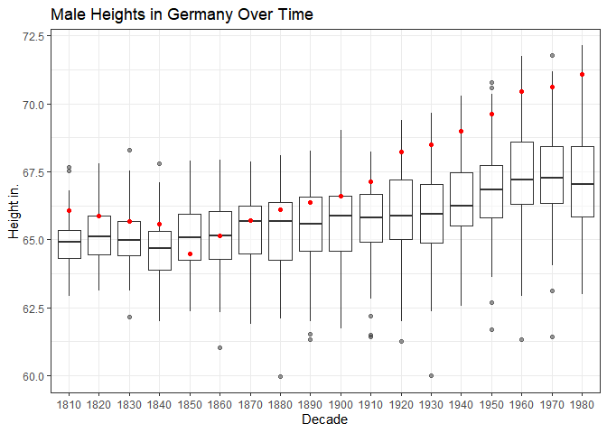
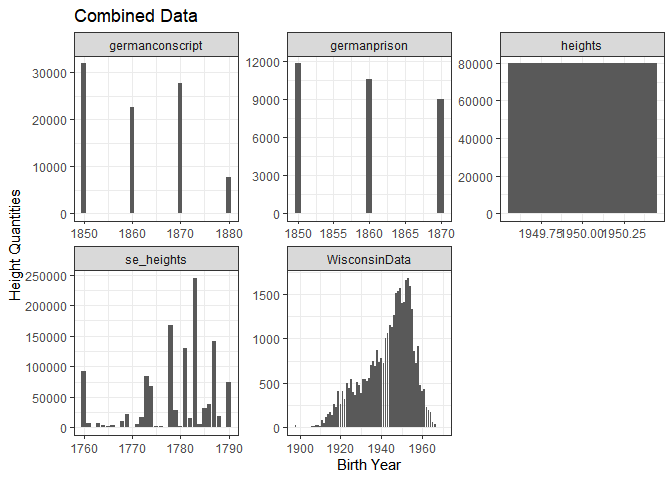

```r
library(tidyverse)
```

```
## ── Attaching packages ─────────────────────────────────────── tidyverse 1.3.2 ──
## ✔ ggplot2 3.3.6      ✔ purrr   0.3.4 
## ✔ tibble  3.1.8      ✔ dplyr   1.0.10
## ✔ tidyr   1.2.1      ✔ stringr 1.4.1 
## ✔ readr   2.1.3      ✔ forcats 0.5.2 
## ── Conflicts ────────────────────────────────────────── tidyverse_conflicts() ──
## ✖ dplyr::filter() masks stats::filter()
## ✖ dplyr::lag()    masks stats::lag()
```

```r
library(readr)
library(haven)
library(downloader)
library(foreign)
library(readxl)
```

Code chunks are unnamed to allow clean processing of visualizations into github.

```r
germanconscript <- read_dta(url("https://github.com/WJC-Data-Science/DTS350/blob/master/germanconscr.dta?raw=true"))

germanprison <- read_dta(url("https://github.com/WJC-Data-Science/DTS350/blob/master/germanprison.dta?raw=true"))

heights <- read_csv(url("https://raw.githubusercontent.com/hadley/r4ds/master/data/heights.csv"))
```

```
## Rows: 1192 Columns: 6
## ── Column specification ────────────────────────────────────────────────────────
## Delimiter: ","
## chr (2): sex, race
## dbl (4): earn, height, ed, age
## 
## ℹ Use `spec()` to retrieve the full column specification for this data.
## ℹ Specify the column types or set `show_col_types = FALSE` to quiet this message.
```

```r
heights2 <- tempfile()
download("https://github.com/WJC-Data-Science/DTS350/blob/master/Height.xlsx?raw=true", heights2, mode = "wb")
heights1 <- read_xlsx(heights2, skip = 2)

heights_se <- tempfile()
download("https://github.com/WJC-Data-Science/DTS350/raw/master/Heights_south-east/B6090.DBF?raw=true", heights_se, mode = "wb")
se_heights <- read.dbf(heights_se)
```


```r
wisconsin <- tempfile()
download("http://www.ssc.wisc.edu/nsfh/wave3/NSFH3%20Apr%202005%20release/main05022005.sav", wisconsin, mode = "wb")
WisconsinData <- read_sav(wisconsin)
```


```r
str(WisconsinData)
```

```
## tibble [7,277 × 2,317] (S3: tbl_df/tbl/data.frame)
##  $ CASE    : chr [1:7277] "00008" "00058" "00058" "00079" ...
##   ..- attr(*, "label")= chr "Case number- character"
##   ..- attr(*, "format.spss")= chr "A5"
##  $ TYPE    : chr [1:7277] "S" "R" "S" "S" ...
##   ..- attr(*, "label")= chr "Respondent type"
##   ..- attr(*, "format.spss")= chr "A1"
##  $ CASEID  : chr [1:7277] "00008S" "00058R" "00058S" "00079S" ...
##   ..- attr(*, "label")= chr "Case identification number"
##   ..- attr(*, "format.spss")= chr "A6"
##  $ CASENUM : num [1:7277] 8 58 58 79 82 120 120 133 146 146 ...
##   ..- attr(*, "label")= chr "Case number- numeric"
##   ..- attr(*, "format.spss")= chr "F5.0"
##  $ DOBM    : dbl+lbl [1:7277] 10,  2,  2, 11,  7, 10, 11, 10,  4,  4, 12, 11, 11, 1...
##    ..@ label      : chr "DATE OF BIRTH, MONTH"
##    ..@ format.spss: chr "F2.0"
##    ..@ labels     : Named num [1:14] -2 -1 1 2 3 4 5 6 7 8 ...
##    .. ..- attr(*, "names")= chr [1:14] "REFUSED" "DON'T KNOW" "JANUARY" "FEBRUARY" ...
##  $ DOBY    : dbl+lbl [1:7277] 15, 40, 40, 12, 61, 54, 54, 51, 52, 51, 49, 43, 45, 2...
##    ..@ label      : chr "DATE OF BIRTH, YEAR"
##    ..@ format.spss: chr "F2.0"
##    ..@ labels     : Named num [1:2] -2 -1
##    .. ..- attr(*, "names")= chr [1:2] "REFUSED" "DON'T KNOW"
##  $ RT1A1   : dbl+lbl [1:7277]  5,  3,  0,  7,  4, 14,  1, 18,  1,  0,  8,  1, 14,  ...
##    ..@ label      : chr "preparing meals, respondent"
##    ..@ format.spss: chr "F2.0"
##    ..@ labels     : Named num [1:3] -2 -1 0
##    .. ..- attr(*, "names")= chr [1:3] "REFUSED" "DON'T KNOW" "NONE"
##  $ RT1A2   : dbl+lbl [1:7277] NA,  0, NA, NA, NA,  0, 10,  0,  0, 20,  1, 20,  2,  ...
##    ..@ label      : chr "preparing meals, partner or spouse"
##    ..@ format.spss: chr "F2.0"
##    ..@ labels     : Named num [1:3] -2 -1 0
##    .. ..- attr(*, "names")= chr [1:3] "REFUSED" "DON'T KNOW" "NONE"
##  $ RT1A3   : dbl+lbl [1:7277] NA,  1, NA, NA,  1,  0,  2,  3, NA, NA, NA, NA, NA, N...
##    ..@ label      : chr "preparing meals, others in household"
##    ..@ format.spss: chr "F2.0"
##    ..@ labels     : Named num [1:3] -2 -1 0
##    .. ..- attr(*, "names")= chr [1:3] "REFUSED" "DON'T KNOW" "NONE"
##  $ RT1B1   : dbl+lbl [1:7277]  3,  2,  0,  0,  4,  7,  0, 18,  2,  0, 10, 10,  4,  ...
##    ..@ label      : chr "washing dishes, respondent"
##    ..@ format.spss: chr "F2.0"
##    ..@ labels     : Named num [1:3] -2 -1 0
##    .. ..- attr(*, "names")= chr [1:3] "REFUSED" "DON'T KNOW" "NONE"
##  $ RT1B2   : dbl+lbl [1:7277] NA,  1, NA, NA, NA,  0, 10,  2,  0, 20,  1, 20,  2,  ...
##    ..@ label      : chr "washing dishes, spouse or partner"
##    ..@ format.spss: chr "F2.0"
##    ..@ labels     : Named num [1:3] -2 -1 0
##    .. ..- attr(*, "names")= chr [1:3] "REFUSED" "DON'T KNOW" "NONE"
##  $ RT1B3   : dbl+lbl [1:7277] NA,  1, NA, NA,  2,  0,  0,  2, NA, NA, NA, NA, NA, N...
##    ..@ label      : chr "washing dishes, others in household"
##    ..@ format.spss: chr "F2.0"
##    ..@ labels     : Named num [1:3] -2 -1 0
##    .. ..- attr(*, "names")= chr [1:3] "REFUSED" "DON'T KNOW" "NONE"
##  $ RT1C1   : dbl+lbl [1:7277] 17,  4,  0,  0,  6, 21,  2, 18, 10,  0, 12,  1,  6,  ...
##    ..@ label      : chr "cleaning house, respondent"
##    ..@ format.spss: chr "F2.0"
##    ..@ labels     : Named num [1:3] -2 -1 0
##    .. ..- attr(*, "names")= chr [1:3] "REFUSED" "DON'T KNOW" "NONE"
##  $ RT1C2   : dbl+lbl [1:7277] NA,  0, NA, NA, NA,  0, 10,  0,  0, 22,  0, 20,  3, 1...
##    ..@ label      : chr "cleaning house, partner or spouse"
##    ..@ format.spss: chr "F2.0"
##    ..@ labels     : Named num [1:3] -2 -1 0
##    .. ..- attr(*, "names")= chr [1:3] "REFUSED" "DON'T KNOW" "NONE"
##  $ RT1C3   : dbl+lbl [1:7277] NA,  1, NA, NA,  2,  0,  0,  2, NA, NA, NA, NA, NA, N...
##    ..@ label      : chr "cleaning house, others in household"
##    ..@ format.spss: chr "F2.0"
##    ..@ labels     : Named num [1:3] -2 -1 0
##    .. ..- attr(*, "names")= chr [1:3] "REFUSED" "DON'T KNOW" "NONE"
##  $ RT1D1   : dbl+lbl [1:7277]  0,  2,  0,  0,  0,  7,  5,  2,  5, 25,  0,  0,  1,  ...
##    ..@ label      : chr "outdoor tasks, respondent"
##    ..@ format.spss: chr "F2.0"
##    ..@ labels     : Named num [1:3] -2 -1 0
##    .. ..- attr(*, "names")= chr [1:3] "REFUSED" "DON'T KNOW" "NONE"
##  $ RT1D2   : dbl+lbl [1:7277] NA,  1, NA, NA, NA,  7,  0,  7,  0,  5,  0, 20,  4,  ...
##    ..@ label      : chr "outdoor tasks, partner or spouse"
##    ..@ format.spss: chr "F2.0"
##    ..@ labels     : Named num [1:3] -2 -1 0
##    .. ..- attr(*, "names")= chr [1:3] "REFUSED" "DON'T KNOW" "NONE"
##  $ RT1D3   : dbl+lbl [1:7277] NA,  0, NA, NA,  0,  0,  0,  0, NA, NA, NA, NA, NA, N...
##    ..@ label      : chr "outdoor tasks, others in household"
##    ..@ format.spss: chr "F2.0"
##    ..@ labels     : Named num [1:3] -2 -1 0
##    .. ..- attr(*, "names")= chr [1:3] "REFUSED" "DON'T KNOW" "NONE"
##  $ RT1E1   : dbl+lbl [1:7277] 2, 1, 0, 0, 2, 1, 2, 2, 4, 2, 4, 0, 2, 4, 6, 4, 6, 2,...
##    ..@ label      : chr "shopping, respondent"
##    ..@ format.spss: chr "F2.0"
##    ..@ labels     : Named num [1:3] -2 -1 0
##    .. ..- attr(*, "names")= chr [1:3] "REFUSED" "DON'T KNOW" "NONE"
##  $ RT1E2   : dbl+lbl [1:7277] NA,  1, NA, NA, NA,  1,  2,  2,  2,  2,  1, 10,  2,  ...
##    ..@ label      : chr "shopping, partner or spouse"
##    ..@ format.spss: chr "F2.0"
##    ..@ labels     : Named num [1:3] -2 -1 0
##    .. ..- attr(*, "names")= chr [1:3] "REFUSED" "DON'T KNOW" "NONE"
##  $ RT1E3   : dbl+lbl [1:7277] NA,  0, NA, NA,  0,  0,  0,  2, NA, NA, NA, NA, NA, N...
##    ..@ label      : chr "shopping, others in household"
##    ..@ format.spss: chr "F2.0"
##    ..@ labels     : Named num [1:3] -2 -1 0
##    .. ..- attr(*, "names")= chr [1:3] "REFUSED" "DON'T KNOW" "NONE"
##  $ RT1F1   : dbl+lbl [1:7277]  2,  2,  1,  2,  2,  4,  0,  5, 12,  0,  7,  0,  7,  ...
##    ..@ label      : chr "washing and ironing, respondent"
##    ..@ format.spss: chr "F2.0"
##    ..@ labels     : Named num [1:3] -2 -1 0
##    .. ..- attr(*, "names")= chr [1:3] "REFUSED" "DON'T KNOW" "NONE"
##  $ RT1F2   : dbl+lbl [1:7277] NA,  1, NA, NA, NA,  0,  8,  0,  0,  8,  0,  1,  0,  ...
##    ..@ label      : chr "washing and ironing, partner or spouse"
##    ..@ format.spss: chr "F2.0"
##    ..@ labels     : Named num [1:3] -2 -1 0
##    .. ..- attr(*, "names")= chr [1:3] "REFUSED" "DON'T KNOW" "NONE"
##  $ RT1F3   : dbl+lbl [1:7277] NA,  2, NA, NA,  2,  0,  0,  0, NA, NA, NA, NA, NA, N...
##    ..@ label      : chr "washing and ironing, others in household"
##    ..@ format.spss: chr "F2.0"
##    ..@ labels     : Named num [1:3] -2 -1 0
##    .. ..- attr(*, "names")= chr [1:3] "REFUSED" "DON'T KNOW" "NONE"
##  $ RT1G1   : dbl+lbl [1:7277] 5, 1, 1, 1, 1, 2, 1, 2, 6, 1, 2, 0, 5, 3, 0, 1, 4, 1,...
##    ..@ label      : chr "paying bills, respondent"
##    ..@ format.spss: chr "F2.0"
##    ..@ labels     : Named num [1:3] -2 -1 0
##    .. ..- attr(*, "names")= chr [1:3] "REFUSED" "DON'T KNOW" "NONE"
##  $ RT1G2   : dbl+lbl [1:7277] NA,  1, NA, NA, NA,  2,  2,  2,  0,  3,  1,  5,  0,  ...
##    ..@ label      : chr "paying bills, partner or spouse"
##    ..@ format.spss: chr "F2.0"
##    ..@ labels     : Named num [1:3] -2 -1 0
##    .. ..- attr(*, "names")= chr [1:3] "REFUSED" "DON'T KNOW" "NONE"
##  $ RT1G3   : dbl+lbl [1:7277] NA,  0, NA, NA,  0,  0,  0,  2, NA, NA, NA, NA, NA, N...
##    ..@ label      : chr "paying bills, others in household"
##    ..@ format.spss: chr "F2.0"
##    ..@ labels     : Named num [1:3] -2 -1 0
##    .. ..- attr(*, "names")= chr [1:3] "REFUSED" "DON'T KNOW" "NONE"
##  $ RT1H1   : dbl+lbl [1:7277] 0, 0, 0, 0, 1, 0, 2, 0, 0, 0, 0, 0, 1, 1, 0, 0, 2, 0,...
##    ..@ label      : chr "auto maintenance, respondent"
##    ..@ format.spss: chr "F2.0"
##    ..@ labels     : Named num [1:3] -2 -1 0
##    .. ..- attr(*, "names")= chr [1:3] "REFUSED" "DON'T KNOW" "NONE"
##  $ RT1H2   : dbl+lbl [1:7277] NA,  0, NA, NA, NA,  3,  0,  0,  2,  0,  0,  0,  1,  ...
##    ..@ label      : chr "auto maintenance, partner or spouse"
##    ..@ format.spss: chr "F2.0"
##    ..@ labels     : Named num [1:3] -2 -1 0
##    .. ..- attr(*, "names")= chr [1:3] "REFUSED" "DON'T KNOW" "NONE"
##  $ RT1H3   : dbl+lbl [1:7277] NA,  0, NA, NA,  0,  0,  0,  0, NA, NA, NA, NA, NA, N...
##    ..@ label      : chr "auto maintenance, others in household"
##    ..@ format.spss: chr "F2.0"
##    ..@ labels     : Named num [1:3] -2 -1 0
##    .. ..- attr(*, "names")= chr [1:3] "REFUSED" "DON'T KNOW" "NONE"
##  $ RT1I1   : dbl+lbl [1:7277] 0, 0, 0, 0, 6, 0, 5, 0, 0, 0, 0, 0, 0, 7, 2, 2, 4, 0,...
##    ..@ label      : chr "driving, respondent"
##    ..@ format.spss: chr "F2.0"
##    ..@ labels     : Named num [1:3] -2 -1 0
##    .. ..- attr(*, "names")= chr [1:3] "REFUSED" "DON'T KNOW" "NONE"
##  $ RT1I2   : dbl+lbl [1:7277] NA,  0, NA, NA, NA,  0,  0,  0,  0,  4,  0,  2,  0,  ...
##    ..@ label      : chr "driving, partner or spouse"
##    ..@ format.spss: chr "F2.0"
##    ..@ labels     : Named num [1:3] -2 -1 0
##    .. ..- attr(*, "names")= chr [1:3] "REFUSED" "DON'T KNOW" "NONE"
##  $ RT1I3   : dbl+lbl [1:7277] NA,  0, NA, NA,  0,  0,  5,  0, NA, NA, NA, NA, NA, N...
##    ..@ label      : chr "driving, others in household"
##    ..@ format.spss: chr "F2.0"
##    ..@ labels     : Named num [1:3] -2 -1 0
##    .. ..- attr(*, "names")= chr [1:3] "REFUSED" "DON'T KNOW" "NONE"
##  $ RT204   : dbl+lbl [1:7277] 4, 3, 3, 4, 4, 4, 4, 3, 5, 3, 4, 1, 4, 3, 4, 2, 2, 5,...
##    ..@ label      : chr "health compared to others"
##    ..@ format.spss: chr "F2.0"
##    ..@ labels     : Named num [1:7] -2 -1 1 2 3 4 5
##    .. ..- attr(*, "names")= chr [1:7] "REFUSED" "DON'T KNOW" "VERY POOR" "POOR" ...
##  $ RE1     : dbl+lbl [1:7277] 1, 2, 1, 1, 2, 2, 2, 2, 1, 1, 2, 1, 2, 2, 2, 1, 1, 2,...
##    ..@ label      : chr "have long-term med probs"
##    ..@ format.spss: chr "F2.0"
##    ..@ labels     : Named num [1:4] -2 -1 1 2
##    .. ..- attr(*, "names")= chr [1:4] "REFUSED" "DON'T KNOW" "YES" "NO"
##  $ RE3     : num [1:7277] -6 NA -6 -6 NA NA NA NA -6 -6 ...
##   ..- attr(*, "label")= chr "most serious condition"
##   ..- attr(*, "format.spss")= chr "F3.0"
##  $ RE4     : num [1:7277] -4 NA -6 -6 NA NA NA NA -6 -4 ...
##   ..- attr(*, "label")= chr "next most serious condition"
##   ..- attr(*, "format.spss")= chr "F3.0"
##  $ RT205A  : dbl+lbl [1:7277]  1,  1,  1,  3,  1,  1,  1,  1,  1,  1,  1, -2,  1,  ...
##    ..@ label      : chr "phys/mental limits personal care"
##    ..@ format.spss: chr "F2.0"
##    ..@ labels     : Named num [1:5] -2 -1 1 2 3
##    .. ..- attr(*, "names")= chr [1:5] "REFUSED" "DON'T KNOW" "DO NOT LIMIT AT ALL" "LIMIT A LITTLE" ...
##  $ RT205B  : dbl+lbl [1:7277] 1, 1, 1, 2, 1, 1, 1, 1, 1, 1, 1, 3, 1, 1, 1, 1, 3, 1,...
##    ..@ label      : chr "phys/mental limits movement"
##    ..@ format.spss: chr "F2.0"
##    ..@ labels     : Named num [1:5] -2 -1 1 2 3
##    .. ..- attr(*, "names")= chr [1:5] "REFUSED" "DON'T KNOW" "DO NOT LIMIT AT ALL" "LIMIT A LITTLE" ...
##  $ RT205C  : dbl+lbl [1:7277]  1,  1,  1,  3,  1,  1,  1,  1,  2,  1,  1,  3,  1,  ...
##    ..@ label      : chr "phys/mental limits day to day tasks"
##    ..@ format.spss: chr "F2.0"
##    ..@ labels     : Named num [1:5] -2 -1 1 2 3
##    .. ..- attr(*, "names")= chr [1:5] "REFUSED" "DON'T KNOW" "DO NOT LIMIT AT ALL" "LIMIT A LITTLE" ...
##  $ RT205D  : dbl+lbl [1:7277] 1, 2, 1, 3, 1, 1, 1, 1, 2, 2, 1, 3, 1, 2, 1, 3, 3, 1,...
##    ..@ label      : chr "phys/mental limits climbing stairs"
##    ..@ format.spss: chr "F2.0"
##    ..@ labels     : Named num [1:5] -2 -1 1 2 3
##    .. ..- attr(*, "names")= chr [1:5] "REFUSED" "DON'T KNOW" "DO NOT LIMIT AT ALL" "LIMIT A LITTLE" ...
##  $ RT205E  : dbl+lbl [1:7277] 1, 2, 1, 3, 1, 1, 1, 1, 2, 2, 1, 3, 1, 2, 1, 2, 3, 1,...
##    ..@ label      : chr "phys/mental limits walk six blocks"
##    ..@ format.spss: chr "F2.0"
##    ..@ labels     : Named num [1:5] -2 -1 1 2 3
##    .. ..- attr(*, "names")= chr [1:5] "REFUSED" "DON'T KNOW" "DO NOT LIMIT AT ALL" "LIMIT A LITTLE" ...
##  $ RT205F  : dbl+lbl [1:7277] -1,  2,  1,  3,  1,  1,  1,  1,  2,  2,  1,  3,  1,  ...
##    ..@ label      : chr "phys/mental limits heavy work"
##    ..@ format.spss: chr "F2.0"
##    ..@ labels     : Named num [1:5] -2 -1 1 2 3
##    .. ..- attr(*, "names")= chr [1:5] "REFUSED" "DON'T KNOW" "DO NOT LIMIT AT ALL" "LIMIT A LITTLE" ...
##  $ RT205G  : num [1:7277] -4 1 1 3 1 1 1 1 -4 3 ...
##   ..- attr(*, "label")= chr "phys/mental limits work for pay"
##   ..- attr(*, "format.spss")= chr "F2.0"
##  $ RE5     : dbl+lbl [1:7277] NA,  2, NA, NA, NA,  2,  2,  1,  1,  1,  1,  2,  2,  ...
##    ..@ label      : chr "partner have disibility"
##    ..@ format.spss: chr "F2.0"
##    ..@ labels     : Named num [1:4] -2 -1 1 2
##    .. ..- attr(*, "names")= chr [1:4] "REFUSED" "DON'T KNOW" "YES" "NO"
##  $ RE6     : num [1:7277] NA NA NA NA NA NA NA -6 -6 -6 ...
##   ..- attr(*, "label")= chr "partners most serious condition"
##   ..- attr(*, "format.spss")= chr "F3.0"
##  $ RE7     : num [1:7277] NA NA NA NA NA NA NA -4 -6 -6 ...
##   ..- attr(*, "label")= chr "partners next most serious condition"
##   ..- attr(*, "format.spss")= chr "F3.0"
##  $ RE8     : dbl+lbl [1:7277] NA,  2, NA, NA,  2,  1,  1,  2, NA, NA, NA, NA, NA, N...
##    ..@ label      : chr "other members of hh have disability"
##    ..@ format.spss: chr "F2.0"
##    ..@ labels     : Named num [1:4] -2 -1 1 2
##    .. ..- attr(*, "names")= chr [1:4] "REFUSED" "DON'T KNOW" "YES" "NO"
##  $ RE10    : num [1:7277] NA NA NA NA NA -6 -6 NA NA NA ...
##   ..- attr(*, "label")= chr "what is most serious condition of other"
##   ..- attr(*, "format.spss")= chr "F3.0"
##  $ RE11    : num [1:7277] NA NA NA NA NA -4 -4 NA NA NA ...
##   ..- attr(*, "label")= chr "next most serious condition of other"
##   ..- attr(*, "format.spss")= chr "F3.0"
##  $ RE12    : dbl+lbl [1:7277] NA, NA, NA, NA, NA,  2,  2, NA, NA, NA, NA, NA, NA, N...
##    ..@ label      : chr "anyone else have condition"
##    ..@ format.spss: chr "F2.0"
##    ..@ labels     : Named num [1:4] -2 -1 1 2
##    .. ..- attr(*, "names")= chr [1:4] "REFUSED" "DON'T KNOW" "YES" "NO"
##  $ RE14    : num [1:7277] NA NA NA NA NA NA NA NA NA NA ...
##   ..- attr(*, "label")= chr "what is most serious condition of third"
##   ..- attr(*, "format.spss")= chr "F3.0"
##  $ RE15    : num [1:7277] NA NA NA NA NA NA NA NA NA NA ...
##   ..- attr(*, "label")= chr "next most serious condition of third"
##   ..- attr(*, "format.spss")= chr "F3.0"
##  $ RE16    : dbl+lbl [1:7277] NA,  2, NA, NA, NA, NA, NA, NA, NA, NA,  2, NA,  2,  ...
##    ..@ label      : chr "need help w/showering or bathing"
##    ..@ format.spss: chr "F2.0"
##    ..@ labels     : Named num [1:4] -2 -1 1 2
##    .. ..- attr(*, "names")= chr [1:4] "REFUSED" "DON'T KNOW" "YES" "NO"
##  $ RE19    : dbl+lbl [1:7277] NA,  2, NA, NA, NA, NA, NA, NA, NA, NA,  2, NA,  2,  ...
##    ..@ label      : chr "need help with dressing"
##    ..@ format.spss: chr "F2.0"
##    ..@ labels     : Named num [1:4] -2 -1 1 2
##    .. ..- attr(*, "names")= chr [1:4] "REFUSED" "DON'T KNOW" "YES" "NO"
##  $ RE22    : dbl+lbl [1:7277] NA,  2, NA, NA, NA, NA, NA, NA, NA, NA,  2, NA,  2,  ...
##    ..@ label      : chr "need help with eating"
##    ..@ format.spss: chr "F2.0"
##    ..@ labels     : Named num [1:4] -2 -1 1 2
##    .. ..- attr(*, "names")= chr [1:4] "REFUSED" "DON'T KNOW" "YES" "NO"
##  $ RE25    : dbl+lbl [1:7277] NA,  2, NA, NA, NA, NA, NA, NA, NA, NA,  2, NA,  2,  ...
##    ..@ label      : chr "need help with getting out of bed/chair"
##    ..@ format.spss: chr "F2.0"
##    ..@ labels     : Named num [1:4] -2 -1 1 2
##    .. ..- attr(*, "names")= chr [1:4] "REFUSED" "DON'T KNOW" "YES" "NO"
##  $ RE28    : dbl+lbl [1:7277] NA,  2, NA, NA, NA, NA, NA, NA, NA, NA,  2, NA,  2,  ...
##    ..@ label      : chr "need help using toilet"
##    ..@ format.spss: chr "F2.0"
##    ..@ labels     : Named num [1:4] -2 -1 1 2
##    .. ..- attr(*, "names")= chr [1:4] "REFUSED" "DON'T KNOW" "YES" "NO"
##  $ RE31    : dbl+lbl [1:7277] 2, 2, 2, 2, 2, 2, 1, 2, 2, 2, 2, 2, 2, 2, 2, 2, 1, 2,...
##    ..@ label      : chr "r given help to non coresident"
##    ..@ format.spss: chr "F2.0"
##    ..@ labels     : Named num [1:4] -2 -1 1 2
##    .. ..- attr(*, "names")= chr [1:4] "REFUSED" "DON'T KNOW" "YES" "NO"
##  $ RE32    : num [1:7277] NA NA NA NA NA NA 7 NA NA NA ...
##   ..- attr(*, "label")= chr "who r provided most help to"
##   ..- attr(*, "format.spss")= chr "F2.0"
##  $ RE35    : dbl+lbl [1:7277] NA, NA, NA, NA, NA, NA, NA, NA, NA, NA, NA, NA, NA, N...
##    ..@ label      : chr "male or female"
##    ..@ format.spss: chr "F2.0"
##    ..@ labels     : Named num [1:4] -2 -1 1 2
##    .. ..- attr(*, "names")= chr [1:4] "REFUSED" "DON'T KNOW" "MALE" "FEMALE"
##  $ RE36    : chr [1:7277] "" "" "" "" ...
##   ..- attr(*, "label")= chr "condition causing need for help"
##   ..- attr(*, "format.spss")= chr "A3"
##  $ RE37    : dbl+lbl [1:7277] NA, NA, NA, NA, NA, NA,  4, NA, NA, NA, NA, NA, NA, N...
##    ..@ label      : chr "weeks in last yr helped"
##    ..@ format.spss: chr "F2.0"
##    ..@ labels     : Named num [1:2] -2 -1
##    .. ..- attr(*, "names")= chr [1:2] "REFUSED" "DON'T KNOW"
##  $ RE38    : dbl+lbl [1:7277] NA, NA, NA, NA, NA, NA,  8, NA, NA, NA, NA, NA, NA, N...
##    ..@ label      : chr "hours per week helped"
##    ..@ format.spss: chr "F2.0"
##    ..@ labels     : Named num [1:4] -2 -1 0 75
##    .. ..- attr(*, "names")= chr [1:4] "REFUSED" "DON'T KNOW" "LESS THAN ONE HOUR" "75 OR MORE"
##  $ RE39    : dbl+lbl [1:7277] NA, NA, NA, NA, NA, NA,  2, NA, NA, NA, NA, NA, NA, N...
##    ..@ label      : chr "help last 30 days"
##    ..@ format.spss: chr "F2.0"
##    ..@ labels     : Named num [1:4] -2 -1 1 2
##    .. ..- attr(*, "names")= chr [1:4] "REFUSED" "DON'T KNOW" "YES" "NO"
##  $ RE40    : dbl+lbl [1:7277]  2,  2,  2,  1,  2,  2,  2,  2,  1,  2,  2,  2,  2,  ...
##    ..@ label      : chr "r received help from non coresident"
##    ..@ format.spss: chr "F2.0"
##    ..@ labels     : Named num [1:4] -2 -1 1 2
##    .. ..- attr(*, "names")= chr [1:4] "REFUSED" "DON'T KNOW" "YES" "NO"
##  $ RE41    : num [1:7277] NA NA NA -6 NA NA NA NA 2 NA ...
##   ..- attr(*, "label")= chr "who helped r"
##   ..- attr(*, "format.spss")= chr "F2.0"
##  $ RE44    : dbl+lbl [1:7277] NA, NA, NA,  9, NA, NA, NA, NA, NA, NA, NA, NA, NA, N...
##    ..@ label      : chr "male or female"
##    ..@ format.spss: chr "F2.0"
##    ..@ labels     : Named num [1:5] -2 -1 1 2 9
##    .. ..- attr(*, "names")= chr [1:5] "REFUSED" "DON'T KNOW" "MALE" "FEMALE" ...
##  $ RE45    : dbl+lbl [1:7277] NA, NA, NA, 52, NA, NA, NA, NA,  2, NA, NA, NA, NA, N...
##    ..@ label      : chr "weeks received help last yr"
##    ..@ format.spss: chr "F2.0"
##    ..@ labels     : Named num [1:2] -2 -1
##    .. ..- attr(*, "names")= chr [1:2] "REFUSED" "DON'T KNOW"
##  $ RE46    : dbl+lbl [1:7277] NA, NA, NA, -1, NA, NA, NA, NA,  1, NA, NA, NA, NA, N...
##    ..@ label      : chr "hours per week received help"
##    ..@ format.spss: chr "F2.0"
##    ..@ labels     : Named num [1:4] -2 -1 0 75
##    .. ..- attr(*, "names")= chr [1:4] "REFUSED" "DON'T KNOW" "LESS THAN ONE HOUR PER WEEK" "75 OR MORE"
##  $ RE47    : dbl+lbl [1:7277] NA, NA, NA, NA, NA, NA, NA, NA,  2, NA, NA, NA, NA, N...
##    ..@ label      : chr "received help last 30 days"
##    ..@ format.spss: chr "F2.0"
##    ..@ labels     : Named num [1:4] -2 -1 1 2
##    .. ..- attr(*, "names")= chr [1:4] "REFUSED" "DON'T KNOW" "YES" "NO"
##  $ RE48    : dbl+lbl [1:7277] 2, 2, 2, 2, 2, 2, 2, 2, 2, 2, 1, 2, 2, 2, 2, 2, 2, 2,...
##    ..@ label      : chr "helped coresident last yr"
##    ..@ format.spss: chr "F2.0"
##    ..@ labels     : Named num [1:4] -2 -1 1 2
##    .. ..- attr(*, "names")= chr [1:4] "REFUSED" "DON'T KNOW" "YES" "NO"
##  $ RE51    : dbl+lbl [1:7277] NA, NA, NA, NA, NA, NA, NA, NA, NA, NA, 16, NA, NA, N...
##    ..@ label      : chr "weeks helped last yr"
##    ..@ format.spss: chr "F2.0"
##    ..@ labels     : Named num [1:3] -2 -1 0
##    .. ..- attr(*, "names")= chr [1:3] "REFUSED" "DON'T KNOW" "LESS THAN ONE WEEK"
##  $ RE50    : dbl+lbl [1:7277]  1,  1,  2,  1,  2,  2, NA,  2,  2,  2, NA,  2,  2,  ...
##    ..@ label      : chr "ever given care for month or more"
##    ..@ format.spss: chr "F2.0"
##    ..@ labels     : Named num [1:4] -2 -1 1 2
##    .. ..- attr(*, "names")= chr [1:4] "REFUSED" "DON'T KNOW" "YES" "NO"
##  $ RE52    : dbl+lbl [1:7277] 2, 2, 2, 2, 2, 2, 2, 2, 2, 2, 2, 1, 2, 2, 2, 2, 2, 2,...
##    ..@ label      : chr "receive help from coresident last yr"
##    ..@ format.spss: chr "F2.0"
##    ..@ labels     : Named num [1:4] -2 -1 1 2
##    .. ..- attr(*, "names")= chr [1:4] "REFUSED" "DON'T KNOW" "YES" "NO"
##  $ RE55    : dbl+lbl [1:7277] NA, NA, NA, NA, NA, NA, NA, NA, NA, NA, NA, 52, NA, N...
##    ..@ label      : chr "weeks r received help last yr"
##    ..@ format.spss: chr "F2.0"
##    ..@ labels     : Named num [1:3] -2 -1 0
##    .. ..- attr(*, "names")= chr [1:3] "REFUSED" "DON'T KNOW" "LESS THAN ONE WEEK"
##  $ RF1     : dbl+lbl [1:7277] 2, 2, 1, 2, 2, 1, 1, 2, 2, 1, 1, 1, 1, 2, 2, 2, 2, 1,...
##    ..@ label      : chr "mother alive"
##    ..@ format.spss: chr "F2.0"
##    ..@ labels     : Named num [1:4] -2 -1 1 2
##    .. ..- attr(*, "names")= chr [1:4] "REFUSED" "DON'T KNOW" "YES" "NO"
##  $ RF2     : dbl+lbl [1:7277] NA, NA, 87, NA, NA, 65, 67, NA, NA, 72, 70, 79, 80, N...
##    ..@ label      : chr "how old is mother"
##    ..@ format.spss: chr "F2.0"
##    ..@ labels     : Named num [1:3] -2 -1 99
##    .. ..- attr(*, "names")= chr [1:3] "REFUSED" "DON'T KNOW" "AGE 99 OR OLDER"
##  $ RF3     : dbl+lbl [1:7277] 1958, 1991,   NA, 1968, 1999,   NA,   NA, 1975, 1978,...
##    ..@ label      : chr "yr mother died"
##    ..@ format.spss: chr "F4.0"
##    ..@ labels     : Named num [1:2] -2 -1
##    .. ..- attr(*, "names")= chr [1:2] "REFUSED" "DON'T KNOW"
##  $ RF4     : dbl+lbl [1:7277] 2, 2, 2, 2, 1, 1, 1, 2, 2, 2, 1, 2, 2, 2, 2, 2, 2, 1,...
##    ..@ label      : chr "father alive"
##    ..@ format.spss: chr "F2.0"
##    ..@ labels     : Named num [1:4] -2 -1 1 2
##    .. ..- attr(*, "names")= chr [1:4] "REFUSED" "DON'T KNOW" "YES" "NO"
##  $ RF5     : dbl+lbl [1:7277] NA, NA, NA, NA, 68, 75, 72, NA, NA, NA, 70, NA, NA, N...
##    ..@ label      : chr "how old is father"
##    ..@ format.spss: chr "F2.0"
##    ..@ labels     : Named num [1:3] -2 -1 99
##    .. ..- attr(*, "names")= chr [1:3] "REFUSED" "DON'T KNOW" "AGE 99 OR OLDER"
##  $ RF6     : dbl+lbl [1:7277] 1957,   NA,   NA,   NA,   NA,   NA,   NA,   NA,   NA,...
##    ..@ label      : chr "yr father died"
##    ..@ format.spss: chr "F4.0"
##    ..@ labels     : Named num [1:2] -2 -1
##    .. ..- attr(*, "names")= chr [1:2] "REFUSED" "DON'T KNOW"
##  $ RF7     : dbl+lbl [1:7277] 2, 1, 1, 2, 2, 2, 2, 2, 2, 1, 2, 2, 2, 2, 2, 2, 2, 2,...
##    ..@ label      : chr "ever live w/ step-parent"
##    ..@ format.spss: chr "F2.0"
##    ..@ labels     : Named num [1:4] -2 -1 1 2
##    .. ..- attr(*, "names")= chr [1:4] "REFUSED" "DON'T KNOW" "YES" "NO"
##  $ RF8     : dbl+lbl [1:7277] NA,  1,  1, NA, NA, NA, NA, NA, NA,  2, NA, NA, NA, N...
##    ..@ label      : chr "step father or mother"
##    ..@ format.spss: chr "F2.0"
##    ..@ labels     : Named num [1:4] -2 -1 1 2
##    .. ..- attr(*, "names")= chr [1:4] "REFUSED" "DON'T KNOW" "STEP-FATHER" "STEP-MOTHER"
##  $ RF9     : dbl+lbl [1:7277] NA,  2,  2, NA, NA, NA, NA, NA, NA,  2, NA, NA, NA, N...
##    ..@ label      : chr "step father/mother still living"
##    ..@ format.spss: chr "F2.0"
##    ..@ labels     : Named num [1:4] -2 -1 1 2
##    .. ..- attr(*, "names")= chr [1:4] "REFUSED" "DON'T KNOW" "YES" "NO"
##  $ RF10    : dbl+lbl [1:7277] NA, NA, NA, NA, NA, NA, NA, NA, NA, NA, NA, NA, NA, N...
##    ..@ label      : chr "step still married to bio parent"
##    ..@ format.spss: chr "F2.0"
##    ..@ labels     : Named num [1:4] -2 -1 1 2
##    .. ..- attr(*, "names")= chr [1:4] "REFUSED" "DON'T KNOW" "YES" "NO"
##  $ RF11    : dbl+lbl [1:7277] NA,  2, NA, NA, NA,  1,  2,  2,  1,  2,  1,  1,  2,  ...
##    ..@ label      : chr "spouse mother still living"
##    ..@ format.spss: chr "F2.0"
##    ..@ labels     : Named num [1:4] -2 -1 1 2
##    .. ..- attr(*, "names")= chr [1:4] "REFUSED" "DON'T KNOW" "YES" "NO"
##  $ RF12    : dbl+lbl [1:7277]   NA, 1996,   NA,   NA,   NA,   NA, 1954, 1962,   NA,...
##    ..@ label      : chr "yr spouse mother died"
##    ..@ format.spss: chr "F4.0"
##    ..@ labels     : Named num [1:2] -2 -1
##    .. ..- attr(*, "names")= chr [1:2] "REFUSED" "DON'T KNOW"
##  $ RF13    : dbl+lbl [1:7277] NA, NA, NA, NA, NA, 66, NA, NA, 72, NA, 79, 62, NA, N...
##    ..@ label      : chr "how old is spouse mother"
##    ..@ format.spss: chr "F2.0"
##    ..@ labels     : Named num [1:3] -2 -1 99
##    .. ..- attr(*, "names")= chr [1:3] "REFUSED" "DON'T KNOW" "AGE 99 OR OLDER"
##  $ RF14    : dbl+lbl [1:7277] NA,  2, NA, NA, NA,  1,  1,  2,  2,  2,  2,  1,  2,  ...
##    ..@ label      : chr "spouse father still living"
##    ..@ format.spss: chr "F2.0"
##    ..@ labels     : Named num [1:4] -2 -1 1 2
##    .. ..- attr(*, "names")= chr [1:4] "REFUSED" "DON'T KNOW" "YES" "NO"
##  $ RF15    : dbl+lbl [1:7277]   NA, 1976,   NA,   NA,   NA,   NA,   NA, 1997, 1982,...
##    ..@ label      : chr "yr spouse father died"
##    ..@ format.spss: chr "F4.0"
##    ..@ labels     : Named num [1:2] -2 -1
##    .. ..- attr(*, "names")= chr [1:2] "REFUSED" "DON'T KNOW"
##  $ RF16    : dbl+lbl [1:7277] NA, NA, NA, NA, NA, 70, 76, NA, NA, NA, NA, 71, NA, N...
##    ..@ label      : chr "how old spouse father"
##    ..@ format.spss: chr "F2.0"
##    ..@ labels     : Named num [1:3] -2 -1 99
##    .. ..- attr(*, "names")= chr [1:3] "REFUSED" "DON'T KNOW" "AGE 99 OR OLDER"
##  $ RF17    : dbl+lbl [1:7277] NA, NA,  1, NA, NA,  3,  2, NA, NA,  3,  3,  1,  3, N...
##    ..@ label      : chr "how is mothers health"
##    ..@ format.spss: chr "F2.0"
##    ..@ labels     : Named num [1:7] -2 -1 1 2 3 4 5
##    .. ..- attr(*, "names")= chr [1:7] "REFUSED" "DON'T KNOW" "VERY POOR" "POOR" ...
##  $ RF18    : dbl+lbl [1:7277] NA, NA, 10, NA, NA, 10,  8, NA, NA,  9, 10, 10,  5, N...
##    ..@ label      : chr "rs relationship w/ mother 0 to 10 scale"
##    ..@ format.spss: chr "F2.0"
##    ..@ labels     : Named num [1:5] -6 -2 -1 0 10
##    .. ..- attr(*, "names")= chr [1:5] "OTHER  (ENTER RESPONSE FOLLOWED BY //)" "REFUSED" "DON'T KNOW" "REALLY BAD" ...
##  $ RF19    : dbl+lbl [1:7277] NA, NA, NA, NA, NA,  1,  1, NA, NA, NA,  1, NA, NA, N...
##    ..@ label      : chr "mother and father currently married"
##    ..@ format.spss: chr "F2.0"
##    ..@ labels     : Named num [1:4] -2 -1 1 2
##    .. ..- attr(*, "names")= chr [1:4] "REFUSED" "DON'T KNOW" "YES" "NO"
##  $ RF20    : dbl+lbl [1:7277] NA, NA,  4, NA, NA, NA, NA, NA, NA,  4, NA,  3,  4, N...
##    ..@ label      : chr "mothers current marital status"
##    ..@ format.spss: chr "F2.0"
##    ..@ labels     : Named num [1:7] -2 -1 1 2 3 4 5
##    .. ..- attr(*, "names")= chr [1:7] "REFUSED" "DON'T KNOW" "MARRIED" "SEPARATED BECAUSE OF MARITAL PROBLEMS" ...
##  $ RF21    : dbl+lbl [1:7277] NA, NA, NA, NA, NA, NA, NA, NA, NA, NA, NA, NA, NA, N...
##    ..@ label      : chr "what yr mother married to current spouse"
##    ..@ format.spss: chr "F4.0"
##    ..@ labels     : Named num [1:2] -2 -1
##    .. ..- attr(*, "names")= chr [1:2] "REFUSED" "DON'T KNOW"
##  $ RF22    : dbl+lbl [1:7277] NA, NA, NA, NA, NA, NA, NA, NA, NA, NA, NA, NA, NA, N...
##    ..@ label      : chr "r relationship w/ mothers spouse 0-10"
##    ..@ format.spss: chr "F2.0"
##    ..@ labels     : Named num [1:6] -6 -4 -2 -1 0 10
##    .. ..- attr(*, "names")= chr [1:6] "OTHER  (ENTER RESPONSE FOLLOWED BY //)" "R HAS NO RELATIONSHIP/CONTACT WITH MOTHER'S HUSBAND" "REFUSED" "DON'T KNOW" ...
##  $ RF23    : dbl+lbl [1:7277] NA, NA,  1, NA, NA,  1,  1, NA, NA,  1,  1,  1,  1, N...
##    ..@ label      : chr "where parents/mother live"
##    ..@ format.spss: chr "F2.0"
##    ..@ labels     : Named num [1:7] -6 -4 -2 -1 1 3 4
##    .. ..- attr(*, "names")= chr [1:7] "SOMEWHERE ELSE  (ENTER RESPONSE FOLLOWED BY //)" "PARENTS DO NOT LIVE TOGETHER - E.G., ONE IN NURSING HOME" "REFUSED" "DON'T KNOW" ...
##   [list output truncated]
```


```r
heights_tidy <- heights1 %>%
  pivot_longer(3:203, names_to = "years", values_to = "heights.cm", values_drop_na = TRUE) %>%
  mutate(year_decade = years, height.in = heights.cm / 2.54) %>%
  separate(years, into = c("century", "decade"), sep = -2) %>%
  separate(decade, into = c("decade", "year"), sep = -1)

write.csv(heights_tidy, "heights_tidy.csv", row.names = TRUE)
```


```r
German_Conscript <- germanconscript %>%
  mutate(birth_year = bdec,
         height.cm = height,
         height.in = height.cm / 2.54,
         study_id = 'germanconscript') %>%
  select(birth_year, height.cm, height.in, study_id)

German_Prison <- germanprison %>%
  mutate(birth_year = bdec,
         height.cm = height,
         height.in = height.cm / 2.54,
         study_id = 'germanprison') %>%
  select(birth_year, height.cm, height.in, study_id)

heights_data <- heights %>%
  mutate(birth_year = 1950,
         height.cm = height * 2.54,
         height.in = height,
         study_id = 'heights') %>%
  select(birth_year, height.cm, height.in, study_id)

SouthEast_heights_data <- se_heights %>%
  mutate(birth_year = SJ,
         height.cm = CMETER,
         height.in = CMETER / 2.54,
         study_id = 'se_heights') %>%
  select(birth_year, height.cm, height.in, study_id)

Wisconsin_Tidy <- WisconsinData %>%
  mutate(birth_year = as.numeric(DOBY) + 1900,
         height.cm = RT216I * 2.54,
         height.in = RT216I,
         study_id = 'WisconsinData') %>%
  select(birth_year, height.cm, height.in, study_id)
```


```r
head(WisconsinData)
```

```
## # A tibble: 6 × 2,317
##   CASE  TYPE  CASEID CASENUM DOBM       DOBY  RT1A1    RT1A2    RT1A3    RT1B1  
##   <chr> <chr> <chr>    <dbl> <dbl+lbl>  <dbl> <dbl+lb> <dbl+lb> <dbl+lb> <dbl+l>
## 1 00008 S     00008S       8 10 [OCTOB… 15     5       NA       NA       3      
## 2 00058 R     00058R      58  2 [FEBRU… 40     3        0 [NON…  1       2      
## 3 00058 S     00058S      58  2 [FEBRU… 40     0 [NON… NA       NA       0 [NON…
## 4 00079 S     00079S      79 11 [NOVEM… 12     7       NA       NA       0 [NON…
## 5 00082 S     00082S      82  7 [JULY]  61     4       NA        1       4      
## 6 00120 R     00120R     120 10 [OCTOB… 54    14        0 [NON…  0 [NON… 7      
## # … with 2,307 more variables: RT1B2 <dbl+lbl>, RT1B3 <dbl+lbl>,
## #   RT1C1 <dbl+lbl>, RT1C2 <dbl+lbl>, RT1C3 <dbl+lbl>, RT1D1 <dbl+lbl>,
## #   RT1D2 <dbl+lbl>, RT1D3 <dbl+lbl>, RT1E1 <dbl+lbl>, RT1E2 <dbl+lbl>,
## #   RT1E3 <dbl+lbl>, RT1F1 <dbl+lbl>, RT1F2 <dbl+lbl>, RT1F3 <dbl+lbl>,
## #   RT1G1 <dbl+lbl>, RT1G2 <dbl+lbl>, RT1G3 <dbl+lbl>, RT1H1 <dbl+lbl>,
## #   RT1H2 <dbl+lbl>, RT1H3 <dbl+lbl>, RT1I1 <dbl+lbl>, RT1I2 <dbl+lbl>,
## #   RT1I3 <dbl+lbl>, RT204 <dbl+lbl>, RE1 <dbl+lbl>, RE3 <dbl>, RE4 <dbl>, …
```


```r
combine <- bind_rows(German_Conscript,German_Prison,heights_data,SouthEast_heights_data,Wisconsin_Tidy)

write.csv(combine, "Combined.csv", row.names = TRUE)
```


```r
germany_filter <- heights_tidy %>%
  filter(`Continent, Region, Country` == 'Germany')
```


```r
ggplot(data = heights_tidy, aes(x = year_decade, y = height.in)) +
  geom_boxplot(alpha = 0.5) +
  geom_point(data = germany_filter, color = "red") +
  theme_bw() +
  labs(x = "Decade",
       y = "Height in.",
       title = "Male Heights in Germany Over Time")
```

<!-- -->

It is easy to see that average height is undoubtedly increasio=ng over time, as evidenced by a clear trend among the same exact sampled demographic each decade (males in Germany). The hypothesis of The Scientific American that argues that humans have been getting taller over the years seems both logical and correct.


```r
ggplot(combine, aes(x = birth_year, y = height.in)) +
  geom_col() +
  facet_wrap(~ study_id, scales = 'free') +
  theme_bw() +
  labs(x = "Birth Year",
       y = "Height Quantities",
       title="Combined Data")
```

```
## Warning: Removed 21 rows containing missing values (position_stack).
```

<!-- -->

