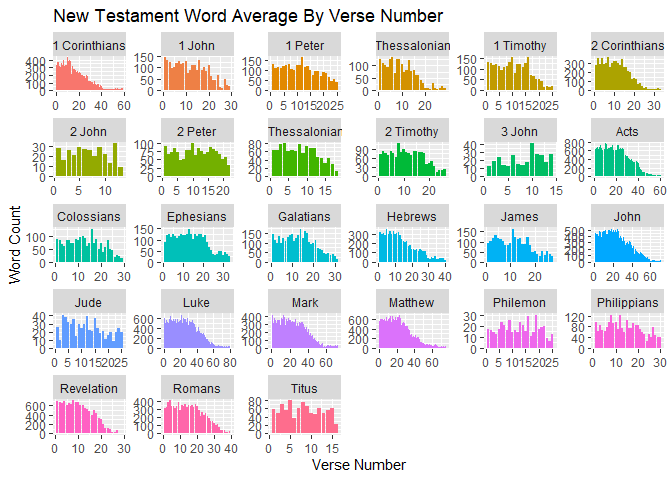

#loading in the packages

```r
library(tidyverse)
```

```
## ── Attaching packages ─────────────────────────────────────── tidyverse 1.3.2 ──
## ✔ ggplot2 3.3.6      ✔ purrr   0.3.4 
## ✔ tibble  3.1.8      ✔ dplyr   1.0.10
## ✔ tidyr   1.2.1      ✔ stringr 1.4.1 
## ✔ readr   2.1.3      ✔ forcats 0.5.2 
## ── Conflicts ────────────────────────────────────────── tidyverse_conflicts() ──
## ✖ dplyr::filter() masks stats::filter()
## ✖ dplyr::lag()    masks stats::lag()
```

```r
library(knitr)
library(downloader)
library(dplyr)
library(lubridate)
```

```
## 
## Attaching package: 'lubridate'
## 
## The following objects are masked from 'package:base':
## 
##     date, intersect, setdiff, union
```

```r
library(ggplot2)
library(grid)
library(corrplot)
```

```
## corrplot 0.92 loaded
```

```r
library(readr) 
library(haven)
library(readxl)
library(stringi)
library(stringr)
```

#Creating a temp file for the bible data

```r
bibledata <- tempfile()
download.file("https://github.com/WJC-Data-Science/DTS350/raw/master/bible.csv",bibledata, mode="wb")
bibledata
```

```
## [1] "C:\\Users\\karis\\AppData\\Local\\Temp\\Rtmp0uy0YK\\file342cbd25bc8"
```

```r
bible <- read_csv(bibledata)
```

```
## Rows: 31102 Columns: 17
## ── Column specification ────────────────────────────────────────────────────────
## Delimiter: ","
## chr (9): volume_title, book_title, volume_long_title, book_long_title, volum...
## dbl (6): volume_id, book_id, chapter_id, verse_id, chapter_number, verse_number
## lgl (2): volume_subtitle, book_subtitle
## 
## ℹ Use `spec()` to retrieve the full column specification for this data.
## ℹ Specify the column types or set `show_col_types = FALSE` to quiet this message.
```

```r
head(bible)
```

```
## # A tibble: 6 × 17
##   volume_id book_id chapter_id verse_id volume…¹ book_…² volum…³ book_…⁴ volum…⁵
##       <dbl>   <dbl>      <dbl>    <dbl> <chr>    <chr>   <chr>   <chr>   <lgl>  
## 1         1       1          1        1 Old Tes… Genesis The Ol… The Fi… NA     
## 2         1       1          1        2 Old Tes… Genesis The Ol… The Fi… NA     
## 3         1       1          1        3 Old Tes… Genesis The Ol… The Fi… NA     
## 4         1       1          1        4 Old Tes… Genesis The Ol… The Fi… NA     
## 5         1       1          1        5 Old Tes… Genesis The Ol… The Fi… NA     
## 6         1       1          1        6 Old Tes… Genesis The Ol… The Fi… NA     
## # … with 8 more variables: book_subtitle <lgl>, volume_short_title <chr>,
## #   book_short_title <chr>, chapter_number <dbl>, verse_number <dbl>,
## #   scripture_text <chr>, verse_title <chr>, verse_short_title <chr>, and
## #   abbreviated variable names ¹​volume_title, ²​book_title, ³​volume_long_title,
## #   ⁴​book_long_title, ⁵​volume_subtitle
```

#Creating a word counter function

```r
wordcount <- bible %>%
  mutate(word_count =
           sapply(bible$scripture_text, function(x) length(unlist(strsplit(as.character(x), "\\W+"))))
  )
```

#Finding the Old Testament average

```r
OldTest <- wordcount %>%
  subset(volume_id == 1)
mean(OldTest$word_count)
```

```
## [1] 26.42208
```

#Finding the New Testament average

```r
NewTest <- wordcount %>%
  subset(volume_id == 2)
mean(NewTest$word_count)
```

```
## [1] 22.71019
```

#Frequency of the word LORD 

```r
str_count(OldTest, "(?i)lord")
```

```
## Warning in stri_count_regex(string, pattern, opts_regex = opts(pattern)):
## argument is not an atomic vector; coercing
```

```
##  [1]    0    0    0    0    0    0    0    0    0    0    0    0    0    0 7273
## [16]    0    0 7273
```

```r
str_count(NewTest, "(?i)lord")
```

```
## Warning in stri_count_regex(string, pattern, opts_regex = opts(pattern)):
## argument is not an atomic vector; coercing
```

```
##  [1]   0   0   0   0   0   0   0   0   0   0   0   0   0   0 736   0   0 736
```

#Visualization for Question 3

```r
ggplot(data = NewTest, aes(x = verse_number, y = word_count, fill = book_title)) +
  geom_col() +
  facet_wrap(~book_title, scales = 'free') +
  theme(legend.position = "none") +
  labs(x = "Verse Number",
       y = "Word Count",
       title = "New Testament Word Average By Verse Number")
```

<!-- -->

Outlined in the code above arfe my findings, answering the 3 central questions of this task. First, on the issue of average verse length in number of words, the Old Testament had an average verse legth of 26.42 words. Contrarily, the New Testament had an average verse length of 22.71 words. While slightly different, the change is not too drastic to draw any conclusions in my opinion. On the issue of how often the word LORD (case insensitive) is used in the Old and New TEstaments respectively, the word appeared 7273 times in the Old Book while it appeared only 736 times in the New Book. This difference is drastic, and could possibly be attributed to the fact that the early books of the bible seek to establish God and his character and thus speak more about God as the Lord than the New Testament, in which most books speak on the life and work of Jesus with God the Lord already established. Finally, on the issue of word count distribution by verse for each book in the New Testament, one can see that early verses in these books typicall have a higher average word count. This may be a stylistic preference of the Bible's authors, or it may be because early verses are in fact more detailed and in-depth. I am not entirely sure of the reasoning.
