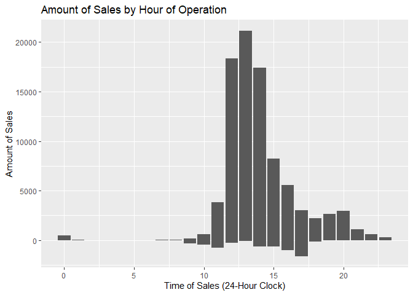

```r
library(tidyverse)
```

```
## ── Attaching packages ─────────────────────────────────────── tidyverse 1.3.2 ──
## ✔ ggplot2 3.3.6      ✔ purrr   0.3.4 
## ✔ tibble  3.1.8      ✔ dplyr   1.0.10
## ✔ tidyr   1.2.1      ✔ stringr 1.4.1 
## ✔ readr   2.1.3      ✔ forcats 0.5.2 
## ── Conflicts ────────────────────────────────────────── tidyverse_conflicts() ──
## ✖ dplyr::filter() masks stats::filter()
## ✖ dplyr::lag()    masks stats::lag()
```

```r
library(knitr)
library(lubridate)
```

```
## 
## Attaching package: 'lubridate'
## 
## The following objects are masked from 'package:base':
## 
##     date, intersect, setdiff, union
```

```r
library(readr)
library(haven)
library(downloader)
library(foreign)
library(readxl)
library(corrplot)
```

```
## corrplot 0.92 loaded
```

```r
library(stringr)
```


```r
temp1 <- tempfile()
download("https://github.com/WJC-Data-Science/DTS350/raw/master/sales.csv", temp1, mode = "wb")
sales <- read_csv(temp1)
```

```
## Rows: 15656 Columns: 4
## ── Column specification ────────────────────────────────────────────────────────
## Delimiter: ","
## chr  (2): Name, Type
## dbl  (1): Amount
## dttm (1): Time
## 
## ℹ Use `spec()` to retrieve the full column specification for this data.
## ℹ Specify the column types or set `show_col_types = FALSE` to quiet this message.
```


```r
head(sales)
```

```
## # A tibble: 6 × 4
##   Name       Type           Time                Amount
##   <chr>      <chr>          <dttm>               <dbl>
## 1 Tacontento Food(prepared) 2016-05-16 19:01:00    3  
## 2 Tacontento Food(prepared) 2016-05-16 19:01:00    1.5
## 3 Tacontento Food(prepared) 2016-05-16 19:04:00    3  
## 4 Tacontento Food(prepared) 2016-05-16 19:04:00    3  
## 5 Tacontento Food(prepared) 2016-05-16 19:04:00    1.5
## 6 Tacontento Food(prepared) 2016-05-16 19:04:00    1
```

```r
tail(sales)
```

```
## # A tibble: 6 × 4
##   Name    Type               Time                Amount
##   <chr>   <chr>              <dttm>               <dbl>
## 1 Frozone Food(pre-packaged) 2016-07-09 23:58:00   5   
## 2 Frozone Food(pre-packaged) 2016-07-10 00:33:00   5   
## 3 Frozone Food(pre-packaged) 2016-07-10 00:37:00   5   
## 4 Frozone Food(pre-packaged) 2016-07-10 00:47:00   5   
## 5 Missing Missing            2016-06-17 21:12:00 150   
## 6 Missing Missing            2016-04-20 19:01:00  -3.07
```

```r
str(sales)
```

```
## spec_tbl_df [15,656 × 4] (S3: spec_tbl_df/tbl_df/tbl/data.frame)
##  $ Name  : chr [1:15656] "Tacontento" "Tacontento" "Tacontento" "Tacontento" ...
##  $ Type  : chr [1:15656] "Food(prepared)" "Food(prepared)" "Food(prepared)" "Food(prepared)" ...
##  $ Time  : POSIXct[1:15656], format: "2016-05-16 19:01:00" "2016-05-16 19:01:00" ...
##  $ Amount: num [1:15656] 3 1.5 3 3 1.5 1 3 3 1.5 3 ...
##  - attr(*, "spec")=
##   .. cols(
##   ..   Name = col_character(),
##   ..   Type = col_character(),
##   ..   Time = col_datetime(format = ""),
##   ..   Amount = col_double()
##   .. )
##  - attr(*, "problems")=<externalptr>
```


```r
sales <- with_tz(sales, tzone = "US/Mountain")
head(sales)
```

```
## # A tibble: 6 × 4
##   Name       Type           Time                Amount
##   <chr>      <chr>          <dttm>               <dbl>
## 1 Tacontento Food(prepared) 2016-05-16 13:01:00    3  
## 2 Tacontento Food(prepared) 2016-05-16 13:01:00    1.5
## 3 Tacontento Food(prepared) 2016-05-16 13:04:00    3  
## 4 Tacontento Food(prepared) 2016-05-16 13:04:00    3  
## 5 Tacontento Food(prepared) 2016-05-16 13:04:00    1.5
## 6 Tacontento Food(prepared) 2016-05-16 13:04:00    1
```


```r
sales_by_hour <- sales %>%
  mutate(hourly = ceiling_date(Time, "hour")) %>%
  mutate(daily = ceiling_date(Time, "day")) %>%
  mutate(Hour = hour(hourly)) %>%
  group_by(Name, Hour) 

head(sales_by_hour)
```

```
## # A tibble: 6 × 7
## # Groups:   Name, Hour [1]
##   Name  Type  Time                Amount hourly              daily              
##   <chr> <chr> <dttm>               <dbl> <dttm>              <dttm>             
## 1 Taco… Food… 2016-05-16 13:01:00    3   2016-05-16 14:00:00 2016-05-17 00:00:00
## 2 Taco… Food… 2016-05-16 13:01:00    1.5 2016-05-16 14:00:00 2016-05-17 00:00:00
## 3 Taco… Food… 2016-05-16 13:04:00    3   2016-05-16 14:00:00 2016-05-17 00:00:00
## 4 Taco… Food… 2016-05-16 13:04:00    3   2016-05-16 14:00:00 2016-05-17 00:00:00
## 5 Taco… Food… 2016-05-16 13:04:00    1.5 2016-05-16 14:00:00 2016-05-17 00:00:00
## 6 Taco… Food… 2016-05-16 13:04:00    1   2016-05-16 14:00:00 2016-05-17 00:00:00
## # … with 1 more variable: Hour <int>
```


```r
hours_of_operation <- ggplot(sales_by_hour, aes(x=Hour, y=Amount )) +
  geom_bar(stat="identity") +
  theme() +
  labs(x="Time of Sales (24-Hour Clock)", y="Amount of Sales", title="Amount of Sales by Hour of Operation")

hours_of_operation
```

<!-- -->
Based on the data and this associated visualization, it would seem that the most prudent hours of operation would be between 10am and no later than 10pm, in order to capture the highest volume of sales.


```r
by_day <- sales %>%
  mutate(daily = ceiling_date(Time, "day")) %>%
  mutate(Daily = wday(daily)) %>%
  group_by(Name, Daily)

tail(by_day)
```

```
## # A tibble: 6 × 6
## # Groups:   Name, Daily [3]
##   Name    Type              Time                Amount daily               Daily
##   <chr>   <chr>             <dttm>               <dbl> <dttm>              <dbl>
## 1 Frozone Food(pre-package… 2016-07-09 17:58:00   5    2016-07-10 00:00:00     1
## 2 Frozone Food(pre-package… 2016-07-09 18:33:00   5    2016-07-10 00:00:00     1
## 3 Frozone Food(pre-package… 2016-07-09 18:37:00   5    2016-07-10 00:00:00     1
## 4 Frozone Food(pre-package… 2016-07-09 18:47:00   5    2016-07-10 00:00:00     1
## 5 Missing Missing           2016-06-17 15:12:00 150    2016-06-18 00:00:00     7
## 6 Missing Missing           2016-04-20 13:01:00  -3.07 2016-04-21 00:00:00     5
```


```r
daily_traffic <- ggplot(by_day, aes(x=Daily, y=Amount )) +
  geom_bar(stat="identity") +
  theme() +
  labs(x="Day of the Week (1 = Sunday)", y="Amount of Sales Traffic", title="Sales Traffic by Day of the Week")

daily_traffic
```

<!-- -->
Friday and Saturday seem to have the largest volumes of sales traffic, with significant drop offs on Sunday and Monday, likely related to the nature of the businesses. Based on the data, I'd recommend being fully staffed an operational Tuesday through Saturday. 


```r
tot_sales<- sales%>%
  group_by(Name)%>%
  summarise(across(Amount, sum))

tot_sales
```

```
## # A tibble: 7 × 2
##   Name          Amount
##   <chr>          <dbl>
## 1 Frozone        5741.
## 2 HotDiggity    21119.
## 3 LeBelle       17089.
## 4 Missing         147.
## 5 ShortStop     10101.
## 6 SplashandDash 13428.
## 7 Tacontento    15264.
```


```r
final_viz <- ggplot(tot_sales, aes(x=Name, y=Amount )) +
  geom_bar(stat="identity" ) +
  theme()+
  labs(x="Company Names", y="Total Amount of Sales", title="Total Sales by Company")

final_viz
```

<!-- -->
Based on the aggregate amount of total sales, it would appear that HotDiggity is the best company to invest in due to genrating the most revenue. Once invested, I recommend hours of operation of 10am-10pm, with company locations being open Tuesday through Saturday. 
