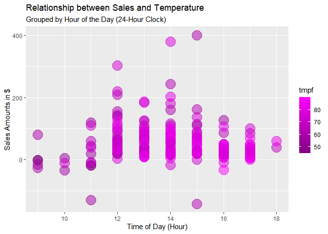

```r
library(tidyverse)
```

```
## ── Attaching packages ─────────────────────────────────────── tidyverse 1.3.2 ──
## ✔ ggplot2 3.3.6      ✔ purrr   0.3.4 
## ✔ tibble  3.1.8      ✔ dplyr   1.0.10
## ✔ tidyr   1.2.1      ✔ stringr 1.4.1 
## ✔ readr   2.1.3      ✔ forcats 0.5.2 
## ── Conflicts ────────────────────────────────────────── tidyverse_conflicts() ──
## ✖ dplyr::filter() masks stats::filter()
## ✖ dplyr::lag()    masks stats::lag()
```

```r
library(knitr)
library(downloader)
library(dplyr)
library(lubridate)
```

```
## 
## Attaching package: 'lubridate'
## 
## The following objects are masked from 'package:base':
## 
##     date, intersect, setdiff, union
```

```r
library(ggplot2)
library(grid)
library(corrplot)
```

```
## corrplot 0.92 loaded
```

```r
library(readr) 
library(haven)
library(readxl)
library(stringi)
library(stringr)

#install.packages("riem")
library(riem)
```


```r
temp_carwash <- tempfile()
download("https://github.com/WJC-Data-Science/DTS350/raw/master/carwash.csv", temp_carwash, mode = "wb")
carwash <- read_csv(temp_carwash)
```

```
## Rows: 533 Columns: 4
## ── Column specification ────────────────────────────────────────────────────────
## Delimiter: ","
## chr  (2): name, type
## dbl  (1): amount
## dttm (1): time
## 
## ℹ Use `spec()` to retrieve the full column specification for this data.
## ℹ Specify the column types or set `show_col_types = FALSE` to quiet this message.
```

```r
head(carwash)
```

```
## # A tibble: 6 × 4
##   name          type     time                amount
##   <chr>         <chr>    <dttm>               <dbl>
## 1 SplashandDash Services 2016-05-13 20:27:00    1  
## 2 SplashandDash Services 2016-05-13 20:27:00    0  
## 3 SplashandDash Services 2016-05-16 19:31:00   23.6
## 4 SplashandDash Services 2016-05-16 17:09:00   18.9
## 5 SplashandDash Services 2016-05-16 17:47:00   23.6
## 6 SplashandDash Services 2016-05-16 17:50:00   23.6
```

```r
str(carwash)
```

```
## spec_tbl_df [533 × 4] (S3: spec_tbl_df/tbl_df/tbl/data.frame)
##  $ name  : chr [1:533] "SplashandDash" "SplashandDash" "SplashandDash" "SplashandDash" ...
##  $ type  : chr [1:533] "Services" "Services" "Services" "Services" ...
##  $ time  : POSIXct[1:533], format: "2016-05-13 20:27:00" "2016-05-13 20:27:00" ...
##  $ amount: num [1:533] 1 0 23.6 18.9 23.6 ...
##  - attr(*, "spec")=
##   .. cols(
##   ..   name = col_character(),
##   ..   type = col_character(),
##   ..   time = col_datetime(format = ""),
##   ..   amount = col_double()
##   .. )
##  - attr(*, "problems")=<externalptr>
```

Converting to Mountain Time Zone

```r
TZcarwash <- with_tz(carwash, tzone = "US/Mountain")
head(TZcarwash)
```

```
## # A tibble: 6 × 4
##   name          type     time                amount
##   <chr>         <chr>    <dttm>               <dbl>
## 1 SplashandDash Services 2016-05-13 14:27:00    1  
## 2 SplashandDash Services 2016-05-13 14:27:00    0  
## 3 SplashandDash Services 2016-05-16 13:31:00   23.6
## 4 SplashandDash Services 2016-05-16 11:09:00   18.9
## 5 SplashandDash Services 2016-05-16 11:47:00   23.6
## 6 SplashandDash Services 2016-05-16 11:50:00   23.6
```

Using ceiling_date to create new hour variable

```r
GCarWash <- TZcarwash %>%
  mutate(hour = ceiling_date(time, "hour"))
head(GCarWash)
```

```
## # A tibble: 6 × 5
##   name          type     time                amount hour               
##   <chr>         <chr>    <dttm>               <dbl> <dttm>             
## 1 SplashandDash Services 2016-05-13 14:27:00    1   2016-05-13 15:00:00
## 2 SplashandDash Services 2016-05-13 14:27:00    0   2016-05-13 15:00:00
## 3 SplashandDash Services 2016-05-16 13:31:00   23.6 2016-05-16 14:00:00
## 4 SplashandDash Services 2016-05-16 11:09:00   18.9 2016-05-16 12:00:00
## 5 SplashandDash Services 2016-05-16 11:47:00   23.6 2016-05-16 12:00:00
## 6 SplashandDash Services 2016-05-16 11:50:00   23.6 2016-05-16 12:00:00
```

Totals for sales by hour

```r
salesbyhour <- GCarWash %>%
  group_by(hour) %>%
  summarise(across(amount, sum))
salesbyhour
```

```
## # A tibble: 240 × 2
##    hour                amount
##    <dttm>               <dbl>
##  1 2016-05-13 15:00:00    1  
##  2 2016-05-16 09:00:00   -1  
##  3 2016-05-16 12:00:00   66.0
##  4 2016-05-16 14:00:00   23.6
##  5 2016-05-16 16:00:00  127. 
##  6 2016-05-17 10:00:00    5  
##  7 2016-05-17 11:00:00   20  
##  8 2016-05-17 12:00:00   25  
##  9 2016-05-17 13:00:00   60  
## 10 2016-05-17 14:00:00  110  
## # … with 230 more rows
```

Getting the corresponding temperatures

```r
TempsDat <- riem_measures(station = "RXE",  date_start ="2016-05-13" , date_end  ="2016-07-08") %>%
  with_tz(tzone = "US/Mountain") %>%
  drop_na(tmpf) %>%
  mutate(hour = ceiling_date(valid, "hour"))
head(TempsDat)
```

```
## # A tibble: 6 × 33
##   station valid                 lon   lat  tmpf  dwpf  relh  drct  sknt  p01i
##   <chr>   <dttm>              <dbl> <dbl> <dbl> <dbl> <dbl> <dbl> <dbl> <dbl>
## 1 RXE     2016-05-12 18:53:00 -112.  43.8  68    30.0  24.1   210    10     0
## 2 RXE     2016-05-12 19:53:00 -112.  43.8  66.0  32    28.0   210    12     0
## 3 RXE     2016-05-12 20:53:00 -112.  43.8  63.0  34.0  33.8   210    10     0
## 4 RXE     2016-05-12 21:53:00 -112.  43.8  59    35.1  40.5   170     7     0
## 5 RXE     2016-05-12 22:53:00 -112.  43.8  57.9  32    37.3   190     8     0
## 6 RXE     2016-05-12 23:53:00 -112.  43.8  55.0  32    41.4   200     9     0
## # … with 23 more variables: alti <dbl>, mslp <dbl>, vsby <dbl>, gust <dbl>,
## #   skyc1 <chr>, skyc2 <chr>, skyc3 <chr>, skyc4 <lgl>, skyl1 <dbl>,
## #   skyl2 <dbl>, skyl3 <dbl>, skyl4 <lgl>, wxcodes <chr>,
## #   ice_accretion_1hr <lgl>, ice_accretion_3hr <lgl>, ice_accretion_6hr <lgl>,
## #   peak_wind_gust <dbl>, peak_wind_drct <dbl>, peak_wind_time <chr>,
## #   feel <dbl>, metar <chr>, snowdepth <lgl>, hour <dttm>
```

New hourly variable to match car wash data

```r
temps_hour <- TempsDat %>%
  with_tz(tzone = "US/Mountain") %>%
  filter(tmpf != "") %>%
  select(hour, tmpf)
temps_hour
```

```
## # A tibble: 1,419 × 2
##    hour                 tmpf
##    <dttm>              <dbl>
##  1 2016-05-12 19:00:00  68  
##  2 2016-05-12 20:00:00  66.0
##  3 2016-05-12 21:00:00  63.0
##  4 2016-05-12 22:00:00  59  
##  5 2016-05-12 23:00:00  57.9
##  6 2016-05-13 00:00:00  55.0
##  7 2016-05-13 01:00:00  55.0
##  8 2016-05-13 02:00:00  48.0
##  9 2016-05-13 03:00:00  45.0
## 10 2016-05-13 04:00:00  46.0
## # … with 1,409 more rows
```

Merging Datasets

```r
MergedDat <- merge(temps_hour, salesbyhour, by = "hour") %>%
  mutate(z_hour = hour(hour)) %>%
  select(tmpf, amount, z_hour) %>%
  group_by(z_hour) 
head(MergedDat)
```

```
## # A tibble: 6 × 3
## # Groups:   z_hour [5]
##    tmpf amount z_hour
##   <dbl>  <dbl>  <int>
## 1  73.9    1       15
## 2  46.0   -1        9
## 3  45.0   -1        9
## 4  50     66.0     12
## 5  54.0   23.6     14
## 6  57.0  127.      16
```

Visualization of sales and temperature by hour of the day

```r
saleshour <- ggplot(data = MergedDat, mapping = aes(x = z_hour, y = amount, color = tmpf)) +
  geom_point(size = 7, alpha=0.5) +
  scale_color_gradient(low = "#800080", high = "#FF00FF") +
  labs(title = "Relationship between Sales and Temperature", subtitle = "Grouped by Hour of the Day (24-Hour Clock)", x = "Time of Day (Hour)", y = "Sales Amounts in $", fill = "Temperature in Fahrenheit") +
 theme()
  
saleshour
```

<!-- -->
